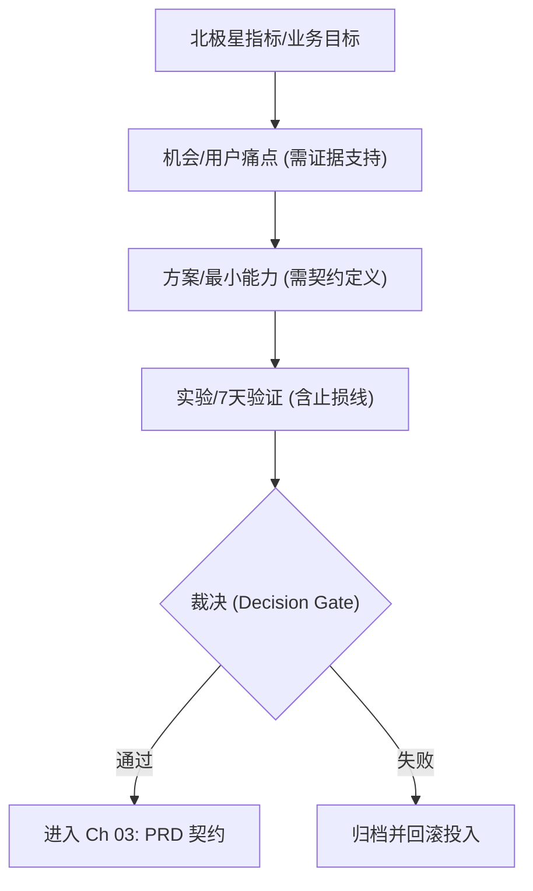

# 第 2 章：需求挖掘与机会判断（Discovery）


> 别急着写代码：先用数据把值不值得做说清楚，再用最小实验把它证伪或证实。[4]

!!! warning
    **合规与成本红线：先确认边界再动手**
    - **隐私/PII：** 评论常含个人信息。存储前必须脱敏；严禁将原始隐私数据直传公网模型或写入日志。
    - **平台条款：** 抓取前查阅目标站点服务条款与 `robots.txt`；优先使用官方 API 或导出功能。
    - **调用成本：** 大规模聚类/筛选优先使用本地/离线工具，将付费 LLM 算力集中于总结、反例挖掘与决策解释。

你可能正处于三种“虚假高效”之中：

1.  **灵感过剩：** 每天都有新点子，但没有一个能经得起推敲。
2.  **数据堆积：** 抓了一堆语料，结论却是“用户不仅想要 A，也想要 B”，无法指导决策。
3.  **工具沉迷：** 沉迷于写 Prompt 和聚类，却不敢面对“并没有人愿意为此付费”的真相。

本章的任务只有一个：**把重心从“产出报告”转向“做出裁决”。** 所有结论必须溯源至证据并经过门槛检验，不达标即止损。[4]

## 章节定位
本章旨在解决“热血开发两周，发布后发现无人买单”的经典困境。我们将把直觉转化为证据，把冲动转化为验证。[4]

你将建立一套**以“否决”为核心**的筛选机制：

1.  **全信号采集：** 建立 **数据卡片 (Datasheet)**，严格记录来源、时间窗与隐私许可，确保结论可审计。[34]
2.  **证据链化：** 将零散反馈压缩为 **《问题—证据》矩阵**，强制绑定原文引用与反例（Red Team 视角）。[4]
3.  **实验裁决：** 设计 **7 天验证闭环**，设定明确的 ROI 门槛。不达标即触发**止损回滚**。[4][6]

## 你将收获什么
*   **《问题—证据》矩阵**：不再是“我觉得”，而是“有多少人说过”。包含证据链、反例与下一步实验计划。[4]
*   **7 天实验菜单**：针对关键假设的验证方案，强调单变量与低成本。[4][6]
*   **决策白板模板**：明确“保留/放弃/延期”标准，设定止损红线。[4]

---

## 核心原则：把 Discovery 做成节奏
很多人把需求挖掘当成一次性活动：前两周访谈、写一份报告、然后就开始冲刺开发。AI 时代这种做法更危险——因为你会更快地做出更多垃圾。

更稳的方式是把 Discovery 变成一种**心跳**：持续接触用户、持续提出可证伪假设、持续用最小实验裁决。[73][72]

我们将机会管理抽象为一棵树。从北极星指标出发，向下拆解机会，再拆解为方案，最后挂载实验。




---

## 实战路径
路径很简单：`数据抓取` -> `结构化压缩` -> `矩阵裁决` -> `反例探测` -> `7 天实验`。

### 第一步：把问题写成可证伪假设
不要给我看功能列表，给我看假设列表。一个合格的假设必须能被证明是错的。

**可证伪假设模板：**

> 对于 **【目标用户】**，在 **【关键场景】** 下，他们因为 **【关键障碍】** 无法完成 **【关键任务】**，导致 **【可量化损失】**；如果我们提供 **【最小方案】**，将把 **【关键指标】** 提升到 **【门槛】**。

如果你填不出来这一句话，说明你想得还不够清楚，不要动工。[4]

### 第二步：信号采集（多源、可追溯）
采集的目的不是越多越好，而是足够代表你的目标人群。必须为每个数据源建立 **数据卡片（Datasheet）**，否则评审时会被直接打回。[34]

**最低准入标准：**
*   **双源验证：** 来源至少 2 个（例如：工单 + 论坛），避免单一平台的幸存者偏差。[34]
*   **证据绑定：** 每条结论都能点击跳转到原始样本（原文/链接/快照），没有原文的概括一律视为幻觉。

### 第三步：《问题—证据》矩阵（核心产物）
这是本章最重要的交付物。它强迫你把“观点”压缩成“证据 + 反例”。

**模板（直接复制使用）：**

| 痛点（问题） | 目标用户/场景 | 证据（原话/样本） | 样本量 | 反例/不确定性 | 潜在价值 | 下一步 7 天实验 |
| :--- | :--- | :--- | :--- | :--- | :--- | :--- |
| *无法批量导出报表* | *财务/月结* | *引用 1: "每个月都要人肉复制一堆数据"* <br> *引用 2: "导出限制 50 条太蠢了，根本用不了"* | *42* | *小微企业用户表示无所谓* | *高（付费点）* | *Wizard-of-Oz: 人工帮 Top 客户导一次，看意愿* |

!!! note "使用说明"
    *   **行**：一行只写一个痛点。
    *   **证据**：必须引用原话，禁止概括。
    *   **下一步**：必须是具体的行动，不是“继续调研”。

### 第四步：反例优先（主动找茬）
你最需要的不是赞同，而是打脸。与其让开发完再发现没人用，不如现在就用 AI 帮你找反例。

使用 Agent 做虚拟访谈时，它的角色应该是**红方（Red Team）**，专门攻击你的假设。它产出的不是结论，而是**质疑清单**。[10]

**Prompt 策略：**
> "你是反例生成器。针对假设 X，列出 10 个它可能不成立的场景，并告诉我用什么问题能验证这些反例是否存在。"

### 第五步：七天实验菜单（门槛裁决）
0→1 阶段最容易死在“永远在验证”。你需要把实验做得足够短、足够狠。**没有门槛的实验不是实验，是体验。**[4][6]

| 实验类型 | 适用场景 | 成功门槛（示例，需按基线校准） | 失败判定 | 典型成本 |
| :--- | :--- | :--- | :--- | :--- |
| **登陆页 + 候补名单** | 价值主张不清 | 转化率 ≥ 基线 × 1.5 | 低于基线 × 1.2 | 低 |
| **Concierge (人工服务)** | 流程复杂 | 关键任务完成率 ≥ 基线 + 20pp | 关键步骤反复卡死 | 中 |
| **原型测试 (Figma)** | 交互不确定 | 任务完成率 ≥ 基线 + 15pp | 错误恢复失败率高 | 中 |
| **MVP (小流量)** | 方案已定 | 7 日留存 ≥ 基线 + 3pp | 留存低且无反例解释 | 高 |

---

## 示例（可执行）：从原始吐槽到决策白板

**场景：** 你想做一个“自动整理会议纪要”的工具，手里有一堆用户吐槽的文本文件 `feedback.txt`。

**目标：** 在 10 分钟内生成《问题—证据》矩阵，并判断是否值得做。

**步骤 1：准备输入**

创建 `feedback.txt` (模拟数据):
```text
(用户A) 开会太累了，记不住重点。
(用户B) 现在的工具录音转文字很准，但太长了根本没法看。
(用户C) 隐私是个大问题，我不希望录音上传到云端。
(用户D) 我只想知道待办事项是什么，别给我整篇逐字稿。
(用户E) 这种工具很多了，飞书自带的就够用了。
```

**步骤 2：执行分析命令**

使用一个可脚本化的模型调用入口做结构化提取。这里强制要求输出 JSON，方便程序化验证。下面示例用 `<LLM_CLI>` 表示你的模型命令。

```bash
{
  cat <<'PROMPT'
你是一个严厉的产品经理助理。分析以下用户反馈，提取痛点。
输出格式为 JSON 列表，每项包含：
- pain_point (简短描述)
- evidence (原文引用，必须逐字)
- sentiment (负面程度 1-5)
- counter_argument (基于常识的反例或风险)

输入数据：
PROMPT
  cat feedback.txt
} | <LLM_CLI> > problem_matrix.json
```

**步骤 3：验证与门禁（Python）**

别只看输出，用脚本卡住质量。如果证据不足，直接报错。

```python
# gate_discovery.py - 发现门禁脚本
import json
import sys
from pathlib import Path

def validate_discovery(matrix_file):
    try:
        data = json.loads(Path(matrix_file).read_text())
    except Exception as e:
        print(f"❌ FAIL: JSON 解析失败 - {e}")
        return False

    valid_count = 0
    for i, entry in enumerate(data):
        # 门禁 1: 证据必须是逐字原文，严禁概括
        evidence = entry.get('evidence', '')
        if len(evidence) < 10 or "用户说" in evidence:
            print(f"⚠️ WARN [Item {i}]: 证据链薄弱，需补充原文引用。")
            continue
        
        # 门禁 2: 必须有反例分析 (Red Teaming)
        if not entry.get('counter_argument'):
            print(f"⚠️ WARN [Item {i}]: 缺少反例分析，存在幸存者偏差风险。")
            continue

        valid_count += 1

    if valid_count < 3:
        print(f"❌ FAIL: 有效痛点不足 ({valid_count}/3)。无法进入 PRD 阶段。")
        return False

    print(f"✅ PASS: 提取到 {valid_count} 个合格痛点。准许进入 Ch 03 生成 PRD 契约。")
    return True

if __name__ == "__main__":
    if not validate_discovery('problem_matrix.json'):
        sys.exit(1)
```

**步骤 4：决策**
人工查看 `problem_matrix.json`。
*   如果看到“竞品已满足”（如用户 E），则标记为 **放弃** 或 **寻找差异化**。
*   如果看到强痛点（如用户 B 和 D），则进入下一轮 **7 天实验**（例如：手动帮用户精简 10 篇文档，看满意度）。

---

## 交付物清单与验收标准

做完这一章，你的项目仓库里应该多出这三个文件。少一个，就别往下走。

1.  **`docs/discovery/datasheet.md` (数据卡片)**
    *   [ ] 明确列出数据来源、采集时间窗口。
    *   [ ] 声明了许可证和隐私处理方式。[34]
    *   [ ] 标注了已知采样偏差（例如“只采集了 iOS 用户”）。

2.  **`docs/discovery/problem-matrix.md` (问题矩阵)**
    *   [ ] 每个痛点至少有 3 条原文引用作为证据。[4]
    *   [ ] 每个痛点都列出了至少 1 个反例或风险。
    *   [ ] 包含样本量统计。

3.  **`docs/decisions/board.md` (决策白板)**
    *   [ ] 明确的裁决结论：保留 / 放弃 / 延期。[4]
    *   [ ] 如果保留，必须有对应的“7 天实验”计划，含明确的量化止损线。[6]

## 常见陷阱

1.  **幸存者偏差：** 只看 App Store 差评，却忽略了沉默的大多数直接卸载了。**修复：** 必须引入行为数据或流失访谈。[34]
2.  **伪需求：** 用户说“我想要个搜索功能”，实际上是因为导航设计得太烂。**修复：** 追问“为了解决什么问题”，而不是直接记录“加搜索”。
3.  **验证瘫痪：** 每周都在调研，从来不做决定。**修复：** 强制设置截止日期（Time-box），到期必须给 Go/No-Go 结论。[4]

<!-- 
占位图配置：
Image Prompt: A clean, minimalist flowchart showing the "Discovery Loop". 
Steps: 
1. Signal Collection (Input icon)
2. Structured Matrix (Grid icon)
3. Red Team / Anti-patterns (Shield/Cross icon)
4. 7-Day Experiment (Calendar icon)
5. Decision Board (Gavel/Checkmark icon)
Style: Technical line art, black and white, no text.
-->
