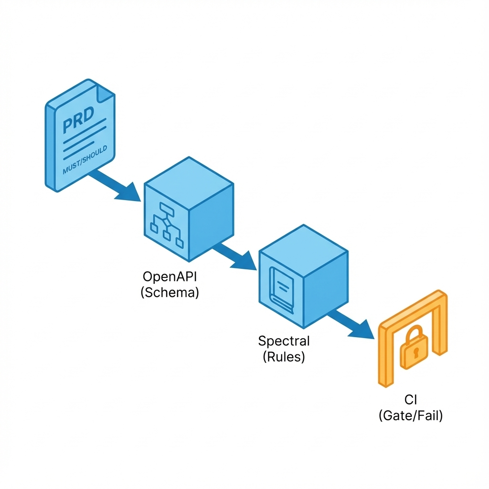
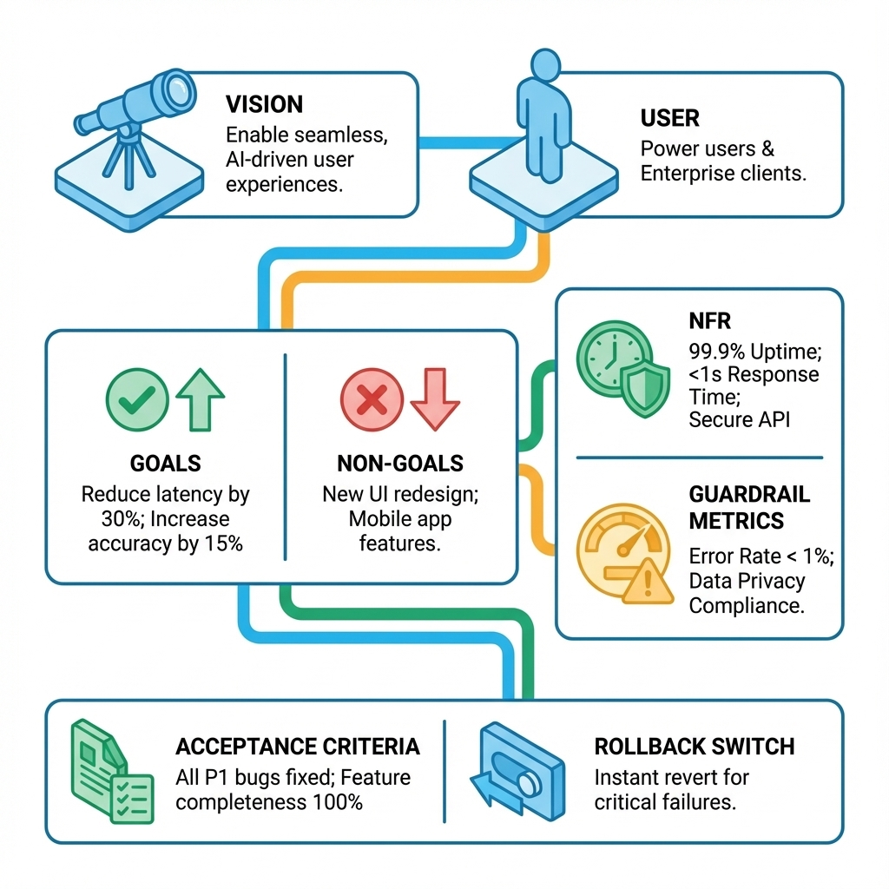
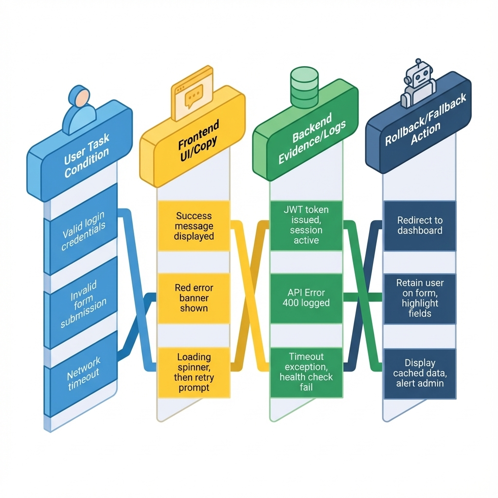

# 第 3 章：PRD 与工程合同（Definition）：从愿景到验收


> PRD 不是用来讲故事的作文，而是一份可裁决的合同：它要让争议有裁判，让交付有门槛，让回滚有预案。写得短可以，但不能写得含糊。[11][12]

当 AI 让写代码变快，PRD 的价值反而更大了：你需要一份能约束生成的边界，让速度落在正确方向上；你也需要一份能保护未来的你的记忆，让两周后的自己仍能回答：当时为什么要这样做。[4]

## 章节定位
本章解决一个核心问题：**把“想做什么”翻译成“做到什么算完”。**

如果不把 PRD 当合同写，你就会在开发后期陷入无休止的“我觉得应该这样”的拉锯战。你将在这里学会：先锁定范围，再补齐失败边界，最后把验收标准写到“可复核”的程度。[5][18]

## 你将收获什么
- **一套最小 PRD 合同结构**：目标/非目标、用例（含异常流）、NFR（非功能需求）、验收标准、回滚策略。
- **一个用例清单写作法**：把失败与补偿路径写成一等公民，减少上线后的返工。[12]
- **三份可直接复用的模板**：一页 PRD、用例清单、验收与决策记录表。[11]

## 三层思考：把 PRD 写成可交付系统

### 第 1 层：读者目标（你到底想用 PRD 解决什么）
你不是为了写文档而写 PRD，而是为了三件事：
1.  **收敛范围**：明确**不做什么**，避免功能像滚雪球一样失控。
2.  **统一语义**：关键名词、状态、错误边界不靠口头记忆，白纸黑字写下来。
3.  **裁决交付**：上线前不靠争论，靠清单与门槛。

### 第 2 层：论证链条（从问题到验收的闭环）
一份能推进交付的 PRD，逻辑链条必须闭合：

`问题证据` &rarr; `目标/非目标` &rarr; `用户与场景` &rarr; `用例（含异常流）` &rarr; `需求拆分` &rarr; `NFR 与预算` &rarr; `指标口径` &rarr; `验收与回滚` &rarr; `决策记录`

这条链条里最容易缺的是**异常流、NFR、回滚**。缺了它们，PRD 就在裸奔，实现阶段必然会发生隐性返工。[5][6]

### 第 3 层：落地与验收（怎么判断 PRD 写对了）
把 PRD 当作合同，它至少要通过三类读者的审查：
- **产品视角**：价值闭环能不能跑通？
- **工程视角**：边界清不清楚？失败能不能恢复？实现能不能拆分？
- **治理视角**：风险控没控制住？成本有没有上限？出事能不能回滚？


## 方法论速览：四步写出最小合同

1.  **先写一页 PRD，再写细节**：用一页纸冻结你在做什么/不做什么/怎么验收。[11]
2.  **用例优先，异常流必须具名**：把失败与补偿路径写进用例清单（超时、重试、权限不足、退款/撤销、幂等等）。[12]
3.  **NFR 不是附录，是边界**：SLO、成本预算、隐私边界与守门指标必须提前写下。[6]
4.  **验收标准要可回归**：每条验收都能映射到一次检查（测试、日志、监控、对比表），否则它只是愿望。[18]

## 关键技术：用 RFC 2119 写验收条款
别再用“应该”、“尽量”、“最好”、“支持一下”这种废话。它们在讨论时很顺滑，在交付时全是坑。
请使用 RFC 2119 标准词汇：**MUST**（必须）、**SHOULD**（推荐）、**MAY**（可选）。[74]

一旦你被迫写出 **MUST**，你就必须回答三个问题：
1.  触发条件是什么？
2.  做不到时怎么办（降级/拒绝/回滚）？
3.  怎么验收（证据在哪里、口径是什么）？[74][18]

| 条款（MUST/SHOULD） | 触发条件 | 验收证据 | 成本/责任（谁实现/谁维护） | 降级/回滚 |
| :--- | :--- | :--- | :--- | :--- |
| 导入失败时 **MUST** 给出失败原因与恢复入口 | 校验失败/网络中断/权限不足 | UI 状态 + 错误码 + 日志字段 | 前端/后端共同 | 可关闭入口；可降级为手工导入 |

## 把合同变成门禁：可执行规格
如果你的 PRD 里写了“接口必须符合 OpenAPI 规范”，那就别让人眼去检查。
建立一条流水线，让合同从文档变成系统默认属性：[67][65]

```text
PRD（定义 MUST/SHOULD 条款）
  &rarr; OpenAPI（字段/错误语义/分页/鉴权/幂等 落到 yaml）
  &rarr; Spectral 规则（语法一致性 &rarr; 产品合同约束）
  &rarr; CI 门禁（破坏性变更直接 fail，并在 PR 里给出修改建议）
```



> **插图请求**：如果图 3-4 不够清晰，请补充一张时序图。
> **Image Prompt**: A strict sequence diagram. Left side "Product Manager" writes "Contract.md". Middle "CI Pipeline" runs "Linter". Right side "Developer" gets "Blocked" or "Merged". Style: Minimalist technical line art, high contrast.

## 模板 1：一页 PRD（MVP 合同）
**用法**：先写这一页。写不满一页不是问题；写不清一句话才是问题。这页没定下来，禁止写任何细节。

| 模块 | 你要写什么 | 写不清会发生什么 |
| :--- | :--- | :--- |
| **一句话愿景** | 为谁解决什么问题 | 讨论会变成各说各话 |
| **问题证据** | 3 条以内：日志/反馈/访谈摘要 | 你会把热闹当需求 |
| **目标（3 条以内）** | 可量化或可验证的结果 | 上线后无法裁决成败 |
| **非目标（3 条以内）** | **明确不做什么** | 范围失控、永远做不完 |
| **核心闭环** | 3–5 个关键动作 | 原型/实现偏离关键路径 |
| **用例列表** | 5–10 条：含异常流 | 上线后在失败边界返工 |
| **外部依赖与索引** | 依赖系统/接口/数据源 + 链接 | 实现时才发现卡死 |
| **NFR 与守门指标** | 延迟/成本/风险底线 | 优化会越做越亏 |
| **验收与回滚** | 通过门槛 + 回滚开关 | 事故发生时无退路 |
| **开放问题** | 需要拍板的 3 项以内 | 团队/未来的你无法继续 |



## 模板 2：用例清单（含异常流）
**用法**：用例不是用户故事散文，是系统的真实合同。每条用例必须包含“失败了怎么办”。

| 用例 ID | 目标用户 | 触发条件 | 成功路径（最多 5 步） | 失败/补偿路径（至少 2 条） | 验收证据 |
| :--- | :--- | :--- | :--- | :--- | :--- |
| UC-01 | 谁 | 什么时候 | 1&rarr;2&rarr;3&rarr;<...> | 超时/重试；权限不足；输入无效；撤销/退款；幂等去重 | 日志、截图、指标对比 |

### 示例：把“导入数据”写成可验收用例
*   **成功路径**：选择文件 &rarr; 校验格式 &rarr; 导入完成 &rarr; 给出下一步引导
*   **失败/补偿**：格式错误（指出行列与修复建议）；网络中断（可重试/可续传）；权限不足（明确申请入口）
*   **验收证据**：导入成功率、平均耗时、失败后恢复率（同口径对比表）[6]

## 模板 3：验收标准（可裁决写法）
PRD 最常见的烂尾：验收标准写在文档里，UI 上却看不见。
**解法**：把验收拆成“用户可见”和“系统证据”两列，钉死在一起。



| PRD 验收条目（用户任务视角） | 前端可见状态/文案（可理解、可行动） | 后端证据（日志字段/指标/trace_id） | 回滚/降级动作（越界时怎么退一步） |
| :--- | :--- | :--- | :--- |
| 用户上传文件格式错误 | 红色提示框 + 具体错误行号 + “下载错误报告”按钮 | Log: `upload_error` (reason="format", line=12) | 连续失败 N 次触发报警，前端暂时隐藏入口 |

## AI 辅助生成：用 Agent 找漏洞
别让 AI 替你拍板，让它替你找茬。让它扮演“挑刺的测试经理”或“悲观的架构师”。

### 场景：补全异常流
复制这段 Prompt 到你的 AI 助手：

```bash
gemini -m gemini-3-pro-preview -p "任务：补全异常流与补偿路径。
输入：一个<用户上传文件并解析>的功能。
要求：
1. 列出至少 5 种失败场景（网络、权限、配额、格式、并发）。
2. 每种失败场景必须给出：用户端的恢复动作（重试/修改/联系）、系统的补偿动作（回滚/清理/幂等）。
3. 输出为 Markdown 表格。
4. 不要废话，直接给表格。" > out/exceptions.md
```

### 场景：攻击 PRD 漏洞
复制这段 Prompt 检查你的 PRD 草稿：

```bash
gemini -m gemini-3-pro-preview -p "任务：列出边界值与攻击向量。
输入：[粘贴你的一页 PRD 内容]
输出：最多 12 条风险点清单。每条包含：
- 风险点一句话
- 最小复现条件
- 建议门禁（测试/日志/阈值）
- 回滚动作
规则：优先写业务逻辑漏洞（如价格为负、库存超卖），而非通用技术故障。" > out/risk_audit.md
```

## 自动化验证：PRD 结构检查脚本
PRD 如果连基本结构都缺，就别进入评审浪费时间。用这个脚本自测：

```python
# check_prd_structure.py
import sys
from pathlib import Path

def check_prd(file_path):
    path = Path(file_path)
    if not path.exists():
        print(f"ERROR: File {file_path} not found.")
        sys.exit(1)

    content = path.read_text(encoding='utf-8')
    required_sections = [
        '# 背景', '# 目标', '# 非目标', 
        '# 验收标准', '# 回滚策略', '# 守门指标'
    ]
    
    missing = [s for s in required_sections if s not in content]
    
    if missing:
        print(f"FAILED: PRD is missing mandatory sections: {missing}")
        print("Rule: A PRD implies a contract. No contract, no code.")
        sys.exit(1)
    
    print(f"PASS: {file_path} structure is valid.")

if __name__ == "__main__":
    if len(sys.argv) < 2:
        print("Usage: python check_prd_structure.py <prd_file.md>")
        sys.exit(1)
    check_prd(sys.argv[1])
```

## 变更协议：防止合同腐烂
敏捷不是不写文档，而是**原子化更新**文档。
任何代码变更如果影响了 PRD 的范围、验收标准或 NFR，必须遵循以下协议：

1.  **同 PR 原子提交**：改代码的 PR 必须包含 PRD/Spec 的修改。
2.  **门槛先行**：先改验收标准（测试用例/指标阈值），再改代码。
3.  **证据留档**：PR 描述里必须贴出对比表或回归报告链接。

**最小变更 PR 模板**：
```markdown
## 变更协议追踪
- [ ] 变更卡片：<Issue 链接>
- [ ] 合同修订：<PRD/Spec 文件路径>
- [ ] 变更类型：Fix / Change / Breaking / NFR
- [ ] 验收证据：<测试报告/日志截图/指标面板链接>
- [ ] 守门指标：<无退化证明>
- [ ] 回滚动作：<Feature Flag 开关 / 回滚版本号>
```

## 复现检查清单（本章最低门槛）
- [ ] **一页 PRD 已冻结**：目标、非目标、回滚策略齐全。[11]
- [ ] **异常流已覆盖**：关键链路至少有 2 条失败/补偿路径。[12]
- [ ] **NFR 可裁决**：有明确的延迟/成本/风险阈值。[6]
- [ ] **验收可复核**：每条验收都能找到对应的日志、指标或截图证据。[18]

## 下一章
PRD 解决了“做到什么算完”，原型解决“关键路径能不能跑通”。
下一章见：[04-prototype.md](04-prototype.md)。

## 参考
详见本书统一参考文献列表：[references.md](references.md)。
