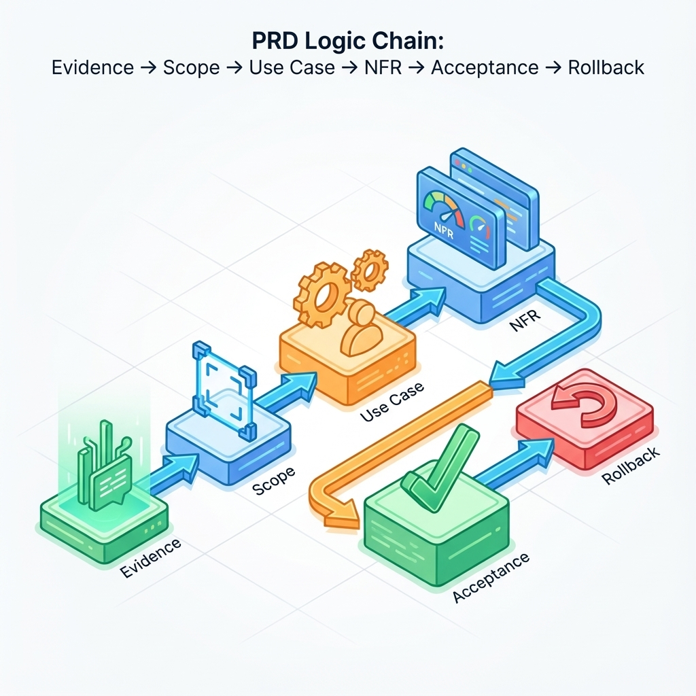

# 第 3 章：PRD 与工程合同（Definition）：从愿景到验收

> PRD 不是“需求作文”，而是一份可裁决的合同：它要让争议有裁判，让交付有门槛，让回滚有预案。写得短可以，但不能写得含糊。[11][12]

当 AI 让实现变快，PRD 的价值反而更大了：你需要一份能“约束生成”的边界，让速度落在正确方向上；你也需要一份能“保护未来的你”的记忆，让两周后的自己仍能回答：当时为什么要这样做。[4]

## 章节定位
本章位于“需求挖掘”与“原型验证”之间，解决一个核心问题：把“想做什么”写成“做到什么算完”。你将把 PRD 当作合同来写：先锁定范围，再补齐失败边界，最后把验收标准写到可复核的程度。[5][18]

## 你将收获什么
- 一套“最小 PRD 合同”结构：目标/非目标、用例（含异常流）、NFR、验收标准、回滚策略。
- 一份“用例清单写作法”：把失败与补偿路径写成一等公民，减少上线后的返工。[12]
- 三份可直接复用的模板：一页 PRD、用例清单、验收与决策记录表。[11]

## 三层思考：把 PRD 写成可交付系统
### 第 1 层：读者目标（你到底想用 PRD 解决什么）
你不是为了“写文档”而写 PRD，而是为了三件事：
- **收敛范围**：明确“不做什么”，避免功能膨胀。
- **统一语义**：关键名词、状态、错误边界不靠口头记忆。
- **裁决交付**：上线前不靠争论，靠清单与门槛。

### 第 2 层：论证链条（从问题到验收的闭环）
一份能推进交付的 PRD，逻辑链条应当闭合：

问题证据 → 目标/非目标 → 用户与场景 → 用例（含异常流）→ 需求拆分 → NFR 与预算 → 指标口径 → 验收与回滚 → 决策记录

这条链条里最容易缺的是“异常流”“NFR”“回滚”。缺它们，PRD 会在实现阶段变成隐性返工。[5][6]

### 第 3 层：落地与验收（怎么判断 PRD 写对了）
把 PRD 当作合同，它至少要通过三类“读者”的审查：
- **产品视角**：目标清晰、范围收敛、价值闭环能发生。
- **工程视角**：边界清晰、失败可恢复、实现可拆分。
- **治理视角**：风险可控、成本有上限、退化可回滚。

任何一类审查无法完成，都说明 PRD 还不够“可交付”。

## 方法论速览：四步写出“最小合同”
1. **先写一页 PRD，再写细节**：用一页纸冻结“你在做什么/不做什么/怎么验收”。[11]
2. **用例优先，异常流必须具名**：把失败与补偿路径写进用例清单（超时、重试、权限不足、退款/撤销、幂等等）。[12]
3. **NFR 不是附录，是边界**：SLO、成本预算、隐私边界与守门指标必须提前写下。[6]
4. **验收标准要可回归**：每条验收都能映射到一次检查（测试、日志、监控、对比表），否则它只是愿望。[18]

## 模板 1：一页 PRD（MVP 合同）
用法：先写这一页，再允许自己写任何细节。写不满一页不是问题；写不清一句话才是问题。

!!! note "作图提示（建议画成一页纸卡片）"
    - 顶部：一句话愿景 + 目标用户
    - 中部：目标/非目标（左右两栏对照，避免范围漂移）
    - 右侧：NFR 与守门指标（延迟/成本/风险）
    - 底部：验收门槛 + 回滚开关（用“触发条件→动作”表达）

| 模块 | 你要写什么 | 写不清会发生什么 |
| --- | --- | --- |
| 一句话愿景 | “为谁解决什么问题” | 讨论会变成各说各话 |
| 问题证据 | 3 条以内：日志/反馈/访谈摘要 | 你会把热闹当需求 |
| 目标（3 条以内） | 可量化或可验证的结果 | 上线后无法裁决成败 |
| 非目标（3 条以内） | 明确“不做什么” | 范围失控、永远做不完 |
| 核心闭环 | 3–5 个关键动作 | 原型/实现偏离关键路径 |
| 用例列表 | 5–10 条：含异常流 | 上线后在失败边界返工 |
| NFR 与守门指标 | 延迟/成本/风险底线 | “优化”会越做越亏 |
| 验收与回滚 | 通过门槛 + 回滚开关 | 事故发生时无退路 |
| 开放问题 | 需要拍板的 3 项以内 | 团队/未来的你无法继续 |

## 模板 2：用例清单（含异常流）
用法：用例不是“用户故事的散文”，而是“系统的真实合同”。每条用例都必须包含失败与恢复。

| 用例 ID | 目标用户 | 触发条件 | 成功路径（最多 5 步） | 失败/补偿路径（至少 2 条） | 验收证据 |
| --- | --- | --- | --- | --- | --- |
| UC-01 | 谁 | 什么时候 | 1→2→3→… | 超时/重试；权限不足；输入无效；撤销/退款；幂等去重 | 日志、截图、指标对比 |

### 一个小示例：把“导入数据”写成可验收用例
- 成功路径：选择文件 → 校验格式 → 导入完成 → 给出下一步引导
- 失败/补偿：格式错误（指出行列与修复建议）；网络中断（可重试/可续传）；权限不足（明确申请入口）
- 验收证据：导入成功率、平均耗时、失败后恢复率（同口径对比表）[6]

## 把“验收”写到前端：让产品与工程说同一种话
PRD 最常见的“后遗症”是：验收标准写在文档里，但产品界面不承认它——用户看不到进度、看不到失败原因、看不到恢复入口；最后验收只能靠口头解释，体验也只能靠“感觉不错”。如果你想让 PRD 真正约束交付，建议你把验收拆成两层：

- **用户可见的验收**：界面上能看到的状态、提示、恢复入口、预算/权限信息。
- **系统可证据的验收**：日志字段、指标曲线、回归报告、灰度对比表。

当两层能对齐，你就能做到：上线前靠清单验收，上线后靠证据复盘，退化时靠回滚止损。[5][18]

!!! note "作图提示（画成四列映射）"
    - 列1：PRD 验收条目（用户任务视角）
    - 列2：前端可见状态/文案（用户能理解、能行动）
    - 列3：后端证据（日志字段/指标/trace_id）
    - 列4：回滚/降级动作（越界时系统怎么退一步）

## 模板 3：验收标准（可裁决写法）
你可以用清单，也可以用 Given/When/Then，但必须满足“可观察、可复核、可回滚”。

建议每条验收标准都包含四个元素：
1. **条件**：在什么前提下（用户类型/权限/网络/数据规模）。
2. **动作**：用户做了什么或系统做了什么。
3. **可观察结果**：页面变化、返回语义、日志字段、指标变化。
4. **失败与恢复**：失败时用户如何自救？系统如何补偿？回滚如何触发？

## AI 怎么用在 PRD 上（但不替你做裁决）
把 AI 放在“补全与找漏洞”上，而不是放在“拍板”上：
- 让 AI 帮你补齐异常流清单，并要求它按“现象/触发条件/用户可恢复路径/系统补偿”输出。[12]
- 让 AI 帮你把目标改写为“可证伪句式”，并给出反例与验证方法。[4]
- 让 AI 扮演“挑刺评审”：只输出歧义点、缺失的守门指标、可能的越权/合规风险。[6]

## 复现检查清单（本章最低门槛）
- 一页 PRD 已完成：目标/非目标/闭环/验收/回滚齐全。[11]
- 用例清单覆盖异常流：每条关键链路至少 2 条失败/补偿路径。[12]
- NFR 与预算已写下：至少包含延迟/成本/风险三条守门指标。[6]
- 验收可裁决：每条验收都能对应到可复核证据（日志/指标/截图/对比表）。[18]

## 常见陷阱（失败样本）
1. **现象**：PRD 写得很完整，但实现时仍然频繁“理解不一致”。  
   **根因**：关键语义与错误边界没写清，或者用例只写了成功路径。  
   **修复**：把分歧点落到“用例 + 验收标准”；先把失败与恢复写清，再谈优化。[12]

2. **现象**：上线后总在补“非功能需求”，进度被拖垮。  
   **根因**：把 NFR 当成最后再补的附录，缺少守门指标与成本上限。  
   **修复**：在 PRD 阶段就写下 SLO 与预算，明确“退化即回滚”的触发条件。[6]

3. **现象**：PRD 承诺了很多，但最终交付物无法验收。  
   **根因**：验收标准不可观察、不可复核；用“体验更好”这类句子替代了门槛。  
   **修复**：把验收改写为“可观察结果 + 证据”，并提前定义失败判定与回滚。[18]

## 交付物清单与验收标准
- PRD（含一页合同 + 用例清单 + NFR + 验收与回滚）。
- 决策记录（开放问题、拍板结论、保留反例与理由）。[4]
- 验收清单（可复核证据的位置与口径）。[18]

## 下一章
PRD 解决“做到什么算完”，原型解决“关键路径能不能发生”。下一章见：[`04-prototype.md`](04-prototype.md)。

## 参考
详见本书统一参考文献列表：[`references.md`](references.md)。
