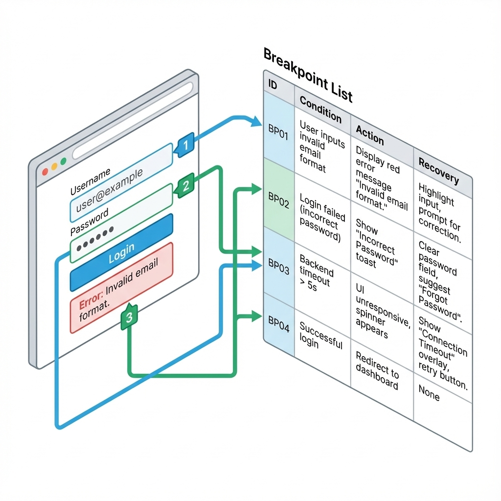
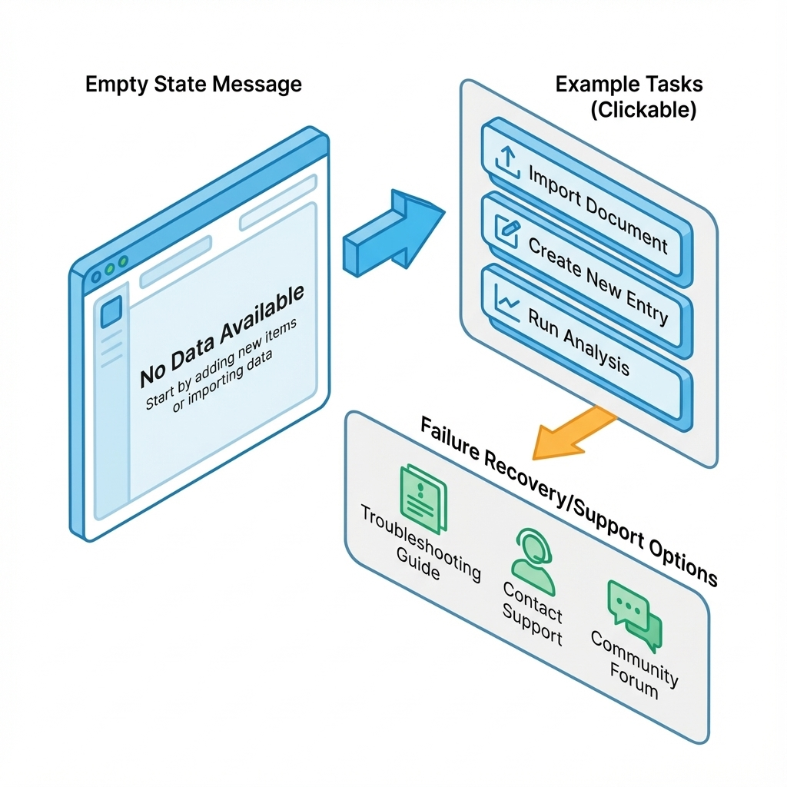

# 第 4 章：原型与信息架构：用最小成本验证路径


> 原型的价值不是看起来像，而是用最小成本验证关键路径、信息架构与错误恢复：用户能不能走到价值、走错了能不能回来。[4][16]

在 0→1 阶段，你最稀缺的不是设计技巧，而是注意力。原型的任务，是把注意力从想象的用户拉回真实的路径：用户从哪里进来、要做什么、在哪一步犹豫、失败后怎么自救。

## 章节定位
上一章你已经把 PRD 写成了最小合同，知道做到什么算完。这一章做的事更朴素：用最小原型验证能不能发生。如果你发现关键路径走不通，最划算的修复方式往往不是加功能，而是改路径：入口、信息层级、状态与错误恢复。[16][17]

## 你将收获什么
- 一套三张纸原型法：页面树、用户流（含异常流）、状态清单。
- 一份原型走查脚本：用任务驱动替代审美争论，让反馈可复核。
- 一张原型通过门槛：什么情况下可以进入验证与打磨，什么情况下必须回到 PRD 重写。

## 三层思考：原型到底在验证什么
### 第 1 层：读者目标
读完本章，你应该能做出一个能跑通关键任务的原型，并且能回答：
- 用户是否能在不被指导的情况下完成任务？
- 他们在哪一步卡住、为什么卡住、卡住后如何恢复？

### 第 2 层：论证链条
原型验证的逻辑链条是：

页面树（信息架构）→ 用户流（主流程+异常流）→ 状态清单（空/加载/成功/失败/无权限）→ 走查脚本（任务驱动）→ 证据（录屏/笔记/问题清单）

缺任何一环，反馈都会变成感觉和审美，无法指导下一步决策。[16][17]

### 第 3 层：落地与验收
原型不是做完就好，而是能走查、能复核、能产生下一步结论。你需要明确门槛：原型过了什么条件才能进入下一章的验证与打磨。[4]

## 方法论速览：三张纸 + 一次走查


## AI 产品的关键时刻：在原型里先把不确定性与纠错画出来
传统软件原型常常只需要验证路径是否顺畅；而 AI 产品还必须验证一件更棘手的事：**当系统不确定、出错、或需要用户补信息时，用户能不能继续走下去**。这不是上线后再补的体验优化，而是原型阶段就该验证的主路径。[71][72]

一个很实用的走查视角是把原型按三个关键时刻切开：
1. **首次接触**：用户是否理解它能做什么/不能做什么，能否找到起步动作。
2. **正在执行**：系统在做什么、需要多久、用户能否打断/改条件/补信息。
3. **结果交付**：用户如何判断对错、如何最小粒度修正、如何撤销/回退。[71]


作图提示：把一条用户流画成三段（进入/执行/交付），每段标出系统提示、用户可动作、失败恢复入口、证据/日志点；用红色标出高风险不确定点，用绿色标出自救出口。[71][72]

你不一定要画复杂图，但建议你至少把这三段写成一张表：每一格都要出现下一步入口和失败恢复，否则 AI 场景的风险会在上线后以十倍成本补回来。[71][72]

| 关键时刻 | 系统必须表达清楚 | 用户必须能做的动作 | 失败时的恢复入口 |
| --- | --- | --- | --- |
| 首次接触 | 能做什么/不能做什么；从哪一步开始 | 选择示例/输入最小信息/开始任务 | 查看示例、回到首页、联系支持 |
| 正在执行 | 正在做什么；预计多久；是否可取消/修改条件 | 取消、补信息、重试、切换方案 | 中断后可继续/可重试；错误原因可读 |
| 结果交付 | 结果结构与依据；不确定时如何追问 | 复制/保存/导出；引用/改写/追问；标注有用/无用 | 撤销/回退、重新生成、回到上一步 |

### 1) 页面树：先定信息架构，再谈细节
用一张页面树把产品的信息层级写清楚：有哪些页面、如何分组、关键任务从哪里进入。页面树的作用是避免功能堆砌，也避免你在实现阶段才发现导航绕路。

#### 页面树（信息架构）

| 分组 | 页面 | 入口 | 用户要完成的任务 | 备注（风险/依赖） |
| --- | --- | --- | --- | --- |
| Onboarding | 注册/登录 | 首页 CTA | 进入系统 | 异常：验证码/频控 |
| Core | 核心任务页 | 导航/快捷入口 | 完成一次关键任务 | 必须可恢复失败 |
| Core | 会话/历史记录 | 侧边栏/最近使用 | 找回上下文、复用结果 | 注意隐私与审计 |
| Core | 上下文/资料管理 | 上传/引用入口 | 管理附件、来源与引用 | 权限隔离/合规 |
| Settings | 设置 | 头像菜单 | 账号/权限/计费 | 影响合规与风控 |
| AI Control | 模型与工具开关 | 设置/任务页 | 选择模式、控制成本与风险 | 默认值要保守 |
| AI Control | 反馈与纠错 | 结果页 | 纠错、追问、标注是否有用 | 证据留档/回归集 |

如果产品是 Chat-first，页面树本身会更薄，但会话/上下文/模式/纠错这些节点不能缺；它们就是 AI 产品的信息架构主干。

### 2) 用户流：强制写异常流
用用户流把关键链路写成步骤：用户做什么、系统反馈什么、下一步是什么。关键是：**异常流必须具名**，至少覆盖：
- 输入无效（用户能否理解并修复）
- 网络/超时（是否可重试、是否会丢数据）
- 权限不足（是否给出申请/替代路径）
- 没有结果（用户如何继续推进）[17]
- 证据不足/拒答（系统如何追问，用户如何补信息）
- 生成质量差/幻觉（如何提示不确定性与引用，如何纠错）
- token/预算超限（如何降级、如何让用户继续推进）

#### 用户流（主流程 + 异常流）

| 步骤 | 用户动作 | 系统反馈 | 模型行为（不确定性/边界） | 下一步 | 异常与恢复（至少 1 条） |
| --- | --- | --- | --- | --- | --- |
| 1 | 选择入口 | 展示引导 | 明示能做/不能做 + 示例入口 | 进入任务页 | 入口找不到：提供快捷入口 |
| 2 | 填写/导入 | 校验与提示 | 证据不足时先追问，不强答 | 提交 | 校验失败：指出原因+修复建议 |
| 3 | 提交 | 进度与预期 | 流式输出；引用来源；可取消 | 展示结果 | 超时/预算超限：保留现场+降级重试 |

### 3) 状态清单：把缺状态当成缺需求
原型阶段最容易漏的是状态：空、加载、失败、无权限。漏掉状态的代价会在实现阶段爆炸式增长，因为它直接影响用户能否走回来。[17]

#### 状态清单（页面/组件）

| 页面/组件 | 空 | 加载 | 成功 | 失败 | 无权限 | 恢复入口 |
| --- | --- | --- | --- | --- | --- | --- |
| 核心任务页 | 有 | 有 | 有 | 有 | 有 | 重试/返回/求助 |

### 4) 走查脚本：用任务驱动替代审美争论
原型走查不要问你觉得怎么样，要给一个任务：让对方完成一次关键闭环。你观察的不是喜欢不喜欢，而是：
- 他们是否知道下一步是什么；
- 他们何时停顿、何时误点、何时放弃；
- 失败后是否能自救。

#### 原型走查脚本

| 任务 | 你的提示（一句话） | 你要观察什么 | 成功判定 | 失败判定 |
| --- | --- | --- | --- | --- |
| 完成首次任务 | 请用它完成 X | 是否迷路、是否犹豫、是否能恢复失败 | 无指导完成 | 卡住超过 2 分钟仍无路 |
| 修正一次错误结果 | 让它改对并给出引用 | 是否知道如何追问/改写/纠错 | 2 分钟内能纠正并保留证据 | 只能反复重试且无明确入口 |



!!! note
    作图提示：建议画成原型截图加断点标注，方便复盘与派发任务。
    - 左侧：一张关键页面截图（低保真即可）
    - 右侧：断点列表（断点 ID、触发条件、用户行为、系统应给的恢复入口）
    - 用编号把截图上的卡点位置与断点列表对应起来（方便复盘与派发任务）

### 4.5) 走查记录：把反馈从观点变成可修的断点
走查结束后，你要立刻把反馈从主观评价翻译成可修复的断点。否则你会陷入一种看似忙碌、实际无效的状态：每个人都给了很多建议，你也都觉得有道理，但下一步改什么、怎么判定改对了，完全说不清。

建议你用一个很朴素的断点记录表，把每个问题写到能行动的程度：

| 断点 ID | 发生在哪一步 | 用户当时想做什么 | 他实际做了什么 | 系统缺了什么 | 修复方向 | 验收方式 |
| --- | --- | --- | --- | --- | --- | --- |
| BP-01 | 首次进入 | 想开始一次任务 | 不知道该输入什么，随便敲几个词 | 缺示例与边界提示 | 增加示例/输入约束 | 30 秒内能开始并跑通 |

你会发现：一旦把问题写到系统缺了什么，很多争论会自动消失——因为它回到了可验证的体验事实，而不是审美偏好。[4]

### 5) 原型输出：尽量低保真，但必须可走通
0→1 原型最容易陷入精修。原则是：**保真度只服务于验证**。只要能走通关键路径、能触发关键状态、能被走查脚本覆盖，就足够进入下一章的验证与打磨。

### 5.5) 原型里的文案与示例不是装饰，而是导航
对 AI 产品尤其如此：用户第一次打开时，最怕的是不知道从哪里开始。在原型阶段，你就应该把示例、空状态、第一步引导画出来并走查验证，因为它们决定了首日能不能发生闭环。

你不需要写出完美文案，但要在原型里明确三件事：
- **我现在要输入什么**（给一个可复制的示例）
- **系统会给我什么**（给一个结果示例或结构）
- **失败了我能怎么办**（给一个可恢复入口）



!!! note
    作图提示：建议画成三块区域，分别解决起步、示例与失败恢复。
    - 空状态：告诉用户这里能做什么
    - 示例区：提供 1–3 个可直接点击/复制的示例任务
    - 失败恢复：显式放出重试/查看示例/联系支持等入口（避免用户无路可走）

你可以用一个非常朴素的三块布局来检查自己有没有把导航画出来：

```text
[空状态：这里能做什么？一句话 + 一个起步动作]

[示例区：示例 1 / 示例 2 / 示例 3（可点击/可复制）]

[失败恢复：重试 | 查看示例 | 联系支持 | 返回上一步]
```

## 关键流程图（纯文本）：原型到走查到断点

```text
页面树（入口唯一） -> 用户流（主流程+异常流+恢复） -> 状态清单（空/加载/失败/无权限）
  -> 走查脚本（任务驱动） -> 走查记录（录屏/笔记） -> 断点列表（触发条件/修复方向/验收方式）

门禁（任一缺失视为不可进入下一章）：
- 关键失败无恢复入口 -> 先补状态与文案
- 走查无记录或无法派发任务 -> 先补断点列表
```

## 示例（可复制）：一轮走查把反馈落成断点列表

**目标：** 用 5 次任务走查，把原型问题翻译成可修任务，并明确验收方式。

**前置条件：**
- 一份低保真原型（截图/白板/可点击原型均可）
- 至少 5 位目标用户或近似画像（不要求大样本，要求能暴露卡点）[4]

**输出格式：**
- 页面树：`docs/prototype/ia.md`
- 用户流（含异常流）：`docs/prototype/user-flow.md`
- 状态清单：`docs/prototype/state-matrix.md`
- 走查记录：`docs/prototype/walkthrough-notes.md`
- 断点列表：`docs/prototype/breakpoints.md`

**步骤：**
1. 写页面树：只保留关键入口与关键任务页，确保入口唯一且可解释。
2. 写用户流表：强制补齐至少 3 类失败与恢复入口（无权限、无结果、证据不足/拒答、预算越界等）。[17]
3. 写状态清单：关键页面必须覆盖空/加载/成功/失败/无权限，并写清恢复入口。[17]
4. 跑 5 次任务走查：每次只给任务，不给提示；记录停顿点与误操作。
5. 把反馈改写为断点：为每个断点写触发条件、系统缺了什么、修复方向、验收方式（参考本章断点表）。[4]

**验证命令：**
```bash
python3 - <<'PY'
from pathlib import Path

required = [
  'docs/prototype/ia.md',
  'docs/prototype/user-flow.md',
  'docs/prototype/state-matrix.md',
  'docs/prototype/breakpoints.md',
]
missing = [p for p in required if not Path(p).exists()]
if missing:
  raise SystemExit(f'missing files: {missing}')

bp = Path('docs/prototype/breakpoints.md').read_text(encoding='utf-8', errors='replace')
if bp.count('BP-') < 5:
  raise SystemExit('need at least 5 breakpoints (BP-xx)')

print('ok')
PY
```

**失败判定：**
- 走查结束后仍说不清下一步改什么、怎么判断改对了。
- 关键失败场景没有恢复入口（用户只能反复重试或直接放弃）。

**回滚：**
- 把修复优先级回到页面树与用户流（先保证能走通），禁止进入高保真精修；直到断点列表可派发、可验收。[4]

## 原型通过门槛（什么时候可以进入下一章）
- 页面树清晰：关键任务入口唯一且可解释。
- 用户流完整：主流程 + 异常流覆盖至少 3 类失败（输入、网络/超时、权限/无结果、证据不足/拒答、生成质量差/预算超限）。[17]
- 状态齐全：关键页面至少覆盖空/加载/成功/失败/无权限，并有恢复入口。[17]
- 走查可复核：至少 5 次任务走查有记录（录屏/笔记/问题清单），能提炼出断点列表。[4]

## 复现检查清单（本章最低门槛）
- 页面树、用户流（含异常流）、状态清单三件套齐全；每个关键失败都有恢复入口。[17]
- 走查可回放：至少 5 次任务走查有记录（录屏/笔记），并提炼出断点列表（触发条件、修复方向、验收方式）。[4]
- 原型可交接：关键输入示例、空状态文案、拒答/追问/预算越界等关键文案在原型中体现；缺失视为不可进入实现。[17]

## 常见陷阱（失败样本）
1. **现象：** 原型看起来很好，但走查时用户仍然迷路。  
   **根因：** 信息层级与入口设计不清晰；你验证了视觉，而不是路径与恢复。  
   **复现：** 让 5 位走查者完成同一任务，超过半数在同一步停顿超过 20 秒或需要提示才能继续。  
   **修复：** 回到页面树与用户流，先改路径与状态，再改样式；为卡点补示例、边界与恢复入口。[16][17]  
   **回归验证：** 同一任务再走查 5 次，无指导完成率明显提升，且关键失败后能自救（有明确入口）。[4]

2. **现象：** 走查反馈很多，但无法行动。  
   **根因：** 你问的是观点（像不像、好不好看），不是任务（能不能完成）；记录里缺触发条件与验收方式。  
   **复现：** 走查记录里大量形容词（好看、清爽、别扭），但缺具体卡住在哪一步、缺哪个恢复入口。  
   **修复：** 把反馈改写为断点表：断点 ID、触发条件、系统缺了什么、修复方向、验收方式，并进入迭代卡片。[4]  
   **回归验证：** 每个断点都有负责人/优先级/验收方式；修复后能用同一走查脚本复跑验证。

3. **现象：** 实现阶段才发现缺大量状态与错误处理。  
   **根因：** 原型只画成功路径，把失败当工程细节，导致需求缺口在实现期爆炸。  
   **复现：** 对关键页面逐条问空/加载/失败/无权限时用户看到什么、能做什么，答不上来或没有恢复入口。  
   **修复：** 在原型阶段强制补齐异常流与状态清单；缺状态视为缺需求，不得进入实现。[17]  
   **回归验证：** 状态清单覆盖率 100%；黄金链路走查脚本覆盖关键异常流，并能复跑验证恢复入口。

## 交付物清单与验收标准
- 页面树（信息架构）与关键入口说明。
- 用户流（含异常流与模型行为）与恢复入口标注。
- 状态清单（关键页面/组件的空/加载/成功/失败/无权限）。
- 走查脚本与记录（至少 5 份），输出断点列表。

## 下一章
当原型证明路径能走通，下一步是把它变成闭环能稳定发生：建立指标树、写迭代卡片、用门槛裁决打磨。下一章见：[05-validation.md](05-validation.md)。

## 参考
详见本书统一参考文献列表：[references.md](references.md)。
