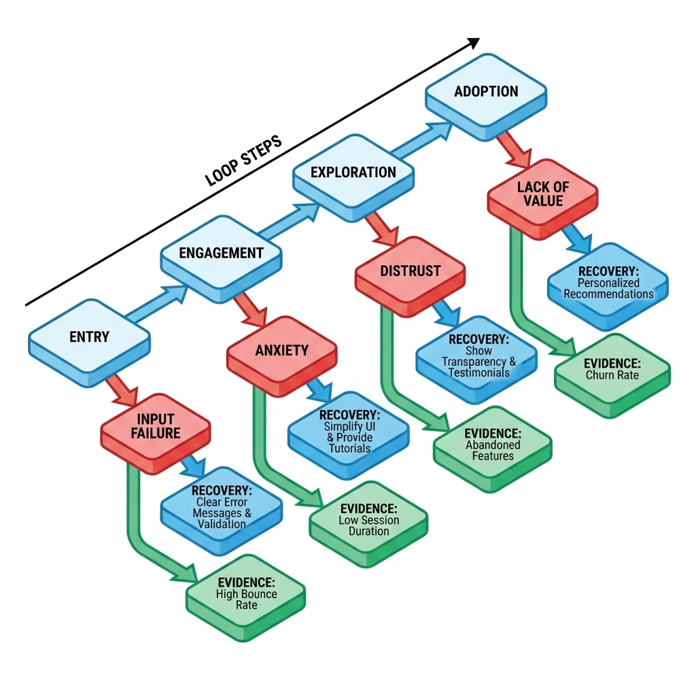
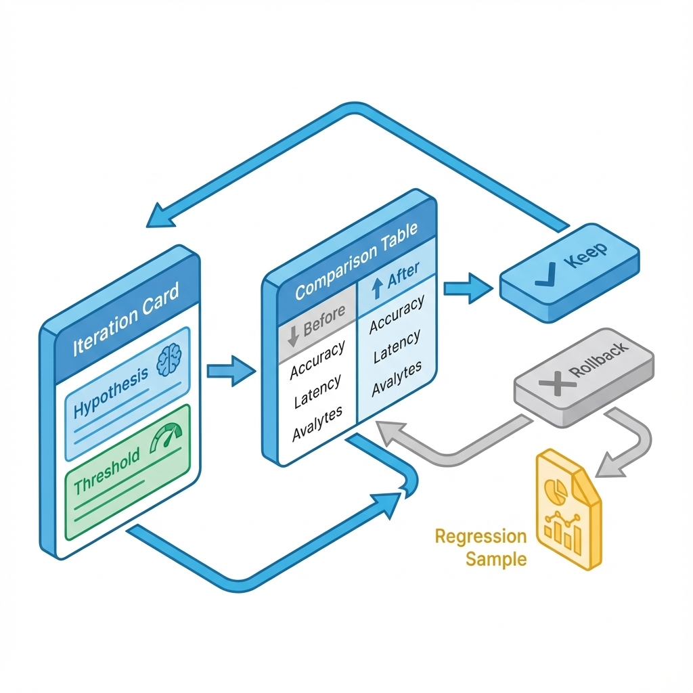

# 第 5 章：产品验证与打磨：把 0→1 做成闭环


> **插图生成提示词**
> - **核心主体**：一个极简的机械闭环结构，正在通过一个发光的检测门（Gate）。
> - **细节**：检测门显示绿灯或红灯，旁边堆着几个被剔除的“废品”（代表失败的迭代）。
> - **风格**：工程蓝图风格，高对比度线条，强调“通过/拦截”的硬性标准。
> - **排除**：复杂的仪表盘、文字标签、模糊的云雾。

> 0→1 阶段最致命的幻觉，是以为“功能做出来了”就等于“产品成立了”。本章不谈“感觉”，只谈“闭环”：如何建立一套可裁决、可回滚、可留档的机制，让你在低流量下也能把产品修到稳定，而不是靠运气盲目精修。[4][6]

你将在本章面对一个冷酷的事实：绝大多数 0→1 产品不是死于功能太少，而是死于闭环太长、太脆、太不可预测。当闭环不稳定时，任何打磨都是在给危房贴壁纸；只有当闭环可预测时，打磨才能产生复利。

## 章节定位
你已经有了一个原型（关键路径能跑通），下一步不是立刻重构代码，也不是从 Dribbble 抄一套 UI，而是必须回答两个生死问题：

1.  **验证（Value Validity）**：目标用户是否真的愿意走完这个闭环？如果不愿意，是因为懒、太贵，还是你解决的问题根本不存在？
2.  **打磨（Reliability）**：闭环能否在 10 次运行中成功 8 次？断点在哪？怎么修补才能提高成功率？

本章的任务，是把 0→1 的中间地带变成固定节拍：每次迭代都有明确的“为什么改”、“改什么”、“怎么算成”、“失败了怎么办”。[4][6]

## 你将交付什么
- **一张断点地图**：清楚列出用户在哪个环节流失，以及对应的恢复手段。
- **一套迭代卡片**：包含假设、门槛、样本、失败判定、回滚策略。
- **一个打磨优先级排序**：用“修复断点”替代“我觉得这样更好看”。[4]

## 三层思考：验证与打磨的区别
### 第 1 层：读者目标
读完本章，你不再是用“我觉得”来做决策，而是能拿出两样东西：
- **可复跑的闭环脚本**：无论谁来测，按这个脚本跑，结果一致。
- **同口径对比表**：改动前后的数据对比，用数据裁决保留还是回滚。

### 第 2 层：论证链条
0→1 的验证逻辑必须是刚性的：

闭环定义 → 样本获取 → 指标口径 → 迭代卡片 → 小步改动 → 守门观察 → 裁决（保留/回滚）→ 归档

这里最脆弱的环节是**样本质量**（找了一堆不痛不痒的人）和**裁决标准**（没有事前定好门槛，事后强行解释）。[4]

### 第 3 层：落地与验收
不要追求虚荣指标（如 PV/UV），只看三个硬指标：
- **复跑率**：你是否能在一周内，让 5 个真实用户完整跑通闭环？
- **裁决力**：你是否真的执行过一次“因为数据没达标而回滚”的操作？
- **留档率**：你的每一次迭代决策，是否有对应的证据（日志/截图）留存？[6]

## 方法论：0→1 的三步闭环
1.  **定义闭环（短而硬）**：3 到 5 个动作，从进入到拿走价值。多一步都是风险。
2.  **门槛决策（死线）**：改动前定好“成功线”和“失败线”；改动后只看数据，不听故事。[6]
3.  **补丁式打磨（可逆）**：所有打磨都是补丁，必须可回滚。证据先入库，结论后补。


> **插图生成提示词**
> - **核心主体**：一个循环流程图，分为五个明确阶段：定义、实验、观察、裁决、归档。
> - **细节**：在“裁决”环节有一个明显的分岔路口（通过或回滚）。
> - **风格**：扁平化图标，箭头清晰，颜色区分鲜明（如蓝/橙/灰）。
> - **排除**：复杂的背景纹理、难以辨认的文字。

## 第一步：画出你的“断点地图”
不要写“用户体验流程图”，要写“断点地图”。你的闭环只有 3–5 步，每一步都可能断掉。

通用公式：
**进入产品 → 注入上下文（数据/意图）→ 触发核心计算 → 获得结果 → 带走价值（保存/分享/支付）**

### 闭环断点地图模板

| 步骤 | 用户动作 | 系统反馈 | 常见断点（Why） | 恢复入口（How） | 证据口径 |
| :--- | :--- | :--- | :--- | :--- | :--- |
| **1** | 进入 | 展示第一步 | 不知从何下手 | 预置示例/模板 | 停留 > 30s 无动作 |
| **2** | 输入/导入 | 校验并反馈 | 数据格式错/没数据 | 格式清洗/提供Demo数据 | 报错率/空输入率 |
| **3** | 执行 | 进度条/中间态 | 等待焦虑/结果不可信 | 进度透传/引用来源 | 取消率/重试率 |
| **4** | 采纳 | 保存/导出 | 不知怎么用/格式不通 | 复制/API/格式转换 | 复制率/下载率 |



!!! note "图 5-2 使用说明"
    这张图是你的作战地图：
    - **横轴**：闭环的关键步骤。
    - **下方标注**：每一层的“断点”和“恢复手段”。
    - **核心逻辑**：只要用户还在断点流失，就不要去优化那些顺畅的环节。先止血，再造血。

## 首次闭环：不是做个引导页，而是帮用户赢一次
很多产品死在第一天，不是因为难用，而是用户第一次尝试就输了。

AI 产品的首次闭环设计，必须满足三个条件（缺一不可）：
1.  **起步无脑**：必须提供默认值、模板或示例。用户没有义务在这个阶段动脑子。
2.  **过程透明**：AI 是黑盒，你的界面不能是。显示进度、解释原因、展示引用。[71][72]
3.  **结果可用**：哪怕只是个 60 分的结果，也必须是可复制、可保存、可导出的。不能给一句“我无法回答”。

**AI 特有门槛：**
- **纠错入口**：用户必须能修正 AI 的错误（改 Prompt、改参数、改上下文）。如果只能重来，就是设计事故。[71]
- **可信标识**：如果不确定，标出来。不要用“自信的胡说八道”骗用户。

**验收标准：**
- **首次任务完成率**：≥ 基线 + 20%。
- **首次结果采纳率**：≥ 60%（且无幻觉强答）。

如果只能做一件事：优化“起步”，让用户不用思考就能开始。

## 第二步：搞定样本（别靠运气冷启动）
不要把“没人用”当成产品问题，这通常是**样本工程**问题。

你需要 **10–20 个活人**，他们有真实痛点，且配合度高。找不到这 20 个人，不要写代码，先去扫楼、混群、发邮件。[4]

### 样本清单模板

| ID | 角色匹配度 | 数据就绪度 | 任务类型 | 频率 | 反馈渠道 | 闭环状态 |
| :--- | :--- | :--- | :--- | :--- | :--- | :--- |
| U01 | 核心目标 | 有清洗好的 CSV | 数据分析 | 日频 | 微信群 | ✅ 完成 |
| U02 | 边缘用户 | 无数据，需 Demo | 体验一下 | 一次性 | 邮件 | ❌ 放弃 |

**样本合格标准：**
- **痛点真实**：不是“看起来不错”，而是“我如果不解决这个问题就要加班”。
- **配合度高**：愿意在你的指导下跑完流程，哪怕 bug 频出。
- **数据就绪**：特别是 AI 产品（RAG/分析类），用户手里必须有能喂给 AI 的数据。

## 第三步：指标树与门槛（把“好用”量化）
不要看虚荣指标。0→1 阶段只看三层：
1.  **北极星指标 (NSM)**：用户真正获得价值的次数（如：每周成功生成的周报数）。[6]
2.  **关键行为**：闭环的必经之路（如：上传成功率、修改率、复制率）。
3.  **守门指标 (Guardrails)**：底线，破了就回滚（如：成本、延迟、幻觉率）。[6]

### 0→1 指标树模板

| 层级 | 指标名称 | 计算口径 | 目标门槛 | 失败判定 |
| :--- | :--- | :--- | :--- | :--- |
| **NSM** | 每周有效闭环数 | 成功导出/复制的会话数 | ≥ 50 | 连续 2 周 < 30 |
| **行为** | 导入/输入成功率 | 成功 Step 2 / 总尝试 | ≥ 80% | < 60% |
| **行为** | 结果采纳率 | 结果被复制或保存 / 总生成 | ≥ 60% | < 40% |
| **行为** | 纠错挽回率 | 纠错后采纳 / 总纠错 | ≥ 50% | 连续下降 |
| **守门** | 幻觉率 | 无引用却给出事实性结论 | ≤ 1% | 出现即 P0 级 Bug |
| **守门** | 人工接管率 | 点击“转人工”或报错 | ≤ 10% | 连续上升 |
| **守门** | 单次成本 | Token 消耗 / 闭环 | ≤ $0.1 | > $0.15 |
| **守门** | P95 延迟 | 95% 请求的耗时 | ≤ 5s | > 8s |

## 迭代卡片：拒绝“口头打磨”
每次改动，必须填卡片。没有卡片，不许改代码。这不是官僚主义，这是为了防止你骗自己。[4]

### 迭代卡片模板 (Copy This)

```markdown
# 迭代卡片: ITR-2025-XX-XX

## 1. 假设 (Hypothesis)
- **改动点**：优化 RAG 检索后的重排序逻辑。
- **预期**：将提升“结果采纳率”。
- **理由**：目前 Top 3 结果相关性低，导致用户频繁重试。

## 2. 目标与门槛
- **主指标**：结果采纳率 ≥ 65% (当前 55%)。
- **守门指标**：P95 延迟 ≤ 3s (允许轻微上涨，但不能过线)。
- **失败判定**：采纳率无明显提升，或延迟 > 4s。

## 3. 验证方案
- **样本**：20 个历史失败 Query + 20 个随机 Query。
- **版本**：Prompt V2.1 + Re-ranker V1.0。
- **流量**：先离线跑测，通过后切 10% 流量。

## 4. 回滚策略
- **触发条件**：守门指标报警或 Error Rate > 1%。
- **动作**：一键切换回 Re-ranker V0.9。

## 5. 证据路径
- 对比表：`reports/itr-2025-xx-xx/compare.md`
- 日志：`logs/itr-2025-xx-xx/`
```



!!! note "图 5-3 使用说明"
    - **左（卡片）**：事前立据，防止事后画靶。
    - **中（对比表）**：事中记录，同口径才有说服力。
    - **右（裁决）**：事后决断，只有三个选项：保留、回滚、继续测。

## 解决 AI 的不确定性：场景脚本
AI 输出是不稳定的，怎么验证？
答案：**固定变量，多次复跑，统计概率。**

不要手工测，写成脚本。

### 场景脚本模板

```text
场景 ID：SCN-001-DATA-ANALYSIS
任务：用户上传财报并询问净利润趋势
输入：<sample_financial_report.pdf>
Prompt 变量：{question: "2024年Q3净利润同比增长多少？", style: "concise"}
期望输出：
  - 必须包含数字："+15%" 或 "15%"
  - 必须引用原文：Page 12 Table 3
  - 必须无拒答关键词："无法回答", "不知道"
失败判定：
  - 缺少引用
  - 数字错误
  - 响应时间 > 10s
```

### 可执行示例：使用 CLI 验证 Prompt

这是一个真实的验证脚本示例，你可以直接拿去改。

```python
# 验证脚本: verify_prompt.sh
# 依赖: gemini-cli (已配置 PATH)

# 1. 准备输入与 Prompt
cat <<EOF > input_context.txt
产品 A 的 Q3 销量为 1000，同比增长 20%。
产品 B 的 Q3 销量为 500，同比下降 5%。
EOF

cat <<EOF > prompt_template.txt
基于以下上下文，请计算 Q3 总销量并分析趋势。
上下文:
{{CONTEXT}}
要求: 输出 JSON 格式，包含 total_sales 和 trend_summary。
EOF

# 2. 组合并执行 (Gemini)
# 注意：这里模拟组合过程，实际需用代码替换 {{CONTEXT}}
# 假设 generated_prompt.txt 已经包含替换后的内容
gemini -m gemini-3-pro-preview -p "$(cat prompt_template.txt | sed "s/{{CONTEXT}}/$(cat input_context.txt)/")" > result.md

# 3. 自动判定 (简单的 Grep 检查)
if grep -q "1500" result.md; then
  echo "PASS: Total sales correct."
else
  echo "FAIL: Total sales incorrect."
fi

if grep -q "JSON" result.md || grep -q "{" result.md; then
  echo "PASS: Format looks like JSON."
else
  echo "FAIL: Format error."
fi
```

**关键点：**
1.  **固定输入**：不要每次手敲，存成文件。
2.  **自动化执行**：用脚本跑，别用聊天框点点点。
3.  **结果落盘**：存下来，这是你的证据。

## 一周节拍：从“随性改”到“固定修”
把你的开发节奏锁死在周维度上。[6]

- **周一：选题**。看数据，选 **1 个** 最痛的断点。写迭代卡片。
- **周二/三：开发**。只修这个断点。别顺手改 UI，别顺手加功能。控制变量。
- **周四：验证**。跑脚本，灰度发布，盯着守门指标。
- **周五：裁决**。填好对比表，决定是保留还是回滚。归档证据。

**优先级法则：**
**断点修复 > 收益放大 > 细节精修**
先让用户走通（修断点），再让用户爽（放大收益），最后再搞那些花里胡哨的（精修）。

## 常见陷阱（不要踩）
1.  **“用户说不错”**：那是客套话。看他是不是真的每周都来用。没数据就是没验证。[4]
2.  **“这周改了 10 个地方”**：那你完了。指标变了你根本不知道是哪个改动造成的。每次只改一个变量。[6]
3.  **“指标涨了但成本爆了”**：这就是没有守门指标的后果。任何不计成本的增长都是耍流氓。设置自动止损线。[6]

## 交付物清单
本章结束时，你应该有：
- [ ] **核心闭环断点地图**（含恢复入口）。
- [ ] **10-20 个真实样本清单**（及他们的测试记录）。
- [ ] **指标树**（含 NSM 和 守门指标）。
- [ ] **至少 3 张完整的迭代卡片**（含裁决记录）。

## 下一章
验证通过，闭环跑通了，现在你的界面可能还像个半成品。下一章，我们将讨论如何把这些逻辑封装进一套可维护、可扩展的 UI 系统中，而不是堆砌控件。

前往下一章：[06-ui.md](06-ui.md)。

## 参考
详见本书统一参考文献列表：[references.md](references.md)。
