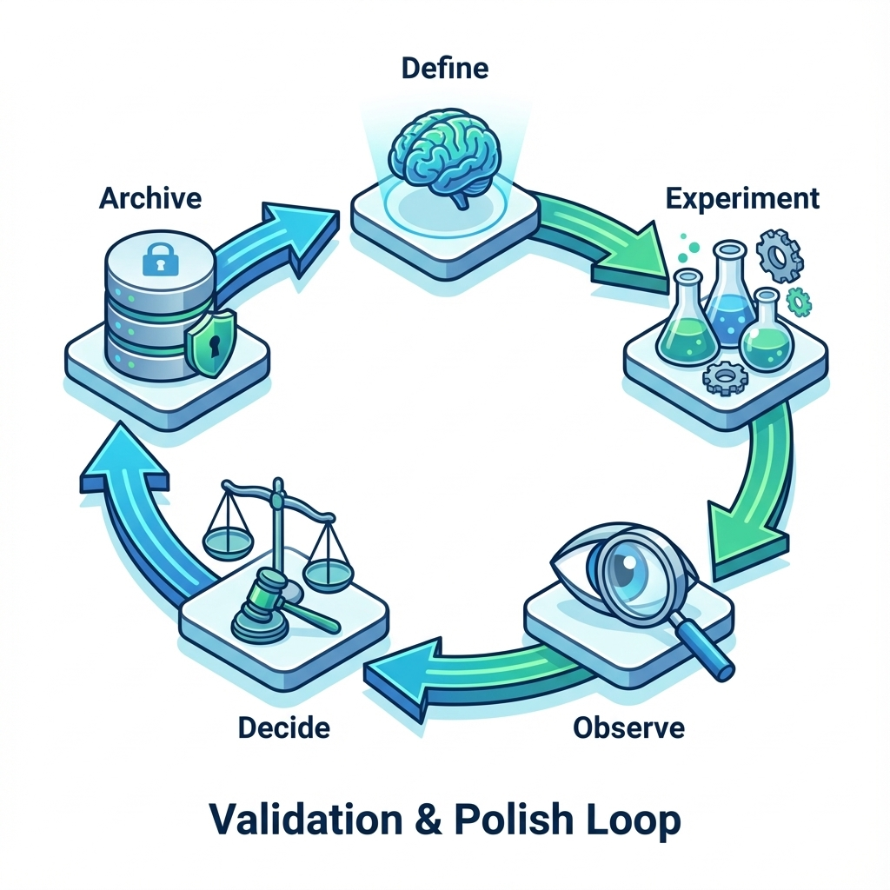

# 第 5 章：产品验证与打磨：把 0→1 做成闭环


> 0→1 最容易的幻觉，是以为做出来就成立了。本章把验证与打磨写成一条可裁决、可回滚、可留档的闭环：让你在低流量条件下，依然能稳定推进，而不是靠感觉精修。[4][6]

你会在这一章遇到一个残酷但友好的事实：很多产品不是做得不够多，而是闭环不够短、不够稳、不够可预测。当闭环不稳时，任何打磨都会变成无方向的劳动；当闭环可预测时，少量打磨就会带来可复利的收益。

## 章节定位
你已经有了原型（关键路径能走通），下一步不是立刻工程化，也不是立刻美化 UI，而是先回答两个问题：

1. **验证（Value Validity）**：目标用户是否愿意为这条闭环付出成本（时间/数据/钱/迁移）？如果不愿意，原因是什么？
2. **打磨（Reliability）**：闭环能否稳定发生？断点在哪里？哪些改动会显著提升完成一次闭环的概率？

本章的任务，是把 0→1 的中段变成固定节拍：每次迭代都能写清楚为什么改、改什么、怎么判定成功、失败怎么回滚、证据存在哪里。[4][6]

## 你将收获什么
- 一张 0→1 指标树：北极星指标（NSM）→ 关键行为 → 守门指标（成本/质量/风险）。[6]
- 一套迭代卡片：假设、门槛、样本、失败判定、回滚与证据留档。
- 一份打磨优先级方法：用断点修复 / 收益放大替代顺手优化。[4]

## 三层思考：验证与打磨分别在做什么
### 第 1 层：读者目标
读完本章，你应该能交付两件东西：
- 一份闭环断点地图：哪一步最容易失败、失败原因是什么、用户如何恢复。
- 一套迭代裁决机制：每次改动都能用同口径对比表做裁决，而不是讲故事。

### 第 2 层：论证链条
0→1 的验证闭环应当是：

闭环定义 → 样本获取 → 指标口径 → 迭代卡片 → 小步改动 → 守门观察 → 裁决（保留/继续/回滚）→ 归档

链条里最容易断的是两处：样本质量（不够同质、不可控）与裁决方式（事后解释、没有门槛）。[4]

### 第 3 层：落地与验收
你不是追求显著增长曲线，而是追求闭环能稳定发生。因此验收不是看曲线漂不漂亮，而是看：
- 你是否能在一周内复跑至少 5 次闭环；
- 你是否能用门槛裁决一次迭代；
- 你是否能在退化时一键回滚。[6]

## 方法论速览：0→1 的三步闭环
1. **把闭环写清楚（短而硬）**：3–5 个动作，从进入到获得价值。任何多余步骤都先当成风险。
2. **用门槛做决策**：改动前写成功阈值与失败判定；改动后只按同口径对比表裁决。[6]
3. **把打磨做成补丁**：所有改动都可回滚；证据先留档，观点后补充。



## 第一步：写出你的核心闭环
闭环写作要求只有两条：短、可观察。下面是一种通用写法：

进入产品 → 形成输入（数据/意图/权限）→ 触发关键动作 → 得到可感知结果 → 把结果带回工作流（保存/分享/导出/付费）

### 闭环描述（3–5 步）

| 步骤 | 用户动作 | 系统反馈 | 失败断点（常见） | 恢复入口 |
| --- | --- | --- | --- | --- |
| 1 | 进入 | 看到下一步 | 不知道从哪开始 | 引导/示例 |
| 2 | 输入/导入 | 校验与预期 | 输入失败/无数据 | 修复建议/模板 |
| 3 | 执行 | 进度与结果 | 超时/无结果/不可信 | 重试/追问/降级 |
| 4 | 采纳结果 | 保存/导出 | 不知道怎么用 | 下一步建议 |


!!! note
    作图提示：建议画成步骤到断点到修复方向，优先级一眼可见。
    - 横轴：闭环 3–5 步（从进入到采纳）
    - 每一步下面标 2–3 个常见断点（入口不清/输入失败/等待焦虑/结果不可信/不知道怎么用）
    - 每个断点标注恢复入口（示例/重试/追问/降级/联系支持）与证据口径（你怎么知道它发生了）

你可以把上面这张表当作断点地图：每一步至少写一个常见失败点，并明确恢复入口与证据口径（你怎么知道它发生过）。一旦你写清楚断点，后面的打磨优先级就会变得非常朴素：先修最容易断的那一段。

## 首次闭环：不是做个引导页，而是帮用户赢一次
很多 0→1 产品死在首日：用户不是不需要，而是第一次使用时被卡住了——他不知道从哪开始、担心输入错了会浪费时间、或者拿到结果后不知道怎么用进工作流。你要做的不是更精美的引导，而是设计一个更容易赢的第一局。

一个更实用的产品视角是：把首次闭环当成三段式体验来设计与验证：
- **起步容易**：提供示例、默认值、模板，减少我要输入什么的不确定性。
- **过程可预期**：展示进度、预计等待、可取消/可重试，让用户不被黑箱吞没。
- **结果可采纳**：一键复制/保存/导出，并给出下一步怎么用的建议，把价值带回工作流。

对 AI 产品来说，你还需要额外验证一件事：**用户能否在不确定性出现时继续前进**。这通常意味着两类设计必须在首版就出现：  
- 纠错入口：用户可以最小粒度修正（补信息、改条件、撤销一段结果），系统能接着修，而不是推倒重来。[71][72]  
- 可信提示：当结果可能不可靠时，系统会给出来源/证据/待核验的明确标识，避免把用户推入错误的确定性。[71]

如果你只能在首版做一件打磨，优先做这三件事的任意一件。它们往往比新增功能更能提高闭环发生率。[4][6]

## 第二步：拿到可用样本（冷启动不靠运气）
0→1 最大误区之一，是把没人用误判为产品不行。很多时候，问题只是你没有拿到足够清晰、足够同质、足够可控的样本。

建议把样本当成一个工程问题：**先拿到 10–20 个目标用户的可控样本**，再谈闭环与打磨。[4]

### 样本清单（冷启动）

| 用户编号 | Persona 是否匹配 | 任务类型 | 使用频次预期 | 反馈渠道 | 是否完成闭环（Y/N） |
| --- | --- | --- | --- | --- | --- |
| U01 | 是/否 | 例如：写周报 | 每周 1 次 | 群/表单/电话 |  |

样本质量的最低标准：
- 用户真实在经历你的痛点（不是听起来不错）。
- 他们愿意完成一次完整任务（哪怕你在旁边引导）。
- 你能在一周内让至少 5 人完成至少 1 次闭环。[4]

## 第三步：指标树与门槛（把好不好用变成可裁决）
0→1 阶段建议使用三层指标：
1. **北极星指标（NSM）**：代表用户获得价值的直接结果（例如每周成功完成的关键任务数）。[6]
2. **关键行为指标**：闭环的必要步骤（例如导入成功率、首个任务完成率、结果被采纳率）。
3. **守门指标（Guardrails）**：不能为了 NSM 牺牲的底线（成本、延迟、崩溃率、错误率、退款率）。[6]

### 指标树（0→1）

| 层级 | 指标 | 口径（怎么计算） | 目标门槛 | 失败判定 |
| --- | --- | --- | --- | --- |
| NSM | 例如：每周闭环次数 | 人均/总量/分组 | ≥ X | < X 且无可解释原因 |
| 行为 | 例如：导入成功率 | 成功/总尝试 | ≥ Y% | 连续下降 |
| 守门 | 例如：单次成本 | 平均/分位数 | ≤ Z | 超预算即回滚 |

## 迭代卡片：把打磨变成可回滚补丁
每一次验证/打磨都写成一张卡片，避免事后讲故事。[4]

### 验证与打磨卡片

| 字段 | 说明 |
| --- | --- |
| 假设 | 改动会改善哪个关键行为？为什么？ |
| 目标用户 | 这次只针对谁？（不要泛化） |
| 指标与门槛 | 成功阈值 + 失败判定（提前写） |
| 观察窗口 | 7 天/14 天（结合使用周期） |
| 成本上限 | 时间/预算/算力止损线 |
| 风险与回滚 | 守门指标阈值 + 回滚触发条件 |
| 证据留档 | 日志/截图/录屏/对比表存在哪里 |


!!! note
    作图提示：建议画成一页迭代闭环，把卡片、对比表、裁决连起来。
    - 左：迭代卡片（假设/门槛/回滚/证据位置）
    - 中：对比表（改动前/后，同口径；并标出守门指标是否越界）
    - 右：裁决（保留/继续/回滚）+ 要补的回归样本（把这轮学到的东西沉淀下来）

把一次迭代写成一页，会让你在热情之外，拥有一把冷静的裁决尺：

```text
迭代卡片（假设/门槛/回滚/证据位置）
  → 对比表（改动前/后，同口径；守门指标是否越界）
  → 裁决（保留/继续/回滚）+ 回归样本更新（把这轮学到的沉淀下来）
```

## 一周节拍：让 0→1 进入可重复的推进
把打磨变成固定节奏，能显著减少今天想改什么就改什么的漂移。[6]

- 如果你希望这个节奏长期不偏航，把接触用户/复盘证据也纳入固定动作（而不是等到没增长才想起访谈）。持续发现不是一段时间的冲刺，而是一种可以被日历保护的习惯。[73]

- **周一：选题**：复盘证据，选 1 个断点（或 1 个收益放大点），写迭代卡片（含门槛与回滚）。
- **周二–周三：改动**：只做能影响该断点的最小补丁；避免把顺手优化塞进同一轮。
- **周四：发布与观察**：小流量灰度，盯守门指标（成本/延迟/错误率），记录触发条件。
- **周五：裁决与归档**：写对比表与结论：保留/继续试验/回滚，并把证据归档。[4]

## 打磨优先级：断点修复优先于细节精修
0→1 的打磨只做两类事：
- **断点修复**：闭环某一步持续失败（注册、导入、首次任务、结果不可信）。
- **收益放大**：让用户更快感受到收益（减少步骤、减少等待、减少不确定）。[4]

当你不确定要改什么，用这个简化的排序规则：
1) 是否影响闭环完成率；2) 是否减少不确定性；3) 是否改善守门指标；4) 是否容易回滚。

## AI 怎么用在验证与打磨上（但不替你做裁决）
AI 的高价值用途是压缩信息与生成备选项，不是替你定门槛：
- **反馈压缩**：把访谈/反馈压缩为断点列表 + 可能根因 + 需要补的证据，并给出 3 个最小改动方案。
- **失败样本结构化**：把翻车案例整理为失败模式：现象/触发条件/修复策略/回归验证，便于进入后续评测闭环。[18]
- **文案与引导备选**：生成 3 个文案/引导方案，但你必须用门槛裁决，且观察守门指标是否退化。[6]

### 把验证写成场景脚本（让每轮改动都可复跑）
很多团队把验证做成一次性走查：今天看起来还行，明天换一批人、换一段文案、换一个入口，又得从头开始。更稳的做法是把验证写成场景脚本，把真实任务、输入、约束与失败判定固定下来，让每次迭代都能对比式复跑。[82]

写场景脚本时，重点不是写得漂亮，而是把变量收住：
- 固定用户任务：用户要完成什么，成功的可观察证据是什么。
- 固定初始状态：权限、数据量、是否有历史记录、是否处在弱网环境。
- 固定关键输入：至少保留一组真实但已脱敏的输入样例，避免每次换输入导致结论不可比。
- 固定失败判定：哪些情况算失败，用户如何恢复，恢复入口是否清晰。[82]

如果你需要在原型阶段测试表格、图表、列表等数据密集界面，别用空白占位糊弄自己。用 AI 生成一组看起来真实的假数据，可以让走查更接近真实工作流，也更容易暴露布局、溢出、排序、筛选、空状态等问题。[84]

## 复现检查清单（本章最低门槛）
- 有一份核心闭环描述（3–5 步），并列出至少 5 个断点与恢复入口。
- 有一张指标树（NSM/关键行为/守门指标）与口径说明。[6]
- 有至少 3 张迭代卡片（含门槛/失败判定/回滚/证据留档）。[4]
- 一周内至少完成 5 次闭环复跑，并能输出一页对比表（改动前/后）。[6]

## 常见陷阱（失败样本）
1. **现象**：有人说不错，但没有持续使用。  
   **根因**：验证只收集观点，没有观察闭环是否发生。  
   **修复**：用任务驱动验证：盯完成一次闭环的证据，而不是盯喜欢/不喜欢。[4]

2. **现象**：越打磨越累，效果不明显。  
   **根因**：没有门槛，优化对象漂移；把细节精修当成进度。  
   **修复**：每轮只改一个断点，并提前写失败判定；无提升就回滚。[6]

3. **现象**：指标上去了，但成本/风险爆了。  
   **根因**：只看 NSM，不设守门指标。  
   **修复**：把成本/延迟/错误率写成硬门槛；越界即止损与回滚。[6]

## 交付物清单与验收标准
- 核心闭环与断点地图（含恢复入口）。
- 样本清单（10–20 人）与闭环完成记录。
- 指标树与口径说明（含守门指标阈值）。[6]
- 迭代卡片库 + 对比表 + 决策记录（保留/继续/回滚）。[4]

## 下一章
当验证证明闭环成立，你的工作重心会从能不能发生转向能不能长期维护：把 UI 与交互沉淀为资产，并建立可回归的设计与实现基线。下一章见：[06-ui.md](06-ui.md)。

## 参考
详见本书统一参考文献列表：[references.md](references.md)。
