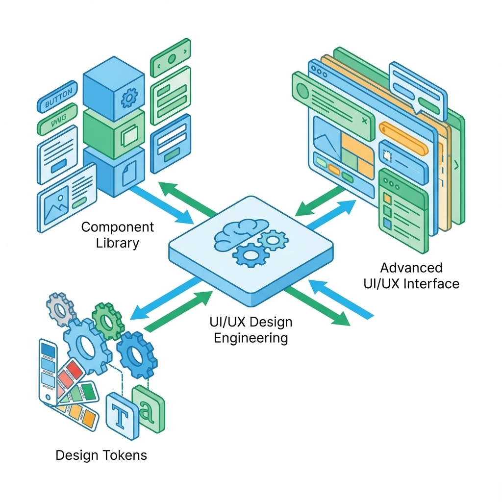
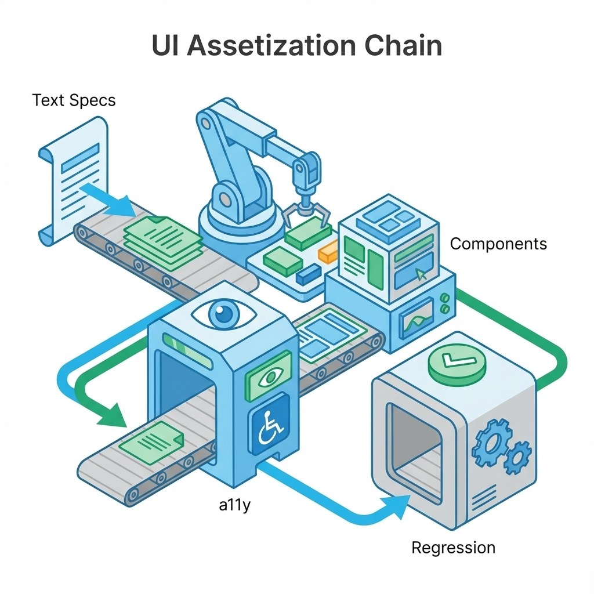
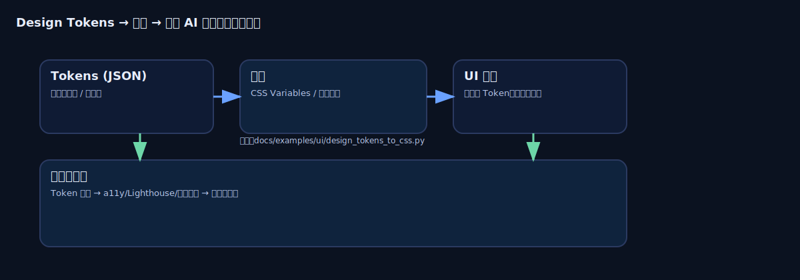

# 第 6 章：UI 设计：把体验做成可维护资产


> 好看不难，难的是既好用，又经得起迭代。在 0→1 阶段，UI 的第一任务不是装饰，而是把不确定性压缩：让用户知道下一步是什么、失败后怎么回来、并且每次改动都能回归。[17]

如果你已经在上一章证明闭环成立，接下来最常见的失速来自两件事：一是体验不稳定（入口绕、状态缺、错误不可恢复），二是迭代成本越来越高（每次改 UI 都像重新装修）。本章要做的，就是把体验沉淀成资产：规格、组件、可访问性与回归基线。

## 章节定位
本章位于验证与打磨之后、工程化之前。它的目标不是教你画得更漂亮，而是教你把 UI 变成可维护系统：能复用、能解释、能回归、能适应下一轮迭代。[17]

## 你将收获什么
- 一套文字规格优先的写法：先把任务、信息层级、状态与恢复写清楚，再谈视觉。
- 一份最小可访问性（a11y）验收清单：把可用变成发布门槛，而不是上线后的补丁。[17]
- 一套把界面沉淀为资产的方法：组件与变体、状态基线、文案规范、边界与例外。

## 三层思考：UI 设计的本质是降低认知与维护成本
### 第 1 层：读者目标
读完本章，你应该能输出可实现、可验收、可回归的 UI 规格，让任何一次改动都能回答：
- 它改善了哪个断点？
- 它是否引入了新的失败？
- 它是否会在下轮迭代中继续可维护？

### 第 2 层：论证链条
UI 从灵感到可维护资产的链条是：

任务与信息层级 → 状态与错误恢复 → 组件与变体 → 文案与一致性 → 可访问性门槛 → 回归基线

缺其中任一环，UI 会变成截图工程：能看不能用，能用不稳定，能稳定但难维护。[17]

### 第 3 层：落地与验收
UI 的验收不止是视觉对齐，更要包含：
- 关键任务是否更短、更清晰、更可预测；
- 关键状态是否齐全（空/加载/成功/失败/无权限）；
- 键盘与辅助技术是否可用（最低门槛）；
- 文案与布局在真实约束下是否成立（长文案、移动端、弱网）。[17]

## 方法论速览：先写规格，再做风格，再沉淀组件


### 1) 先写文字规格（让争论有裁判）
所谓文字规格，不是写一篇文案，而是写清楚：
- 这个页面的目标是什么（为哪个用例服务）；
- 用户的下一步是什么（主 CTA 是什么）；
- 失败后怎么回来（错误恢复入口在哪里）；
- 每个关键状态如何呈现（空/加载/失败/无权限）。[17]

#### 页面文字规格（最小可验收）

| 模块 | 你要写什么 |
| --- | --- |
| 页面目标 | 一句话：用户来这里要完成什么 |
| 主 CTA | 一句话：点击后发生什么；失败如何提示 |
| 信息层级 | 3 层以内：主信息/次信息/辅助信息 |
| 状态清单 | 空/加载/成功/失败/无权限（每个状态的文案与入口） |
| 错误恢复 | 重试/返回/求助/联系客服/查看示例（至少 1 个） |
| 约束 | 设备/网络/权限/数据规模（影响交互与文案） |
| 验收 | 任务完成率、耗时、错误恢复率（同口径） |

把规格写出来后，AI 的正确用法不是让它自由发挥设计，而是让它把规格变成可审查补丁：严格遵守状态清单、恢复入口、Token 约束与 a11y 底线。

下面是一份可直接复制的生成提示词骨架，用来把文字规格转成组件或页面实现。它的目标不是一次生成可上线代码，而是生成一份可评审、可回滚的改动。

```text
你是前端工程师与 UI 审稿人。任务：把下面的 UI 文字规格实现为一个可回滚补丁。

输入
- 文字规格：<粘贴本节表格，含状态清单与恢复入口>
- 设计约束：只允许使用现有 Design Tokens；禁止硬编码颜色/间距/字号
- a11y 底线：键盘可达、焦点可见、表单有 label 与可恢复错误提示
- 状态要求：必须覆盖空/加载/成功/失败/无权限，并补充流式输出的执行中/中断/继续

输出
- 只输出统一 diff
- 每个新增状态必须包含恢复入口
- 若信息不足，先列出 3 个需要补充的问题，不要编造
```

### 2) 再谈风格（风格服务于信息层级）
风格不是不要，而是要服从信息层级：颜色、字号、间距、对比度、动效都应当强化下一步是什么。如果风格掩盖了下一步，说明你在用美观掩盖结构问题。

### 3) 把组件当成长期资产
0→1 时你不需要完整设计系统，但需要一个不会失控的最小集合：
- 基础组件：按钮、表单、对话框、列表、提示、空状态、加载骨架。
- 规则优先：每个组件都要写清楚变体与状态；业务页面尽量组合组件，不复制样式。

#### 组件规格（变体与状态）

| 组件 | 变体 | 状态（必须覆盖） | 交互与反馈 | 禁止项 |
| --- | --- | --- | --- | --- |
| Button | primary/secondary/danger | 默认/禁用/加载 | 键盘可触达；加载时不可重复提交 | 在页面内自定义一套新按钮 |
| Input | text/password | 默认/聚焦/错误/只读 | 错误提示可理解且可恢复 | 仅用占位符代替标签 |
| ResultPanel（生成结果） | plain/with-citations | 空/流式中/完成/中断/失败 | 可中断；可复制部分；提示证据与不确定性 | 只给结论不给依据 |

### 流式交互：把执行中与中断写成状态
对 AI 产品，UI 最容易翻车的不是静态页面，而是执行中的长任务：流式输出、工具调用、检索等待、预算超限。它们会把一个看似简单的组件变成状态机。

建议在原型与组件规格阶段就把流式状态写死，至少覆盖：
- 执行中：展示进度与可取消，避免黑箱等待。
- 增量渲染：允许用户边看边停、边复制边继续。
- 中断与继续：中断后能恢复现场，避免推倒重来。
- 证据不足：明确追问或降级，不允许强答。

## Design Tokens：把风格变成可执行约束
当你开始频繁迭代 UI，一致性会成为最大的隐性成本：颜色、间距、阴影、圆角到处散落（Figma、CSS、组件里各一份），AI 生成的代码更容易出现看起来差不多但不一致的幻觉。解决思路是把设计决策写成一个可版本化、可生成、可校验的**唯一事实源**：Design Tokens。[53]



如果你做过一次全站换主色，你会发现真正折磨人的不是改一个值，而是：

- 你不知道哪里还藏着硬编码的 `#3b82f6`；
- 你不知道哪些页面会被影响、影响是否可接受；
- 你不知道改完以后有没有退化（对比度、可访问性、视觉一致性）。

Design Tokens 的意义就是把这些不确定性压缩成**可审查的变更**：你改的是一份 JSON，所有产物由出码生成；你的门禁跑的是 a11y/质量回归，而不是靠肉眼扫页面。[53]

你可以把 Token 当成 UI 的配置与契约：
- **基础层（Primitive）**：原始值（如 `blue-500`）。
- **语义层（Semantic）**：表达意图（如 `color.action.primary`），尽量不要把长什么样写进名字。[53]
- **组件层（Component）**：把语义绑定到组件状态（如 `button.bg.default`）。[53]

### 最小 Token 规范（可直接起步）

| 要素 | 约定 |
| --- | --- |
| 存储格式 | 用 JSON 作为唯一事实源（可被工具链消费/生成）[53] |
| 命名 | 语义化（error-bg）优先于外观化（red-bg）[53] |
| 引用 | 组件层尽量只引用语义层；减少魔法值[53] |
| 出码 | 用工具（如 Style Dictionary）从同一份 Token 生成多端产物（CSS Variables / iOS / Android）[53] |
| 回归 | Token 变更必须触发视觉回归或关键页面走查，避免一处改动全站变脸[53] |

把 Token 作为约束层后，AI 的使用方式也会变：你不需要让 AI 设计颜色，而是让它在给定 Token 的边界内组合 UI。最直接的规则是：**生成代码时禁止写十六进制颜色，只能引用 Token 键名**。[53]

为了让这条规则在协作中不靠自觉，建议把它写成可复用的约束清单，在每次让 AI 生成前端代码时都附上：

```text
约束清单（前端生成）
- 禁止新增任意颜色值（含 hex/rgb/hsl）；只能用 CSS 变量或 Token 键名
- 禁止新增任意间距/字号魔法值；只能用 spacing/font Token
- 发现硬编码时：改为 Token，并给出对应 token 名称
- 若找不到合适 Token：先提出新增 Token 的建议，不要临时写死
```

### 能跑的最小示例：Tokens JSON → CSS Variables（Python）
为了让你把 Token 真正落地，而不是停留在概念里，这里给一个零依赖、能跑起来的出码示例：

- Token 示例：`docs/examples/ui/tokens.sample.json`
- 出码脚本：`docs/examples/ui/design_tokens_to_css.py`

运行：

```bash
python3 docs/examples/ui/design_tokens_to_css.py \
  --in docs/examples/ui/tokens.sample.json \
  --out docs/assets/generated/tokens.sample.css
```

你会得到一份可直接引入的 CSS Variables（同时把 `{color.blue.600}` 这类别名转成 `var(--color-blue-600)`），这样语义层/组件层引用才能真正进入你的工程与回归体系。

## 可访问性（a11y）：把可用变成发布门槛
可访问性不是照顾少数人，而是让产品在真实世界更稳：键盘用户、弱网、老旧设备、不同语言长度，都会逼你把交互做扎实。[17]

**最小 a11y 验收清单（建议作为门槛）**
- 键盘可完成关键任务（Tab 顺序、Enter 提交、Esc 关闭）。
- 焦点可见且顺序合理（不会迷失焦点）。
- 文本对比度达标（主信息与 CTA 清晰）。
- 表单有明确标签与错误提示（错误提示可理解且可恢复）。
- 动效可克制（不靠动效传递关键信息；允许减少动效）。

### 从 WCAG 2.2 到可自动化的门禁
如果你只记住一件事：把可访问性从上线后修改成合入前拦。WCAG 2.2 的优势在于它把体验变成可验收条目（例如焦点可见、点击目标尺寸）。[17]

**补强：WCAG 2.2 AA 的几个高杠杆点**
- **焦点可见且不被遮挡**：Sticky Header/Footer 不能把聚焦元素盖住。[17]
- **点击目标尺寸**：移动端触控目标至少 24×24 CSS 像素（或提供足够间距）。[17]
- **语义化优先**：能用原生 `<button>` 就别用 `<div onClick>` 再用 ARIA 修补。[17]

### axe-core：把 a11y 退化拦在 CI 里
自动化工具覆盖不了全部 WCAG，但它非常适合做底线守门员：防止已修复的低级错误反复出现。[54]

**最小集成策略（从易到难）**
1. 组件单测：`jest-axe` / `vitest-axe` 扫描基础组件（Button/Input/Dialog）。[54]
2. E2E：在 Playwright/Cypress 中注入 `axe.run()`，只在关键状态变化后跑（弹窗打开、表单报错、路由切换）。[54]
3. CI 阻断：对 `critical/serious` 级别违规零容忍；老项目用基线策略先守新增。 [54]

## 质量门禁：用 Lighthouse 把感觉变成分数
UI 体验的另一个大坑是看起来没问题，但实际很慢/很脆。Lighthouse 能把性能、a11y、最佳实践这类主观判断变成可追踪的分数与建议，非常适合放进流水线做门禁。[55]

**建议的最小门槛（按项目调参）**
- 新页面：Performance ≥ 80（移动端口径），Accessibility ≥ 100。[55]
- 规则化：用 Lighthouse CI（LHCI）在 CI 中断言阈值，退化即阻断。[55]

## 回归策略：组件先行，E2E 兜底
当你开始资产化组件库，最划算的回归顺序通常是：**组件级回归跑得勤，页面级 E2E 只守黄金链路**。[56][57]

对 AI 生成代码，回归还有一个额外目标：拦截视觉漂移与交互退化。常规测试能发现按钮点不动，但很难发现对齐错位、颜色微变、状态缺失这种慢性退化。

一个低成本补强方式是把视觉 diff 交给 AI 做二次审查：先用 Playwright 截图对比，再让多模态模型判断差异是否影响下一步与错误恢复（而不是只看像素差）。

### Storybook Test Runner：把 Story 变成测试用例
如果你已经在写 Story 展示组件的各种状态，Test Runner 可以把它们直接转成可在 CI 里跑的冒烟/交互回归，并且在真实浏览器中执行（基于 Playwright）。[56]

**组件级回归的最低门槛**
- 每个关键组件至少 1 个 Story 覆盖成功/失败状态；表单/弹窗类组件用 `play` 覆盖一次交互。[56]
- 对网络请求组件用 MSW Mock，避免测试依赖后端与环境波动。[56]
- 可访问性顺手做：在 Story 执行后跑一次 a11y 扫描，作为 DoD。[56][54]

### Playwright：黄金链路的最后一道门禁
E2E 不该覆盖一切，它应该只守不能出错的那几条路：注册、登录、支付、关键配置等。[57]

**黄金链路 E2E 的写法（更稳、更省维护）**
- 选择器优先用 `getByRole/getByText`（面向用户可见属性），避免脆弱的 class/XPath。[57]
- 测试独立：每条用例都在全新浏览器上下文中运行，避免 Cookie/LocalStorage 污染。[57]
- 失败可复盘：保留 Trace，CI 失败时直接用 Trace Viewer 定位，无需本地复现。[57]

## 多语言与多端：把真实约束提前
0→1 最容易的爆雷是：只在理想文案与理想屏幕下成立。

**最小检查清单（i18n/多端）**
- 长文案不溢出、不遮挡 CTA（至少准备一组超长文案样例）。
- 移动端关键任务不需要精确点击（避免小按钮挤在一起）。
- 弱网/慢设备下加载态与重试入口明确。

## AI 怎么用在 UI 上（但不替你做判断）
把 AI 放在生成备选与做一致性检查上：
- 生成 3 版文案与引导，要求每版都说明对应哪类失败断点；
- 让 AI 做一致性巡检：术语是否统一、按钮动词是否一致、错误提示是否可恢复；
- 让 AI 按清单检查 a11y 风险点，输出可直接改写的一句话而不是泛泛建议。[17]

### 避免高保真原型带来的进度幻觉
用 AI 做原型与界面草稿时，一个常见陷阱是高保真带来的错觉：看起来像快做完了，实际上关键任务流、异常流与状态根本没跑通。要避免被这种进度幻觉误导，你需要把验收强制写成可复跑的走查脚本：覆盖完整任务流、关键异常流、以及所有必须出现的状态，而不是只看一张静态页面截图。[82][83]

更实用的检查方式是用真实复杂场景来测，而不是用简单示例自嗨：让测试输入包含真实约束，例如长文案、弱网、无权限、无数据、数据量很大、用户输入含糊或带情绪。只有在这些约束下仍然能顺畅完成任务，你的 UI 才算经得起迭代。[82][83]

### 在对话界面里把可控性做成控件
对话类产品很容易把一切都塞进提示词，最后变成只有作者自己会用的系统。更好的做法是把关键可控项做成界面控件，让用户知道当前模式是什么，也能在不改提示词的情况下调整行为。[80][81]

你可以优先考虑把这些控制点做出来：
- 输出形态与长度：简洁、详细、分步骤，或直接选择常用模板。
- 语气与角色：更专业、更友好、更中立，避免风格漂移导致用户不适。
- 上下文与记忆：哪些内容会被记住，哪些不会，是否允许引用历史对话。
- 风险与确认：当请求可能造成损失时，明确提示风险并要求二次确认。[80][81]

控件做出来还不够，配套也要到位：要能被复盘、能被回归、能解释。最小要求是把当前生效的控制状态展示给用户，并在日志里记录控制状态与最终输出，方便你定位一次对话为什么会变成那样。

## 关键流程图（纯文本）：规格到回归门禁

```text
文字规格（任务/状态/恢复入口） -> Token 约束（可执行） -> 组件库（单一来源）
  -> a11y 最小门槛（键盘/焦点/错误恢复） -> 性能门禁（Lighthouse/关键指标）
    -> 回归策略（组件级优先，E2E 兜底） -> 证据留档（报告/截图/Trace）
```

## 示例（可复制）：为关键页面补齐文字规格 + 状态矩阵 + 最小门禁

**目标：** 让一个关键页面从能看变成可交接、可回归、可复盘。

**前置条件：**
- 选定一个关键页面（例如核心任务页：输入 → 输出 → 证据 → 反馈）
- 你能在项目里落一个固定目录保存规格与门禁证据

**输出格式：**
- 页面文字规格：`docs/ui/spec-core-task.md`
- 状态矩阵：`docs/ui/state-matrix-core-task.md`
- Token 约束（可选）：`docs/ui/tokens.core.json`
- 门禁证据（截图/报告）：`reports/ui/core-task/`

**步骤：**
1. 写文字规格：每个关键状态都写清用户看到什么、能做什么、下一步是什么（尤其是失败恢复）。[17]
2. 写状态矩阵：空/加载/成功/失败/无权限必须齐全，并为失败与无权限提供恢复入口。[17]
3. 若你用 Token：把关键 Token（颜色、间距、字体、圆角）写成可执行约束（JSON），避免页面随手复制样式导致分裂。[53]
4. 走查与门禁：至少跑一次无指导任务走查，并把问题改写成断点列表与验收方式。[4]

**验证命令：**
```bash
# 若使用 Token JSON，至少保证它是严格 JSON
python3 -m json.tool docs/ui/tokens.core.json > /dev/null
echo ok
```

**失败判定：**
- 页面缺状态或缺恢复入口；或走查问题无法被改写成断点与验收方式。

**回滚：**
- 禁止继续加新样式与新交互，先回到文字规格与状态矩阵补齐；直到关键任务可无指导完成、失败可自救。[4]

## 复现检查清单（本章最低门槛）
- UI 规格可交接：每个关键页面都有文字规格 + 状态清单 + 恢复入口，缺一项视为未完成。[17]
- 走查可复核：至少一轮无指导任务走查有记录，失败断点能被改写为可修任务，并写清验收方式。[4]
- a11y 最小门槛可验证：键盘可达、焦点可见、错误可恢复；发现问题能定位到具体控件与修复点。[17]

## 常见陷阱（失败样本）
1. **现象：** 界面精美，但用户找不到关键操作。  
   **根因：** 视觉装饰压过信息层级；缺少下一步是什么的明确表达与导航。  
   **复现：** 让 5 位用户完成关键任务，超过半数在 30 秒内找不到入口或误点到非关键路径。  
   **修复：** 回到文字规格，先改信息层级与入口（标题、CTA、空状态引导），再改样式。[4]  
   **回归验证：** 同一走查脚本复跑，关键入口可发现性提升，且误点与停顿显著减少。

2. **现象：** 每次迭代 UI 都越改越乱、组件逐渐分裂。  
   **根因：** 没有最小组件集合的单一来源；业务页面随手复制样式与变体。  
   **复现：** 同一类按钮在不同页面出现多套尺寸/颜色/交互；改一处会引发连锁返工。  
   **修复：** 把基础组件与变体写成规则并版本化；新增样式必须通过复用与一致性审查，并沉淀到组件库与 Token。[53]  
   **回归验证：** 新页面只能引用组件库与 Token；审查时能定位到单一来源，避免复制粘贴式分裂。

3. **现象：** 上线后才发现加载慢、错误多、用户无法恢复。  
   **根因：** 只在成功路径下设计；把失败当工程实现细节，缺少状态矩阵与恢复入口。  
   **复现：** 弱网/无权限/无数据/超时场景下，页面只显示转圈或报错，用户无路可走。  
   **修复：** 把失败与恢复入口写进规格与组件状态，作为验收门槛，并纳入回归脚本。[17]  
   **回归验证：** 状态矩阵覆盖率 100%；关键异常流可被复跑验证，且错误提示可行动、可恢复。[17]

## 交付物清单与验收标准
- 页面文字规格（关键页面至少 3 个）。
- 组件规格（基础组件最小集合）与一致性规则。
- a11y 与多端检查记录（至少覆盖关键任务）。
- Token 资产与出码链路（最小三层 Token + 出码 + 回归门禁）。[53]
- UI 自动化门禁：axe-core / Lighthouse / 组件级回归 / 黄金链路 E2E 至少各 1 条跑通。[54][55][56][57]

## 下一章
当你把体验做成可维护资产，下一步是把 AI 纳入交付系统：让每次改动都能被验证、被审查、被回滚。下一章见：[07-engineering.md](07-engineering.md)。

## 参考
详见本书统一参考文献列表：[references.md](references.md)。
