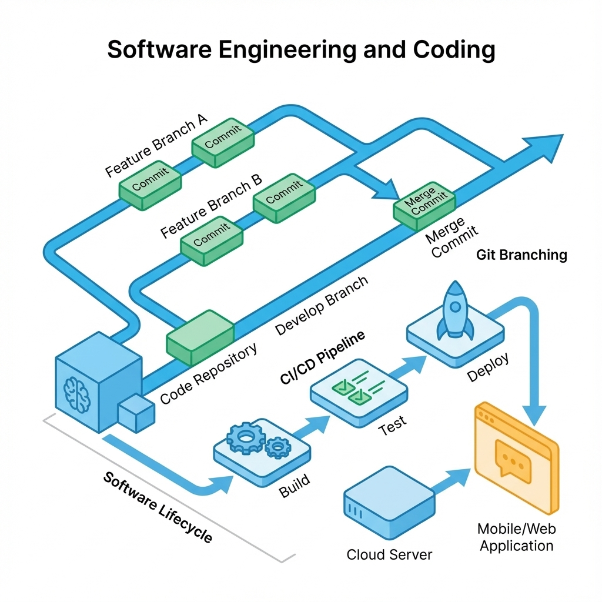
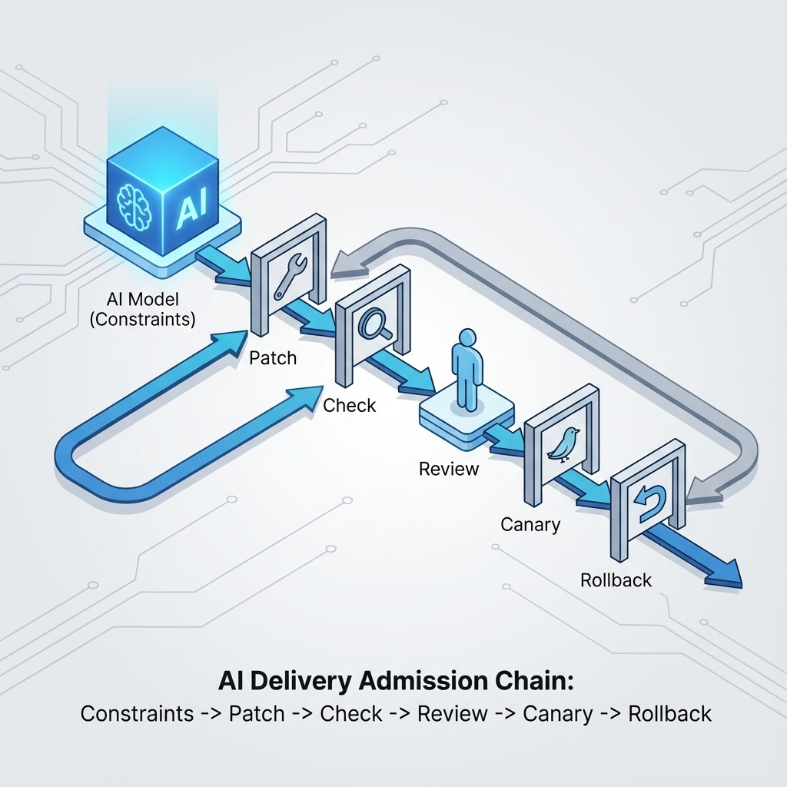
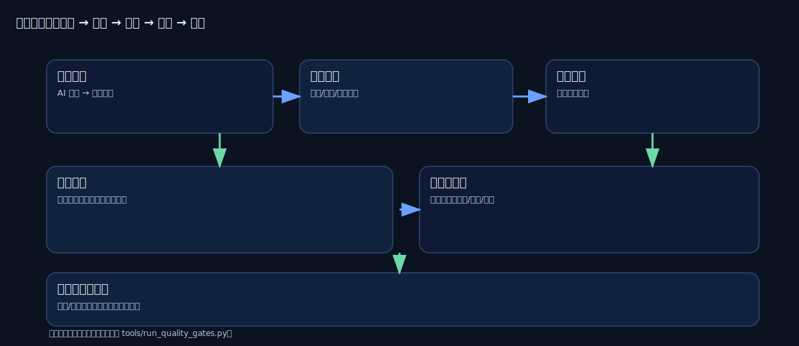

# 第 7 章：工程化与编码：让 AI 的速度可控



> AI 能让你写得更快，也能让你更快地写错。本章的核心原则：用门禁约束速度，用审查保护一致性，用回滚对冲不确定性。[5][6][18]

当你一个人推进全链路时，工程化不是为了“规范”，而是为了“保命”：它让你敢快、敢改、敢上线。没有门禁与回滚，AI 会把你带向另一种极端——看似进度飞快，实际上是在光速堆积技术债务。

## 章节定位

本章位于产品定义之后、具体代码实现之前。它解决的不是“用什么框架”，而是交付纪律：如何把 AI 的狂野输出变成可验证、可审计、可回滚的工程变更。

## 你要交付什么

读完本章，你手里必须有三样东西：

1.  **一条补丁优先的工作流**：任何 AI 输出必须先落成可审查的最小变更，再谈合并。
2.  **一份最小质量门禁**：明确定义什么情况下必须阻断合并，什么情况下允许灰度试错。[6]
3.  **一套回滚协议**：退化如何被发现、如何回滚、证据如何归档，避免事后靠记忆复盘。[18]

## 核心逻辑：先定义约束，再允许生成

把 AI 纳入工程化链条，顺序必须反直觉：**先造笼子，再放老虎**。

如果你跳过第一步（门槛与约束），后面每一步都会变成无休止的解释和修补工作。正确的链路是：

1.  **门槛与口径**：定义好坏标准。
2.  **最小变更范围**：圈定改动边界。
3.  **生成补丁**：AI 执行填空。
4.  **自动检查**：机器拦截低级错误。
5.  **人工审查**：人脑拦截逻辑风险。
6.  **灰度与回滚**：最后一道防线。[6]

## 方法论：把 AI 输出变成可交付变更





### 1. 先写门禁：把“感觉不错”变成“脚本通过”

把门禁写在文档里是没用的，写成代码才有约束力。建议最小化但绝对强硬：

*   **正确性门禁**：关键路径回归测试失败，禁止合并。
*   **风险门禁**：检测到越权、敏感数据暴露、SQL 注入风险，禁止发布。
*   **守门指标**：延迟、成本、错误率越过红线，必须回滚。[6]

#### 表 7-1：最小质量门禁（按需裁剪）

| 类别 | 你要守住什么 | 失败判定（阻断条件） |
| :--- | :--- | :--- |
| **功能正确性** | 核心业务流程不中断 | 关键路径回归测试失败即阻断 |
| **安全与权限** | 越权访问不可发生 | 任一越权样本命中即阻断 |
| **稳定性** | 错误可定位、可恢复 | 错误率/崩溃率上升且无豁免单 |
| **成本与性能** | 不为“变聪明”付无限代价 | 单次调用成本/延迟越过阈值即回滚 |
| **可审计性** | 关键行为有迹可循 | 缺少关键日志/审计字段即阻断 |

### 2. 门禁即命令：一键定生死

不要维护一堆零散的 shell 脚本。把所有必须通过的检查收敛成一个入口命令。在个人项目里，这个命令失败，就意味着代码不仅不能上线，甚至不能合并进主干。

本仓库的最小门禁脚本是 `tools/run_quality_gates.py`。它的逻辑非常粗暴：按顺序跑检查，任何一步挂了就退出。

```bash
python3 tools/run_quality_gates.py
```

把入口统一后，你的 CI（持续集成）配置就会变得极其简单。更重要的是，这迫使你在本地开发时就养成习惯：**跑不过门禁的代码，AI 写得再花哨也是垃圾**。

### 3. 用 DORA 指标校准你的“提效”

引入 AI 后，最常见的错觉是：代码提交变多了，所以效率变高了。错。真正的效率提升，必须同时包含速度与稳定性。[6]

关注 DORA 的四个核心指标（不要用来考核个人，要用来考核流程）：

1.  **部署频率 (Deployment Frequency)**：你能多快把代码变成用户可用的功能？
2.  **变更前置时间 (Lead Time for Changes)**：从 commit 到上线需要多久？
3.  **平均恢复时间 (MTTR)**：出事后多久能回滚或修复？
4.  **变更失败率 (Change Failure Rate)**：多少次发布导致了故障？[6]

**警惕信号**：如果你发现提交量翻倍，但 PR 审查时间变长了，或者 MTTR 变差了，说明 AI 正在制造债务。

### 4. 约束生成：把 AI 当生成器，不是架构师

最愚蠢的做法是把整个文件丢给 AI，让它“看着改”。你要做的是：先把边界画死，再让它填空。

#### 表 7-2：AI 编码任务卡（必须写清楚）

| 字段 | 写法要求（越具体越好） |
| :--- | :--- |
| **目标** | 一句话：要改变的**行为**是什么（不是要改的代码）。 |
| **范围** | 白名单：允许改哪些文件；黑名单：绝对禁止碰哪些模块。 |
| **上下文** | 只给必要的片段，不要塞整个项目进去干扰它。 |
| **输出格式** | 强制要求 Unified Diff 格式，或者只输出变更部分。 |
| **验收门槛** | 哪些测试必须通过；哪些指标绝对不能退化。 |
| **风险点** | 权限、计费、数据边界；越界即视为失败。 |
| **回滚方案** | 怎么关掉这个功能？怎么降级？怎么回退？ |

### 5. 人工审查：只看高风险点

在门禁健全的前提下，人工审查不要浪费在缩进和变量命名上。你的精力很贵，要花在 AI 搞不定的地方：

*   **边界是否扩大**：是不是偷偷改了不该改的公共库？
*   **权限与错误处理**：异常路径是不是直接吞掉了报错？鉴权逻辑是不是被绕过了？
*   **回滚是否真实**：写的开关真的能关掉功能吗？
*   **成本陷阱**：有没有可能出现死循环调用？[6]

### 6. 合规与风险：把“不可说”变成默认约束

AI 最容易踩的红线不是语法错误，而是合规：隐私泄露、密钥硬编码、版权侵权。[19]

**最低纪律：**

*   **脱敏**：不在 Prompt 里发真实的密钥、用户 PII 信息。
*   **来源清洗**：AI 给出的代码，如果是整段复制的，必须检查来源和许可证。[19]
*   **关键模块严管**：涉及鉴权、计费、审计的代码，默认禁止 AI 全自动修改，必须人工逐行确认。

### 7. 回滚不是口号：识别“不可回滚”的坑

有些改动一旦上线，就像泼出去的水。

*   **数据库 Schema 变更**：一旦写入新格式数据，旧代码可能读不懂，回滚代码也读不懂。
    *   *对策*：Schema 变更和业务逻辑分步走。先兼容读写，再切流量，最后清旧数据。
*   **依赖与锁文件**：升级一个库，可能导致整个依赖树变动。
    *   *对策*：依赖升级必须有独立的 PR，且必须有基线对比证据。

## 实战示例：把一次 AI 输出约束成小补丁

**场景目标：** 修复“导入 CSV 失败时错误提示不可读”的问题。

**前置条件：** 必须只修这一个问题，严禁顺手重构其他代码。

**步骤 1：编写任务卡**

保存为 `docs/changes/chg-001.md`，明确约束：

```markdown
目标：优化 CSV 导入失败的错误提示，使其包含具体的行列号和错误原因。
范围：只允许修改 `src/utils/csv_parser.py`。禁止修改 `src/api/` 下的任何文件。
验收门槛：
- 新增单元测试必须覆盖 3 种典型错误格式。
- `tools/run_quality_gates.py` 必须全绿。
回滚：
- 不需要数据库回滚。
- 若上线后报错激增，直接 Revert 代码即可。
```

**步骤 2：执行 AI 生成（使用 CLI 模式）**

```bash
gemini -m gemini-3-pro-preview -p "你是资深后端工程师。阅读 docs/changes/chg-001.md 的要求。读取 src/utils/csv_parser.py 的内容。输出修复后的代码 diff。严禁修改其他文件。严禁引入新依赖。" > out/chg-001.diff
```

**步骤 3：验证与应用**

```bash
# 检查 diff 是否越界（示例：只能改 1 个文件）
files_changed=$(grep "diff --git" out/chg-001.diff | wc -l)
if [ "$files_changed" -gt 1 ]; then
  echo "失败：AI 修改了多个文件，违反约束。"
  exit 1
fi

# 应用补丁
git apply out/chg-001.diff
```

**步骤 4：跑门禁**

```bash
python3 tools/run_quality_gates.py
```

**失败判定：**
1.  diff 包含了 `src/utils/csv_parser.py` 以外的文件 -> **失败**。
2.  门禁脚本报错 -> **失败**。
3.  没有对应的测试用例 -> **失败**。

## 复现检查清单（本章最低门槛）

*   [ ] **任务卡机制**：每次改动前，先写下 50 字以上的任务卡（目标、范围、回滚）。[6]
*   [ ] **一键门禁**：有一个命令（如 `make check` 或 `run_quality_gates.py`），能跑完所有必须的检查。[6]
*   [ ] **证据留档**：每次合并代码，PR 里都附带了门禁通过的截图或日志，以及关键指标的对比。[18]

## 常见陷阱与修复

1.  **陷阱**：进度飞快，但大家都怕改代码。
    *   **根因**：没有回滚能力，所有风险都堆积到上线那一刻。
    *   **修复**：先补回归测试，再谈新功能。把“可回滚”作为合并的硬性条件。[6]

2.  **陷阱**：AI 一次改了一大坨，Review 改不动。
    *   **根因**：没有约束 AI 的修改范围。
    *   **修复**：强制要求小步提交。一次只解决一个问题。如果 diff 超过 200 行，直接打回要求拆分。[5]

3.  **陷阱**：线上成本突然爆炸。
    *   **根因**：AI 写的循环调用没有退出条件，或者重试逻辑写死循环了。[6]
    *   **修复**：给所有循环和递归加上硬性的计数器上限。给所有 API 调用加上预算熔断机制。[6]

## 下一章

工程化解决了“怎么安全地改”。下一章我们将进入具体的实现环节：先从前端开始，看如何把体验与状态做成可回归的系统。

请阅读：[08-frontend.md](08-frontend.md)。

## 参考

详见本书统一参考文献列表：[references.md](references.md)。
