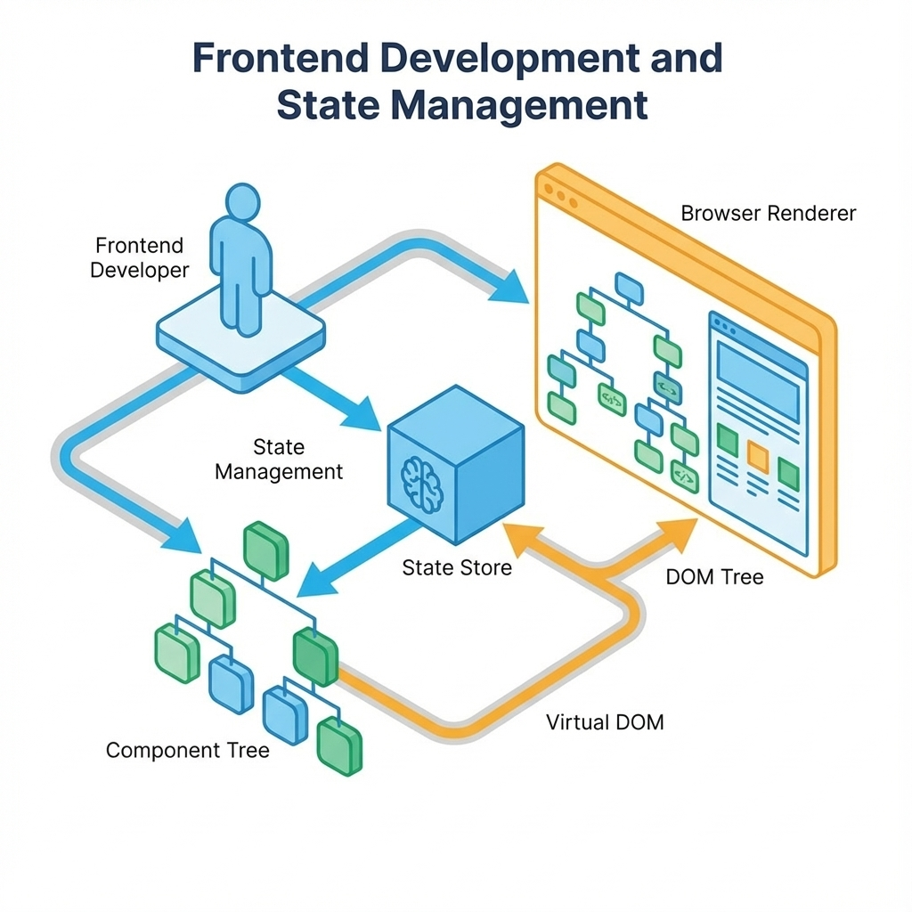
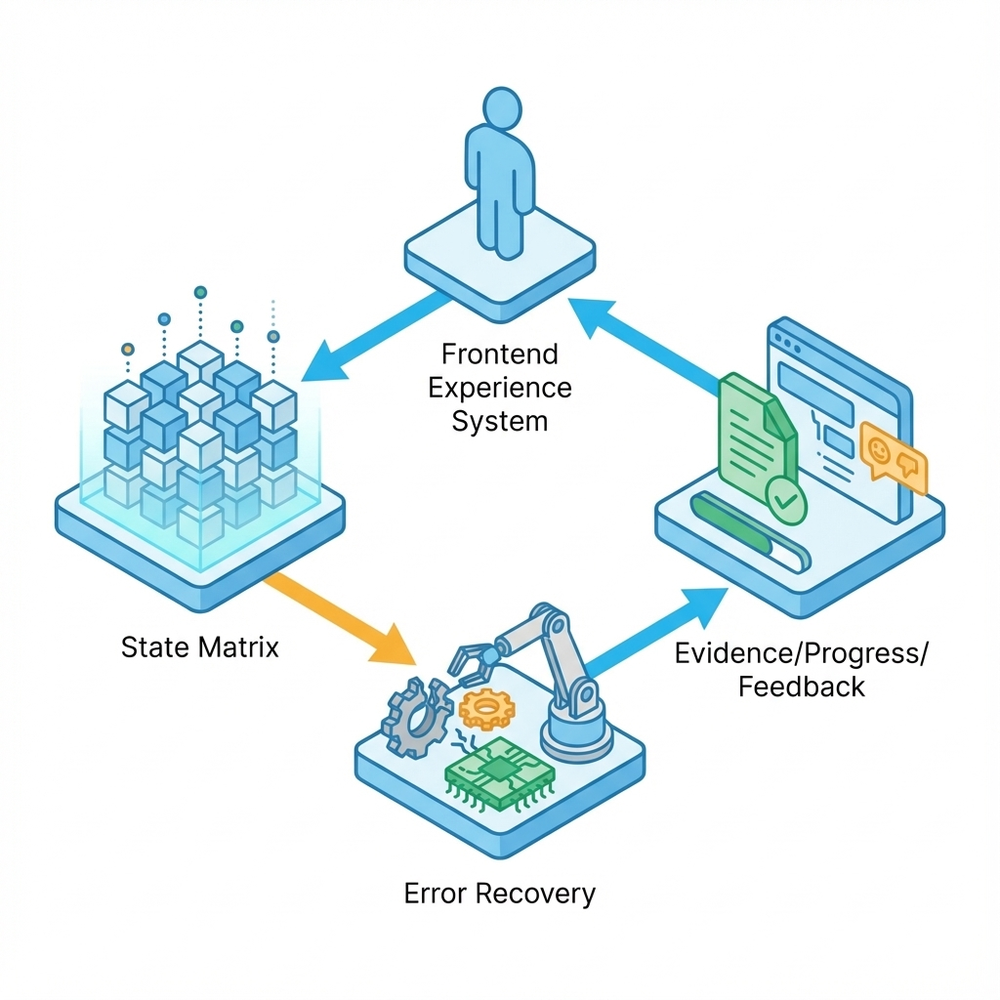

# 第 8 章：前端实现：状态、可恢复与体验指标


> 前端不是把页面画出来，而是把体验写成一个可预测系统。用户必须知道下一步是什么，失败了怎么回来，以及系统到底在干什么。[17]

在 AI 产品里，前端就是飞行员的驾驶舱。它既承载交互，也承载不确定性。你的工作不是让它“好看”，而是让它“可控”：看到证据、看到进度、看到边界，而不是盯着一个只会转圈和吐字的黑盒。

## 章节定位
本章承接工程化纪律，把 UI 规格落地为可回归的代码。我们不谈 CSS 技巧，只谈如何把不确定性关进笼子：组件化、状态完整、错误可恢复、体验可度量。[17]

## 你将收获什么
- **一套状态完整性标准**：空、加载、成功、失败、无权限，缺一个都不叫完成。[17]
- **一套 AI 交互三件套**：进度（可预期）、证据（可追溯）、反馈（可学习）。
- **一份体验指标最小集**：把“好用”变成可观察的门槛，而不是审美争论。[6][17]

## 三层思考：前端要处理的不只是交互
### 第 1 层：读者目标
你要交付的是**可用且可解释**的体验。用户完成任务要快、要稳，并且在系统犯傻时能自救。

### 第 2 层：论证链条
体验稳定的链条如下：
状态齐全 -> 错误语义一致 -> 进度可预期 -> 结果可采纳（保存/导出） -> 反馈可回流 -> 指标可裁决

### 第 3 层：落地与验收
前端是否合格，只看三件事：
1.  **关键路径可回归**：至少覆盖一次完整闭环。
2.  **失败可恢复**：用户不求助客服也能继续操作。
3.  **体验可度量**：至少有 1 个效率指标和 1 个质量指标。[6][17]

## 方法论：把状态当成产品的一等公民

### 1. 状态矩阵：缺一不可
别等到测试提 bug 才补状态。把每个关键页面写成状态矩阵，缺一项就是未完成。[17]

**模板：关键页面状态矩阵**

| 页面 (Page) | 空状态 (Empty) | 加载状态 (Loading) | 成功状态 (Success) | 失败状态 (Error) | 证据点 (Evidence) |
| :--- | :--- | :--- | :--- | :--- | :--- |
| **核心 AI 对话** | 显示 3-5 个引导 Prompt | 耗时预估 + “Thought” 展开 | 结果 + 引用 + 采纳按钮 | 修复建议 + 重试/回滚 | `chat_state_transition` |
| **任务流水线** | 显示“暂无任务”插图 + 新建 | 实时进度条 (Step N/M) | 结果卡片 + 导出按钮 | 报错行列号 + 修改入口 | `flow_step_latency` |

### 2. 错误语义：把报错变成行动指南
前端最常见的浪费，就是把技术堆栈直接扔给用户。错误提示必须是**可行动的**。

推荐三段式结构：
1.  **发生了什么**（人话，非技术术语）。
2.  **为什么**（可选，简要解释）。
3.  **怎么做**（必须有，提供按钮或链接）。

**AI 场景特有错误处理表**

| 错误类别 | 典型触发场景 | 用户看到的提示重点 | 恢复入口（必须） |
| :--- | :--- | :--- | :--- |
| **证据不足** | 检索无结果/引用分低 | "资料库中未找到相关信息，请补充资料。" | 上传资料/扩大搜索范围 |
| **拒答** | 命中风控/超出能力 | "该问题超出当前回答范围，尝试换个问法。" | 修改提问/查看使用规范 |
| **质量差** | 幻觉/前后矛盾 | "结果置信度较低，请核验。" | 重新生成/切换模型/人工编辑 |
| **超时/预算** | Token 耗尽/响应过长 | "生成耗时较长，已暂停。" | 继续生成/查看已生成部分 |
| **权限不足** | 访问受限资源 | "无权访问该数据源。" | 申请权限/切换数据源 |

### 3. AI 交互三件套：进度、证据、反馈
AI 的核心是不确定性，前端的任务是把不确定性可视化。[6]



**图 8-1 占位说明**：本书默认使用“无文字底图 + 后期叠字”。本章需要一张“AI 输出区三件套（进度/证据/反馈）”示意图。

```text
image_prompt:
flat 2D wireframe UI diagram, AI chat interface with three zones: top progress bar area, middle content area with citation markers like [n], bottom feedback controls (thumb up/down, edit),
blueprint style, clean lines, white background, ample whitespace for later typography, no text

negative_prompt:
text, letters, numbers, watermark, signature, handwriting, photorealistic, 3d render, gradients, heavy shadows, blur, messy background, humans, faces

params:
aspect_ratio=16:9, quality=high
```

叠字策略：标注“进度区：可取消”“内容区：可引用”“反馈区：可纠错”。

#### 输出区最小结构要求
1.  **进度 (Progress)**：
    *   **必须**：显示当前状态（思考中、检索中、生成中）。
    *   **必须**：提供“停止/取消”按钮。
    *   **门槛**：加载超过 3 秒必须显示具体阶段提示。
2.  **结果 (Result)**：
    *   **必须**：结论前置（BLUF）。
    *   **必须**：操作入口（复制、保存、导出）。
    *   **证据**：所有事实性陈述必须带引用标记，点击可展开来源。[6]
3.  **反馈 (Feedback)**：
    *   **必须**：一键反馈（点赞/点踩）。
    *   **必须**：点踩后收集原因（哪怕只是几个选项），数据直接回流到失败样本库。[18]

### 4. 最小实现骨架：状态机
别用一堆 `isLoading`, `isError`, `isRetrying` 的布尔值来拼凑逻辑。AI 输出区本质是一个状态机。

**示例：TypeScript 状态定义（参考）**

```typescript
type Phase = 'idle' | 'running' | 'done' | 'aborted' | 'error';

interface Evidence {
  id: string;
  source_title: string;
  url?: string;
  snippet: string;
  relevance_score: number;
}

interface OutputState {
  // 核心状态，决定 UI 渲染哪个主组件
  phase: Phase;
  
  // 数据载荷
  content: string; // 流式更新
  evidences: Evidence[];
  
  // 追踪与诊断
  trace_id: string; // 必传，用于关联后端日志
  error_code?: string; // 用于映射 UI 提示
  
  // 性能指标（前端采集）
  timing: {
    start_ms: number;
    first_token_ms?: number;
    end_ms?: number;
  };
}
```

## 可执行示例：生成并验证输出区状态机

**目标**：用 AI 辅助生成一个符合上述要求的状态机定义，并验证其包含了关键字段。

**前置条件**：准备一个可脚本化的模型调用入口，并确保项目根目录在 Git 管理下。

**步骤 1：生成代码**
让模型生成 TypeScript 接口定义。

```bash
cat <<'PROMPT' | <LLM_CLI> > src/types/ai_output_schema.ts
作为一个资深前端架构师，请为我不基于任何框架（纯 TypeScript）写一个 AI 输出区的状态管理接口定义。
要求：
1. 包含 idle, running, done, aborted, error 五种状态。
2. 包含流式输出内容 content。
3. 包含引用来源 evidences 数组。
4. 包含用于调试的 trace_id 和 timing 指标（首字延迟、总耗时）。
5. 包含简单的 Action 定义（start, stop, feedback）。
只输出代码，不要解释。
PROMPT
```

**步骤 2：验证代码结构**
用 Python 脚本快速检查生成的代码是否合格（包含必要字段）。

```python
# gate_frontend.py - 前端体验哨兵
import sys
from pathlib import Path

def validate_frontend_states(file_path):
    required_checks = {
        "trace_id": "必须包含 trace_id 透传。确保前后端日志可串联。",
        "evidences": "必须定义证据渲染逻辑。确保 AI 结论可审计。",
        "timing": "必须记录性能指标 (TTFT)。确保响应速度可监控。",
        "recovery": "必须提供失败恢复入口。确保体验闭环不中断。"
    }
    
    content = Path(file_path).read_text(encoding='utf-8')
    missing = [v for k, v in required_checks.items() if k not in content]
    
    if missing:
        print("❌ FAILED: 前端状态定义不规范。缺失以下关键要素：")
        for m in missing:
            print(f"  - {m}")
        sys.exit(1)
    
    print(f"✅ PASS: {file_path} 前端状态校验通过。准许动工。")

if __name__ == "__main__":
    validate_frontend_states(sys.argv[1])
```

**步骤 3：运行验证**
```bash
python3 check_schema.py
```

**失败判定与回滚**：
如果验证失败，删除 `src/types/ai_output_schema.ts`，调整 Prompt 重新生成。不要试图手动修补一个连基本结构都缺失的文件。

## 体验指标：最小裁决集

不要搞一堆虚荣指标（如 PV/UV）。在 0->1 阶段，只关注能不能**裁决**系统的优化方向。

**最小事件埋点表**

| 事件 Key | 触发时机 | 业务含义 | 对应指标 |
| :--- | :--- | :--- | :--- |
| `task_start` | 用户点击发送/回车 | 意图开始 | (分母) |
| `first_token` | 第一个字符渲染上屏 | 响应速度 | **效率指标**：首字延迟 (TTFT) |
| `evidence_click` | 用户点击引用来源 | 信任建立/核验 | **质量指标**：证据采纳率 |
| `feedback_negative`| 用户点踩 | 结果不可用 | **质量指标**：负反馈率 |
| `task_complete` | 用户复制/导出/保存 | 结果被采纳 | **北极星指标**：任务闭环率 |
| `client_error` | 前端捕获到异常 | 系统故障 | **守门指标**：客户端错误率 |

## 常见陷阱（预案）

1.  **现象**：用户一直盯着屏幕发呆，不知道系统是不是死机了。
    *   **根因**：缺少“微交互”反馈。流式输出卡顿时没有任何视觉提示。
    *   **修复**：添加“光标闪烁”或“正在思考”的动态占位符。如果 3 秒没新内容，显示“正在组织语言（生成中）”。
2.  **现象**：报错全是 "Unknown Error" 或 "Network Error"。
    *   **根因**：后端透传了 HTTP 状态码，前端没做语义映射。
    *   **修复**：在 API 层拦截错误，将 429 映射为“请求太快”，500 映射为“服务繁忙”，401 映射为“登录失效”，并分别给出恢复按钮。
3.  **现象**：用户改了一个标点符号，指标显示“任务闭环率”暴跌。
    *   **根因**：埋点口径变了，或者测试数据污染。
    *   **修复**：严守**同口径对比**。改动前后必须用同一套埋点逻辑跑一遍基准测试。[6]

## 交付物清单
提交代码前，请确认你交付了以下内容：

*   [ ] **状态矩阵文档**：`docs/frontend/state_matrix.md`（明确每个页面的 5 态 + 恢复路径）。[17]
*   [ ] **输出区组件代码**：实现了进度、证据、反馈三件套。
*   [ ] **埋点定义**：`docs/frontend/events.md`（包含上述最小事件集）。
*   [ ] **失败样本库接入**：前端能捕获 `trace_id` 并上报用户反馈。[18]

## 下一章
前端把体验做成了可预测的闭环，下一章我们进入后端：如何构建一个默认幂等、审计完备、错误语义清晰的后端系统。
见：[09-backend.md](09-backend.md)。

## 参考
[6] [05-validation.md](05-validation.md)
[17] [17-deployment.md](17-deployment.md)
[18] [18-evaluation.md](18-evaluation.md)
详见本书统一参考文献列表：[references.md](references.md)。
