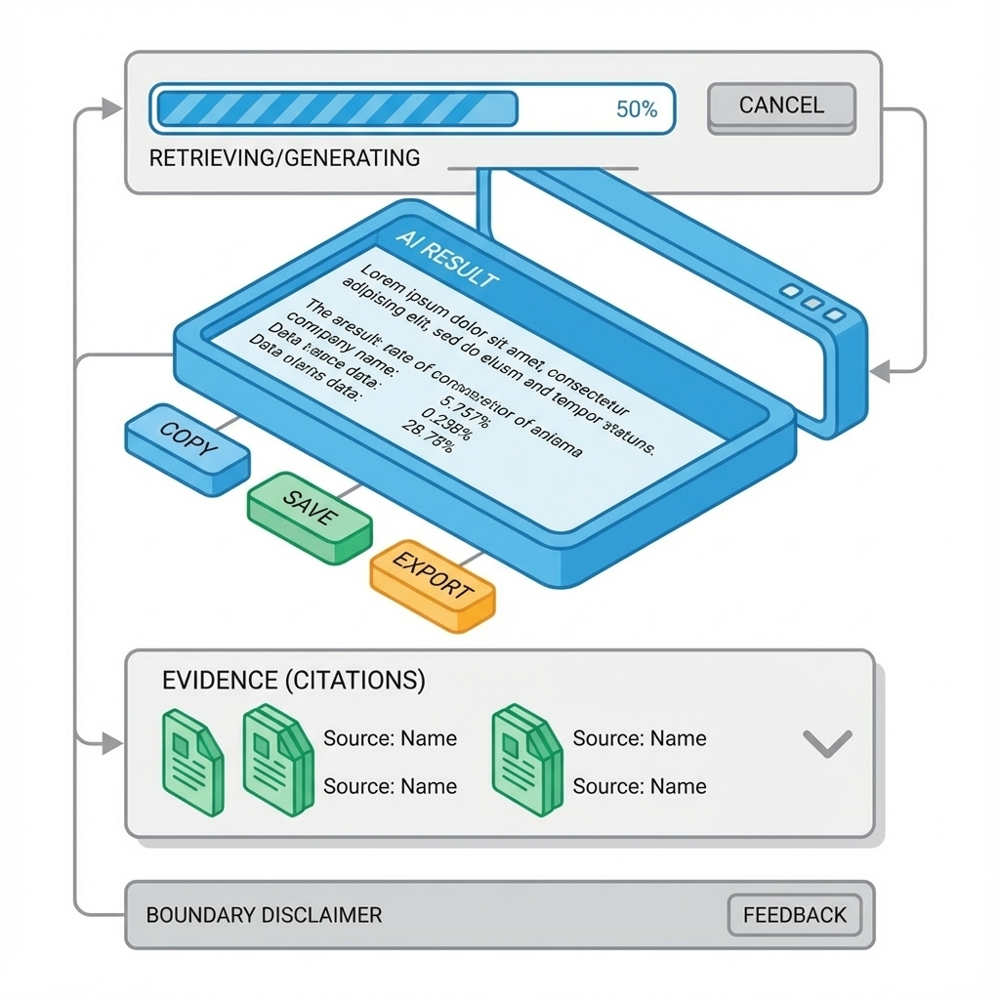

# 第 8 章：前端实现：状态、可恢复与体验指标


> 前端不是把页面写出来，而是把体验写成一个可预测系统：用户知道下一步是什么，失败知道怎么回来，系统知道怎么解释自己。[17]

在 AI 产品里，前端更像驾驶舱：它既承载交互，也承载不确定性。你需要让用户看到证据、看到进度、看到边界，而不是只看到一个看似聪明的输出框。

## 章节定位
本章承接上一章的工程化纪律，聚焦把 UI 规格落到可回归的前端实现：组件化、状态完整、错误可恢复、体验可度量。[17]

## 你将收获什么
- 一套前端状态完整性方法：空/加载/成功/失败/无权限不是细节，是系统边界。[17]
- 一套 AI 交互的三件套：进度（可预期）、证据（可追溯）、反馈（可学习）。
- 一份体验指标最小集合：把更好用变成可观察的门槛，而不是审美争论。[6][17]

## 三层思考：前端要处理的不只是交互
### 第 1 层：读者目标
你要交付的是可用且可解释的体验：用户完成任务更快、更稳，并且在失败时能自救。

### 第 2 层：论证链条
体验稳定的链条是：

状态齐全 → 错误语义一致 → 进度可预期 → 结果可采纳（保存/导出/回溯）→ 反馈可回流 → 指标可裁决

### 第 3 层：落地与验收
前端是否做好，看三件事：
- 关键路径是否可回归（至少覆盖一次闭环）；
- 失败是否可恢复（用户不求助也能继续）；
- 体验是否可度量（至少有 1 个效率指标与 1 个质量指标）。[6][17]

## 方法论速览：把状态当成产品的一等公民


### 1) 状态矩阵：每个关键页面都必须过五态门槛
把每个关键页面写成状态矩阵，缺一项视为未完成。[17]

#### 页面状态矩阵

| 页面 | 空 | 加载 | 成功 | 失败 | 无权限 | 恢复入口 |
| --- | --- | --- | --- | --- | --- | --- |
| 核心任务页 | 有 | 有 | 有 | 有 | 有 | 重试/返回/求助 |

### 2) 错误语义：把报错改成可行动信息
前端最常见的浪费，是把错误提示写成技术真相，却不给用户行动路径。推荐把错误提示改写成三段式：
- 发生了什么（可理解）
- 为什么可能发生（可选）
- 你现在能做什么（必须给入口）

### 3) AI 交互的三件套：进度、证据、反馈
AI 场景里，用户不确定性更高，因此必须把不确定性可视化：
- **进度**：让用户知道系统在做什么、还要等多久、是否可取消。
- **证据**：当输出基于资料或工具调用时，展示来源与依据（哪怕是简化版）。[6]
- **反馈**：允许用户一键标注有用/无用/危险，并把样本沉淀到失败样本库。[18]

#### AI 输出区的最小结构

| 区块 | 目的 | 最小要求 |
| --- | --- | --- |
| 结果 | 给出可采纳的答案/动作 | 可复制/可保存/可导出 |
| 依据 | 告诉用户为什么 | 引用/来源/关键输入摘要 |
| 边界 | 告诉用户何时不该信 | 不足时拒答/追问/提示风险 |
| 反馈 | 让系统变聪明 | 一键反馈 + 失败样本记录 |



!!! note
    作图提示：建议画成一个聊天或结果页的分区示意，能一眼看到进度、结果、依据与反馈入口。
    - 上：进度（正在检索/正在调用工具/生成中）+ 可取消
    - 中：结果（可复制/可保存/可导出）+ 关键结论优先
    - 下：依据（引用卡片/工具调用摘要）+ 可折叠
    - 底部：边界提示（何时不可靠/何时需要更多信息）+ 一键反馈

把这四块落到界面上，用户才会看见系统的边界，进而敢把它放进工作流：

```text
[进度：检索/调用工具/生成中…]（可取消）

[结果：结论优先]（可复制/可保存/可导出）

[依据：引用卡片/工具摘要]（可折叠）

[边界提示：何时不可靠 + 下一步怎么做] + [一键反馈]
```

### 4) 体验指标：用最小集合建立裁决
0→1 不追求指标齐全，只追求能裁决。建议最小化为：
- **效率指标**：完成一次闭环的耗时、步骤数。
- **质量指标**：失败后恢复率、关键错误率。
- **守门指标**：崩溃率、卡顿、成本/延迟（与后端口径一致）。[6]

## 复现检查清单（本章最低门槛）
- 关键页面状态矩阵齐全；失败与无权限都有恢复入口。[17]
- AI 输出区具备进度/证据/反馈三件套；至少能沉淀 10 条失败样本。[18]
- 有一份体验对比表：改动前/后同口径对比（效率/质量/守门）。[6]

## 常见陷阱（失败样本）
1. **现象**：页面能用，但用户很慢、很不确定。  
   **根因**：缺少进度与边界表达，用户不知道系统在做什么。  
   **修复**：补齐进度与取消、补齐边界提示，把等待变成可预期。

2. **现象**：错误提示很多，但用户仍然放弃。  
   **根因**：错误不可行动；没有恢复入口。  
   **修复**：把错误提示改成三段式，并提供明确恢复入口。

3. **现象**：看起来更好用了，但指标不动。  
   **根因**：没有定义效率与质量口径；优化对象漂移。  
   **修复**：用最小指标集建立裁决；无对比表不宣称提升。[6]

## 交付物清单与验收标准
- 关键页面状态矩阵与恢复入口说明。[17]
- AI 输出区结构说明（进度/证据/边界/反馈）。[6]
- 体验对比表（效率/质量/守门指标）与结论（保留/继续/回滚）。[6]

## 下一章
前端解决体验如何可预测。下一章进入后端：把错误语义、幂等、审计与可观测做成系统默认属性。见：[09-backend.md](09-backend.md)。

## 参考
详见本书统一参考文献列表：[references.md](references.md)。
