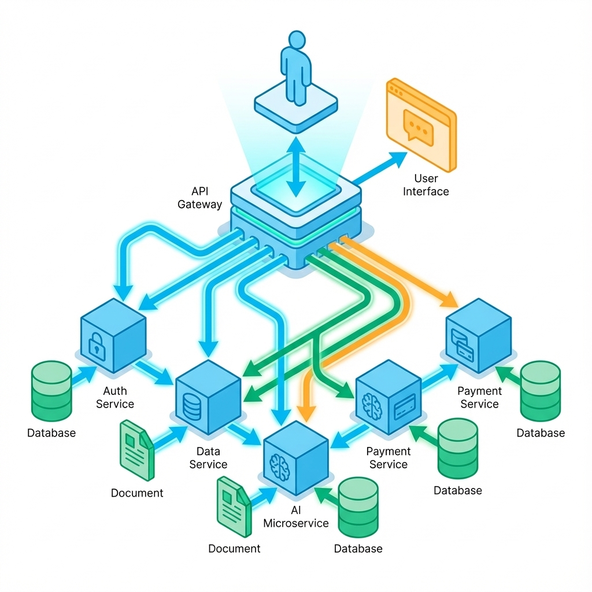

# 第 9 章：后端架构：边界、幂等与可观测


> 后端开发的底线不是“接口跑通了”，而是“把风险关在笼子里”。错误必须有统一语义，请求必须可重放，成本必须能止损，事故必须可追责。[5][6]

0 到 1 阶段的后端常犯两种错：一种是“虽然能跑但随时会崩”，另一种是“稳是稳，但贵得离谱”。AI 应用让第二种情况更普遍：一个不起眼的改动，可能让上下文长度翻倍、工具调用死循环，月底账单直接教做人。[6]

## 章节定位
本章承接前端的状态管理，重点补齐服务端底座：服务边界划分、错误契约、幂等机制、审计可观测以及 AI 场景特有的成本守门。这些是通用底座，不涉及具体业务逻辑，但决定了系统是像积木一样稳固，还是像沙堡一样脆弱。[22]

## 你将收获什么
- **一套服务边界切分法**：哪些放同步，哪些放异步，哪些必须降级。
- **一套幂等与重试策略**：把偶发失败变成可预测的事件，而不是线上事故。
- **一套死板的可观测口径**：能定位、能复盘、能重放，拒绝“大概”、“可能”和“灵异事件”。[6]

## 三层思考：后端要对“不可控”负责

### 第 1 层：读者目标
你要交付的是一个 **敢上线** 的系统。
敢上线的定义是：失败了能自动恢复，恢复不了能安全回滚，成本超标了能自动熔断。

### 第 2 层：论证链条
后端稳定的链条极其朴素：
1.  **边界清晰**：知道什么必须快，什么可以慢。
2.  **契约明确**：错误码不是给前端看的，是给自动化重试机制看的。
3.  **幂等兜底**：只要网络波动，请求就会重复；重复不可怕，可怕的是副作用叠加。
4.  **观测为王**：没有 trace_id 和版本指纹，所有的优化都是盲人摸象。
5.  **成本守门**：AI 调用是付费的，不仅要限流，还要限“钱”。[6]

### 第 3 层：落地与验收
验收标准不是 HTTP 200 OK，而是：
- **失败可行动**：用户知道是换个词还是稍后再试，系统知道是重试还是报警。
- **行为可追溯**：谁（Actor），在什么时候（Time），对什么（Target），做了什么（Action），结果如何（Result）。
- **止损自动化**：当 Token 消耗或延迟越过红线，系统自动降级。[6][22]

## 方法论速览：先定边界，再定语义，最后定止损


### 1. 服务边界：把“不确定性”隔离出去
AI 链路天然不稳定：模型响应慢、工具不可靠、幻觉难预测。别把这些和你的核心业务逻辑混在一起。

建议你划三条死线：
-   **同步链路（Synchronous）**：只做编排和快速校验。用户等待时间越短越好。
-   **异步链路（Asynchronous）**：所有耗时操作（RAG 检索、模型生成、数据导入）全部扔进队列。
-   **降级链路（Degraded）**：当 AI 挂了或者超预算时，系统必须能退回到“傻瓜模式”（只检索不生成、只返回静态结果、甚至直接拒答）。[6]

**最小划分模式：**
-   **API 网关**：负责鉴权、限流、生成 `request_id`。
-   **编排器（Orchestrator）**：决定请求走哪条路（同步直接还回缓存，异步扔给 Worker，降级直接返回兜底文案）。
-   **Worker**：干脏活累活（调用 LLM、爬取网页、写入数据库），必须支持重试和幂等。

### 2. 契约与错误语义：让失败“可编程”
别再发明新的 HTTP 状态码了，也别只返回一个 `500 Internal Server Error`。错误语义必须既对 **用户** 负责（知道怎么改），也对 **代码** 负责（知道怎么处理）。

**错误语义表（Error Taxonomy）模板：**

| 错误码 (Error Code) | HTTP | 用户提示 | 重试策略 (Retry) | 重试预算 | 告警 |
| :--- | :--- | :--- | :--- | :--- | :--- |
| `INVALID_INPUT` | 400 | 输入内容不合法 | 不可重试 | 0 | 否 |
| `QUOTA_EXCEEDED` | 429 | 访问过快，稍后再试 | 指数退避 (Exp Backoff) | 3 次 | 否 |
| `UPSTREAM_TIMEOUT` | 504 | 服务繁忙，请稍后 | 静默重试 (Silent) | 2 次 | 是 |
| `BUDGET_EXHAUSTED` | 402 | 今日额度已用完 | 不可重试 (需手工充值) | 0 | 是 |
| `SAFETY_VIOLATION` | 403 | 触碰合规红线 | 不可重试 (记录审计) | 0 | 是 |

### 3. 幂等与重试：把“重复”当成常态
在分布式系统里，**只有成功和未知，没有失败**。超时意味着你不知道对面执行了没有。
唯一的解法是：**假定每个请求都会被发两遍**。

**AI 场景下的实用幂等策略：**
1.  **生成 Action ID**：用户点击按钮时，前端生成一个 `action_id`。
2.  **绑定副作用**：后端把 `action_id` 和所有副作用（扣费、写库、发邮件）绑定。
3.  **缓存优先**：收到请求先查 `action_id` 对应的结果。有就直接返回，没有再执行。
4.  **模型调用去重**：如果输入完全一致（Prompt Hash + Model Config + Action ID），直接查缓存，别浪费 Token。

**幂等设计卡（Idempotency Card）：**

| 动作 | 副作用 | 幂等键 (Idempotency Key) | 冲突处理策略 | 证据留档 |
| :--- | :--- | :--- | :--- | :--- |
| 创建对话 | 扣除额度，写入历史 | `hash(user_id + prompt + timestamp_minute)` | 返回已存在的对话 ID | 审计日志 |
| 导入文档 | 触发 Parsing，写入向量库 | `file_hash` | 忽略或覆盖（视策略） | 上传记录 |
| 工具调用 | 发送邮件 / 支付 | `tool_call_id` (由 LLM 生成或系统注入) | **严格禁止重复执行** | 第三方回执 |

### 4. 可观测与审计：拒绝“盲人摸象”
不要等到出了事才去加日志。0 到 1 阶段，你可以没有复杂的监控大屏，但必须有 **全链路日志**。

**必须记录的字段（少一个都是事故隐患）：**

-   **`trace_id`**：串起网关、后端、Worker、LLM 调用的唯一 ID。
-   **`version_set`**：当前代码版本 + 模型版本 + Prompt 版本 + 配置版本。这是归因的关键。
-   **`cost_info`**：输入 Token、输出 Token、预估费用。
-   **`latency_breakdown`**：总耗时、TTFT（首字时间）、工具耗时、排队耗时。
-   **`final_status`**：成功、失败、降级、被拦截。

**版本集合（Version Set）是核心：**
如果在日志里只记了 `commit_sha`，那是没用的。Prompt 变了没有？RAG 索引切片方式变了没有？模型温度参数变了没有？
必须把所有影响输出的因子打包成一个 `version_set` 字符串，写入每条日志。

### 5. 成本守门：把预算写进代码
AI 产品最怕的不是没人用，而是被恶意刷单或者程序死循环把钱烧光。
预算不能只在财务报表里，必须在 **运行时（Runtime）** 检查。

**三级熔断机制：**
1.  **单次请求级**：如果一次对话调用工具超过 10 次，或者 Token 超过 100k，强制中断。
2.  **用户/租户级**：如果某用户 1 分钟内消耗超过 $1，或者单日超过 $10，触发限流或降级。
3.  **全局级**：如果全站 1 小时消耗突增 500%，触发全站熔断，只保留核心功能。

## 关键流程：让一次请求可控、可复盘

```text
请求进入 (HTTP Request)
  │
  ├── 1. 鉴权与定界 (Auth & Boundary)
  │    └─ 生成 trace_id，识别 tenant_id，判断是 VIP 还是免费用户
  │
  ├── 2. 预算检查 (Budget Check)
  │    └─ 检查该用户/全局是否超支？ -> 超支则抛出 BUDGET_EXHAUSTED 或降级
  │
  ├── 3. 幂等检查 (Idempotency Check)
  │    └─ 带着 action_id 查缓存 -> 命中则直接返回 result
  │
  ├── 4. 执行编排 (Orchestration)
  │    ├─ 尝试走快速路径 (Cache/Simple Logic)
  │    └─ 没命中则进入 AI 慢路径 (LLM/Tools)
  │         └─ 记录每一步的 Token 消耗和耗时
  │
  ├── 5. 结果处理 (Result Handling)
  │    ├─ 成功：写入数据库，扣除额度，缓存结果
  │    └─ 失败：根据错误语义表决定是重试还是报错
  │
  └── 6. 审计落盘 (Audit Logging)
       └─ 写入结构化日志：trace_id, version_set, cost, latency, result
```

## 示例：生成并验证后端设计文档

我们用 AI 辅助生成一份标准的后端设计文档，并用脚本进行强校验。

**第 1 步：生成文档草稿**
让模型生成错误语义表和幂等设计卡草稿。

```bash
mkdir -p docs/backend
cat <<'PROMPT' | <LLM_CLI> > docs/backend/design_drafts.md
作为资深后端架构师，请为一款 AI 写作助手生成两份设计文档：
1. error-taxonomy.md: 包含 INVALID_INPUT, QUOTA_EXCEEDED, UPSTREAM_TIMEOUT, POLICY_VIOLATION, BUDGET_EXHAUSTED 等错误码的表格，列出 HTTP 状态、用户文案、是否可重试。
2. idempotency.md: 针对 '生成大纲', '扩写段落', '导出文档' 三个动作的幂等性设计表格，包含幂等键构成和冲突处理。
请直接输出 Markdown 内容，不需要废话。
PROMPT
```

**第 2 步：拆分并保存（手动或脚本）**
假设你已经把内容分别保存到了 `docs/backend/error-taxonomy.md` 和 `docs/backend/idempotency.md`。

**第 3 步：运行工程门禁**
这个脚本不看内容写得好不好，只看**关键要素全不全**。缺了关键字段，禁止提交。

```python
# gate_backend.py - 后端架构哨兵
import sys
from pathlib import Path

def validate_backend_design(file_path):
    required_checks = {
        "幂等键": "核心写操作必须包含幂等键设计。防止副作用叠加。",
        "trace_id": "日志必须包含 trace_id。确保全链路可追溯。",
        "version_set": "必须记录版本组合。确保 AI 效果归因准确。",
        "重试预算": "必须定义重试次数。防止重试风暴（Retry Storm）。"
    }
    
    content = Path(file_path).read_text(encoding='utf-8')
    missing = [v for k, v in required_checks.items() if k not in content]
    
    if missing:
        print("❌ FAILED: 后端架构设计不规范。缺失以下关键要素：")
        for m in missing:
            print(f"  - {m}")
        sys.exit(1)
    
    print(f"✅ PASS: {file_path} 后端架构校验通过。准许进入实现阶段。")

if __name__ == "__main__":
    validate_backend_design(sys.argv[1])
```

**运行命令：**

```bash
python3 tools/check_backend_design.py
```

**失败判定：**
-   如果文档不存在，或者文档里没有“可重试”、“副作用”、“幂等键”等关键词，脚本直接报错退出。这逼着你在写代码前先想清楚这些问题。

## 常见陷阱（失败样本）

1.  **现象：线上全是 `UNKNOWN_ERROR`。**
    *   **根因**：后端偷懒，把所有异常都 catch 住然后吐一个 500。
    *   **后果**：前端没法做针对性提示，用户以为是网络问题狂点重试，导致后端雪崩。
    *   **修复**：**必须**透传具体错误码，**必须**区分系统错误（5xx）和用户错误（4xx）。[6]

2.  **现象：用户充了 10 块钱，用了 50 块钱的资源。**
    *   **根因**：扣费逻辑在 LLM 返回之后才执行，且没有预扣冻结机制；或者并发请求绕过了余额检查。
    *   **后果**：直接亏损，且难以追回。
    *   **修复**：请求开始前先冻结预估费用，或者使用带乐观锁的数据库更新扣费；强制单点串行或分布式锁。

3.  **现象：改了个 Prompt，怎么效果变差了却找不到原因？**
    *   **根因**：日志里只有 `message="success"`，没有记录当时的 `prompt_version` 和 `model_parameters`。
    *   **后果**：回滚都不知道回滚到哪个版本，只能盲猜。
    *   **修复**：严格执行 `version_set` 记录，每一次变更都有据可查。[6]

## 交付物清单与验收标准

*   **服务边界图**：明确画出同步、异步、降级三条线。
*   **错误语义表**：包含至少 5 种核心错误及其对应的客户端处理逻辑。
*   **幂等设计卡**：关键的写操作（Write Ops）必须有定义好的幂等键。
*   **可观测规范**：定义好日志必须包含的 10 个核心字段（含 `version_set`, `trace_id`, `cost`）。

## 下一章
当你的后端底座已经稳固，能够接得住流量、守得住成本、查得清问题，你就可以开始引入更复杂的智能层了：让 AI 不仅仅是回答问题，而是去使用工具、去规划任务。
下一章见：[10-agent-rag.md](10-agent-rag.md)。

## 占位图生成提示

**Figure 9-1: 后端可控底座示意**
> **Prompt**: A high-tech, dark-themed architectural diagram. At the bottom, a solid foundation layer labeled "Service Boundaries". Above that, "Contracts & Semantics". Above that, "Idempotency & Retries". Top layer is "Observability & Auditing". A vertical bar on the side labeled "Cost Gating" cuts through all layers. Arrows pointing up indicating dependency. Minimalist, neon blue and grey colors. No text on the diagram itself if possible, or use placeholder generic text blocks.
> **Negative Prompt**: complex text, handwriting, messy, bright background, cartoon.
