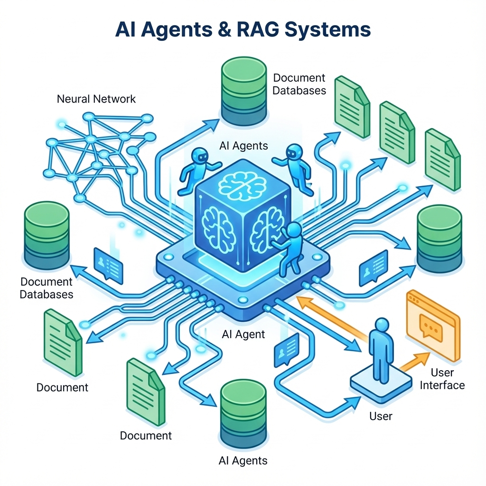
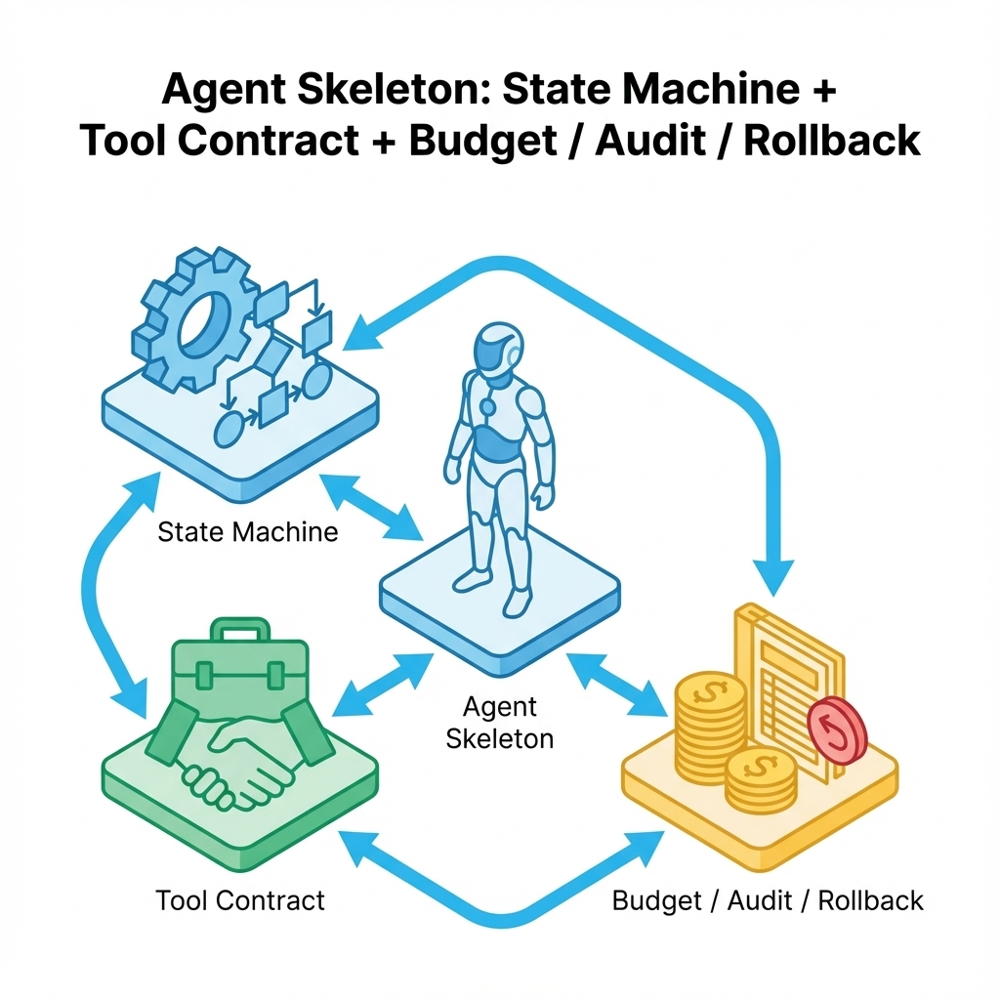

# 第 10 章（Agent 深入）：让模型在边界内会做事


> Agent 不是让模型更勤奋，而是让它在边界内行动：能做什么、不能做什么、做到哪一步停、出了问题怎么回滚。越权与不可追溯，是 Agent 的原罪。[29][6]

很多 Agent 的失败不是因为模型不够强，而是因为系统设计太宽松：工具随便调、参数随便填、预算没有上限、失败没有停止条件。你会得到一个看似聪明、实际不可控的自动化事故制造机。

## 章节定位
本章是第 10 章的深入版，聚焦 Agent 的行动闭环：工具白名单、权限边界、预算与停止条件、审计与回滚，以及如何把这些写进评测门禁。它与后端与合规章节强相关，但这里先把 Agent 的通用骨架写清楚。[29]

## 你将收获什么
- 一套 Agent 的最小骨架：任务定义 → 状态机 → 工具边界 → 停止条件 → 审计落盘。
- 一份工具合同模板：每个工具都有输入/输出/权限/副作用/预算。
- 一套回归门禁：越权、注入、无限循环、成本失控都能被拦在上线前。[6][29]



## 关键流程图（纯文本）：一次任务的可控行动闭环

```text
用户请求（不可信输入）
  ↓
任务边界判定
  - 不需要行动：直接答复（带证据/拒答）
  - 需要行动：进入状态机
  ↓
状态机循环（每一步都可审计/可停止）
  1) 收集信息（追问/澄清）
  2) 计划（列步骤 + 标注所需工具）
  3) 执行（工具调用只能走“闸门”）
      validate_tool_call:
        - allowlist 检查（工具名）
        - schema 校验（必填/格式/白名单/长度/范围）
        - 权限校验（user/tenant/resource）
        - 预算校验（调用次数/成本/时间）
      - 失败：aborted_reason 记录 → 停止/降级/请求确认
      - 成功：写审计字段 → 更新状态 → 继续下一步
  4) 总结（解释 + 证据 + 下一步）
  ↓
副作用治理
  - 任何写操作：必须有补偿/回滚（同 action_id 可追溯）
  - 退化/事故：回滚 → 留证据 → 失败样本入回归 → 阻断发布
```

## 示例（可复制）：工具闸门 + 最小回归样本（越权/预算）

**目标：** 为一个“有副作用”的工具补齐闸门校验，并把越权/预算越界写成阻断级回归样本。

**前置条件：**
- Python 3 可用

**步骤：**
1. 复制并运行下面脚本：它会验证 1 条合法调用可通过、2 条非法调用必须被拒绝。
```bash
python3 - <<'PY'
from __future__ import annotations

class Reject(Exception):
    pass

def validate_tool_call(call: dict, actor: dict, budget: dict, contracts: dict) -> None:
    tool = call.get("tool")
    if tool not in contracts:
        raise Reject("tool_not_allowlisted")

    contract = contracts[tool]
    required_role = contract["permission_scope"]["role"]
    if required_role not in actor.get("roles", []):
        raise Reject("rbac_denied")

    if call.get("tenant_id") != actor.get("tenant_id"):
        raise Reject("tenant_mismatch")

    amount_cents = int(call.get("amount_cents", -1))
    if not (1 <= amount_cents <= contract["input_validation"]["amount_cents_max"]):
        raise Reject("amount_out_of_range")

    if call.get("currency") not in contract["input_validation"]["allowed_currencies"]:
        raise Reject("currency_not_allowed")

    customer_id = str(call.get("customer_id", ""))
    if not (1 <= len(customer_id) <= contract["input_validation"]["customer_id_max_len"]):
        raise Reject("customer_id_invalid")

    if budget["calls_used"] + 1 > budget["max_calls_per_task"]:
        raise Reject("budget_calls_exceeded")

def must_pass(case: dict) -> None:
    try:
        validate_tool_call(case["call"], case["actor"], case["budget"], case["contracts"])
    except Reject as e:
        raise SystemExit(f"UNEXPECTED REJECT: {e}")

def must_reject(case: dict, expect: str) -> None:
    try:
        validate_tool_call(case["call"], case["actor"], case["budget"], case["contracts"])
        raise SystemExit("UNEXPECTED PASS")
    except Reject as e:
        if str(e) != expect:
            raise SystemExit(f"WRONG REJECT: got={e} expect={expect}")

contracts = {
    "create_invoice": {
        "permission_scope": {"role": "billing_admin"},
        "input_validation": {
            "allowed_currencies": ["CNY", "USD"],
            "amount_cents_max": 5_000_000,
            "customer_id_max_len": 64,
        },
    }
}
actor_ok = {"tenant_id": "t_001", "roles": ["billing_admin"]}
budget_ok = {"calls_used": 0, "max_calls_per_task": 1}

case_ok = {
    "contracts": contracts,
    "actor": actor_ok,
    "budget": budget_ok,
    "call": {
        "tool": "create_invoice",
        "tenant_id": "t_001",
        "currency": "CNY",
        "amount_cents": 1200,
        "customer_id": "c_123",
    },
}
must_pass(case_ok)

case_unauthorized_tenant = {**case_ok, "call": {**case_ok["call"], "tenant_id": "t_999"}}
must_reject(case_unauthorized_tenant, "tenant_mismatch")

case_budget_exceeded = {**case_ok, "budget": {"calls_used": 1, "max_calls_per_task": 1}}
must_reject(case_budget_exceeded, "budget_calls_exceeded")

print("ok")
PY
```
2. 把 `validate_tool_call` 迁移到你的统一工具入口（所有工具调用必须经过同一闸门），并把拒绝原因写入审计字段（如 `aborted_reason`）。
3. 把失败用例固化成回归样本：至少覆盖 `tenant_mismatch`（越权）、`schema_invalid`（输入不合规）、`budget_exceeded`（成本/次数越界）；命中即阻断发布。

**验证命令：**
- 上面脚本输出 `ok` 且退出码为 0；在你的工程中，对应回归任务应稳定通过。

**失败判定：**
- 任一非法用例被放行（出现 `UNEXPECTED PASS`），或拒绝原因不一致（出现 `WRONG REJECT`）。

**回滚：**
- 立即将该工具从 allowlist 移除（或通过配置禁用），并回滚到上一稳定版本组合；把触发事故的输入写入阻断级回归样本，复跑通过才允许重新启用。

## 三层思考：Agent 的关键矛盾
### 第 1 层：读者目标
你要交付的是可托付的行动者：它能完成任务，但更重要的是它知道什么时候不该做、做不下去怎么办、做错了怎么撤回。

### 第 2 层：论证链条
Agent 的可控链条是：

任务边界 → 工具合同 → 状态机与停止条件 → 输入不可信处理（注入/越权）→ 审计与回滚 → 评测回归

只要你缺工具合同和停止条件，其他一切都会变成不可预测的漂移。[29][6]

### 第 3 层：落地与验收
验收看三件事：
- 工具调用是否都在白名单与权限内；越权即阻断。[29]
- 是否有预算上限与停止条件；无限循环/过度调用即失败。[6]
- 关键行动是否可追溯可撤回；不可回滚即不该自动化。

## 第一步：先问真的需要 Agent 吗
很多时候你需要的不是 Agent，而是：
- 更好的产品流程（把任务拆短、把输入做对）；
- 更好的 RAG 证据链（减少编造）；
- 更好的后端能力（提供更明确的接口与错误语义）。[6]

如果用户只要一个答案，用 RAG；如果系统必须做一串动作，才考虑 Agent。

## 第二步：写工具合同（工具是风险源，不是能力源）
把每个工具当成有副作用的外部系统。工具合同至少要写清楚：
- 工具做什么、不做什么；
- 需要什么权限与范围；
- 输入输出的结构与校验；
- 成本预算与停止条件；
- 副作用如何撤回/补偿（回滚）。[29]

### 工具合同（工具白名单）

| 字段 | 说明 |
| --- | --- |
| 工具名 | 唯一标识 |
| 目的 | 一句话说明用途 |
| 允许动作 | 读/写/删除/支付等（尽量最小） |
| 权限范围 | 用户/租户/资源级限制 |
| 输入校验 | 必填字段、格式、长度、白名单 |
| 输出语义 | 成功/失败与原因，是否可重试 |
| 预算与停止 | 最大调用次数/最大成本/超时 |
| 副作用 | 会改变什么；如何撤回/补偿 |
| 审计字段 | 需要记录哪些信息用于追责 |

把表格变成可落地合同，建议补一个可复用示例，明确输入校验、权限边界与副作用。下面是一个最小工具合同（示意）：

```text
tool: create_invoice
purpose: 为某租户创建一张草稿账单（只允许草稿）
allowed_actions: write
permission_scope:
  tenant_id: 必须等于当前会话 tenant_id
  role: billing_admin
input_validation:
  currency: 仅允许 CNY/USD
  amount_cents: 1..5000000
  customer_id: 必填，长度<=64
budget:
  max_calls_per_task: 1
  timeout_ms: 3000
side_effect:
  writes: invoices(draft)
  rollback: delete_draft_invoice（同 action_id）
audit_fields:
  action_id, request_id, user_id, tenant_id, tool, params_hash, result, latency_ms
```

## 第三步：做一个可解释的状态机
Agent 不应该是无边界的自由发挥。最实用的做法是把它写成状态机：每一步明确输入、输出与停止条件。

### Agent 状态机（最小可控版）

| 状态 | 进入条件 | 行为 | 成功退出 | 失败退出（必须有） |
| --- | --- | --- | --- | --- |
| 收集信息 | 输入不足/不确定 | 追问/补齐 | 信息齐全 | 超时/拒答 |
| 计划 | 任务明确 | 生成步骤列表 | 计划可执行 | 计划包含越权动作 |
| 执行 | 计划已定 | 调用工具（白名单） | 得到结果 | 工具失败/预算越界 |
| 总结 | 有结果 | 解释+证据+下一步 | 交付 | 不确定则回到追问 |

状态机的价值在于：它让你能写评测、能回归、能定位，而不是把系统交给不可预测的自由对话。

要让状态机真正可解释，最低要求是记录状态流转日志：每次进入/退出状态都带上理由、预算与关键输入摘要。否则出了事故只能猜它为什么会走到那一步。

| 字段 | 为什么需要 |
| --- | --- |
| action_id / trace_id | 串起整条任务链路 |
| state | 当前状态名 |
| event | enter/exit/fail |
| reason | 为什么进入/为什么失败 |
| tool | 若调用工具，记录工具名 |
| budget_remaining | 剩余预算（步数/成本/时间） |

## 第四步：预算与停止条件（防止勤奋导致破产）
Agent 最危险的不是不会做，而是做太多：反复思考、反复检索、反复调用工具。最低止损要求：
- 每次任务有最大步骤数/最大工具调用次数；
- 每次任务有最大成本/最大时间；
- 达到上限必须停止，并给出下一步建议。[6]

### 预算与停止条件

| 维度 | 阈值 | 触发后动作 |
| --- | --- | --- |
| 工具调用次数 | ≤ N | 停止并解释原因 |
| 总成本 | ≤ X | 降级/请求确认/停止 |
| 总时长 | ≤ T | 返回部分结果 + 建议 |
| 失败次数 | ≤ M | 切换策略或停止 |

## 第五步：审计与回滚（让自动化可追责）
Agent 的每一次行动都应该可追溯：谁触发、对什么资源、做了什么、结果如何、用了什么参数。更重要的是：当行动有副作用时，你必须设计撤回/补偿。[29]

最低审计原则：
- 工具调用必须记录输入、输出、结果与原因；
- 关键资源操作必须记录资源标识与权限上下文；
- 任何涉及计费/删除/权限变更的动作，默认需要更强的审计与更强的回滚策略（甚至需要人工确认）。[6]

## 安全：把输入当作不可信，把工具当作高风险
Agent 的两类常见事故：
- **输入注入**：用户用指令诱导越权或泄露。
- **工具滥用**：工具参数被注入，导致访问不该访问的资源。[29]

最低防护：
- 工具层做权限校验与输入校验（不要只在提示里说不要）。
- 任何越权尝试都要阻断并记录，且进入回归集。[6][29]

把防护落到代码层，最低是一道工具调用闸门：所有工具调用必须走同一个校验入口。

```text
validate_tool_call(tool, params, actor, budget):
  if tool not in allowlist: reject
  if not schema_validate(params, tool.input_schema): reject
  if not rbac_allow(actor, tool, params): reject
  if budget_exceeded(budget): reject
  return ok
```

## 评测与回归：Agent 的门禁比 RAG 更硬
Agent 的评测不止看答得对不对，还要看做得安不安全：
- 越权率（必须为 0 或可解释豁免）
- 预算越界率（必须可控）
- 副作用可回滚率（关键动作必须可撤回）
- 失败恢复质量（是否能停止并给出下一步建议）[6]

预算与停止条件要能被观测系统看见，否则阈值只是文档。最低落地是把任务级指标打点出来：steps_used、tool_calls、token_cost、latency_ms、aborted_reason，并把越界与阻断当成告警事件。

## 复现检查清单（本章最低门槛）
- 工具合同齐全：权限/输入校验/预算/副作用/审计字段/回滚动作齐全。[29]
- 状态机与停止条件可观测：无限循环、预算越界、工具失败能被门禁拦截，并输出 aborted_reason。[6]
- 越权/注入/预算越界样本进入回归：命中即阻断发布，并要求给出最小复现与修复证据。[6][29]
- 对比证据可解释：每次变更有同口径对比表（越权率、预算越界率、任务成功率、成本/延迟），退化即回滚。[6]

## 常见陷阱（失败样本）
1. **现象：** Agent 偶尔做出危险操作（越权/误删/误发），而且你无法解释它为什么敢这么做。  
   **根因：** 把安全写在提示里，而不是写在工具与权限层；工具入口没有统一闸门。[29]  
   **复现：** 移除或绕过工具闸门，让模型直接构造工具参数；用越权 `tenant_id` 或越界资源 id 触发工具调用。  
   **修复：** 所有工具调用必须经过同一校验入口（allowlist + schema + rbac + budget）；越权命中即阻断，并写入回归集。[29][6]  
   **回归验证：** 阻断级回归样本（越权/注入）稳定复跑：非法调用必拒绝，且 `aborted_reason` 与审计字段齐全可查询。

2. **现象：** Agent 表现很努力，但成本失控、延迟巨大，甚至进入无限循环。  
   **根因：** 没有预算与停止条件；把反复调用工具当成聪明。[6]  
   **复现：** 给一个开放式任务（信息不足但可无限追问/检索），观察工具调用次数与总时长持续增长且无停止。  
   **修复：** 写任务级预算（步数/调用次数/成本/时间）与硬停止条件；越界必须停止并解释下一步建议。[6]  
   **回归验证：** 回归任务在最坏输入下也会在阈值内停止，并产出一致的 `aborted_reason`；预算越界率不随版本漂移。

3. **现象：** 出了事故无法复盘，只能猜；同样输入复跑也复不出同样轨迹。  
   **根因：** 缺审计字段与可重放记录；状态流转与工具输入输出不可追溯。[29]  
   **复现：** 发生一次错误后，尝试回答“谁触发/用的什么参数/改了什么资源/为什么进入该状态”；若只能靠口头推测即命中。  
   **修复：** 补齐 `trace_id/action_id`、state enter/exit、tool params_hash、result、latency、budget_remaining 等字段；关键链路提供重放入口（回放同一请求）。  
   **回归验证：** 随机抽 5 条真实任务：能从审计系统还原状态轨迹与关键工具参数，并复现同口径的门禁结论。

4. **现象：** “回滚”只写在文档里，真正出问题时撤不回，自动化变成不可逆伤害。  
   **根因：** 工具有副作用但没有补偿动作；缺少幂等键与 action_id 绑定，导致无法定位/无法撤回。  
   **复现：** 让 Agent 执行写操作（支付/删除/权限变更），在中途失败或重复执行时出现重复扣费/误删/权限漂移。  
   **修复：** 为关键写操作设计补偿/冲正，并与 `action_id` 绑定；引入幂等键与重试语义，默认“先草稿、后确认”。  
   **回归验证：** 故障注入下（超时/重试/重复请求）副作用不重复；执行回滚动作后，资源状态与账本口径恢复到同一基线。

## 交付物清单与验收标准
- 工具合同库（白名单）：至少覆盖 5 个关键工具。[29]
- Agent 状态机与停止条件说明（含预算与降级）。[6]
- 回归集：越权/注入/预算越界/失败恢复样本，命中即阻断发布。[6][29]

## 下一章
Agent 与 RAG 让系统能回答、能行动。接下来进入产品模块：身份与权限，是一切边界与审计的底座。下一章见：[11-user.md](11-user.md)。

## 参考
详见本书统一参考文献列表：[references.md](references.md)。
