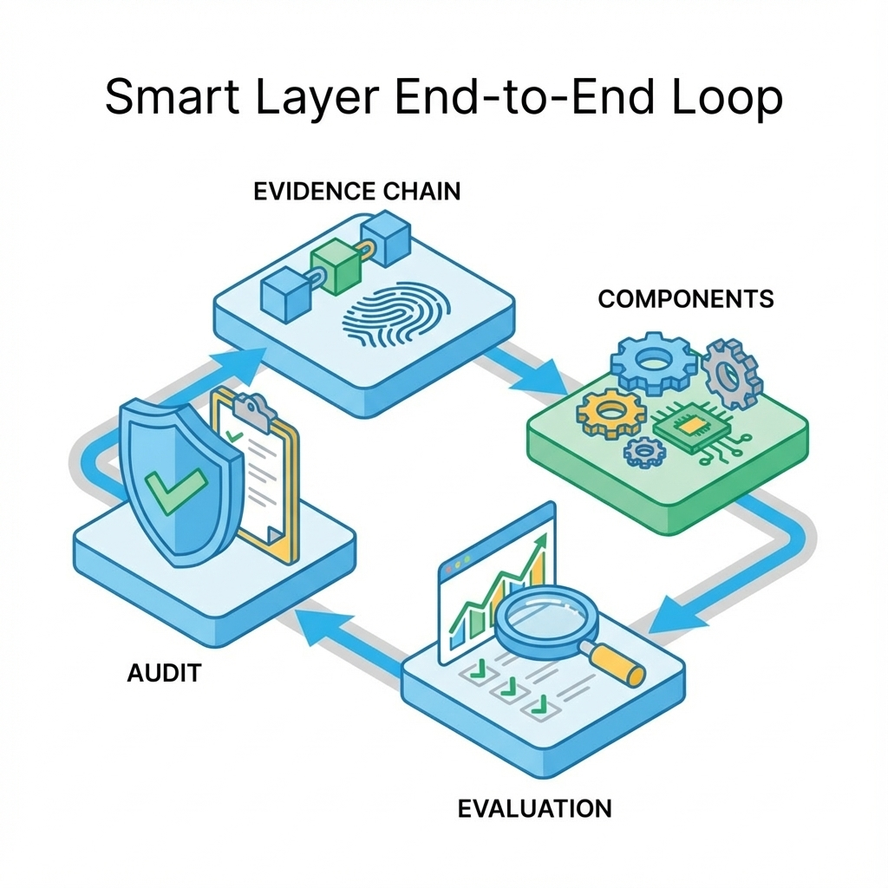

# 第 10 章：Agent 架构与 RAG：证据、边界与回归


> RAG 解决回答要有证据，Agent 解决让模型会做事。两者最难的不是能不能跑，而是能不能长期稳定地跑：证据链、权限边界、评测门禁缺一不可。[6][24][29]

这一章给你一条主线：当你遇到幻觉、注入、越权、成本飙升、延迟变差时，应该先看哪一环；也给你一套决策框架：什么时候该用 RAG，什么时候该用工具（Agent），什么时候应该回到产品设计与数据质量上重做。

## 章节定位
本章位于全栈底座之后，开始进入智能层。它不追求把你带进某个框架的细节，而是把智能层写成可治理系统：
- **证据链**：回答能回指到来源片段；无引用视为失败。[24]
- **边界**：工具调用有白名单、Schema、预算与停止条件；越权视为阻断。[29]
- **回归**：改动前后同口径对比；退化即回滚。[6]

这里的全栈底座指的是：工程化门禁（Ch07）+ 前端可解释体验（Ch08）+ 后端错误语义/幂等/可观测/预算（Ch09）。没有这些底座，智能层只会把不确定性放大到线上。

更细的实现与陷阱分别放在两章深入：
- RAG 深入：[`10-agent-rag-rag.md`](10-agent-rag-rag.md)
- Agent 深入：[`10-agent-rag-agent.md`](10-agent-rag-agent.md)

## 你将收获什么
- 一张端到端闭环：数据进入、检索、生成、工具调用、审计落盘、评测回归。
- 一套最小门禁：无引用即失败、非法工具调用阻断、失败样本集回归。
- 一张选型决策表：面对不同问题，先选 RAG、Agent 还是别做智能。[6]

## 三层思考：把聪明变成可控
### 第 1 层：读者目标
你要让用户得到两种确定性：
- 结果的确定性：有证据、可追溯、可复核。
- 行为的确定性：能做什么、不能做什么、做到哪一步就停止。[29]

### 第 2 层：论证链条
智能层的闭环是：

任务定义 → 失败模式 → 证据链（RAG）→ 行为边界（Agent）→ 评测门禁 → 线上审计与观测 → 退化回滚

你会发现：只要评测与审计缺失，任何优化都会变成不可解释的漂移。[6]

### 第 3 层：落地与验收
验收不靠感觉更聪明，而靠门槛：
- 回答必须带引用（或明确拒答/追问）；无引用=失败。[24]
- 工具调用必须在白名单与预算内；越权=阻断。[29]
- 改动必须过回归集；退化=回滚。[6]



## 智能层的定义与边界
本书中智能层指的是：把模型能力嵌入系统，并让它在可审计与可回滚的约束下工作的一组组件。最小组成只有四块：

- 检索与证据：把回答绑定到来源片段，证据不足就追问或拒答。[24]
- 工具与行动：把可做的事收敛成白名单工具，并把入参、权限与预算写成合同。[29]
- 评测与回归：用失败样本集与固定口径做门禁，避免漂移。[6]
- 审计与观测：把检索、引用、工具调用与成本写入审计事件，能复盘能追责。[29]

## 先做决策：你到底需要 RAG 还是 Agent
### 决策表：先问你缺的是信息还是能力

| 你遇到的问题 | 更可能的解法 | 混合策略（常见） | 风险与门禁 |
| --- | --- | --- | --- |
| 回答缺事实、编造引用 | RAG | 先检索再生成 | 无引用强答视为失败[24] |
| 需要调用外部系统完成任务 | Agent | 先检索上下文，再工具写操作 | 非法工具调用与越权阻断[29] |
| 输出不稳定、风格漂移 | 评测与回归先行 | 固定回归集 + A/B | 无基线不宣称优化[6] |
| 成本与延迟失控 | 预算与降级先行 | 缓存 + 分层模型 + 降级路径 | 越界即降级/回滚[6] |
| 用户不信任、不敢用 | 证据与边界先行 | 证据卡片 + 工具时间线 | UI 必须可解释可自救 |

## 最小门禁（建议先落地这 5 条）
1. **引用缺失 = 失败**：无引用不合并、不上线（知识问答尤甚）。[24]
2. **非法工具调用 = 阻断**：不在白名单/入参不匹配/权限不足，直接失败并记录审计。[29]
3. **失败样本集回归**：每次改动必须通过固定失败集（注入、长上下文、边界语义、越权尝试）。[6]
4. **成本/延迟守门**：每次改动提供同口径对比表（质量/延迟/成本），退化即回滚。[6]
5. **审计可追责**：关键动作（检索、工具、引用）可追溯可重放。[29]

## 把证据与行动做成产品体验：用户看见了，才会敢用
智能层最容易出现的产品错觉是：你在系统里做了很多治理（引用、工具白名单、审计），但用户完全看不见——他只看到一段回答（或一串动作），于是他无法判断它是否可靠，也无法在失败时自救。

更稳的做法是把证据链和行动链在 UI 上变成可理解的结构，让用户在关键时刻能回答三件事：
- **它凭什么这么说**：关键结论对应哪些来源片段（能点开、能核对）。[24]
- **它做了什么**：调用了哪些工具、每一步花了多久、哪一步失败（避免黑箱）。[29]
- **我下一步怎么办**：证据不足时追问；工具失败时重试/降级；权限不足时申请/切换账号。[6]

与其放一张占位图，不如先把 UI 结构写成可实现表格，保证每一块都有用户动作与失败恢复：

| 区块 | 用户看到什么 | 用户能做什么 | 系统留档什么 |
| --- | --- | --- | --- |
| 结果区 | 结论 + 下一步 | 复制/保存/继续 | 最终答案 + trace_id |
| 证据区 | 引用卡片（来源/片段） | 展开/跳转/核对 | sources + 命中片段 |
| 行动区 | 工具时间线（每步状态） | 重试/降级/取消 | tool_calls + 参数摘要 |
| 边界区 | 不确定性与风险提示 | 追问/补信息/改请求 | refusal_reason + 风险标记 |

把这三件事长在界面里，智能层才会从黑箱变成可托付系统：

```text
[结果区] 结论 + 下一步（先给可行动答案）

[证据区] 引用卡片（来源/段落摘要/命中高亮）— 无证据则明确提示不足

[行动区] 工具调用时间线（工具名/参数摘要/结果/失败原因）+ 可重试/可降级
```

## 常见陷阱（失败样本）
1. **现象**：线上偶尔很准、偶尔翻车，用户不敢依赖。  
   **根因**：没有失败样本资产化与回归门禁，优化只看平均指标。  
   **修复**：建失败样本集 + 固定攻击集；回归不过不发布。[6]

2. **现象**：Agent 很勤奋，但成本飙升且偶尔越权。  
   **根因**：没有预算/停止条件与工具边界；把会做事当成该做事。  
   **修复**：明确停止条件、预算与权限；越权视为阻断级失败并可审计。[29]

## 交付物清单与验收标准
- 智能层端到端闭环说明（含证据链、边界、评测门禁）。
- 最小门禁规则与阈值（引用/越权/回归/成本）。[6][24][29]
- 审计字段规范（检索、工具、引用可追溯）。

## 下一章
智能层之后，你会进入产品模块的世界：用户、权限、计费、数据等，把商业闭环与风险边界落到系统默认属性。下一章见：[11-user.md](11-user.md)。

## 参考
详见本书统一参考文献列表：[references.md](references.md)。
