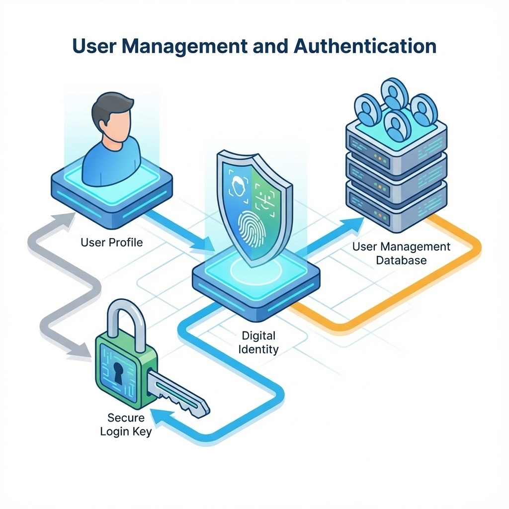

# 第 11 章：用户模块：认证、授权与审计


> **编辑器注**
> 
> **插图生成提示词**
> **image_prompt:** A minimalistic, isometric architectural diagram of a fortress gate. The gate is composed of three layers: a biometric scanner (identity), a keycard reader (permission), and a security camera (audit). The style should be clean, blueprint-like, with blue and white lines on a dark background. No text labels on the image itself.
> **negative_prompt:** text, characters, messy lines, organic shapes, chaotic, low resolution
> **params:** --ar 16:9 --v 6.0

能登录不等于能上线。0 到 1 阶段最容易出事故的地方，往往是权限边界不清、审计缺失、账号体系一改就崩。本章不讲怎么写登录页面，而是把用户模块当作生产系统的底座来写：边界清晰、可追溯、可回滚。[22][68]

AI 产品会把用户模块的风险放大：一旦越权，泄露的不只是页面数据，还可能是知识库、提示词、工具调用结果与审计日志本身。你必须把“默认安全”做成系统属性，而不是靠开发者记得在代码里写个 `if` 校验。[68]

## 章节定位
本章位于智能层之后，进入产品模块。原因很简单：只要你开始提供保存、共享、团队协作、计费或知识库，你就必须先把身份与权限边界写清楚。否则你后面的每一章都会在同一个地方反复返工：谁能看到什么、谁能做什么、出了事怎么追责。[22]

## 你将收获什么
*   **一个可迁移的边界模型**：AuthN（认证）与 AuthZ（授权）分层、硬隔离的租户 ID、资源级权限判定。
*   **一套审计口径**：关键事件、字段、追踪标识（Trace ID），让事故可复盘、可追责。[68]
*   **一张最小门禁**：越权阻断、敏感操作可追溯、凭证策略可回滚。

## 三层思考：用户模块的价值不是登录，是边界
### 第 1 层：读者目标
你要交付的是一个可托付的系统底座：权限清晰、越权可回归、关键操作可追溯。

### 第 2 层：论证链条
用户模块的链条是：

身份体系（AuthN） -> 权限模型（AuthZ） -> 租户隔离 -> 审计事件 -> 回归用例 -> 变更与回滚

缺一环，安全会变成人的记忆，而人的记忆在压力下最不可靠。[68]

### 第 3 层：落地与验收
验收不靠“看起来没问题”，而靠三条硬门槛：
1.  **任何跨租户访问都必须失败**（服务端阻断，而不是 UI 隐藏）。[68]
2.  **敏感操作必须产生审计事件**（谁、何时、对什么、做了什么、结果如何）。[68]
3.  **权限变更必须可灰度与可回滚**（避免一改全崩）。

## 方法论速览：先定模型，再定事件，再写回归


> **编辑器注**
> 
> **插图生成提示词**
> **image_prompt:** A schematic diagram showing the flow of a user request through security layers. Layer 1: Identity verification (a filter). Layer 2: Permission check (a gate). Layer 3: Action execution (a gear). Running parallel to all layers is a logging stream (audit trail). Clean lines, technical drawing style, dark mode palette.
> **negative_prompt:** text, labels, realistic people, cluttered, colorful
> **params:** --ar 3:2 --v 6.0

## 关键流程图（纯文本）：一次请求如何被允许或拒绝

```text
请求（含凭证与 tenant_id）
  |
  v
AuthN（你是谁）
  - 校验凭证有效性（过期 / 撤销 / 轮换）
  - 失败：拒绝 + 记录审计（login_fail / token_invalid）
  |
  v
AuthZ（你能做什么）
  - 取主体（user / service） -> 取资源（resource_id） -> 取动作（read / write / admin）
  - 关键检查：tenant_id 必须一致；资源级谓词必须成立
  - 失败：拒绝 + 记录审计（access_denied + reason + policy_version）
  |
  v
执行（只在允许后发生）
  - 返回结果或业务错误（与权限错误区分）
  |
  v
审计（可搜索、可串联、可解释）
  - 字段：who / when / where / what / action / result / reason / trace_id / policy_version
  |
  v
回归与变更治理
  - 越权用例入回归：跨租户、降权后访问、敏感操作审计缺失
  - 策略版本化与灰度：新旧策略并行窗口 -> 指标不退化才切换 -> 退化即回滚
```

## 示例（可复制）：3 条阻断级权限回归
**目标：** 用最小回归集把“越权必失败”固化成可复跑门禁，并确保拒绝原因可解释（便于审计与对外沟通）。

**前置条件：**
*   Python 3 可用

**步骤：**
1.  复制并运行下面脚本：它模拟一个最小 RBAC + 租户隔离，并验证 3 条回归用例。

```python
from __future__ import annotations

class Denied(Exception):
    def __init__(self, reason: str):
        self.reason = reason

def authorize(actor: dict, resource: dict, action: str, policy: dict) -> dict:
    # 核心：租户隔离必须是第一道防线
    if actor["tenant_id"] != resource["tenant_id"]:
        raise Denied("tenant_mismatch")
    
    # 策略查找
    allowed_actions = policy["roles"].get(actor["role"], [])
    if action not in allowed_actions:
        raise Denied("action_not_allowed")
        
    # 返回策略版本，用于审计
    return {"allow": True, "policy_version": policy["version"]}

def must_allow(case: dict) -> None:
    try:
        out = authorize(case["actor"], case["resource"], case["action"], case["policy"])
    except Denied as e:
        raise SystemExit(f"UNEXPECTED DENY: {e.reason}")
    if out.get("policy_version") != case["expect_policy_version"]:
        raise SystemExit("WRONG POLICY VERSION")

def must_deny(case: dict, expect_reason: str) -> None:
    try:
        authorize(case["actor"], case["resource"], case["action"], case["policy"])
        raise SystemExit("UNEXPECTED ALLOW")
    except Denied as e:
        if e.reason != expect_reason:
            raise SystemExit(f"WRONG DENY REASON: got={e.reason} expect={expect_reason}")

# 策略定义：版本化是回滚的关键
policy = {
    "version": "p_001",
    "roles": {
        "owner": ["read", "write", "admin"], 
        "viewer": ["read"]
    }
}
resource = {"tenant_id": "t_001", "resource_id": "kb_1"}

# 用例 1：合法访问必须通过
must_allow(
    {
        "policy": policy,
        "actor": {"tenant_id": "t_001", "role": "owner"},
        "resource": resource,
        "action": "read",
        "expect_policy_version": "p_001",
    }
)

# 用例 2：跨租户必须阻断（即便是 owner）
must_deny(
    {
        "policy": policy,
        "actor": {"tenant_id": "t_999", "role": "owner"},
        "resource": resource,
        "action": "read",
    },
    "tenant_mismatch",
)

# 用例 3：低权限写操作必须阻断
must_deny(
    {
        "policy": policy,
        "actor": {"tenant_id": "t_001", "role": "viewer"},
        "resource": resource,
        "action": "write",
    },
    "action_not_allowed",
)

print("ok")
```

2.  将这 3 条用例迁移到你的服务端授权层回归（真实 API / 真实租户 / 真实资源），并把拒绝原因落到审计字段（`reason` + `policy_version` + `trace_id`）。
3.  权限策略变更必须先灰度：新旧策略并行一个窗口；回归全绿且线上拒绝率不异常，才允许切换。

**验证命令：**
*   执行上述脚本，输出 `ok` 且退出码为 0。
*   在你的 CI/CD 管道中，对应回归任务应稳定通过。

**失败判定：**
*   任一越权用例被放行（出现 `UNEXPECTED ALLOW`）。
*   拒绝原因或策略版本口径不一致（出现 `WRONG <...>`）。

**回滚动作：**
*   立即切回上一策略版本（`policy_version` 回退）。
*   在回归集中加入触发问题的最小用例，复跑通过才允许继续变更。

### 1) 身份体系（AuthN）：你是谁
AuthN 的核心是凭证生命周期：签发、过期、撤销、轮换。0 到 1 阶段不追求花哨，但必须可解释、可撤销。[22]

如果你要接第三方登录或企业 SSO，建议优先选成熟的 OIDC 提供商，别在 0 到 1 阶段自己发明一套 token 协议。真正折磨人的不是登录页，而是撤销、轮换、过期后的边界：用户登出后旧会话是否还在？管理员禁用账号后旧 token 是否还能访问？把这些问题写进验收与回归，比多做两种登录方式更值钱。[22][69][68]

你要回答三件事：
1.  **支持哪些登录方式**：邮箱、第三方、企业 SSO？
2.  **凭证如何失效**：登出、改密、风控封禁。
3.  **会话如何被追踪**：用于审计与风控。

一个更可落地的最小推荐是：短生命周期 Access Token + 可轮换 Refresh Token，并把撤销做成服务端事实而不是客户端愿望：
*   **Access Token**：过期时间短一些（如 15 分钟），降低泄露窗口。
*   **Refresh Token**：绑定设备与会话。
*   **轮换**：每次刷新都签发新 Refresh Token，旧 Refresh Token 立即失效，降低被盗复用风险。
*   **撤销与封禁**：服务端维护会话表或撤销列表，禁用用户时让所有会话立即失效（而不是等过期）。[69][68]

### 2) 权限模型（AuthZ）：你能做什么
推荐从最小可用三件套起步：
*   **主体**：用户、服务账号、团队。
*   **资源**：项目、文档、知识库、账单等资源实例。
*   **动作**：read、write、admin 等动作集合。[68]

最重要的不是你选 RBAC 还是 ABAC，而是：权限必须可测试、可审计、可迁移。

#### 模板：权限模型一页纸

| 项目 | 写法要求 | 示例 |
| :--- | :--- | :--- |
| **主体** | 用户 / 团队 / 服务账号的定义 | `user:123`, `service:indexer` |
| **资源** | 需要保护的资源清单与标识方式 | `repo:456`, `kb:789` |
| **动作** | read / write / admin 等最小集合 | `kb:read`, `kb:delete` |
| **角色** | 角色与动作映射（可选） | Owner = All; Viewer = ReadOnly |
| **租户隔离** | tenant_id 如何贯穿与校验 | HTTP Header `X-Tenant-ID` + DB 字段 |
| **默认策略** | 默认拒绝还是默认允许 | **必须默认拒绝** |

#### 界面设计：两栏权限视图
用“两栏 + 危险区”结构把权限变成可解释、可审计的产品能力。别让用户猜为什么不行。

*   **左栏（成员列表）**：邮箱 | 角色 | 状态（已邀请 / 已加入 / 已停用）。支持搜索。
*   **右栏（权限详情）**：选中成员后，展示资源范围 + 动作集合，并明确标示“任何变更都会产生审计事件”。
*   **页底（危险操作区）**：移除成员 / 降权 / 停用。**必须**二次确认 + 输入理由，理由会写入审计日志，避免事后扯皮。

### 3) 租户隔离：0 到 1 最常见的致命漏洞
多租户产品里，最贵的事故是跨租户数据泄露。

最低要求：
1.  **查询必带租户**：任何资源查询 SQL 或 API 调用都必须带租户上下文。
2.  **缓存必带租户**：任何缓存键（Key）都必须包含租户 ID，避免 A 租户看到 B 租户的缓存数据。
3.  **导出必授权**：任何导出 / 分享动作都要有显式授权与审计。[68]

跨租户越权属于 S0 级事故，建议把 10 分钟止损动作写成 Runbook 并演练：见 [E-runbooks.md](E-runbooks.md)（RB-04）。

### 4) 审计：把背锅变成可追责
审计日志是事故复盘的事实源，也是很多企业客户付费的理由之一。[68]

#### 模板：审计事件规范

| 字段 | 说明 | 示例 |
| :--- | :--- | :--- |
| **who** | 操作者 ID | `user_123`, `service_cron` |
| **when** | 时间戳（UTC ISO8601） | `2025-10-24T10:00:00Z` |
| **where** | 追踪 ID / IP | `trace_abc123`, `1.2.3.4` |
| **what** | 资源类型 + ID | `kb:456` |
| **action** | 动作 | `kb:delete` |
| **result** | 结果 + 原因 | `fail:permission_denied` |
| **context** | 关键上下文 | `tenant_id:t_001`, `policy:v2` |
| **payload** | 变更摘要（脱敏） | `{"name_old": "A", "name_new": "B"}` |

建议先列出必须审计的事件，再实现功能：登录、权限变更、导出 / 删除、计费操作、知识库变更。[68]

### 5) 邀请与协作：让加入团队像完成一次闭环
如果你的产品有团队 / 工作区概念，邀请流程往往决定了协作能否启动。

一个可控、可解释的邀请闭环建议包含：
发起邀请（管理员选择角色 / 资源范围） -> 发送邀请 -> 成员接受 -> 首次登录 / 绑定 -> 权限生效 -> 产生审计事件。[68]

**状态机设计（Invite Flow）：**
*   `invited` -> `accepted` -> `joined` -> `active`
*   `invited` -> `expired`
*   `invited` -> `revoked`

**异常处理：**
*   **重复邀请**：按 `(tenant_id, email)` 做幂等，返回现有邀请并提示可撤销 / 重发。
*   **成员已存在**：切换为“调整权限”流程（产生审计事件）。
*   **过期**：重发邀请（生成新 Token，旧 Token 立即失效）。
*   **跨租户**：服务端必须阻断并记录审计。

### 6) 回归：把越权当成阻断级失败
权限系统最怕改一处、崩一片。你需要把越权用例写成固定回归集，只要 CI 挂了就禁止发布：
*   跨租户读取必须失败。
*   角色降权后，访问必须失败。
*   权限变更必须产生审计事件。[68]

## 复现检查清单（本章最低门槛）
*   [ ] **模型就位**：主体 / 资源 / 动作 / 租户隔离定义清晰，能映射到 API。
*   [ ] **阻断回归**：越权回归用例（跨租户、资源级）已入 CI，失败即阻断发布。[68]
*   [ ] **审计规范**：关键操作可追溯，字段齐全（含 `trace_id` 与策略版本），不泄露敏感信息。[68]
*   [ ] **回滚机制**：权限策略版本化，支持一键切回上一版本。

## 常见陷阱（失败样本）
1.  **现象：UI 隐藏了按钮，但接口可调用**
    *   **根因**：把前端显示逻辑当成授权；服务端缺少资源级校验。[68]
    *   **复现**：用低权限账号 / 跨租户 Token 直接调用接口（Curl / Postman）。
    *   **修复**：授权必须在服务端做。`tenant_id` 强校验 + 资源级谓词。

2.  **现象：权限改一次，线上崩一片**
    *   **根因**：权限模型缺少迁移策略；策略变更没有灰度。[68]
    *   **修复**：新旧策略并行窗口 -> 指标不退化 -> 切换。保留一键回滚。

3.  **现象：出了事无法追责，只能猜**
    *   **根因**：审计字段缺失，无法串起链路；缺少 `trace_id`。[68]
    *   **修复**：统一审计规范，缺审计视为功能未完成。

## 下一章
用户模块决定谁能做什么。下一章把商业闭环落到系统：订阅、计费、账本、对账与风控。见：[12-billing.md](12-billing.md)。

## 参考
详见本书统一参考文献列表：[references.md](references.md)。
