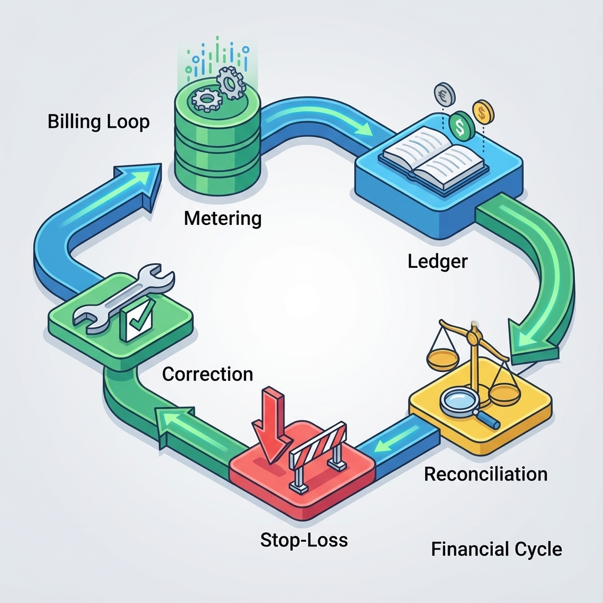

# 第 12 章：付费模块：订阅、计费与风控

> 计费系统不是“把支付接上”，而是一份可追溯的合同：谁在何时用掉了什么、应付多少、为什么这么算、出错如何纠正。做对了，它让你能增长；做错了，它让你背锅。[23][5]

AI 产品的计费比传统 SaaS 更敏感：成本与质量强耦合、调用次数随交互波动、异常峰值容易把利润吃光。因此“风控与止损”不是后补丁，而是计费设计的一部分。[6]

## 章节定位
本章承接用户与权限，把商业闭环落到系统默认属性：定价模型、计量口径、账本与对账、异常处理与风控。它的目标不是让你马上做出“完美收费”，而是让你从第一天起就能算清账、能对账、能回滚。[23]

## 你将收获什么
- 三种常见定价模型的选择框架：订阅、用量计费、混合计费（以及各自的坑）。
- 一套“计量口径 → 账本 → 对账”的最小闭环：可重放、可纠错、可追责。[5]
- 一套风控与止损线：异常用量、退款/拒付、成本尖峰都能被系统拦住。[6]

## 三层思考：计费是系统的“事实”
### 第 1 层：读者目标
你要交付的是一套让自己睡得着的系统：收费可解释、账目可重放、异常可止损。

### 第 2 层：论证链条
计费系统的链条是：

定价模型 → 计量口径 → 账本记录（不可变）→ 对账与结算 → 退款与纠错 → 风控与止损 → 审计与回滚

只要你缺“不可变账本”与“对账”，迟早会在争议与退款里崩溃。[23][5]

### 第 3 层：落地与验收
验收不是“能扣款”，而是：
- 同一笔用量不会重复计费（幂等与去重）；[5]
- 任何账单都能解释与重放（审计与对账）；
- 成本/风险越界时能止损（限额/降级/暂停）。[6]

## 先做选择：你卖的到底是什么
### 定价模型速览

| 模型 | 适合什么 | 最大风险 |
| --- | --- | --- |
| 订阅（按周期） | 价值稳定、可预测 | “用得越多越亏” |
| 用量计费 | 成本与价值可对齐 | 计量与对账复杂 |
| 混合（订阅+用量） | 既要现金流又要扩展 | 规则太多导致争议 |

0→1 的建议：先保证“可解释、可止损”，再追求“精细化定价”。你越早建立对账与止损线，越不容易被异常峰值拖垮。[6]

!!! note "作图提示（定价页不要先讲功能堆砌）"
    - 顶部：一句话价值闭环（用户得到什么结果）
    - 中部：分层的“体验承诺”（每层能做什么、会被什么护栏约束）
    - 右侧：成本相关的透明说明（用量/预算/超额后的行为：降级/限流/暂停）
    - 底部：FAQ（如何计量、失败是否计费、如何查看账单与审计）

## 计量口径：先写“怎么数”，再写“多少钱”
AI 产品里，计量口径常见有三类：
- 请求次数（简单但容易被滥用）
- 资源单位（例如：处理文档数、导入条数）
- 成本近似（例如：token、工具调用次数、向量检索次数）[6]

关键是：口径必须能被审计与复现，否则你无法解释账单争议。

如果你不知道“口径应该细到什么程度”，一个实用参照是用量计费的通用工程实践：计量事件、聚合窗口、补写/更正、幂等与去重、以及用户侧可解释的明细与汇总。[75]

**模板：计量口径卡**

| 字段 | 说明 |
| --- | --- |
| 计量单位 | 你数的是什么（次/条/页/token/工具调用） |
| 归属对象 | 归到用户还是租户（tenant） |
| 计量时机 | 什么时候记账（请求开始/完成/成功才记） |
| 去重规则 | 重试、回调重复、幂等如何处理 |
| 例外与豁免 | 哪些情况不计费（失败、系统错误） |
| 展示方式 | 用户如何查看与理解用量 |

## 用量与账单的产品呈现：把“算账”变成用户能理解的语言
计费系统常见的争议，不是出在计算公式，而是出在“解释”。用户不懂你的 Token、也不关心你的向量检索次数，他只关心两件事：我为什么被扣了这些钱？我能怎么控制它？

因此，用量与账单页面的目标不是“展示很多数字”，而是让用户能做出下一步行动：
- **预期**：我继续用下去会发生什么（是否会触发降级/限流/暂停）？
- **控制**：我如何把用量降下来（缩短输入、减少工具、批量任务排队）？
- **追溯**：这笔费用对应哪个任务/哪个请求（能回放到证据）？[5]

!!! note "作图提示（建议画成一个“可操作的用量页”）"
    - 顶部：当前周期用量进度（已用/剩余）+ 预计账单（用区间或趋势表达，别让用户猜）
    - 中部：费用拆分（按能力/入口/模型/工具调用），并标出“最费钱的路径”
    - 底部：控制开关（预算上限、稳定模式、限流策略、导出明细），每个开关都要说明“会牺牲什么体验”

## 账本：把“事实”写成不可变记录
账本的意义是：你永远能回答“为什么这笔钱要收/要退”。因此账本记录必须：
- 可追溯到一次行为（request_id、user_id、action）；
- 可重放（同一事件重放不会改变总额）；
- 可纠错（用冲正/补记而不是直接改历史）。[5][23]

**模板：账本事件（最小字段）**

| 字段 | 说明 |
| --- | --- |
| ledger_event_id | 事件唯一标识（用于去重） |
| user_id / tenant_id | 归属 |
| action | 业务语义（例如：chat.complete） |
| quantity | 计量单位数量 |
| unit_price | 单价或计价参数版本 |
| amount | 该事件金额 |
| request_id | 追踪链路 |
| timestamp | 发生时间 |
| status | 记账/冲正/退款等 |

## 对账：让“钱”与“用量”一致
对账不是财务专属，它是工程的自救：你要能发现漏记、重复记、异常峰值，并能追溯原因。
它也不是“做一次就结束”的系统：当你的计量规则、产品入口、模型与工具链不断变化，对账就是你保持口径一致性的最后防线。[75]

0→1 最小对账能力：
- 按天汇总：用量总量、金额总量、失败与退款；
- 抽样复核：随机抽取若干账单，能回放到原始行为；
- 异常告警：用量或金额突增触发止损。[6]

!!! note "作图提示（建议画成“用户→系统→人工”的闭环）"
    - 用户发起：对某笔费用发起质疑（选择账单行/时间范围）
    - 系统自证：展示该费用对应的请求证据（trace_id、关键输入摘要、结果/失败原因、是否命中豁免）
    - 纠错动作：冲正/补记/退款（以事件方式记录，不改历史）
    - 复盘回写：把争议样本与触发条件写回对账规则与风控门禁

## 风控与止损：把“越用越亏”关掉
风控的核心不是“防坏人”，也是“防意外”：脚本误刷、循环调用、批量任务误触发、模型异常导致重试风暴。

**模板：止损线（建议作为门禁）**

| 场景 | 守门指标 | 阈值 | 越界动作 |
| --- | --- | --- | --- |
| 单用户异常 | 日用量/金额 | ≤ X | 限流/暂停/提示升级 |
| 租户异常 | 峰值用量 | ≤ Y | 降级高成本功能 |
| 全局尖峰 | 总消耗 | ≤ Z | 临时关闭高风险入口 |

## 复现检查清单（本章最低门槛）
- 计量口径卡已写清：单位、时机、去重、豁免、展示方式。
- 账本事件不可变：支持去重与冲正，能追溯到一次行为。[5]
- 最小对账可执行：按天汇总 + 抽样复核 + 异常告警。[6]
- 止损线存在：异常用量能触发限流/暂停/降级。[6]

## 常见陷阱（失败样本）
1. **现象**：用户投诉“多扣费”，你无法解释。  
   **根因**：缺账本/缺去重；重试与重复回调被重复计费。  
   **修复**：账本事件唯一标识 + 幂等去重 + 冲正机制；让每笔费用可追溯可重放。[5][23]

2. **现象**：用得越多越亏，现金流越好越危险。  
   **根因**：订阅定价与成本脱钩；缺止损线。  
   **修复**：加入用量上限或分层；设置预算与降级策略；越界即止损。[6]

3. **现象**：退款/拒付处理混乱，账目越修越乱。  
   **根因**：直接改历史账单，而不是用冲正/补记。  
   **修复**：账本不可变；纠错用事件补丁；对账能重放。[23]

## 交付物清单与验收标准
- 定价模型说明与计量口径卡（含去重与豁免）。
- 账本事件规范（不可变、可追溯、可冲正）。[5][23]
- 对账与止损规则（异常峰值可拦截）。[6]

## 下一章
计费解决“怎么收钱”，数据决定“怎么变强”。下一章进入数据收集与清洗：把语料变成可训练、可评测、可治理的数据资产。见：[`13-data.md`](13-data.md)。

## 参考
详见本书统一参考文献列表：[`references.md`](references.md)。
