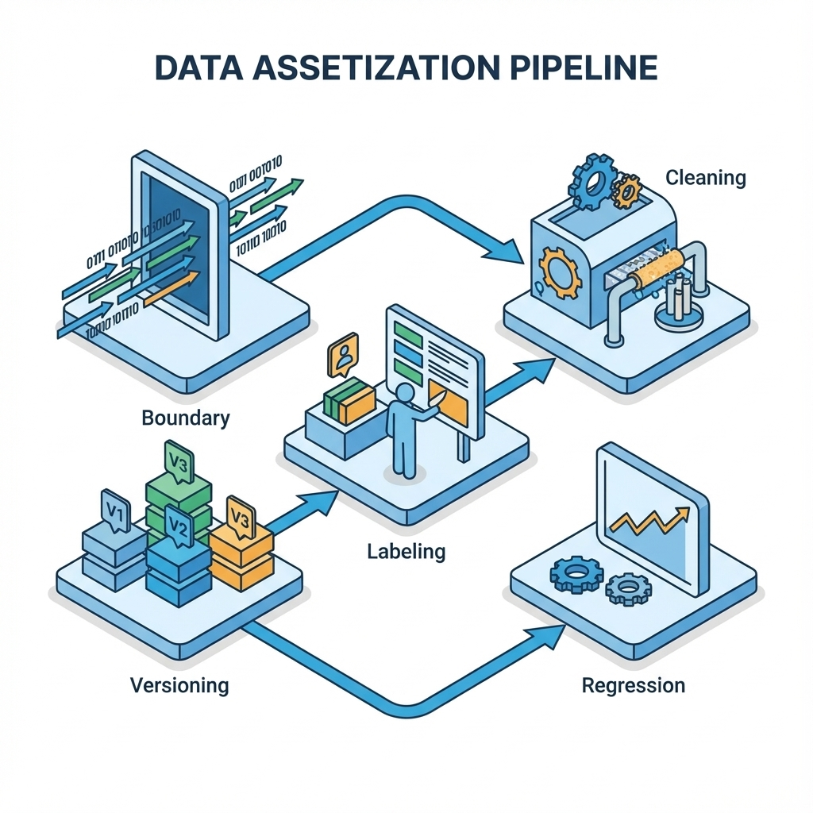

# 第 13 章：数据收集与清洗：从语料到可训练数据集

> 数据不是原材料，而是你的产品资产：它决定你能训练什么、能评测什么、能否合规上线，以及你能否在同一问题上持续变强。[34]

在 AI 产品里，数据有两张脸：一张是面向用户的事实（他们的输入、反馈、失败样本），另一张是面向系统的燃料（训练集、评测集、检索语料）。做得好，你积累的是护城河；做得坏，你积累的是风险与偏差。

## 章节定位
本章连接产品与系统到训练与评测。你会把零散的语料与日志，整理成可复用的数据资产：有范围、有许可、有字段、有清洗报告、有版本、有回滚。这样你才能在后续训练、RAG、评测与治理里建立同一个事实源。[34][35]

## 你将收获什么
- 一套数据资产化流程：范围 → 许可 → 采集 → 清洗 → 标注 → 版本化 → 评测回归。[34]
- 三个可复用模板：数据卡（Datasheet）、标注指南、清洗报告（含阈值与例外）。[34]
- 一条底线：先合规后增长；先可追溯后训练。[35]

## 三层思考：数据工作的价值不在量，在可用
### 第 1 层：读者目标
你要交付的是可训练、可评测、可治理的数据集：别人（或未来的你）能理解它、复现它、质疑它、回滚它。

### 第 2 层：论证链条
数据变成资产的链条是：

数据边界与许可 → 字段与口径 → 清洗与过滤 → 标注与一致性 → 版本化与审计 → 回归与迭代

缺许可与边界，后面都是风险；缺版本化与审计，后面都是不可复现。[34][35]

### 第 3 层：落地与验收
验收不靠我收集了很多，而靠：
- 你能解释数据从哪里来、能不能用、能用到什么范围；
- 你能给出清洗报告与例外（为什么删、为什么留）；
- 你能复跑一遍处理流程并得到同级别结论（趋势一致）。[34]

## 第一步：先写数据边界（不要先抓再说）
数据边界决定两件事：你能不能用，以及你该不该用。建议你先写清楚：
- 数据来源（用户输入、客服对话、公开资料、内部文档等）
- 使用目的（训练/评测/RAG/分析）
- 敏感性（是否含个人信息、机密、版权风险）
- 留存与删除（保留多久、如何删除、如何审计）[35]

## 模板 1：数据卡（Datasheet）
用法：每个数据集都先写一张卡，哪怕很短。[34]

| 字段 | 说明 |
| --- | --- |
| 名称与版本 | 数据集名 + 版本号 |
| 目的 | 用于训练/评测/RAG/分析 |
| 来源 | 从哪里来；是否可复现 |
| 许可与合规 | 授权、隐私、版权边界 |
| 覆盖范围 | 适用人群/任务类型/语言 |
| 不覆盖范围 | 明确不保证的部分 |
| 字段与口径 | 关键字段定义与计算口径 |
| 已知偏差 | 采样偏差、标签偏差、分布偏差 |
| 风险与止损 | 发现问题如何停用/回滚 |

## 第二步：采集策略（宁可少，但要干净）
0→1 阶段常见误区是先把量堆上去。更聪明的做法是先建立失败样本优先的采集：
- 记录用户无法完成闭环的案例（失败的输入、失败的输出、用户的纠正）。
- 记录高风险案例（越权尝试、注入、敏感内容）。
- 记录高价值案例（用户明确标注有用/采纳的输出）。[34]

这些样本会直接变成你的评测集与训练集的种子，价值远高于随机大规模抓取。

## 第三步：清洗与过滤（必须有报告）
清洗不是随便删，而是可解释的决策。每一次清洗都要回答：
- 你删掉了什么（规则与阈值）？
- 你为什么删（风险或质量理由）？
- 你删掉后会损失什么（覆盖面/多样性）？
- 你保留了哪些例外（为什么保留）？[34]

**模板 2：清洗报告（最小集合）**

| 项 | 写法 |
| --- | --- |
| 输入范围 | 原始数据量、时间范围、来源 |
| 去重策略 | 重复判定规则与比例 |
| 脱敏策略 | 哪些字段脱敏/删除，如何验证 |
| 过滤规则 | 低质量、垃圾、注入、敏感内容规则 |
| 例外清单 | 为什么保留；风险如何控制 |
| 输出统计 | 清洗后数据量、分布变化、抽样示例 |
| 回滚策略 | 如何回到上一版数据集 |

## 第四步：标注与一致性（让标签可被信任）
标注最贵的不是人工成本，而是不一致：同一个问题，不同标注者给出不同标准，训练出来的模型会学会矛盾。

**模板 3：标注指南（让一致性可回归）**

| 模块 | 说明 |
| --- | --- |
| 任务定义 | 什么算一个样本；输入/输出边界 |
| 标签集合 | 标签名、含义、正反例 |
| 判定规则 | 评分尺度与判定优先级 |
| 冲突处理 | 标注冲突如何仲裁 |
| 质量抽检 | 抽检比例与返工规则 |

0→1 的建议：先做小规模标注，先把一致性跑通，再扩量。

## 第五步：版本化与审计（让数据可复现）
数据版本化的目标不是存档，而是可追溯：任何一次训练、评测、RAG 索引都能指向一个明确的数据快照。[34]

最低要求：
- 每次数据变更都能说明变了什么、为什么变、影响了什么；
- 能回滚到上一版本；
- 能复跑处理流程得到同级别结果（趋势一致）。

## 复现检查清单（本章最低门槛）
- 每个数据集都有数据卡（目的、来源、许可、风险、止损）。[34][35]
- 每次清洗都有清洗报告（规则、阈值、例外、回滚）。[34]
- 标注有指南与抽检策略（一致性可回归）。
- 数据可版本化：训练/评测/RAG 都能指向明确数据快照。[34]

## 常见陷阱（失败样本）
1. **现象**：训练或 RAG 越做越乱，表现波动难解释。  
   **根因**：数据版本不可追溯；每次清洗都像重新洗牌。  
   **修复**：强制数据卡 + 清洗报告 + 版本化；没有证据的清洗不进入训练。[34]

2. **现象**：模型学会了危险行为（泄露、越权、注入）。  
   **根因**：采集时把风险样本当噪声删掉；或未做合规边界。  
   **修复**：把高风险失败样本当资产；纳入评测与回归；合规边界先行。[35]

3. **现象**：数据量很大，但训练收益很小。  
   **根因**：数据与任务不匹配；噪声比例高；标注不一致。  
   **修复**：回到数据卡的覆盖范围；先提升一致性与密度，再扩量。[34]

## 交付物清单与验收标准
- 数据卡（Datasheet）与合规边界说明。[34][35]
- 清洗报告（含阈值、例外、回滚）。[34]
- 标注指南与抽检记录（一致性可复核）。
- 数据版本与快照策略（训练/评测/RAG 可追溯）。[34]

## 下一章
数据资产准备好后，才轮到训练与适配。下一章进入预训练：你该追求什么目标、怎么核算成本、什么时候不做。见：[`14-pretrain.md`](14-pretrain.md)。

## 参考
详见本书统一参考文献列表：[`references.md`](references.md)。
