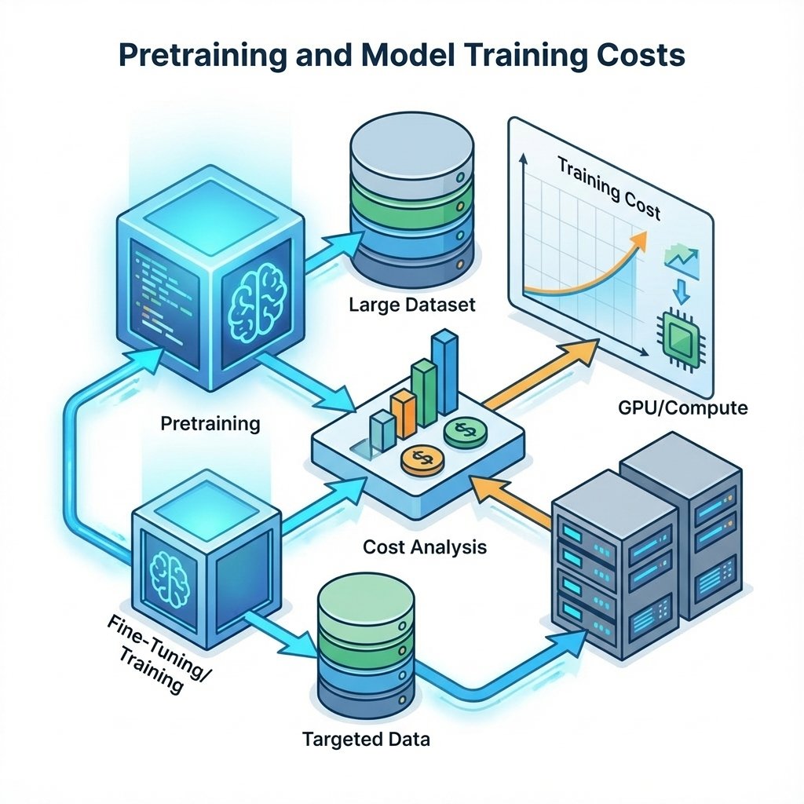

# 第 14 章：预训练：目标、边界与成本核算



> **本章核心主张**：在应用层，预训练（Pretraining）不是“炼丹”，而是“领域适配”（Domain Adaptation）。对 99% 的产品而言，预训练是成本最高、风险最大、迭代最慢的路径。你的第一任务不是怎么训，而是证明“为什么非训不可”。[44][37]

本章不谈万卡集群，只谈怎么做这笔投资决策。我们将建立一套冷酷的门禁机制：只有当 RAG、提示工程和流程优化都失效，且你付得起算力、数据清洗和维护成本时，预训练才被允许进入你的待办列表。[6][44]

## 你的交付物：一张“劝退”决策卡
读完本章，你必须能拿出一张可裁决的**预训练决策卡**。它不是一份 PPT，而是一份包含以下条款的“生死状”：
1.  **基线（Baseline）**：不训练时，RAG + Prompt 能做到多少分？（这是你的止损底线）。
2.  **门槛（Threshold）**：训练必须提升多少个点，才算覆盖成本？
3.  **守门（Guardrails）**：一旦发生隐私泄露、指令遗忘或幻觉激增，是否有自动熔断机制？
4.  **回滚（Rollback）**：新模型上线变砖，能在几秒内切回旧版？

如果这一行填不出来，请直接合上本章，去做第 10 章的 RAG。[6]

!!! warning "术语校准"
    本章所指“预训练”，主要指在通用基座模型（Base Model）上进行的**持续预训练（Continued Pretraining）**或**领域自适应预训练（Domain-Adaptive Pretraining）**，目的是注入领域知识或对齐特定格式，而非从零训练一个 LLM。

## 三层过滤：预训练的本质是“钞能力”还是“最后手段”？

不要用“提升体验”这种虚词来立项。预训练是投资，必须算账。

### 第 1 层：先找便宜替代品（RAG/Prompt）
预训练能解决的问题，往往比你想象的少。
*   **缺知识？** 训练很难实时更新，且容易产生顽固幻觉。用 **RAG**（第 10 章）外挂知识库更便宜、更准确。[24]
*   **缺遵循？** 模型不按格式输出？先试 **Few-Shot Prompting**（第 3 章）或 **结构化输出模式**。
*   **缺逻辑？** 任务太复杂？用 **Agent**（第 10 章）拆解步骤，让它调用工具。

**什么时候才轮到预训练？**
*   **领域语言极度特化**：满屏全是医疗缩写、法律黑话、古文或私有代码库，通用模型读不懂上下文。
*   **格式要求极度严苛**：必须输出某种怪异的 JSON 结构，且 Prompt 写了几千字还是偶尔出错。
*   **知识内化于直觉**：需要模型像老专家一样由直觉判断（如审美、语感、风险嗅觉），难以用规则显式描述。[37]

### 第 2 层：数据这关你过得去吗？
垃圾进，垃圾出（GIGO）。预训练对数据的要求比 RAG 高两个数量级。
*   **量级**：你有几亿 token 的高质量领域语料吗？几千条数据是做微调（SFT）用的，不是预训练。
*   **版权**：这些数据你能商用吗？把客户数据喂进模型，是否违反了隐私协议？
*   **清洗**：你有能力清洗掉 PII（个人敏感信息）、乱码和错误知识吗？否则你只是在教模型说胡话。

### 第 3 层：你敢写“止损线”吗？
即使是大厂，预训练失败率也很高。你必须预设：
*   **预算上限**：烧掉 1000 美元还没效果，停不停？
*   **时间上限**：调参 2 周还没收敛，停不停？
*   **退化红线**：通用能力（如闲聊、逻辑）下降超过 5%，必须回滚。[6]

## 决策图谱：先便宜，后昂贵

这是你的决策逻辑，请把这个 ASCII 流程图打印贴在墙上。

```text
输入：业务痛点（如：合同条款抽取准确率低）
  ↓
0. 定义指标与数据集
  - 有无“金标准”评测集？
  - 无 → [停止] 先去标数据，没尺子量什么身高？
  ↓
1. 便宜方案极限测试
  - 优化 Prompt + RAG + 流程拆解
  - 达标？ → [结束] 恭喜省钱了
  - 不达标 → 进入下一步
  ↓
2. 数据审计
  - 有足够且合规的领域语料？
  - 否 → [停止] 巧妇难为无米之炊
  ↓
3. 基线锁定（Baseline）
  - 记录便宜方案的指标（如 F1=0.85）
  ↓
4. 小规模验证（Pilot）
  - 拿 1% 数据跑几个 Epoch
  - Loss 下降？下游任务有提升趋势？
  - 否 → [止损] 数据质量有问题或方法不对
  ↓
5. 全量训练 & 守门测试
  - 训练后通用能力（指令遵循、安全性）是否退化？
  - 是 → [熔断] 调整配比或回滚
  - 否 → [上线灰度]
```

## 实战模板：预训练决策卡（Pretrain Decision Card）

这是本章的核心交付物。不要口头汇报，填好这张卡，用脚本校验它。

### 1. 决策卡结构（JSON 格式）
把它存为 `pretrain_card.json`。

```json
{
  "project_name": "legal_contract_embedding_adapt",
  "goal": {
    "description": "提升特种租赁合同的条款识别率",
    "primary_metric": "extraction_f1",
    "target_value": 0.92
  },
  "baseline": {
    "description": "GPT-4o + RAG + 5-shot",
    "metric_value": 0.86,
    "reproducible_script": "scripts/eval_baseline.py"
  },
  "data": {
    "source": "internal_legal_archive_v2",
    "token_count": "500M",
    "pii_scrubbed": true,
    "license_cleared": true
  },
  "budget": {
    "max_gpu_hours": 100,
    "max_cost_usd": 500,
    "provider": "aws_sagemaker"
  },
  "guardrails": {
    "general_chat_degradation_max": 0.05,
    "security_refusal_rate_min": 0.99,
    "pii_leakage_max": 0.0
  },
  "stop_loss": {
    "condition": "loss_curve_plateau_steps > 1000 OR validation_metric_drop > 0.1",
    "action": "abort_and_rollback"
  }
}
```

### 2. 自动化校验脚本
写一个简单的 Python 脚本 `validate_card.py`，确保在动手烧钱前，你的逻辑是闭环的。

```python
# validate_card.py
import json
import sys
from pathlib import Path

def validate_pretrain_decision(card_path):
    try:
        with open(card_path, 'r') as f:
            card = json.load(f)
    except FileNotFoundError:
        print(f"Error: Card file '{card_path}' not found.")
        sys.exit(1)

    issues = []

    # 1. 检查基线与目标的收益比
    baseline = card.get("baseline", {}).get("metric_value", 0)
    target = card.get("goal", {}).get("target_value", 0)
    
    if target <= baseline:
        issues.append(f"❌ 目标收益 ({target}) 必须显著高于基线 ({baseline})，否则不值得训练。")
    
    gain = target - baseline
    if gain < 0.02 and gain > 0: # 假设 2% 是最小收益阈值
        issues.append(f"⚠️ 预期收益 ({gain:.2f}) 过低，建议复核 ROI。")

    # 2. 检查守门指标
    guards = card.get("guardrails", {})
    if guards.get("pii_leakage_max", 1.0) > 0.001: # 允许极低容错
         issues.append("❌ PII 泄露容忍度必须接近 0。")

    # 3. 检查数据合规
    data_cfg = card.get("data", {})
    if not data_cfg.get("pii_scrubbed"):
        issues.append("❌ 数据未声明已脱敏 (pii_scrubbed: false)。")
    if not data_cfg.get("license_cleared"):
        issues.append("❌ 数据未声明版权合规 (license_cleared: false)。")
        
    # 4. 检查预算
    budget = card.get("budget", {})
    if budget.get("max_cost_usd", 0) <= 0:
        issues.append("❌ 必须设置明确的预算上限。")

    if issues:
        print("🛑 决策卡校验失败：")
        for i in issues:
            print(i)
        sys.exit(1)
    else:
        print(f"✅ 决策卡通过校验。预期提升: {gain:.2f}。去跑 Pilot 吧。")

if __name__ == "__main__":
    validate_pretrain_decision("pretrain_card.json")
```

**验证命令：**
```bash
# 1. 创建测试文件
echo '{"goal": {"target_value": 0.9},"baseline": {"metric_value": 0.85},"data": {"pii_scrubbed": true, "license_cleared": true},"budget": {"max_cost_usd": 100}}' > pretrain_card.json

# 2. 运行校验
python3 validate_card.py
```

## 成本核算：不要只算 GPU 钱

新手往往只盯着 `GPU 租金` 看，这是典型的财务盲区。真实的成本账本至少包含五项：

| 成本项 | 隐形大坑 | 估算公式 |
| :--- | :--- | :--- |
| **显性算力** | 忘了算存储、数据传输费、实验失败重跑的费用。 | `(Token量 / 吞吐量) × 显卡单价 × 1.5倍冗余` |
| **数据工程** | 清洗、去重、脱敏通常占据 70% 的工程时间。 | `数据工程师时薪 × 人天 × 2` |
| **机会成本** | 团队死磕训练的 3 个月，产品没功能更新，用户流失了。 | `(延期导致的预期收入损失)` |
| **运维债** | 自有模型需要自己部署、扩缩容、修 Bug，不像 API 那么省心。 | `SRE 人力 + 长期推理资源溢价` |
| **合规风险** | 模型吐露了训练集里的敏感数据，导致法务罚款。 | `无法估量 (一票否决)` |

**极简估算原则**：先跑 **Pilot**（小规模实验）。
1.  取 1% 数据，租一台 8 卡机器跑 2 小时。
2.  看 Loss 下降曲线和 eval 指标。
3.  如果不收敛或提升微乎其微，直接止损。这一百块钱是最好的学费。

## 评测先行：没有对比，就没有伤害

预训练的验收标准不是 Loss 曲线，而是 **“训练后 vs 训练前”的对比报告**。

### 1. 必须有的三组数据集
*   **目标任务集**：你要解决的那个问题（如：合同提取）。
*   **通用能力集**：MMLU、GSM8K 或你自己构建的通用指令集。用于检测模型是不是变笨了（Catastrophic Forgetting）。
*   **安全守门集**：诱导攻击、PII 探测。用于检测模型是不是变坏了。

### 2. 报告怎么写
不要贴 TensorBoard 截图，老板看不懂。给一张 **红绿灯对比表**：

| 任务维度 | 基线 (RAG) | 预训练 v1 | 变化 | 结论 |
| :--- | :--- | :--- | :--- | :--- |
| **合同条款提取 (F1)** | 0.86 | 0.91 | <span style="color:green">▲ 5%</span> | **达标** |
| **通用对话流畅度** | 4.8/5.0 | 4.7/5.0 | <span style="color:gray">▼ 0.1</span> | 可接受 |
| **指令遵循能力** | 95% | 88% | <span style="color:red">▼ 7%</span> | **警报：严重退化** |
| **PII 泄露率** | 0% | 0.02% | <span style="color:red">▲ 0.02%</span> | **阻断：必须回滚** |

## 常见陷阱（Post-Mortem）

*   **陷阱一：拿着锤子找钉子。**
    *   *现象*：团队有人想刷简历，强行上预训练，最后效果不如改两行 Prompt。
    *   *解法*：严格执行第 1 层过滤，必须证明 RAG 无效。
*   **陷阱二：数据污染。**
    *   *现象*：评测集混进了训练集，分数高得离谱，上线一跑全是幻觉。
    *   *解法*：数据切分时做严苛的去重（De-duplication），并在训练前做 **Decontamination** 检查。
*   **陷阱三：过拟合（Overfitting）。**
    *   *现象*：领域任务无敌，但模型只会这一种句式，稍微变个问法就傻了。
    *   *解法*：在领域数据中混入 10%-20% 的通用高质量语料（Replay Data）一起训练，保持模型的通用智商。[37]

## 交付物清单
1.  **预训练决策卡**（JSON，含止损线）。[44]
2.  **基线评测报告**（证明不训练确实不行）。[6]
3.  **对比验收报告**（证明训练确实有用且无害）。
4.  **回滚预案**（一键切回旧模型）。

## 下一章
如果预训练这关你真的过了，并且拿到了一个懂领域知识的 Base Model，接下来怎么让它听话、好用、安全？下一章我们讲 **后训练（Post-training）**：SFT、RLHF 与对齐的艺术。
见：[15-posttrain-rl.md](15-posttrain-rl.md)。

---
**参考**
详见本书统一参考文献列表：[references.md](references.md)。

### 图片配置（Image Configuration）

<!--
image_prompt: "A minimalist conceptual diagram showing a data filtering funnel. Raw chaotic data at the top, passing through three filter layers labeled 'RAG Check', 'Data Audit', 'Budget Gate', resulting in a clean, small stream of 'Approved for Training' data. High contrast, technical drawing style."
negative_prompt: "text, messy, realistic photos, people, complex background, 3d render"
params: "--ar 16:9 --v 6.0"
-->

<!--
image_prompt: "A split-screen comparison visualization. Left side: a stable, rigid geometric structure representing the Baseline. Right side: a fluid, evolving organic structure representing the Pretrained Model, growing but slightly unstable. Connected by measurement lines."
negative_prompt: "text, numbers, charts, excel, cluttered"
params: "--ar 16:9 --v 6.0"
-->
