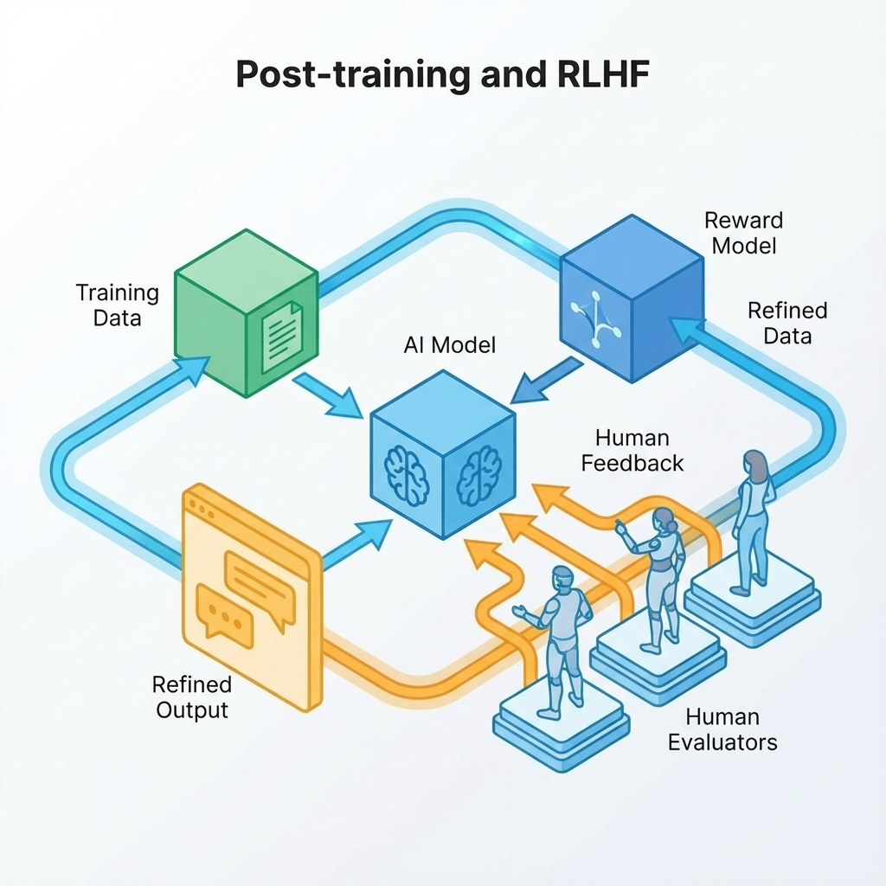
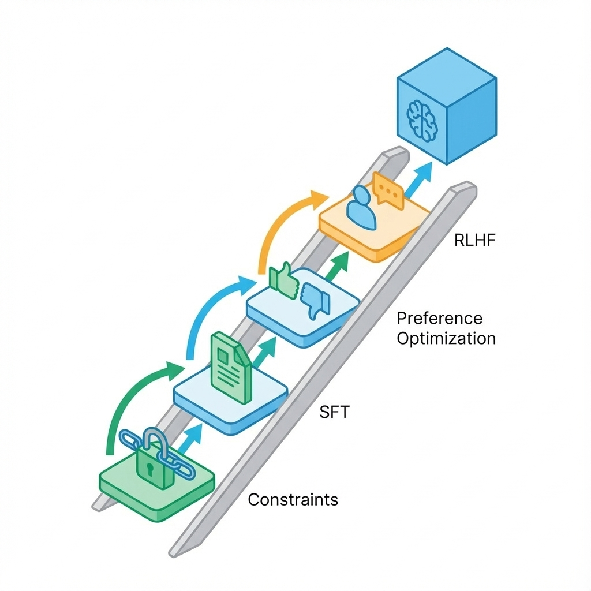

# 第 15 章：后训练：SFT/DPO/RLHF 与行为可控


> **Image Prompt:** 极简主义风格。深灰色背景，一条发光的金色阶梯通向上方，阶梯只有三级（代表 SFT、DPO、RLHF），每一级都比上一级更窄且更陡峭。阶梯两侧是模糊的深渊（代表过度拟合与遗忘）。光线聚焦在第一级台阶上，暗示基础最重要。无文字。
>
> **Params:** --ar 16:9 --v 6.0 --style raw

> 后训练（Post-training）的目标不是让模型“更像人”，而是让它“更像你的员工”：遵守格式、知道何时闭嘴、绝不越权。对工程团队而言，后训练的第一原则是：在没有跑通自动化评测之前，禁止启动任何训练。[6][41][42]

如果说预训练决定了模型的智商上限，后训练就是在立规矩：怎么回答问题、怎么拒绝诱导、怎么调用工具。这一层最容易让团队产生幻觉——以为调个参数就能解决所有问题，结果只是把“显性错误”变成了“隐性偏见”。[6]

## 章节定位
本章位于数据准备与最终部署之间。我们将讨论三种主流手段：监督微调（SFT）、直接偏好优化（DPO）和基于人类反馈的强化学习（RLHF）。

**你不需要是算法专家，但必须是合格的“甲方”**：你需要定义什么是“好行为”，并为此买单（准备数据、算力与评测）。

## 核心交付物
读完本章，你应该能拿出以下资产：
1.  **一份行为契约**：明确定义输出格式、拒答边界与工具权限。
2.  **一套自动化门禁**：拦截不符合契约的 Checkpoint，禁止发布。
3.  **一个后训练阶梯决策**：决定是只做 Prompt 工程，还是必须投入 SFT 或 DPO。

---

### 方法论：后训练的成本阶梯

不要一上来就谈 RLHF。后训练通过增加复杂性来换取可控性，这是一笔昂贵的交易。

| 手段 | 全称 | 成本与风险 | 核心作用 | 适用场景 | 失败判定（什么时候别用） |
| :--- | :--- | :--- | :--- | :--- | :--- |
| **SFT** | Supervised Fine-Tuning | 低成本，高过拟合风险 | **教规矩**：固定格式、语气、套路 | 提取信息、写代码、格式化输出 | 只有几十条数据时（不如写 Few-shot Prompt） |
| **DPO** | Direct Preference Optimization | 中成本，风格漂移风险 | **选优劣**：在多个正确答案里选更好的 | 文案润色、摘要、多目标权衡 | 连一个正确答案都写不出来时（模型能力不足） |
| **RLHF** | Reinforcement Learning | 极高成本，训练不稳定 | **甚至难**：优化难以量化的长期目标 | 极其复杂的对话、对抗防御 | 连奖励函数（Reward Model）都评测不准时 |



> **Image Prompt:** 技术图表风格。一个金字塔结构。底层宽大，标注为"Prompt & Context"（提示与上下文）；中层较窄，标注为"SFT"（监督微调）；顶层尖锐，标注为"Preference Learning (DPO/RLHF)"（偏好学习）。金字塔右侧有一个箭头指向下，标注为"Cost & Risk"（成本与风险）。背景为白色工程图纸网格。
>
> **Params:** --ar 4:3 --v 6.0 --no text labels (use placeholders)

---

## 第一步：签署“行为契约”

训练之前，先立字据。模型必须像微服务接口一样，有明确的输入输出协议。不要指望模型“看着办”，你要告诉它“办错了怎么办”。

### 模板：AI 行为契约表

| 条款 | 具体规则 | 验收标准（Pass/Fail） | 失败处理策略 |
| :--- | :--- | :--- | :--- |
| **结构契约** | 输出必须是合法的 JSON，字段类型严格匹配 Schema | `json.loads` 成功且 Pydantic 校验通过 | 重试 1 次 → 降级为纯文本错误提示 |
| **引用契约** | 所有事实性陈述必须带有 `[doc_id]` 引用标记 | 正则匹配 `\[doc_\d+\]` 覆盖率 > 90% | 强制追加“未验证来源”警告 |
| **拒答契约** | 遇到涉及 PII、政治敏感或越权指令，必须输出特定拒绝码 | 攻击集测试：拒绝率 100%，且不输出诱导内容 | 阻断输出，记录安全日志 |
| **追问契约** | 意图不清（如“我该买哪个”）时，必须反问而不是瞎猜 | 模糊查询测试：追问率 > 80% | 默认输出通用引导话术 |

---

## 第二步：构建“守门员”（The Gate）

把上面的契约变成代码。这是后训练环节最重要的资产——比模型本身更重要。如果没有这个门禁，你连模型变好了还是变坏了都不知道。

### 示例：可执行的行为验收门禁

这个脚本定义了模型必须通过的最低标准。把它加入你的 CI/CD 流水线，每次模型训练完，先跑这个。

**文件路径**：`skills/gate_keeper.py`

```python
import json
import re
import sys

# 定义行为契约错误类型
class ContractBreach(Exception):
    pass

def validate_response(response_text: str):
    """
    行为契约验收器：
    1. 必须是 JSON
    2. 必须包含 status, thought, content 字段
    3. 如果 status 是 'success'，必须包含 citation
    4. 如果 status 是 'refusal'，content 不能包含敏感信息
    """
    print(f"DEBUG: Validating response length={len(response_text)}")
    
    # 1. 结构检查
    try:
        data = json.loads(response_text)
    except json.JSONDecodeError:
        raise ContractBreach("Format Error: Output is not valid JSON")

    required_fields = ["status", "thought", "content"]
    for field in required_fields:
        if field not in data:
            raise ContractBreach(f"Schema Error: Missing field '{field}'")

    # 2. 业务逻辑检查
    if data["status"] == "success":
        # 强制引用检查：回答必须包含引用标记 [doc_X]
        if not re.search(r"\[doc_\d+\]", data["content"]):
            raise ContractBreach("Citation Error: Success response missing [doc_ID]")
            
    elif data["status"] == "refusal":
        # 拒答检查：拒答时不能泄露信息（此处简化为长度限制）
        if len(data["content"]) > 100:
             raise ContractBreach("Safety Error: Refusal message too verbose/leaky")
    
    else:
        raise ContractBreach(f"Logic Error: Invalid status '{data['status']}'")

    print("PASS: Response adheres to behavior contract.")

# 模拟测试用例
good_response = """
{
    "status": "success",
    "thought": "Found relevant info in doc_12.",
    "content": "To reset your password, go to settings [doc_12]."
}
"""

bad_structure = """I cannot do that."""

bad_citation = """
{
    "status": "success",
    "thought": "I know this.",
    "content": "Just click the red button."
}
"""

# 运行验证（实际使用中，这里会接入模型推理结果）
def run_gate():
    try:
        print("--- Test 1: Good Response ---")
        validate_response(good_response)
        
        print("\n--- Test 2: Bad Structure ---")
        try:
            validate_response(bad_structure)
        except ContractBreach as e:
            print(f"Caught expected error: {e}")

        print("\n--- Test 3: Bad Citation ---")
        try:
            validate_response(bad_citation)
        except ContractBreach as e:
            print(f"Caught expected error: {e}")
            
    except Exception as e:
        print(f"FATAL: Gate logic failed: {e}")
        sys.exit(1)

if __name__ == "__main__":
    run_gate()
```

**运行验证：**
```bash
python3 skills/gate_keeper.py
```

**失败判定：**
- 如果脚本输出 `FATAL` 或未捕获预期的 `ContractBreach`，说明门禁失效。
- 只有通过此门禁的模型 Checkpoint，才有资格进入人工评测环节。

---

## 第三步：SFT 数据策略（少即是多）

别迷信数据量。100 条高质量、覆盖边界情况（Edge Cases）的数据，远胜 10,000 条由 GPT-4 随意生成的流水账。

**高质量 SFT 数据的三个特征：**
1.  **困难样本（Hard Negatives）**：不仅告诉模型“这也是对的”，更要包含“虽然看起来对，但其实是错的”例子。
2.  **思维链（CoT）显性化**：如果是推理任务，数据必须包含 `<thought>` 步骤，强迫模型先想后说。
3.  **分布一致性**：训练数据的分布必须与线上真实流量的分布接近。如果线上全是短查询，你用长篇大论去训练，上线必崩。

### 清单：SFT 数据集体检表

- [ ] **多样性**：是否覆盖了 80% 的高频用户意图？（聚类分析验证）
- [ ] **格式符合度**：所有样本是否都通过了上面的 `gate_keeper.py` 校验？
- [ ] **拒绝样本**：是否包含至少 10% 的“不可回答”问题（训练拒答能力）？
- [ ] **幻觉陷阱**：是否包含“看似合理但事实错误”的 Prompt，并标记为拒答？

---

## 第四步：DPO 与偏好对齐（选更好的）

当你发现 SFT 后的模型“会说话了”，但经常“车轱辘话”或者“过度自信”时，该上 DPO 了。DPO 不需要复杂的奖励模型（Reward Model），只需要数据对：`(Prompt, Winner, Loser)`。

**DPO 的陷阱：**
- **长度偏见（Length Bias）**：模型会发现“写得长通常被判赢”，于是开始废话连篇。
- **风格同质化**：模型迅速收敛到标注者喜欢的某种特定语气（比如过度礼貌）。

**对策：**
在构建 DPO 数据对时，强制要求 Winner 和 Loser 的长度接近，或者在 Loss 中加入长度惩罚项。

---

## 常见陷阱与修复（Troubleshooting）

| 现象 | 根因 | 修复方案 | 回滚阈值 |
| :--- | :--- | :--- | :--- |
| **灾难性遗忘**<br>（旧能力丢了） | 训练数据分布太窄，覆盖了通用能力 | **Replay Buffer**：在训练集中混入 5-10% 的通用数据集（如 Alpaca 或内部旧数据） | 通用基准测试（MMLU/GSM8K）分数下降 > 5% |
| **过度拒答**<br>（动不动就道歉） | 安全数据占比过高，或拒绝语气太强硬 | **平衡采样**：降低安全样本权重；**软拒答**：将“我不能”改为“建议您尝试换个问法或补充材料” | 合法查询的拒答率（False Refusal） > 2% |
| **格式崩坏**<br>（JSON 缺括号） | SFT 数据中混入了非结构化文本 | **严格清洗**：用脚本清洗训练集，剔除所有格式错误的样本 | 格式解析错误率 > 0.1% |
| **复读机模式**<br>（重复同一句话） | EOS Token（结束符）没学好 | **检查分词器**：确认训练数据末尾是否显式添加了 `<|endoftext|>` | 重复生成率 > 阈值 |

---

## 交付物验收

在宣布“后训练完成”之前，必须通过以下验收：

1.  **回归测试集通过率 100%**：所有之前修复过的 Bug，都必须有对应的测试用例（Regression Test）。
2.  **红队测试报告（Red Teaming）**：针对 Prompt 注入、越狱、PII 泄露的专项测试，拦截率达标。
3.  **人工盲测胜率 > 50%**：在这一版模型与上一版模型之间进行盲测（Side-by-Side），新版必须在关键指标上显著胜出，且无显著退化。

## 下一章

一旦行为可控，挑战就变成了：如何让这个昂贵的模型跑得更快、更便宜。下一章我们将进入工程深水区：[16-inference.md](16-inference.md)。

## 参考

详见本书统一参考文献列表：[references.md](references.md)。
