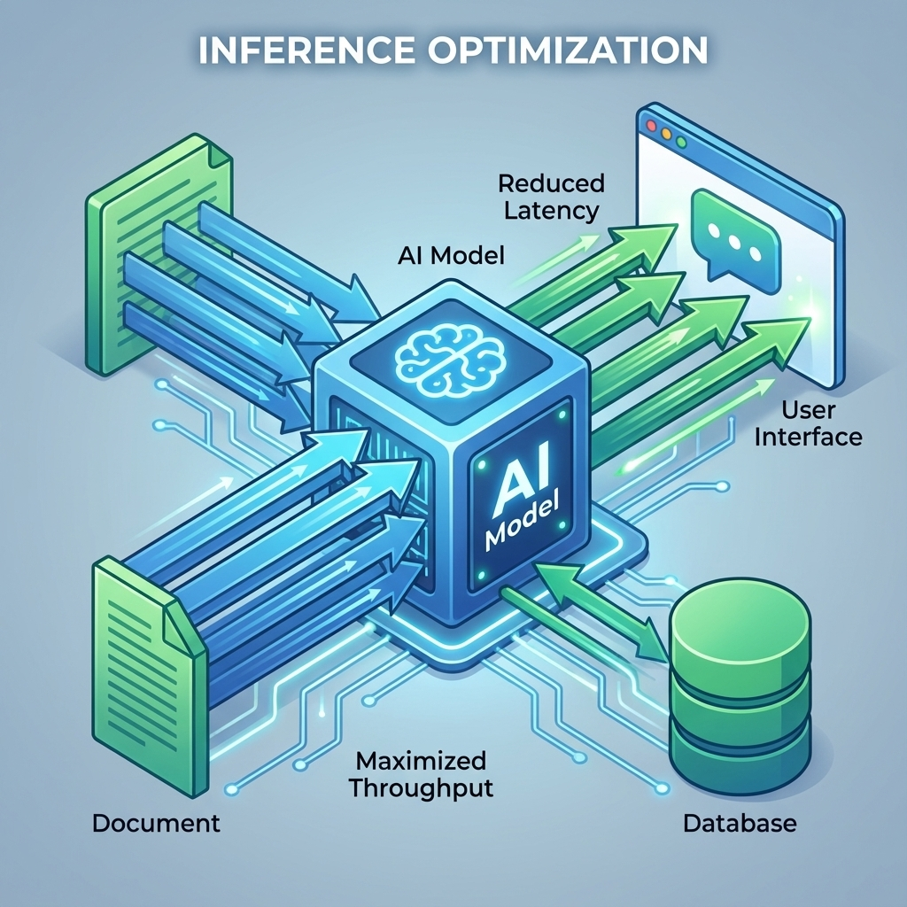
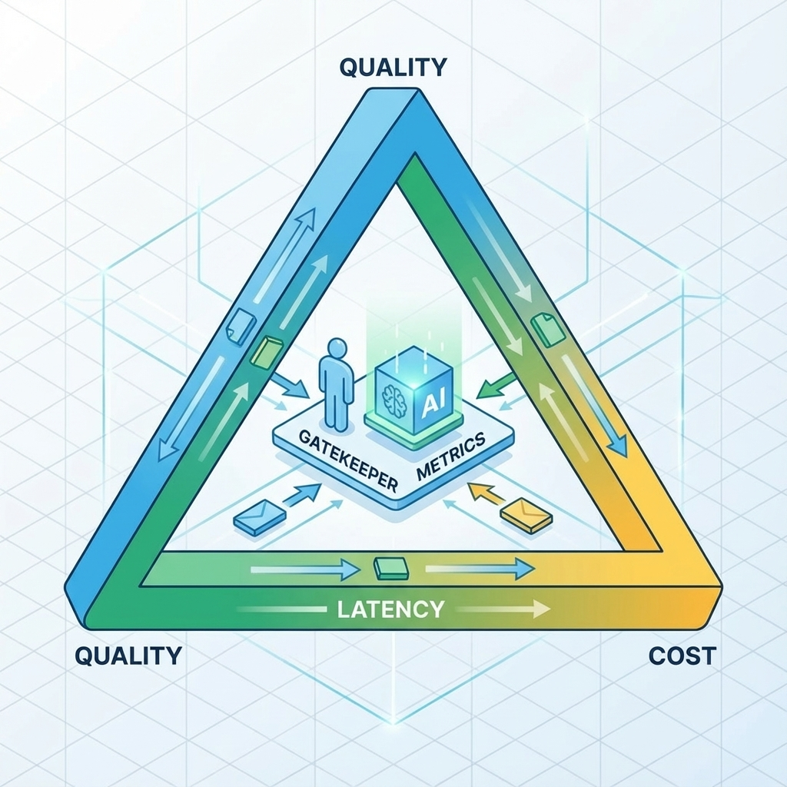
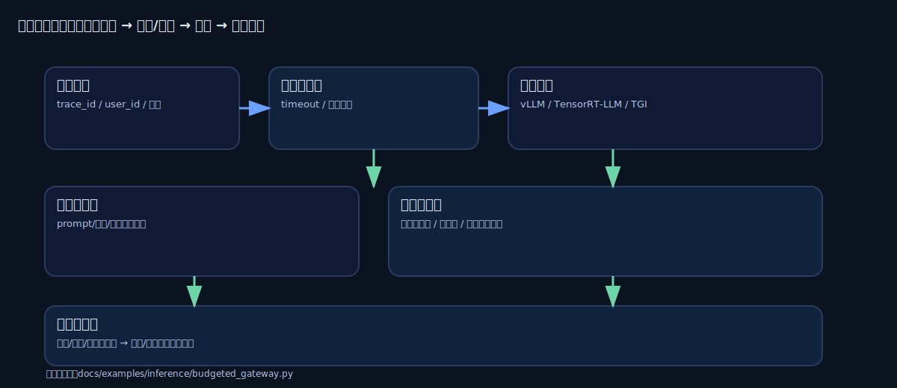

# 第 16 章：推理优化：延迟、吞吐与成本的三角形


> 推理优化的本质不是跑得更快，而是在质量、延迟、成本之间建立可裁决的取舍：你知道为了哪一点牺牲哪一点，并且退化时能回滚。[6][44]

在 AI 产品里，推理是现金流的闸门：它决定你每一次交互的成本上限，也决定用户是否愿意把它纳入日常工作流。你可以允许偶尔不够聪明，但很难允许经常很慢或经常很贵。[6]

## 章节定位
本章承接后训练，讨论上线推理的优化策略与治理方式：如何建立基线、如何定位瓶颈、如何用预算与降级守住底线。它不假设你必须自部署模型；同样适用于托管推理，只是控制点不同。[44]

## 你将收获什么
- 一张推理三角形：质量/延迟/成本的取舍框架与守门指标。[6]
- 一套优化顺序：先做最便宜的，再做最昂贵的，避免盲目上重武器。
- 一份推理预算与降级策略：让你在尖峰与退化时有退路。[6]

## 三层思考：推理优化是一门治理学
### 第 1 层：读者目标
你要获得可预测的体验与成本：用户等待可接受，账单可解释，退化可回滚。

### 第 2 层：论证链条
推理优化链条是：

基线与口径 → 瓶颈定位 → 低成本优化 → 预算与降级 → 灰度与回滚 → 持续回归

缺基线与口径，任何优化都是不可裁决的。[6]

### 第 3 层：落地与验收
验收必须包含对比表：
- 质量是否达标（且不退化）；
- P95 延迟是否达标；
- 单次成本是否在预算内；
- 守门指标是否越界（错误率、超时率）。[6]

## 推理三角形：先把取舍写清楚


### 推理取舍卡

| 维度 | 你要写清楚 |
| --- | --- |
| 质量目标 | 哪些任务必须准确，哪些允许降级 |
| 延迟目标 | P50/P95 目标与超时策略 |
| 成本目标 | 单次/日/租户预算与止损线 |
| 守门指标 | 错误率、超时率、拒答率阈值 |
| 回滚 | 退化时如何回到上一策略 |

## 基线与口径：先回答三件事（否则任何优化都不可裁决）
推理优化最常见的假努力是：你做了很多事情（换模型、调参数、加缓存），但你无法清楚回答到底变好了什么。要避免这种情况，你只需要在开始前强迫自己回答三件事：

1) **用户到底在等什么？**  
如果是流式输出，用户体感往往由首屏速度决定：多久看到第一段可用信息；之后的生成速度是否稳定。你不需要一开始就追求极致指标，但必须把它写成口径（例如：首段可见的等待、以及后续输出的稳定性）。[6]

2) **钱到底花在了哪里？**  
成本不是抽象的模型很贵，而是可分解的：输入 token、输出 token、工具调用次数、重试与回退、缓存命中率。只有当你能把账单分摊到这些可控变量上，预算与降级才不是拍脑袋。[6]

3) **退化到底算什么？**  
对推理系统来说，更差不只是不准确：更慢、更贵、更容易超时、拒答更糟、越权风险更高，都算退化。把退化写成守门指标，才能让优化进入交付系统，而不是进入辩论系统。[6]

### 一个可落地的口径清单（从最小到可扩展）
你不需要一开始就上完整的压测与统计分析，但建议至少把下面这些字段跑通闭环（先能看见，再谈优化）：[6]
- 延迟：整体延迟（尤其是 P95），以及排队/上游/模型生成是否能被拆开；
- Token：`tokens_in/tokens_out`（或等价口径），用于解释成本与速度；
- 失败：超时/5xx/重试次数（以及失败时走了哪条降级路径）；
- 复用：缓存命中率（命中与未命中的延迟/成本差异）；
- 版本：`model_version/prompt_version/index_version`（把变化与行为绑定）。[6]

### 预算怎么定：不要先写数字，先写护栏
很多人卡在我不知道阈值该写多少。但阈值不是凭空定出来的，它来自两个事实：
- **基线**：你现在的系统在真实分布下是什么样（哪怕是粗略的）；
- **护栏**：你愿意接受的最坏情况是什么（超过就必须止损）。[6]

实操上可以按这个顺序推进（避免空谈）：
1) 先用当前实现跑出一版可重复的基线（同一批样本、同一套口径、同一份报告）。  
2) 用基线把预算写成相对变化：例如：P95 明显上升就暂停/回滚，单位成本持续上升就降级。  
3) 只对你最在乎的那条链路写硬护栏：核心入口的延迟/错误/成本越界必须触发动作；其他先观察。  
4) 每次变更只允许改变一件事：否则你永远无法解释是什么造成了变化。[6]

## 优化顺序：先做最便宜的
### 1) 输入与上下文：减少没必要的 token
很多成本来自把上下文塞满。先做三件事：
- 只带必要上下文（围绕当前任务）；
- 统一输出合同，减少解释性啰嗦；
- 对重复内容做摘要与缓存（尤其是长对话）。[6]

### 2) 缓存与复用：把重复请求变成命中
对 0→1 产品来说，最划算的提速往往来自复用：
- 同样输入的结果缓存（短期缓存）
- 检索结果缓存（RAG 场景）
- 工具调用结果缓存（可审计且有过期策略）[6]

### 3) 并发与降级：尖峰时先保底
尖峰时的策略不是硬顶，而是可控降级：
- 先降级高成本路径（减少工具调用、减少重排、缩短上下文）
- 再限流（按用户/租户预算）
- 最后拒绝服务（明确提示与恢复入口）[6]

### 4) 模型与推理策略：最后才上重武器
更换模型、量化、并行推理等往往收益大，但也更复杂。对个人而言，只有当你已经把口径、回归、回滚建立起来，才值得进入这一层。[44]

## 推理引擎：把吞吐当作工程问题
当你的业务进入稳定迭代期，推理优化很快会从 prompt 改动变成系统工程：显存、调度、批处理策略决定了你每秒能服务多少并发、能把单位成本压到多低。不同引擎的差异，往往不在能不能跑，而在真实并发与长短混合请求下是否稳定、是否可解释。[45][46][49]



### 推理引擎选型卡

| 维度 | 你要写清楚 |
| --- | --- |
| 目标 | 优先吞吐还是优先延迟（TTFT/TPOT） |
| 负载形态 | 长短请求比例、并发峰值、是否一问多答 |
| 约束 | GPU 型号/显存、CPU 核数、网络带宽 |
| 失败模式 | OOM/超时/排队、退化如何降级 |
| 运维 | 可观测字段、压测口径、回滚路径 |

### vLLM：显存利用率决定吞吐上限
很多场景的瓶颈不是算力，而是显存（尤其是 KV Cache）。vLLM 的核心价值是把 KV Cache 做成按需分页的管理方式，减少碎片与预分配浪费，让同样的显存承载更多并发请求，从而提升吞吐。[45]

你可以把它理解成：当并发上来以后，**显存管理就是吞吐量**。因此，在你已经把口径/压测/回滚建立起来后，把后端替换到更擅长显存管理与调度的推理栈，往往比继续抠 prompt 更划算。[45]

### TensorRT-LLM：极致性能派（但要付工程成本）
如果你的主要战场是 NVIDIA GPU 且对性能极致敏感，TensorRT-LLM 提供了更工程化的优化空间：算子融合、KV Cache 策略、动态批处理（Inflight Batching）等组合拳，目标是同时守住延迟与吞吐。[46]

但它也会把你带入一个现实约束：推理引擎与构建产物对硬件/驱动/版本高度敏感，构建成本与迁移成本需要提前纳入交付系统（制品管理、版本锁定、回退路径）。[46]

### TGI：把推理服务当可运维产品来运行
当你不想把精力都花在自研服务框架上，TGI 提供的是服务化能力：并发、流式输出、基础运维接口、与生态的对接能力。它适合把推理服务快速推到可运营的状态，再在性能上逐步迭代。[49]

## 一个能跑的最小推理网关（Python）：预算、缓存、并发上限

### 为什么现在就该做它？
很多团队都是在流量上来后才补推理网关：用户开始抱怨卡顿、偶发超时拖死队列、账单突然翻倍。那时再去补预算、并发闸门、缓存与指标，往往要在事故里边修边学。

更稳的做法是：从第一天就把这些护栏做成一层最小网关。你的业务只需要对着一个 `/chat` 发请求；网关负责把请求纳入预算、并发与缓存，并把关键指标暴露出来。这样你每次优化都能回答：到底快了多少、贵了多少、退化发生在哪一段。

你不必一上来就自建推理栈：这个网关同样可以放在托管推理前面。等你未来切换到 vLLM/TensorRT-LLM/TGI，只是在网关后面换引擎，前面的口径、预算和回滚不用推倒重来。

本仓库提供了一个标准库实现（零第三方依赖）：

- 代码：`docs/examples/inference/budgeted_gateway.py`
- 功能：`/chat`（生成）、`/metrics`（Prometheus 文本）、`/healthz`（健康检查）

### 理解核心护栏如何协同工作
这个最小网关只做四件事，但足够把感觉变成口径：

1. **预算（Budget）**：每个请求带 `budget_ms`，超时就走降级/兜底，避免慢请求拖垮队列，也把单次成本锁在上限内。
2. **并发闸门（Concurrency Limit）**：限制同时处理的请求数；峰值时返回 `429`，把过载从 OOM/雪崩变成可预期的限流与恢复。
3. **缓存（Caching）**：对重复请求做短期缓存；命中就省一次模型钱，也省一次等待。
4. **可观测（Observability）**：把预算耗尽次数、inflight、缓存命中、错误率、延迟等用 `/metrics` 暴露出来，方便接入 Prometheus/Grafana。

### 先用 mock 跑通闭环（推荐）
在真实模型接入前，使用 `mock` 模式是验证网关逻辑、监控配置和应用集成的最佳实践。

```bash
python3 docs/examples/inference/budgeted_gateway.py --provider mock --port 8787
```

请求示例：

```bash
curl -sS -X POST http://127.0.0.1:8787/chat \
  -H 'content-type: application/json' \
  -H 'x-trace-id: demo-001' \
  -d '{"user_id":"u1","prompt":"给一个推理预算与降级的最小策略","budget_ms":1200}'
```

观察响应里的 trace_id，它能帮你把一次请求的链路串起来。重复的 prompt 会标记为 cached，说明缓存真的生效了。并发过高时，系统会返回 429，这种预防机制远比等到 OOM 再救火要划算。

### 接入 gemini（可选）
本机已配置好 gemini CLI 后，可以把 provider 切到 gemini，把模拟生成替换为真实调用。

```bash
python3 docs/examples/inference/budgeted_gateway.py --provider gemini --gemini-model gemini-2.5-flash
```

这个示例的核心价值不在于模型多强，而是帮你先把预算控制、并发保护和缓存这些地基搭好。地基稳了，后面再替换更强的推理后端就不会牵一发而动全身。[45][46][49]

### 下一步：将它接入你的项目
把网关当成独立服务跑起来，业务侧只负责调用它的 chat 接口，例如 http://127.0.0.1:8787/chat。你关心的是请求口径、预算和失败策略，而不是背后到底接了哪个模型。

之后再按你的瓶颈去加：更细的降级梯度、更严格的限流、分布式缓存、对接自部署引擎。做对的标志是业务代码几乎不用动，替换推理后端只发生在网关里。

## 量化：从省显存走到降成本
量化最容易被误用的点是：只看压缩率，不看链路是否真的变快。对于 LLM 推理这类访存密集型工作负载，4-bit 权重（W4A16）往往是非常现实的甜点，但只有当你的推理引擎与 kernel 真正支持这条路径时，省下来的显存才会转化为吞吐与成本优势。[48][59]

### GPTQ vs AWQ：两类常见 PTQ 路线
- GPTQ：典型的后训练量化路线之一，工程上常见于希望尽量不改训练流程，但想要较低精度权重的场景。[48]
- AWQ：更强调哪些权重值得被保护与工程可实现性，目标是在统一低比特格式下尽量保住效果，并对实际推理栈更友好。[59]

### 量化上线自查
- 量化目标清晰：是为了降成本、扩并发、还是为了端侧可运行（目标不同，策略不同）。[59]
- 引擎支持确认：推理栈是否原生支持目标量化格式与 kernel；否则可能省显存但不提速。[59]
- 校准集策略：用多样化校准数据做量化校准，避免只在单一领域看起来很准。[59]
- 评测口径齐全：除困惑度/离线指标外，必须在业务回归集上测可用性退化。[48][59]
- 回退可用：量化版本出问题能快速切回 FP16/FP8/上一版本（别把量化当成不可逆）。[46]

## 预算与降级：把止损写成默认行为
推理系统必须知道何时不该继续。建议你写三层预算：
- 单次预算：超过就降级或停止
- 用户或租户预算：超过就限流或提示升级
- 全局预算：尖峰时保护现金流与稳定性。[6]

### 预算与降级策略

| 触发条件 | 你观察什么 | 你怎么降级 | 何时回滚 |
| --- | --- | --- | --- |
| 单次超时 | latency 超阈值 | 缩短上下文/跳过某步 | 指标恢复 |
| 成本超预算 | cost 超阈值 | 切换低成本路径 | 次日重置/手动 |
| 错误率上升 | timeout/error 增加 | 限流/暂停高风险入口 | 回归通过 |

### 一个直觉：预算不是限制体验，而是保证体验
很多人听到预算会下意识反感：这不就是让系统更抠门、更不好用吗？但在推理系统里，预算更像是你给用户体验设定的护栏——它把最坏情况锁住，让系统不会在尖峰或异常时失控。

你可以用一个更日常的类比理解：高速公路的限速不是为了让你更慢，而是为了让所有人都能更稳定地到达。推理预算也是同样的逻辑：当少数请求非常慢、非常贵、或者在工具调用里不断兜圈时，预算会及时把它拉回到可控范围，让其他请求不被拖垮。[6]

### 一个可执行的降级梯度（从最温和到最强硬）
当预算触发时，最怕的是要么硬抗到底，要么直接拒绝。更稳的做法是准备一条渐进式的降级梯度：先保住可用性，再保住成本，最后才是拒绝服务。

### 降级梯度卡

| 阶段 | 触发信号 | 你怎么降级 | 你告诉用户什么 |
| --- | --- | --- | --- |
| 轻度 | P95 延迟上升 | 缩短上下文、减少解释性输出 | 我先给结论与下一步 |
| 中度 | 成本/超时趋近阈值 | 关闭高成本工具、减少重排/多路候选 | 我用更省时的路径完成 |
| 重度 | 错误率/排队上升 | 限流、只保关键链路 | 当前繁忙，请稍后重试 |
| 熔断 | 关键指标越界 | 回滚/切换兜底模型 | 已切换稳定模式 |

这张表的核心不是文案，而是让你在事故时能按表执行：你不需要临场辩论到底该不该降级，只需要看信号、执行动作、记录证据、回归验证。[6]

## 复现检查清单（本章最低门槛）
- 推理取舍卡已写：质量/延迟/成本/回滚清晰。[6]
- 有基线对比表：优化前/后同口径对比（质量、P95、成本）。[6]
- 有降级策略：尖峰与越界时系统能自动止损并可回滚。[6]

## 常见陷阱（失败样本）
1. **现象**：优化了延迟，但质量下降，用户反而流失。  
   **根因**：没有写清质量底线；缺少回归门禁。  
   **修复**：先定质量门槛与回归；不达标就回滚。[6]

2. **现象**：成本越来越高，却说不清为什么。  
   **根因**：没有预算与审计；上下文与工具调用不透明。  
   **修复**：把成本写进可观测字段；预算越界自动降级/止损。[6]

3. **现象**：尖峰时系统崩溃，恢复慢。  
   **根因**：没有降级与限流策略；把稳定性寄托在不会尖峰。  
   **修复**：先设计降级路径与止损线；尖峰先保底再恢复。[6]

## 交付物清单与验收标准
- 推理取舍卡与预算阈值。[6]
- 基线与对比表（质量/延迟/成本）。[6]
- 降级与止损策略（可触发、可回滚）。[6]
- 引擎选型卡与压测报告（至少覆盖一种真实并发与长短混合负载）。[45][46][49]
- 量化上线自查记录（引擎支持/校准集/回退路径/回归结果）。[48][59]

## 下一章
推理优化让系统跑得稳、跑得起。下一章进入部署与运维：如何灰度发布、监控退化、回滚与复盘，让系统长期健康。见：[`17-deployment.md`](17-deployment.md)。

## 参考
详见本书统一参考文献列表：[`references.md`](references.md)。
