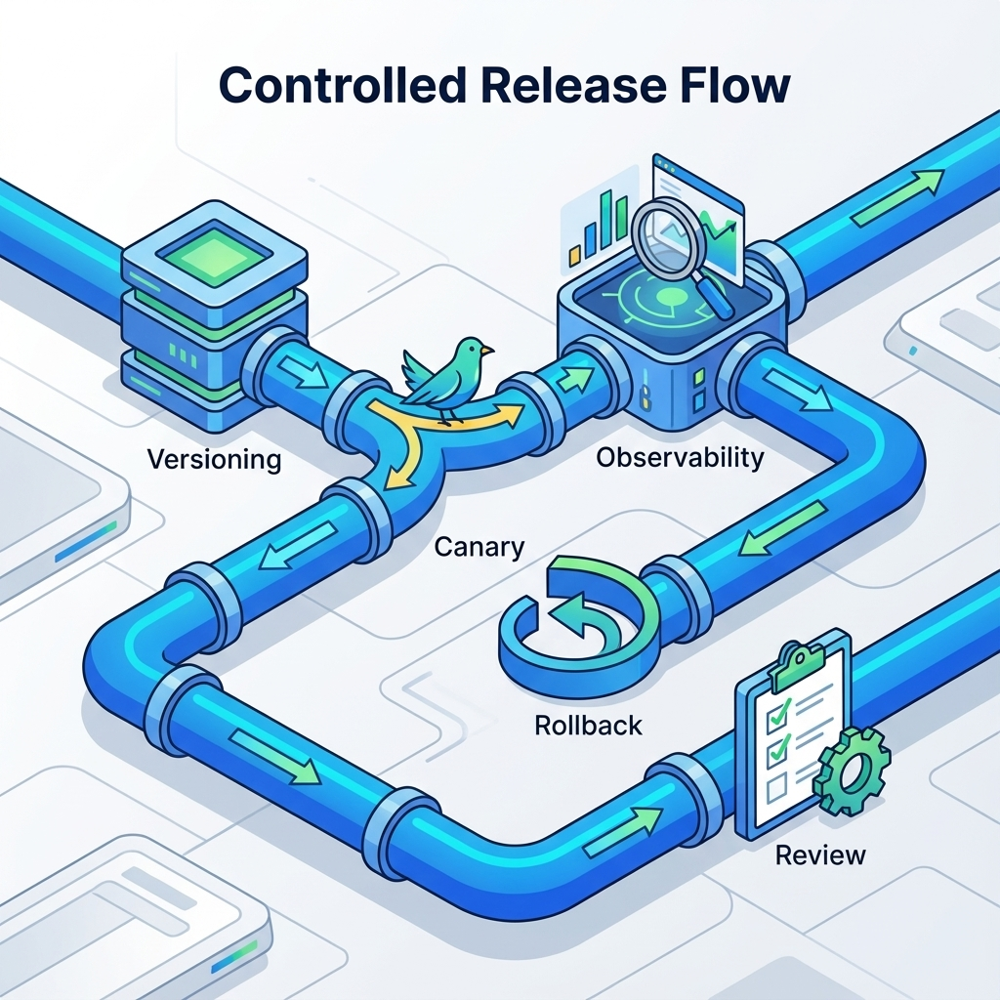
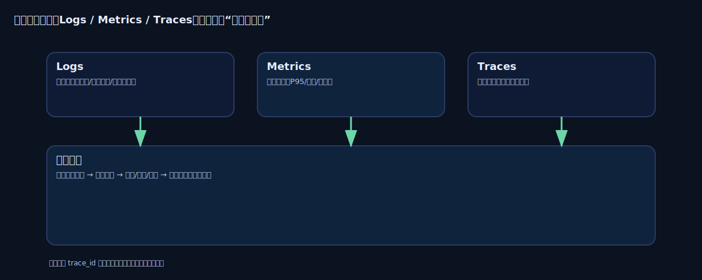

# 第 17 章：部署与运维：灰度、监控与回滚


> 上线不是“把版本推上去”，而是把不确定性纳入治理：你知道如何灰度、如何观测、如何回滚、如何复盘。没有回滚的发布，等价于赌博。[5][6]

AI 产品的运维挑战更尖锐：模型/提示/检索/工具任何一处变化都可能改变行为分布；你不只要监控错误率，还要监控质量、成本与风险面。把这些纳入发布门禁，你才能持续迭代而不被线上事故拖垮。[6]

## 章节定位
本章承接推理优化与评测门禁，讲“如何安全地发布与长期运行”：版本管理、灰度策略、监控口径、回滚与复盘。它的目标是让你在低资源条件下仍能建立“可控上线”的操作系统。[5]

## 你将收获什么
- 一套发布策略：从小流量灰度到全量，何时推进、何时暂停、何时回滚。[5]
- 一份运维观测口径：质量/延迟/成本/风险四线同看。[6]
- 一份 Runbook 模板：事故发生时你按表执行，而不是凭情绪决策。[5]

## 三层思考：运维是“让系统长期不坏”
### 第 1 层：读者目标
你要获得持续迭代的能力：上线不怕、退化可控、事故可复盘。

### 第 2 层：论证链条
可控发布链条是：

版本化（代码/配置/提示/模型）→ 灰度策略 → 观测口径 → 告警与处置 → 回滚与复盘 → 回归集更新

缺版本化，你无法解释变化；缺回归集，你无法防止复发。[6]

### 第 3 层：落地与验收
验收看三件事：
- 你能明确说明“这次发布改了什么”（可追溯）；
- 你能在 10 分钟内完成回滚或降级（可执行）；
- 你能产出一份复盘并把失败样本回写进回归集（可复利）。[6]

## 版本化：把“变化”变成可追溯对象
AI 系统的“版本”不止代码，还包括：
- 提示与输出合同
- 检索配置与索引版本（RAG）
- 工具清单与权限边界（Agent）
- 模型版本与后训练策略

最低要求：任何一次线上行为都能指向一组明确版本（用于复盘与回放）。[6]

## 灰度发布：把风险拆小
灰度的本质是：在真实分布下验证，但把影响面控制在可承受范围内。[5]



**模板：灰度策略卡**

| 维度 | 说明 |
| --- | --- |
| 灰度对象 | 内测用户/小比例租户/特定场景 |
| 观察窗口 | 例如：24 小时/一周（与使用周期一致） |
| 通过门槛 | 质量/延迟/成本/风险阈值 |
| 暂停条件 | 任一守门指标越界 |
| 回滚方式 | 版本回退/功能开关/降级路径 |

## 监控口径：四条线同看
AI 产品上线后至少要同看四条线：[6]
- **质量线**：用户是否解决问题（反馈、采纳率、失败样本）。
- **延迟线**：P50/P95、超时率、重试率。
- **成本线**：单次成本、日消耗、尖峰消耗。
- **风险线**：越权尝试、注入命中、敏感内容与拒答质量。

## 观测性：把“看见发生了什么”变成默认能力
AI 系统的事故往往不是单点故障：模型变了、索引变了、工具权限变了、prompt 变了，最后表现为“某类用户体验变差”。如果你缺少可追溯的观测链路，复盘就会变成讲故事。最低要求是把日志、指标、链路追踪三件套打通，并且让每一次请求都能在三者之间对齐。[61]



### OpenTelemetry：统一日志/指标/链路的语义
OpenTelemetry 的价值不是“又一个 SDK”，而是让你能用统一的字段把一次请求串起来：从 API 网关 → 推理服务 → 检索/工具调用 → 结果返回。这样你才能回答“慢在哪里、贵在哪里、错在哪里”。[61]

**模板：最小可观测字段合同（建议写进输出/日志规范）**
- `request_id` / `trace_id`：一次请求的全链路标识。[61]
- `user_id` / `tenant_id`：用于限流、成本归因与安全审计（注意脱敏/合规）。
- `model_version` / `prompt_version` / `rag_index_version`：把“行为变化”绑定到版本。[6]
- `tool_calls`：工具名、次数、耗时、失败原因（能定位“工具导致的慢/贵/错”）。
- `tokens_in/tokens_out`、`latency_ms`、`cache_hit`：成本与延迟的最小闭环。[6]

## 指标与面板：Prometheus + Grafana 的组合拳
指标体系的核心不是“收集很多数据”，而是让守门指标可以被持续观察、被告警、被用于回滚决策。Prometheus 适合做时序指标采集与告警规则，Grafana 负责把它们变成可读的面板与值班入口。[62][64]

**模板：发布守门指标（建议至少覆盖以下 6 类）**
- 质量：成功率/失败率、用户反馈（或离线抽样分数）。[6]
- 延迟：P50/P95、超时率、排队时间。[6]
- 成本：单次成本、Token 预算越界率、缓存命中率。[6]
- 稳定性：5xx、重试、OOM/过载保护触发次数。[6]
- RAG/工具：检索命中率、工具调用失败率/耗时。[6]
- 风险：越权尝试、注入命中、敏感内容触发率。[6]

**最小告警原则**
- 告警必须绑定动作：降级/限流/回滚三选一；没有动作的告警等于噪音。[6]
- 告警必须绑定版本：能回答“从哪个版本开始变坏”。[6]

## 一个能跑的最小观测闭环（Python）：trace_id + /metrics
观测性最容易变成“买工具”。但对个人与小团队来说，你更需要的是“先建立可追溯闭环”，再决定是否上更重的栈。

这里直接复用上一章的可运行示例（标准库实现）：`docs/examples/inference/budgeted_gateway.py`。

启动：

```bash
python3 docs/examples/inference/budgeted_gateway.py --provider mock --port 8787
```

1) 发起请求时带上 `x-trace-id`：

```bash
curl -sS -X POST http://127.0.0.1:8787/chat \
  -H 'content-type: application/json' \
  -H 'x-trace-id: canary-0001' \
  -d '{"user_id":"u1","prompt":"写一份 10 分钟止损 runbook","budget_ms":1200}'
```

2) 你会在响应与日志里拿到同一个 `trace_id`，这就是“可追溯”的最小单位（后续你可以把它对齐到 OTel trace）。[61]

3) 访问指标端点：

```bash
curl -sS http://127.0.0.1:8787/metrics | head
```

你会看到 Prometheus 文本格式的指标（请求总量、成功/失败、缓存命中、inflight、延迟总和）。这份最小闭环足够你把“灰度推进/暂停/回滚”的决策从情绪变成口径：例如当 `gateway_requests_error` 或 `gateway_inflight` 异常上升时，Runbook 触发降级或回滚。[6]

## 推理服务形态：从“能跑”到“可运维”
当你把推理放进产品体系，服务形态会直接影响可控性：并发、伸缩、发布、监控、权限隔离都需要一套可运维的承载方式。

### KServe：把推理当作工作负载管理
KServe 更像是“推理的运维壳”：围绕部署、滚动更新、伸缩与流量治理提供标准化入口，适合把推理服务纳入统一的发布与运维系统里。[63]

### TGI：把推理服务的关键能力做成标准件
TGI 的定位更偏向“推理服务产品化”：让你以更低的工程成本获得并发、流式输出与基础运维能力，适合在早期把服务先跑稳，再逐步引入更深的性能优化。[49]

## 告警与处置：先保底，再优化
当告警触发，你的第一目标不是“修得漂亮”，而是“止损”。建议优先级：
1) 降级高成本/高风险路径（减少工具、缩短上下文、关闭某入口）
2) 限流（按用户/租户预算）
3) 回滚到上一版本
4) 进入复盘与补回归

## 模板：事故 Runbook（10 分钟版）
| 步骤 | 你要做什么 | 产出 |
| --- | --- | --- |
| 1 | 确认影响面（谁/多少/哪些功能） | 影响范围说明 |
| 2 | 触发止损（降级/限流/回滚） | 止损动作记录 |
| 3 | 保留证据（日志/请求样本/版本） | 证据包 |
| 4 | 定位根因（最小复现） | 失败样本 |
| 5 | 补门禁与回归（防复发） | 回归集更新 |
| 6 | 写复盘（结论与行动项） | 复盘文档 |

## 复现检查清单（本章最低门槛）
- 发布可追溯：能指向代码/配置/提示/模型/索引的版本组合。[6]
- 灰度可执行：通过门槛、暂停条件、回滚方式事先写清。[5]
- 四线监控可用：质量/延迟/成本/风险至少各 1 个守门指标。[6]
- Runbook 可执行：10 分钟内能止损并保留证据。[5]

## 常见陷阱（失败样本）
1. **现象**：出了事故才发现“不知道改了什么”。  
   **根因**：提示/配置/索引没有版本化，变化不可追溯。  
   **修复**：把所有影响行为的对象纳入版本管理；上线行为可回放。[6]

2. **现象**：灰度看起来没问题，全量后爆雷。  
   **根因**：灰度样本不代表真实分布；缺少守门指标。  
   **修复**：用守门指标裁决；扩大灰度覆盖面，增加攻击/边界样本。[6]

3. **现象**：回滚很慢，越拖损失越大。  
   **根因**：回滚依赖人工拼命；缺少降级路径与开关。  
   **修复**：把回滚写进发布策略；把降级当默认能力。[5]

## 交付物清单与验收标准
- 灰度策略卡与通过/暂停门槛。[5]
- 四线监控口径与阈值（质量/延迟/成本/风险）。[6]
- Runbook（含证据包与回归更新流程）。[5]
- 可观测字段合同与落地证明：能用 `trace_id` 串起一次请求的关键耗时与成本归因。[61]
- 一张可执行仪表盘：Prometheus 采集 + Grafana 面板 + 告警规则 + 对应处置动作。[62][64]
- 推理服务运行形态说明：你选择 KServe/TGI/自研的原因与回退路径。[49][63]

## 下一章
运维解决“如何持续上线而不爆”。下一章把评测体系写成门禁：离线/在线、红队与回归，让每次变化都可裁决。见：[`18-evaluation.md`](18-evaluation.md)。

## 参考
详见本书统一参考文献列表：[`references.md`](references.md)。
