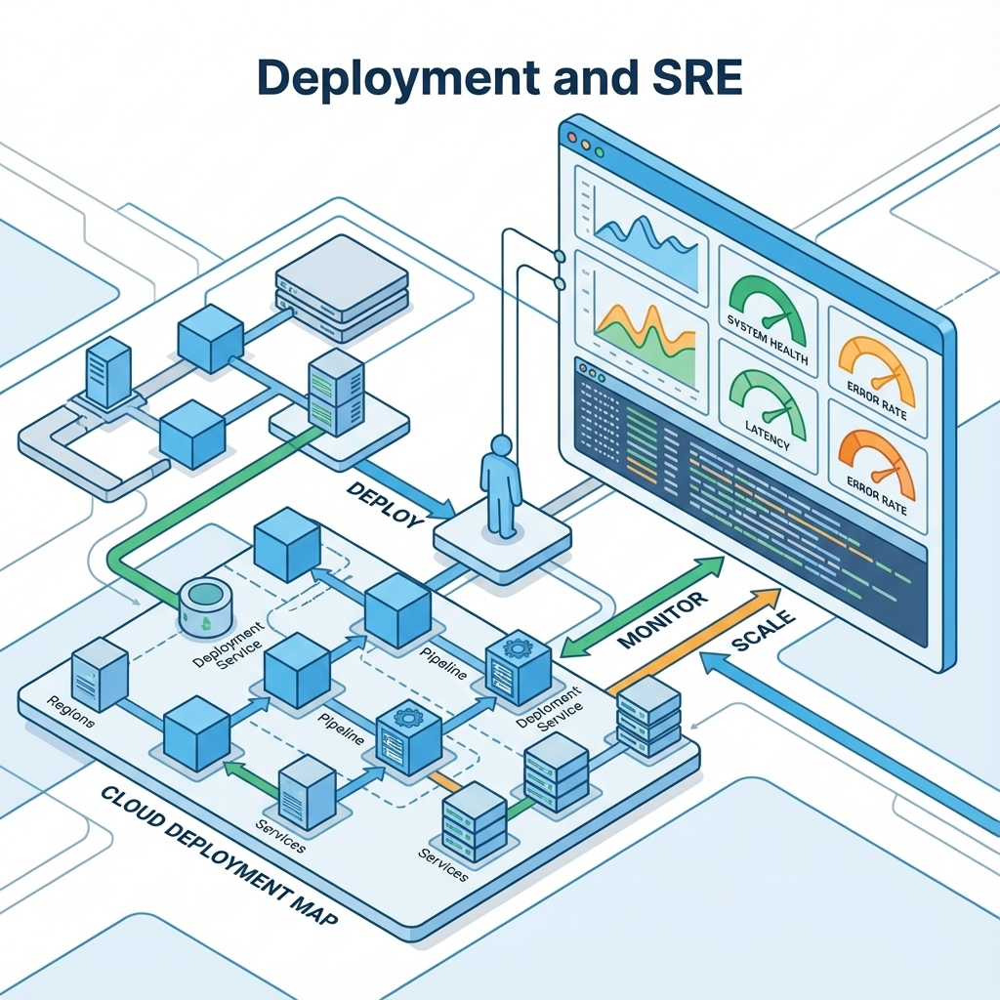

# 第 17 章：部署与运维：灰度、监控与回滚


> 上线不是把版本推上去，而是把不确定性纳入治理：你知道如何灰度、如何观测、如何回滚、如何复盘。没有回滚的发布，等价于赌博。[5][6]

AI 产品的运维挑战更尖锐：模型/提示/检索/工具任何一处变化都可能改变行为分布；你不只要监控错误率，还要监控质量、成本与风险面。把这些纳入发布门禁，你才能持续迭代而不被线上事故拖垮。[6]

## 章节定位
本章承接推理优化与评测门禁，讲如何安全地发布与长期运行：版本管理、灰度策略、监控口径、回滚与复盘。它的目标是让你在低资源条件下仍能建立可控上线的操作系统。[5]

## 你将收获什么
- 一套发布策略：从小流量灰度到全量，何时推进、何时暂停、何时回滚。[5]
- 一份运维观测口径：质量/延迟/成本/风险四线同看。[6]
- 一份 Runbook 模板：事故发生时你按表执行，而不是凭情绪决策。[5]

## 三层思考：运维是让系统长期不坏
### 第 1 层：读者目标
你要获得持续迭代的能力：上线不怕、退化可控、事故可复盘。

### 第 2 层：论证链条
可控发布链条是：

版本化（代码/配置/提示/模型）→ 灰度策略 → 观测口径 → 告警与处置 → 回滚与复盘 → 回归集更新

缺版本化，你无法解释变化；缺回归集，你无法防止复发。[6]

### 第 3 层：落地与验收
验收看三件事：
- 你能明确说明这次发布改了什么（可追溯）；
- 你能在 10 分钟内完成回滚或降级（可执行）；
- 你能产出一份复盘并把失败样本回写进回归集（可复利）。[6]

## 关键流程图（纯文本）：可控发布闭环（版本化→灰度→观测→回滚→复盘）

```text
版本化（代码/配置/prompt/模型/索引/工具合同）
  → 生成版本组合（version set）
  → 小流量灰度（可控样本）
  → 四线观测（质量/延迟/成本/风险）
  → 达标：推进；不确定：暂停；越界：回滚/降级（按表执行）
  → 固定证据包（请求样本/日志/指标/版本快照）
  → 复盘（结论 + 行动项）
  → 回归集更新（把事故变资产，命中即阻断）
```

## 版本化：把变化变成可追溯对象
AI 系统的版本不止代码，还包括：
- 提示与输出合同
- 检索配置与索引版本（RAG）
- 工具清单与权限边界（Agent）
- 模型版本与后训练策略

落地做法（0→1）：把非代码资产当作制品管理，而不是当作散落文件。
- 大文件与制品：用 Git LFS 或制品仓库保存模型、索引快照与构建产物，并用标签关联版本。
- 数据与索引：用 DVC 或数据注册表记录数据快照与索引 manifest（embedding_version、chunking、params）。
- 提示与配置：把 prompt 与关键配置集中管理（Prompt Hub），并强制 `prompt_version` 进入日志与回放。
- 版本集合：每次发布输出一个版本集合（code/config/prompt/model/index），用于灰度与复盘。

输出合同是什么：模型输出的结构与语义约束，例如字段集合、类型、必填项、长度上限、允许值枚举、引用与不确定标注规则。把它当作 API schema 管理（output_contract_version），并让校验、回退与日志都引用同一版本，才能在灰度与回滚时可裁决。

在 RAG 架构里，向量索引不是随手生成的文件，更像一次发布的制品。它必须和 embedding 版本、切分策略、索引参数绑在一起版本化，否则你根本说不清这次召回变差是数据变了还是算法变了。知识库更新要走一条可复跑的构建流水线，产出一个带版本号的索引快照，并保留上一个稳定版本。这样一旦线上检索退化或被坏数据污染，你才能像回滚代码一样，把流量切回旧索引，先止损再定位。把索引当成一级制品，系统才会在时间维度上可解释、可回放。[6]

最低要求：任何一次线上行为都能指向一组明确版本（用于复盘与回放）。[6]

## 灰度发布：把风险拆小
灰度的本质是：在真实分布下验证，但把影响面控制在可承受范围内。[5]


上面的关键流程图给出了不依赖图片的闭环；这里补齐灰度策略如何按表执行。

### 灰度策略卡

| 维度 | 说明 |
| --- | --- |
| 灰度对象 | 内测用户/小比例租户/特定场景 |
| 观察窗口 | 例如：24 小时/一周（与使用周期一致） |
| 通过门槛 | 质量/延迟/成本/风险阈值 |
| 暂停条件 | 任一守门指标越界 |
| 回滚方式 | 版本回退/功能开关/降级路径 |

#### 门槛示例：把阈值写成可裁决数字
阈值不要拍脑袋，最低做法是用基线分位数写相对门槛，再配一个绝对红线：
- 相对门槛：基线过去 7 天的 P50/P95 与波动区间
- 绝对红线：一旦触发立即回滚或止损（例如越权、泄露、注入突破）

基线怎么来：取同一套稳定版本集合，至少连续一周的历史指标作为基线（按租户/入口/输入长度分桶），再用分位数定义波动区间，避免被短期噪音带偏。

| 线 | 指标 | 通过门槛示例 | 暂停阈值示例 | 回滚阈值示例 |
| --- | --- | --- | --- | --- |
| 质量 | 采纳率、差评率、关键任务成功率 | 不低于基线 | 低于基线 3% | 低于基线 5% 或出现可复现关键失败 |
| 延迟 | P95、超时率 | P95 ≤ 基线 +10% | 超过基线 +15% | 超过基线 +25% 或超时率翻倍 |
| 成本 | 单次成本、预算耗尽率 | 单次成本 ≤ 基线 +10% | 超过基线 +15% | 超过基线 +25% 或预算耗尽率明显上升 |
| 风险 | 注入成功率、越权/泄露事件 | 0 重大事件 | 命中红队样本 | 任一越权/泄露/注入突破即回滚 |

### 灰度进阶：A/B Testing 与多版本策略
AI 系统的变化往往体现在质量分布，而不是错误率。相比单一路径的渐进放量，A/B 与多版本并行更容易给出可裁决的对比证据。

| 要素 | 最小做法 |
| --- | --- |
| 分流单位 | 以 tenant_id 或 user_id 做稳定哈希分流，避免同一用户反复切版本 |
| 对比对象 | 新旧版本并行（prompt/模型/索引/策略），其余保持不变 |
| 观测窗口 | 与使用周期一致（至少覆盖一次完整任务闭环） |
| 决策规则 | 主指标提升达到门槛，且守门指标不退化；否则不推进 |
| 风控 | 风险线红线命中即止损，不等待统计显著性 |

### 灰度推进的操作手册：推进/暂停/回滚三件事
灰度最折磨人的瞬间，通常发生在数据似是而非的时候。上线半小时，告警没响，核心转化也没掉，但 P95 延迟微涨，零星用户喊慢。团队若在此时争论这算不算退化，往往会走向两个极端：要么盲目放量放大风险，要么过度恐慌扼杀收益。[5]

更稳的做法是把决策压缩成推进、暂停、回滚三件事，每一步都配套必须留存的证据。不要现场辩论，只需按表执行：先判断信号，再执行动作，最后固化证据与回归资产。[5][6]

灰度期间把心态摆正：信号不确定就先暂停，守门指标越界立刻回滚，继续推进必须有证据。推进不是勇气测试，是对口径与证据的信任。[6]

| 信号（以基线为准） | 动作 | 你必须记录的证据（用来复盘/回放） | 复盘要补的回归样本（让问题不复发） |
| --- | --- | --- | --- |
| 守门指标稳定；关键体验（质量线）与关键业务指标同向或基本不变 | 推进（扩大灰度或延长观察窗口） | 当前版本集合（代码/配置/prompt/模型/索引）；关键面板截图；抽样请求的 `trace_id` 与响应对比；用户反馈摘要 | 新增收益样本：体现改动带来的真实价值闭环；补齐不同用户段/不同输入长度的代表性样本 |
| 指标波动但仍在历史波动范围；存在噪音或样本量不足，无法裁决 | 暂停（维持流量不变，进入排查） | 分桶对比（新/旧版本、不同租户/地区/入口）；失败请求样本与日志；排队/缓存命中等解释变量 | 新增分布样本：把造成波动的特定分桶（某类输入、某入口、某租户）沉淀进回归集 |
| 守门指标明显恶化（错误率/超时率/成本越界）；或出现可复现的用户关键失败 | 回滚（立即切回上一稳定版本/稳定模式） | 回滚触发时刻与条件；告警与指标变化曲线；最小复现请求；回滚后指标恢复证明 | 新增事故复发样本：把最小复现样本写入阻断级回归；补充相邻边界（更长/更短输入、弱网、工具失败） |
| 高风险事件：越权/泄露/注入突破边界；或成本失控影响现金流 | 立即止损（强回滚 + 关闭入口/开关） | 审计记录（谁/何时/对什么）；触发链路与攻击样本；影响面评估；对外说明草稿 | 新增红线样本：攻击样本进入固定红队集；把触发条件固化为门禁（命中即阻断） |

### 灰度案例（把框架落到动作）
案例 1（延迟微涨但不确定）：
- 现象：灰度 2 小时后质量线稳定，但 P95 上升 12%，且集中在长输入分桶。
- 动作：暂停灰度，流量不变；按租户与输入长度分桶对比新旧版本。
- 排查：抽样 20 个 `trace_id`，拆分排队/检索/生成耗时与 `tokens_out`，确认瓶颈来自长输入生成。
- 处置：对长输入启用降级路径（先摘要后生成），并限制最大上下文与重试次数。
- 验证：P95 回落到阈值内且质量不退化后，再继续推进。

案例 2（红线命中）：
- 现象：灰度期间红队样本出现越权命中。
- 动作：立即止损（强回滚 + 关闭入口/开关）。
- 证据：固定证据包（版本集合、`trace_id`、攻击样本、告警曲线）。
- 回写：将样本写入阻断级回归与门禁，通过回归后再开灰度。

## 监控口径：四条线同看
AI 产品上线后至少要同看四条线：[6]
- 质量线：用户是否解决问题（反馈、采纳率、失败样本）。
- 延迟线：P50/P95、超时率、重试率。
- 成本线：单次成本、日消耗、尖峰消耗。
- 风险线：越权尝试、注入命中、敏感内容与拒答质量。

## 风险治理：AI 特有风险与合规
把风险线做成门禁，核心不是多做告警，而是把高风险事件变成可裁决动作：命中即止损，事后回写。

常见 AI 特有风险类型：
- 幻觉与编造：看似流畅但缺证据，导致错误决策与投诉。
- 提示注入：诱导模型绕过规则或泄露系统提示。
- 数据泄露：RAG 或工具返回把敏感信息带进输出。
- 越权与危险动作：工具被错误调用或参数越界。
- 偏见与不公平：某些人群或输入分桶质量持续退化。
- 过度拒答：安全变严但可用性崩溃，用户流失。

### 风险控制卡（把风险写成门禁）

| 风险 | 你监控什么 | 守门阈值示例 | 命中后动作 |
| --- | --- | --- | --- |
| 注入突破 | 注入成功率、命中样本 | 任一突破即红线 | 立即止损 + 回滚 |
| 越权调用 | 未授权 tool_calls | 0 | 立即止损 + 关入口 |
| 泄露 | PII/机密命中率 | 不高于基线 | 回滚 + 排查语料与日志 |
| 幻觉 | 无证据断言率 | 不高于基线 | 暂停推进 + 补证据门禁 |
| 偏见 | 分桶采纳率/差评率/离线分数差异 | 任一关键人群与整体差异 > 5% 即暂停 | 调整数据与回归集 |
| 过度拒答 | 拒答率、拒答满意度 | 拒答率上升且满意度下降 | 调整拒答模板与策略 |

合规落地要点（GDPR/CCPA/个人信息保护法思路）：
- 多租户隔离：缓存与日志不跨租户共享；敏感数据不进入共享缓存。
- 数据最小化与假名化：只留必要字段，优先记录摘要与指纹而不是原文。
- 加密与访问控制：存储加密、最小权限、审计可追溯。
- 留存与删除：明确 TTL、删除与导出流程，避免越积越久变成风险。
- 审计：发布与降级决策可审计（版本集合、trace_id、触发条件、处置动作）。

## 观测性：把看见发生了什么变成默认能力
AI 系统的事故往往不是单点故障：模型变了、索引变了、工具权限变了、prompt 变了，最后表现为某类用户体验变差。如果你缺少可追溯的观测链路，复盘就会变成讲故事。最低要求是把日志、指标、链路追踪三件套打通，并且让每一次请求都能在三者之间对齐。[61]


文字版图 17-2：观测性三件套如何服务灰度与回滚（不依赖图片也能落地）

| 组件 | 你看什么 | 用在灰度 | 用在回滚 | 必备关联键 |
| --- | --- | --- | --- | --- |
| 指标（metrics） | 守门指标趋势与分桶 | 裁决推进/暂停/回滚 | 证明回滚恢复 | version_set |
| 链路（traces） | 一次请求的耗时拆分 | 抽样对比新旧版本 | 定位慢/错/贵的环节 | trace_id |
| 日志（logs） | 证据与上下文摘要 | 固定证据包与复现样本 | 复盘根因与修复验证 | trace_id + version_set |

最小闭环：用 `trace_id` 把一次请求的日志与链路对齐，用 version_set（code/config/prompt/model/index）把行为变化对齐到发布制品，才能让灰度与回滚可裁决。

### OpenTelemetry：统一日志/指标/链路的语义
OpenTelemetry 的价值不是又一个 SDK，而是让你能用统一的字段把一次请求串起来：从 API 网关 → 推理服务 → 检索/工具调用 → 结果返回。这样你才能回答慢在哪里、贵在哪里、错在哪里。[61]

### 最小可观测字段合同
建议把这些字段写进输出与日志规范，保证线上可回放、可归因。[61]
- `request_id` / `trace_id`：一次请求的全链路标识。[61]
- `user_id` / `tenant_id`：用于限流、成本归因与安全审计（注意脱敏/合规）。
- `model_version` / `prompt_version` / `rag_index_version`：把行为变化绑定到版本。[6]
- `tool_calls`：工具名、次数、耗时、失败原因（能定位工具导致的慢/贵/错）。
- `tokens_in/tokens_out`、`latency_ms`、`cache_hit`：成本与延迟的最小闭环。[6]

## 指标与面板：Prometheus + Grafana 的组合拳
指标体系的核心不是收集很多数据，而是让守门指标可以被持续观察、被告警、被用于回滚决策。Prometheus 适合做时序指标采集与告警规则，Grafana 负责把它们变成可读的面板与值班入口。[62][64]

### 发布守门指标
- 质量：成功率/失败率、用户反馈（或离线抽样分数）。[6]
- 延迟：P50/P95、超时率、排队时间。[6]
- 成本：单次成本、Token 预算越界率、缓存命中率。[6]
- 稳定性：5xx、重试、OOM/过载保护触发次数。[6]
- RAG/工具：检索命中率、工具调用失败率/耗时。[6]
- 风险：越权尝试、注入命中、敏感内容触发率。[6]

### 最小告警原则
- 告警必须绑定动作：降级/限流/回滚三选一；没有动作的告警等于噪音。[6]
- 告警必须绑定版本：能回答从哪个版本开始变坏。[6]

## 示例（可复制）：一个能跑的最小观测闭环（Python）：trace_id + /metrics
观测性最容易变成买工具。但对个人与小团队来说，你更需要的是先建立可追溯闭环，再决定是否上更重的栈。

这里直接复用上一章的可运行示例（标准库实现）：`docs/examples/inference/budgeted_gateway.py`。

启动命令（mock 模式）：

```bash
python3 docs/examples/inference/budgeted_gateway.py --provider mock --port 8787
```

1) 发起请求时带上 `x-trace-id`：

```bash
python3 - <<'PY' > /tmp/canary_payload.json
import json
print(json.dumps(
    {'user_id': 'u1', 'prompt': '写一份 10 分钟止损 runbook', 'budget_ms': 1200},
    ensure_ascii=False,
))
PY

curl -sS -X POST http://127.0.0.1:8787/chat \
  -H 'content-type: application/json' \
  -H 'x-trace-id: canary-0001' \
  --data-binary @/tmp/canary_payload.json
```

2) 你会在响应与日志里拿到同一个 `trace_id`，这就是可追溯的最小单位（后续你可以把它对齐到 OTel trace）。[61]

3) 访问指标端点：

```bash
curl -sS http://127.0.0.1:8787/metrics | head
```

你会看到 Prometheus 文本格式的指标（请求总量、成功/失败、缓存命中、inflight、延迟总和）。这份最小实践为建立可决策的观测闭环打下基础：例如当 `gateway_requests_error` 或 `gateway_inflight` 异常上升时，你可以按 Runbook 触发暂停、降级或回滚。[6]

## 推理服务形态：从能跑到可运维
当你把推理放进产品体系，服务形态会直接影响可控性：并发、伸缩、发布、监控、权限隔离都需要一套可运维的承载方式。

### KServe：把推理当作工作负载管理
KServe 更像是推理的运维壳：围绕部署、滚动更新、伸缩与流量治理提供标准化入口，适合把推理服务纳入统一的发布与运维系统里。[63]

### TGI：把推理服务的关键能力做成标准件
TGI 的定位更偏向推理服务产品化：让你以更低的工程成本获得并发、流式输出与基础运维能力，适合在早期把服务先跑稳，再逐步引入更深的性能优化。[49]

### 推理服务运行形态选型卡（运维视角）

| 维度 | 你要问的问题 | 最小答案（0→1） |
| --- | --- | --- |
| 部署复杂度 | 你能否稳定交付与回滚？ | 先选你能 10 分钟回滚的形态 |
| 伸缩策略 | 尖峰怎么扛，怎么限流？ | 先有配额与限流，再谈自动伸缩 |
| 可观测 | 版本与 trace 能否对齐？ | 日志/指标/链路字段合同统一 |
| 隔离与安全 | 多租户如何隔离？ | 预算、并发、缓存不跨租户 |
| 成本可控 | 单次成本如何解释？ | token/tool 成本可分摊与审计 |
| 回退路径 | 出事怎么切回？ | 版本化 + 流量切换 + 稳定模式 |

回退路径的最小定义：
- 托管推理：切换到上一稳定的模型或策略版本（或切回稳定模式）。
- 自部署引擎：回滚到上一镜像与配置，或把流量切回上一套后端。
- KServe/TGI：用版本化部署与流量治理把回滚变成一次配置变更，而不是一次救火工程。

### 伸缩与限流：先控再伸
AI 推理的伸缩比普通 Web 更脆：冷启动慢、GPU 资源稀缺、长短请求混杂会放大排队。0→1 的顺序建议：先把限流与降级做成默认，再谈自动伸缩。

- 伸缩信号：队列长度、inflight、GPU 利用率、P95 延迟（不要只看 CPU）。
- 伸缩手段：Kubernetes HPA 结合自定义指标（例如队列长度），并配合预热与最小副本数。
- 限流机制：令牌桶或漏桶，按租户/用户配额；触发时返回 429 并给恢复指引。

## 告警与处置：先保底，再优化
当告警触发，你的第一目标不是修得漂亮，而是止损。建议优先级：
1) 降级高成本/高风险路径（减少工具、缩短上下文、关闭某入口）
2) 限流（按用户/租户预算）
3) 回滚到上一版本
4) 进入复盘与补回归

## 模板：事故 Runbook（10 分钟版）
| 步骤 | 你要做什么 | 产出 |
| --- | --- | --- |
| 1 | 确认影响面（谁/多少/哪些功能） | 影响范围说明 |
| 2 | 触发止损（降级/限流/回滚） | 止损动作记录 |
| 3 | 保留证据（日志/请求样本/版本） | 证据包 |
| 4 | 定位根因（最小复现） | 失败样本 |
| 5 | 补门禁与回归（防复发） | 回归集更新 |
| 6 | 写复盘（结论与行动项） | 复盘文档 |

### 一次 10 分钟止损该怎么走（让你在压力下也能执行）
事故发生时，人最容易犯的错是急着解释。你会下意识地把注意力放在到底哪里错了，而不是如何先把损失停住。Runbook 的价值是把决策顺序反过来：先止损，再定位；先保留证据，再复盘叙事。[5]

一个更可执行的心智模型是：把 10 分钟切成 3 段，每段只做一件事。

1) **第 1–3 分钟：确认影响面**
你要回答的不是发生了什么，而是谁正在受影响。只要影响面不清楚，你后续所有动作都容易过度或不足。

2) **第 3–7 分钟：触发止损**
优先级永远是：能降级就先降级，能限流就先限流，能回滚就回滚。止损动作越早，后续定位越从容；越晚，你就越容易被线上噪音带偏。[5][6]

3) **第 7–10 分钟：保留证据并固定版本**
在你开始修复之前，先把证据包固定下来：请求样本、关键日志、指标截图、当前版本号与配置快照。否则你很可能会遇到最痛苦的一种事故：你已经改了一堆东西，但无法复现，也无法证明修复有效。[6]

如果你发现自己已经开始争论是不是要回滚，那通常说明 Runbook 太晚被执行了。把何时回滚/如何回滚前置写进灰度策略卡，事故时才能按表执行，而不是靠胆量。[5]

## 复现检查清单（本章最低门槛）
- 发布可追溯：能指向代码/配置/提示/模型/索引的数据版本组合，并能一键回到上一稳定组合。[6]
- 灰度可执行：通过门槛、暂停条件、回滚方式事先写清；触发即按表执行而非临场争论。[5]
- 四线监控可用：质量/延迟/成本/风险至少各 1 个守门指标，并能定位到对应处置动作。[6]
- Runbook 可演练：10 分钟内能止损并固定证据包（请求样本、日志、指标、版本与配置快照）。[5]

## 常见陷阱（失败样本）
1. **现象：** 出了事故才发现不知道改了什么；复盘时只能猜“是不是模型变了”。  
   **根因：** 提示/配置/索引/工具清单等没有版本化，变化不可追溯，导致无法回放与对比。[6]  
   **复现：** 线上退化发生后，无法回答“当前 prompt_version/index_version/model_version 是什么”；也无法复跑到同一版本组合。  
   **修复：** 把所有影响行为的对象纳入版本管理，并让线上每条请求都能指向版本组合（version set）；上线行为可回放。[6]  
   **回归验证：** 随机抽 3 条线上请求：能从日志/审计中还原版本组合，并在同口径下复跑得到一致结论。

2. **现象：** 灰度看起来没问题，全量后爆雷；问题只在某些租户/某些输入长度上出现。  
   **根因：** 灰度样本不代表真实分布；缺少守门指标分桶与边界样本（攻击/长输入/高成本路径）。[6]  
   **复现：** 灰度只覆盖轻量用户或短输入场景，未覆盖高成本链路；全量后 P95、预算耗尽率或越权事件突增。  
   **修复：** 用守门指标裁决并按入口/输入长度/租户分桶；扩大灰度覆盖面；把攻击/边界样本纳入发布门禁与回归。[6]  
   **回归验证：** 灰度与全量指标在同口径分桶下稳定；攻击/边界样本集复跑通过后才允许推进。

3. **现象：** 回滚很慢，越拖损失越大；你在事故里边查边改边上线。  
   **根因：** 回滚依赖人工拼命；缺少降级路径与开关；证据包没固定导致无法复现。[5][6]  
   **复现：** 发生退化后，回滚需要改代码/重建制品/重新部署，无法在 10 分钟内完成；同时无法定位触发请求样本。  
   **修复：** 把回滚写进发布策略（流量切换/功能开关/稳定模式）；把降级当默认能力；Runbook 固化证据包与最小复现。[5]  
   **回归验证：** 演练一次 10 分钟止损：降级/回滚动作可执行、证据包完整、回归集新增并能阻断复发。

## 交付物清单与验收标准
- 灰度策略卡与通过/暂停门槛。[5]
- 四线监控口径与阈值（质量/延迟/成本/风险）。[6]
- Runbook（含证据包与回归更新流程）。[5]
- 可观测字段合同与落地证明：能用 `trace_id` 串起一次请求的关键耗时与成本归因。[61]
- 一张可执行仪表盘：Prometheus 采集 + Grafana 面板 + 告警规则 + 对应处置动作。[62][64]
- 推理服务运行形态说明：你选择 KServe/TGI/自研的原因与回退路径。[49][63]

## 下一章
运维解决如何持续上线而不爆。下一章把评测体系写成门禁：离线/在线、红队与回归，让每次变化都可裁决。见：[18-evaluation.md](18-evaluation.md)。

## 参考
详见本书统一参考文献列表：[references.md](references.md)。
