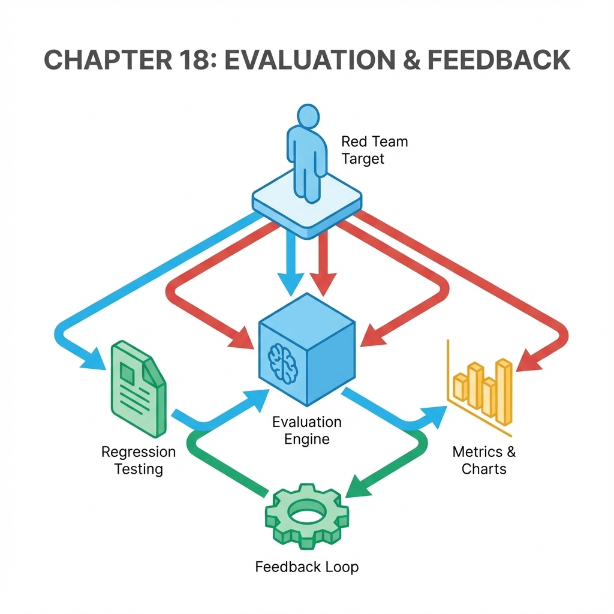
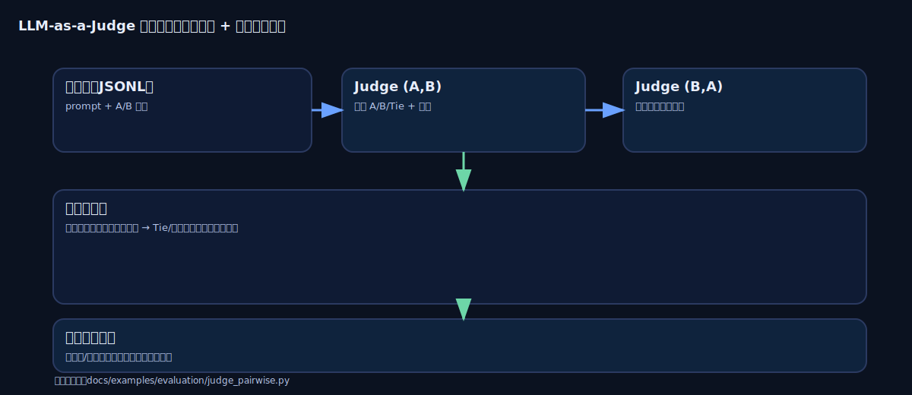

# 第 18 章：评测体系：离线/在线、红队与回归


> 评测不是上线前做一次，而是把变化变成可裁决的日常：回归不过不发布，退化可定位可回滚。[6]

当你进入持续迭代期，你会频繁改动提示、检索、工具边界、模型版本、后训练策略。没有评测体系，所有优化都会变成感觉更好，最后只能靠线上事故来学习。本章把评测拆成三层：离线回归、线上观测、红队与安全评测，并把它们接入发布门禁。[6]

想象一下你为了修复指令遵循的问题，刚调整完提示词。本地随手测了几个例子都很顺，于是你把它推到了生产环境。第二天你才发现，一个高频场景的回答跑偏了，客服反馈和日志一起堆了上来。这样的事情不稀奇，智能系统的改动往往会在别的角落结出副作用。如果没有评测门禁挡在发布流程前面，你的每一次优化都更像是在用线上流量做实验。

## 章节定位
本章承接部署与运维，回答如何持续变更而不爆雷。它是你把 AI 系统从演示变成可长期运营产品的关键一章：评测让你敢改，回归让你敢上线，红队让你敢面对真实世界。

## 你将收获什么
- 一套离线回归集规范：字段、标签、评分口径、版本化方法。
- 一套线上观测与反馈回流：业务指标 + 质量指标同口径。
- 一份红队用例框架：注入、越权、泄露、工具滥用等常见攻击面都能进入回归门禁。[6]

## 三层思考：评测是裁判系统
### 第 1 层：读者目标
你要获得一个裁判：它能告诉你这次改动是更好、更坏还是不变，并且能解释原因。

### 第 2 层：论证链条
评测闭环是：

目标与门槛 → 离线回归集 → 线上观测 → 失败样本回流 → 红队攻击集 → 发布门禁 → 退化回滚

缺任何一环，系统都会漂移：你会越来越难解释为什么变这样。[6]

### 第 3 层：落地与验收
验收很简单：每次发布都有离线回归报告 + 线上指标对比表；任何退化都能触发回滚并留下证据。[6]


## 关键流程图（纯文本）：评测闭环（离线回归→线上观测→红队→门禁→回滚）
不依赖图片也能执行：把闭环写清楚，你才能把“感觉更好”变成“可裁决”。

```text
目标与门槛
  → 离线回归（可复跑）
  → 线上观测（真实分布补盲）
  → 失败样本回流（资产化）
  → 红队与安全评测（风险前置）
  → 发布门禁（不过不发布）
  → 退化回滚（可止损）
  ↺ 回归集更新（让问题不复发）
```

## 离线评测：先有回归集，再谈优化
离线回归集是你最重要的资产之一。它不追求覆盖所有情况，而追求三件事：
- 能复跑（版本化、可追溯）
- 能对比（同口径）
- 能定位（失败样本可解释）[6]

### 回归样本记录

| 字段 | 说明 |
| --- | --- |
| id | 样本唯一标识 |
| 输入 | 用户问题/上下文摘要 |
| 期望 | 要点/参考结论（可简写） |
| 标签 | 主题/难度/风险类型 |
| 判定 | 通过/失败 + 原因 |
| 备注 | 触发条件与复现说明 |

### 评分口径
把口径写成可量化规则，你才能把离线回归接进自动化门禁：

| 维度 | 取值 | 评分示例 | 说明 |
| --- | --- | --- | --- |
| 关键要点覆盖 | 全中/部分/缺失 | 1.0 / 0.5 / 0.0 | 以要点清单为准 |
| 证据链 | 贴题/弱/无 | 1.0 / 0.5 / 0.0 | 必须引用且贴题 |
| 可行动性 | 可推进/卡住 | 1.0 / 0.0 | 是否给下一步 |
| 安全边界 | 通过/拒答/越权或泄露 | 1.0 / 0.0 / -1.0 | 越权或泄露直接失败 |

单样本判定建议：
- 安全边界为越权或泄露：直接失败（阻断级）。
- 否则总分 = 0.4×要点 + 0.3×证据 + 0.3×可行动性，达到 0.8 视为通过。

回归集判定建议：
- 阻断级样本必须 100% 通过。
- 其余样本通过率不低于基线，且平均分不下降超过阈值（例如 0.02）。

### 案例：评测如何挡住一次事故
案例 1（提示改动的副作用）：你为了提升指令遵循修改了 prompt。离线回归显示主任务通过率上升，但边界样本的拒答率上升且用户满意度下降。门禁动作：阻断发布 → 抽样失败样本定位到拒答模板过度保守 → 调整拒答策略后再跑回归，达标才允许上线。

案例 2（检索注入）：某次知识库更新引入了带指令的文档片段，红队用例在检索注入项命中并诱导模型越权。门禁动作：立即阻断 → 回滚索引版本 → 把该样本升级为阻断级回归，并在索引构建时加入注入扫描与内容过滤。

## LLM-as-a-Judge：让主观题也能自动裁决[50]
很多 AI 产品的核心体验是开放式回答：写作、总结、对话、规划。这类问题很难用标准答案打分，但你依然需要一个可回归的裁判。LLM-as-a-Judge 的关键不是让模型随便打分，而是通过机制设计把偏差压到可接受范围。[50]



文字版图 18-2：LLM-as-a-Judge 回归门禁（不依赖图片也能执行）

```text
候选输出 A、B
  → Judge 评审 1（输入 A,B）得到 choice_1
  → Judge 评审 2（输入 B,A）得到 choice_2（归一化回原顺序）
  → 聚合策略：
      - 两次一致：A / B / Tie
      - 不一致：标记为争议样本，进入人工复审或追加评审
  → 输出回归报告 → 接入 CI 门禁 → 退化回滚
```

### 最稳的起步：成对比较（Pairwise）+ 交换位置去偏
与其让裁判打 1–10 分，不如让它在 A/B 两个答案里选更好的（或平局）。为了抵抗位置偏差，必须**交换顺序跑两遍**并聚合结果。[50]

### Judge 回归规则
- 同一题跑两次：`(A,B)` 与 `(B,A)`。[50]
- 允许平局：输出必须支持 `Tie`，强行分胜负会制造噪声。[50]
- 聚合策略：两次结论一致才计胜负；不一致标记为争议样本（进入人工复审或追加评审），并在报告中统计不一致率。[50]

### 防范长度偏差：评估冗余回答的挑战
裁判很容易把更长误判为更好。最低防线是写进 Judge Prompt：**不要因为更长就给更高分**；进阶做法是对超长答案截断/惩罚，并在报告中单独展示长度分布（帮助你发现规避评测指标的倾向）。[50]

可执行建议：
- 定义超长阈值：例如目标输出长度的 1.5 倍，或固定最大 512 token，超过则截断或扣分。
- 记录冗余占比：统计超过阈值的样本比例，把它作为门禁参考指标之一（避免模型朝着冗长漂移）。

### 参考答案引导：客观题更可靠
数学/代码/可验证推理类任务，建议在 Prompt 中提供 `<Reference Answer>`（人工或强模型生成的参考解），要求裁判对照参考再评判，能显著降低误判。[50]

### 补充：参考答案如何进入裁判
当前 `docs/examples/evaluation/judge_pairwise.py` 是最小实现，输入格式为 `{id,prompt,a,b}`，其中 `prompt` 主要用于用户问题。若你希望裁判对照独立的参考答案，可选两种做法：

1. 在 `prompt` 中嵌入：把参考答案与用户问题按固定结构拼进 `prompt` 字段内容，例如先给参考答案块，再给用户问题块，并在 Judge Prompt 里要求优先对照参考答案再裁决。
2. 扩展数据与脚本：在 JSONL 增加 `reference_answer` 字段，并改 `judge_pairwise.py` 将其注入 Judge Prompt，让参考答案与用户问题分离，便于版本化与复用。

## 示例（可复制）：一个能跑的 Judge 回归脚本（Python）：A/B + swap + 聚合
要把 Judge 变成门禁，你需要一个能稳定跑的最小实现：输入一份样本集，输出一份结构化报告；CI 里只需要看胜率是否下滑、Tie 是否变多，就能裁决该不该阻断。

这个仓库提供了一个最小脚本：对同一题做 A/B，交换顺序跑两遍（抵抗位置偏差），再按规则聚合成最终结论：

- 评测脚本：`docs/examples/evaluation/judge_pairwise.py`
- 示例数据：`docs/examples/evaluation/sample.jsonl`

输入格式（JSONL，每行一个对象）：`{id,prompt,a,b}`

| 字段 | 说明 |
| --- | --- |
| id | 可选，样本唯一标识。强烈建议提供，便于追溯与复盘；若省略，脚本会按行号自动生成 id，定位会更麻烦。 |
| prompt | 用户问题 |
| a | 版本 A 的回答 |
| b | 版本 B 的回答 |

### 优先使用 Mock 模式快速验证
先用 `mock` 跑通数据格式与报告结构，再接真实裁判。这样你排查的是工程链路，而不是模型波动。

`mock` 的定位不是替代真实评审，而是提供稳定、可重复的裁判输出：它用固定规则返回 A/B/Tie（例如对步骤、风险与回滚等关键词做加权），用来验证 swap、聚合、报告生成与 CI 门禁是否按预期工作。

运行命令：

```bash
python3 docs/examples/evaluation/judge_pairwise.py \
  --in docs/examples/evaluation/sample.jsonl \
  --judge mock \
  --out docs/examples/evaluation/report.mock.json
```

`--out` 参数指定了 `judge_pairwise.py` 输出评测报告的路径。

### 接入 Gemini 作为智能裁判（可选）
当你确认 `mock` 模式运行无误后，再把裁判切换为真实模型（例如已配置好的 `gemini` CLI），让结果更接近真实体验。

运行前先做一次健康检查：用你准备在 `--model` 里传入的同一个模型 id 运行 `gemini --model gemini-3-pro-preview -o text 'ping'`（示例），确保能得到正常输出；如果失败，先补齐 `gemini` CLI 的认证信息（例如 API Key 或登录凭据），再继续。

```bash
python3 docs/examples/evaluation/judge_pairwise.py \
  --in docs/examples/evaluation/sample.jsonl \
  --judge gemini \
  --model gemini-3-pro-preview \
  --out docs/examples/evaluation/report.gemini.json
```

`--out` 参数指定了 `judge_pairwise.py` 输出评测报告的路径。

### 运行结果与门禁判断
`judge_pairwise.py` 的退出码只表示运行是否成功（例如输入为空、模型调用失败会返回非 0）；它的职责是产出报告，而不是判断是否达标。要把它接入 CI 门禁：先生成基线/候选报告，再用 `docs/examples/evaluation/judge_gate.py` 对比并以退出码表示通过/失败（非 0 视为门禁失败）。

### 理解评测报告：为什么它能接入 CI 作为门禁
运行结束后你会得到一个 JSON 报告。报告顶层包含 `judge`、`model`、`items`，其中 `items` 是样本列表，每个样本至少包含：

- `choice_1`：按原始顺序（A,B）评审的结果；
- `choice_2_swapped_normalized`：交换顺序（B,A）评审后，再归一化回原顺序的结果；
- `final`：两次结果聚合后的最终裁决（两次一致才计胜负，否则记 Tie）。

在 CI/CD 里你只需要聚合这些字段：以冻结基线为参照，关键任务胜率下降超过 1%（或下降超过 1 个样本），或 Tie 率上升超过 3%（或 Tie 个数增加超过 5 个），就直接阻断发布，把争论从感觉拉回口径。[6][50]

更直接的做法是把门禁写成一个小脚本：先生成报告，再对比基线报告并用退出码表示通过/失败。本仓库提供了示例：`docs/examples/evaluation/judge_gate.py`。

`judge_gate.py` 的输入是 `judge_pairwise.py` 生成的两份 JSON 报告（基线报告与候选报告）的文件路径。

运行 `judge_gate.py` 前，你需要先生成基线报告与候选报告（同一份样本集、同一裁判配置）：

```bash
python3 docs/examples/evaluation/judge_pairwise.py \
  --in docs/examples/evaluation/sample.jsonl \
  --judge gemini \
  --model gemini-3-pro-preview \
  --out docs/examples/evaluation/report.baseline.json

python3 docs/examples/evaluation/judge_pairwise.py \
  --in docs/examples/evaluation/sample.jsonl \
  --judge gemini \
  --model gemini-3-pro-preview \
  --out docs/examples/evaluation/report.candidate.json
```

然后执行门禁判断：

```bash
python3 docs/examples/evaluation/judge_gate.py \
  --baseline docs/examples/evaluation/report.baseline.json \
  --candidate docs/examples/evaluation/report.candidate.json \
  --max-win-rate-drop 0.01 \
  --max-win-count-drop 1 \
  --max-tie-rate-increase 0.03 \
  --max-tie-count-increase 5
```

运行时 `judge_gate.py` 会输出基线与候选的摘要对比（胜率、Tie 率与增量），并在未达标时打印具体失败原因（例如 A 胜率下滑过多），以便 CI/CD 日志直接定位。

失败判定：脚本退出码非 0 即视为门禁失败。

## 评测集怎么建：从能裁决开始，而不是从覆盖一切开始
做评测集最常见的误区，不是样本太少，而是样本多到你也不敢相信结论：一跑一堆 Tie、一堆理由，最后仍然回到争论。评测最怕跑了很久，但裁决不了。

更稳的起步是先做一小份能裁决的评测集：跑得动、结论稳、能定位失败。你不必一开始就穷尽长尾，但必须先抓住三类高杠杆样本，并把它们直接绑定到发布门禁：[6]

1. **核心「黄金链路」样本**：这些是用户使用你产品时，最核心、最不能出错的关键路径（例如，新用户注册、完成支付、关键功能配置、核心问答交互等）。
   - 如何收集/维护：与产品、运营共同确认生命线场景，并随着路线图迭代定期更新样本，确保它始终代表真实使用分布。

2. **「事故复发」预防样本**：这些是曾经在线上导致严重问题、爆雷的失败案例（如数据越权访问、敏感信息泄露、模型答非所问、资源成本意外飙升等）。一旦命中，必须立即阻断发布。
   - 如何收集/维护：把每次事故复盘的关键失败样本沉淀进回归集，并将其视为不可触碰的红线；新版本上线前必须跑过且通过。

3. **「边界压力」探索样本**：这些是容易将系统推向极限、触发性能退化或异常行为的场景（如极长的上下文输入、网络环境不佳、依赖的外部工具服务不可用、恶意或异常的输入注入等）。
   - 如何收集/维护：从日志与用户反馈里抽取最费钱/最费时/最易错的请求类型，把它们变成固定样本；并在引入新工具/新链路时补充对应的压力样本。

最小启动集建议（先让它跑得动）：
- 黄金链路：选产品最核心 2–3 条价值路径，每条路径挑 3–5 个关键交互点作为首批样本。
- 事故复发：回顾最近 3–6 个月影响最大的 2–3 起事故，把最小复现写成阻断级样本。
- 边界压力：各挑 1–2 个代表性用例（超长输入、工具失败、注入尝试），先把门禁跑通。

当这三类样本能跑通发布门禁→风险阻断→必要时回滚→评测集回写的闭环，你就有了质量保障的复利基座。后面再扩充覆盖面，会比一开始就贪大求全更省时间，也更容易持续稳定地变好。[6]

## 回归集的生命周期：收集、冻结、更新与弃用
很多团队把评测集当成一次性的考试卷：上线前紧急凑一套，测完就束之高阁；或者相反，任由它无限膨胀，最后跑一次回归要半天、产出的结论却依然不可裁决。更有效的心智模型是：**回归集是系统的免疫记忆**——它会把你走过的弯路、踩过的坑、被攻击过的边界，变成下一次发布前的自动提醒。

当你把回归集当作资产来经营，它会产生很强的复利：你越早建立可复跑、可对比、可定位的样本集，后面每一次改动的验证成本就越低，争论也越少。要做到这一点，你需要给回归集一个清晰的生命周期：**怎么收集、何时冻结、如何更新、什么时候弃用**。

### 样本为什么要分三类（以及如何进入门禁）
把样本分成黄金链路 / 事故复发 / 边界压力不是为了分类而分类，而是为了让你在有限资源下把钱花在刀刃上：不同样本对应不同风险、不同运行频率、不同阻断力度。

- **黄金链路样本**：守住产品可用的生命线。它们代表用户最核心、最频繁、最不能出错的价值闭环。  
  **进入门禁方式**：作为合并/发布的强卡点；任何一次变更只要在黄金链路上退化，就不应该继续推进。
- **事故复发样本**：用真实事故换来的不二过。每一次线上爆雷、严重投诉、越界输出，都应该被固化成可复现样本。  
  **进入门禁方式**：作为发布前必须跑过的阻断级回归；修复缺陷时同步补样本，确保同类问题不再复发。
- **边界压力样本**：守住系统不会在极端情况下崩。它们覆盖超长输入、弱网、工具不可用、恶意注入、跨语言干扰等把系统推向极限的场景。  
  **进入门禁方式**：进入固定的深度评测与红队回归；一旦命中高风险边界突破（越权/泄露/注入），直接升级为阻断级门禁样本。

你会发现：这三类样本对应三种不同的发布语气。黄金链路是必须能用；事故复发是绝不能再犯；边界压力是宁可降级也别失控。

### 推荐的每周维护节奏（把评测做成日常）
回归集要稳定，靠的不是某次大整理，而是一个轻量、持续的维护心跳：
- **收集**：从线上日志、反馈与告警中挑选最费钱/最费时/最易错的样本候选；同步记录版本与 `trace_id`，保证可回放。
- **验证**：为新样本补齐标签与期望口径（要点/拒答/边界）；确保它能稳定复现，并且失败原因可解释。
- **冻结**：每周（或每次小版本发布）冻结一版回归集作为基线；后续所有改动都以该基线对比裁决。
- **更新**：新功能上线就补黄金链路；线上事故复盘就补事故复发；引入新工具/新入口就补边界压力。
- **弃用**：定期把已下线功能、无法复现、或长期不再代表风险的样本移入归档区，保持主回归集精简可跑。

### 建议的目录结构（让样本有家可归）
你不需要一上来就做复杂的数据平台，但至少要让往哪里放、怎么找、怎么冻结是清晰的：
- `datasets/regression/golden/`：黄金链路（少而精，人工精校）
- `datasets/regression/incidents/`：事故复发（按事件/工单组织，长期累积）
- `datasets/regression/boundary/`：边界压力（注入/超长/弱网/工具失败等）
- `datasets/regression/frozen/`：冻结基线（按版本或时间片存档）
- `datasets/regression/archive/`：弃用归档（不参与日常跑测，但保留以便追溯）

## RAG 专项评测：用 RAGAS 拆解检索 vs 生成[28]
RAG 的退化往往不是答案不好，而是链路里某一环坏了：检索喂了垃圾、上下文太冗余、回答没基于证据。RAGAS 的价值是把这件事拆成可量化的几个指标，让你知道该修检索还是修生成。[28]

**三个最常用指标**
- **Faithfulness（忠实度）**：答案里的陈述能否在检索上下文中找到依据（防幻觉底线）。[28]
- **Answer Relevancy（答案相关性）**：是否答在用户真正问的问题上。[28]
- **Context Precision（上下文精度）**：检索内容是否高信噪比，避免喂太多反而失焦。[28]

**落地方式：把 RAG 评测接入门禁**
- 合并门禁：对固定测试集离线打分，阈值不过就阻断（例如 Faithfulness 下滑即视为高风险）。[28]
- 线上监控：不要实时全量跑，改为抽样 + 异步离线打分，把低分样本纳入回归集。[28]

本地运行前置条件（示例）：

```bash
python3 -m pip install ragas datasets
```

### 前置条件：RAGAS 评估 LLM 配置
RAGAS 在计算指标时需要调用一个评估 LLM（它是裁判，不是被测模型）。如果你的环境里没有配置可用的评估 LLM，脚本会因认证或依赖问题而失败。

常见配置方式（示例，按你选择的 provider）：

```bash
# OpenAI
export OPENAI_API_KEY=YOUR_KEY

# Gemini（按你所用 SDK 或代理要求）
export GOOGLE_API_KEY=YOUR_KEY
```

以 `python3 docs/examples/evaluation/ragas_gate.py` 能跑通为验收标准；如果报认证失败或限流，先补齐凭据、降采样或改为离线跑。

最小可执行脚本（离线门禁）：

- 目标：对固定评测集计算 3 个指标均值，并在低于阈值时以非零退出码失败（适合作为 CI 门禁）。
- 前置条件：RAGAS 的指标计算会调用评估 LLM；运行前请按你所用 provider 配好对应的 API Key 或登录凭据，否则会报认证错误。

输入格式（JSONL，每行一个对象）：`{question,answer,contexts}`

| 字段 | 说明 |
| --- | --- |
| question | 用户问题 |
| answer | RAG 模型生成的答案 |
| contexts | 检索到的上下文列表（字符串数组） |

注意：若不提供 `--in` 参数，脚本将使用内部预设的示例数据运行。

本仓库已提供示例脚本：`docs/examples/evaluation/ragas_gate.py`。

你可以通过以下命令运行这个 RAGAS 评估脚本：

```bash
python3 docs/examples/evaluation/ragas_gate.py \
  --in docs/examples/evaluation/ragas_sample.jsonl \
  --threshold-faithfulness 0.85 \
  --threshold-answer-relevancy 0.70 \
  --threshold-context-precision 0.60
```

失败判定：脚本退出码非 0 即视为门禁失败。

## 线上评测：真实分布补盲
离线覆盖不了真实世界的分布。线上观测至少要回答三件事：[6]
- 用户是否解决问题（显式反馈 + 隐式行为）
- 系统是否安全与可控（拒答质量、越权率、泄露风险）
- 成本是否可控（延迟、调用次数、单次成本）

### 线上观测最小落地（先能回流，再谈完美）
- 显式反馈：点赞/点踩、是否采纳、是否需要改写，绑定 `trace_id` 与版本集合。
- 隐式信号：重试次数、编辑后再提交、任务放弃率、二次询问率（代表答案不够可用）。
- 抽样评测：抽样 1%–5% 请求做异步离线打分（Judge 或规则），把低分样本送入回归集。
- 风险监控：注入命中、越权尝试、PII 命中、拒答满意度，命中红线直接升级为阻断级样本。
- 成本监控：tokens_in/out、tool_calls、latency_ms、预算耗尽率，越界触发降级与告警。

线上样本的价值在于：它会不断把你离线没想到的失败模式推到面前。你的任务不是否认它，而是把它变成回归资产。

## 红队与安全评测：把风险前置成门禁
红队不是偶尔演练，而是常态化回归。[6]

建议按攻击面组织用例：
- 输入注入（指令覆盖、越狱）
- 检索注入（文档里藏指令）
- 工具滥用（越权调用、参数注入）
- 数据泄露（敏感信息、系统提示、密钥）

红队用例进入固定回归集：命中即阻断发布，避免线上才发现。[6]

## 发布门禁：用最小规则把系统守住
### 发布门禁卡

下表给出一个可执行门槛示例，你可以按业务调整，但必须写成数字与阻断规则，避免出现 X/Y 这类不可执行占位。

| 类别 | 门槛 | 退化动作 |
| --- | --- | --- |
| 离线回归 | 阻断级样本 100% 通过；其余样本通过率不低于基线，且平均分不下降超过 0.02 | 失败即阻断 |
| 安全/红队 | 阻断级用例命中率 0% | 命中即阻断 |
| 线上守门 | P95 延迟 < 500ms；单次调用成本 < 0.01 美元；错误率 < 0.1% | 越界即回滚/降级 |
| 证据留档 | 报告与对比表齐全 | 缺证据不发布 |

## 复现检查清单（本章最低门槛）
- 回归集版本化：能追溯到数据快照、配置与版本；每条样本有 id 与最小复现条件。[6]
- 发布门禁可执行：每次发布有离线报告 + 线上指标对比表，并写成阻断规则（失败即阻断）。[6]
- 红队攻击集常态化：命中即阻断发布，并把触发样本写入阻断级回归。[6]
- 失败样本回流：线上失败能在一周内进入回归集并复跑通过；做不到就暂停迭代而不是继续加功能。[6]

## 常见陷阱（失败样本）
1. **现象：** 离线分数很好，上线体验却变差；用户反馈与离线结论相反。  
   **根因：** 回归集分布偏离真实；缺线上反馈回流，导致盲区持续存在。[6]  
   **复现：** 对比“离线高分样本”与“线上差评/工单样本”，发现后者几乎不在回归集中，或标签分桶缺失。  
   **修复：** 把线上失败样本资产化：一周内进入回归集并版本化；按入口/人群/输入长度补齐分桶。[6]  
   **回归验证：** 更新后的回归集能复跑并覆盖线上失败；离线结论与线上关键指标（采纳率/差评率/成功率）趋势一致。

2. **现象：** 每次改动都在争论到底算不算更好；A 说更好、B 说更差。  
   **根因：** 缺评分口径与门槛；缺统一对比表与基线冻结，导致结论不可复核。[6]  
   **复现：** 让两人用同一批样本评审却得出相反结论；或回归集/裁判配置每次都变，无法对齐。  
   **修复：** 先定口径与门槛：阻断级样本 100% 通过；其余样本按通过率/平均分写成阈值；基线与裁判配置版本化。[6]  
   **回归验证：** 同一回归集在同一裁判配置下多次复跑结论稳定；CI 门禁能用退出码裁决通过/失败并给出差异摘要。

3. **现象：** 安全事故线上爆雷（越权/注入/泄露），而离线评测从未报警。  
   **根因：** 红队不进回归；把攻击当偶发，发布门禁缺“命中即阻断”的红线。[6]  
   **复现：** 用固定注入/越权用例复跑：模型能被诱导执行越权动作或泄露敏感信息，但发布流程没有阻断。  
   **修复：** 攻击集常态化并版本化：命中即阻断发布；触发样本写入阻断级回归，并在系统层补闸门（工具合同/权限校验/拒答策略）。[6]  
   **回归验证：** 攻击集进入发布门禁：命中率保持 0%，且审计/拒答口径一致；修复后复跑能稳定通过。

## 交付物清单与验收标准
- 回归集规范与样例（含标签与评分口径）。[6]
- 红队用例与阻断阈值。[6]
- 发布门禁卡（通过阈值、回滚条件、证据留档）。[6]

## 下一章
有了裁判系统，你才能高质量迭代。下一章进入迭代与增长：路线图、实验节拍与定价如何与成本守门协同。见：[19-iteration.md](19-iteration.md)。

## 参考
本章主要引用：
- [6] N. Forsgren, J. Humble, and G. Kim, *Accelerate: The Science of Lean Software and DevOps*, 2018.
- [28] P. Li et al., 《RAGAS: Automated Evaluation of Retrieval-Augmented Generation》, 2024.
- [50] H. Zheng et al., 《Judging LLM-as-a-Judge with MT-Bench and Chatbot Arena》, 2023.

完整列表见本书统一参考文献列表：[references.md](references.md)。
