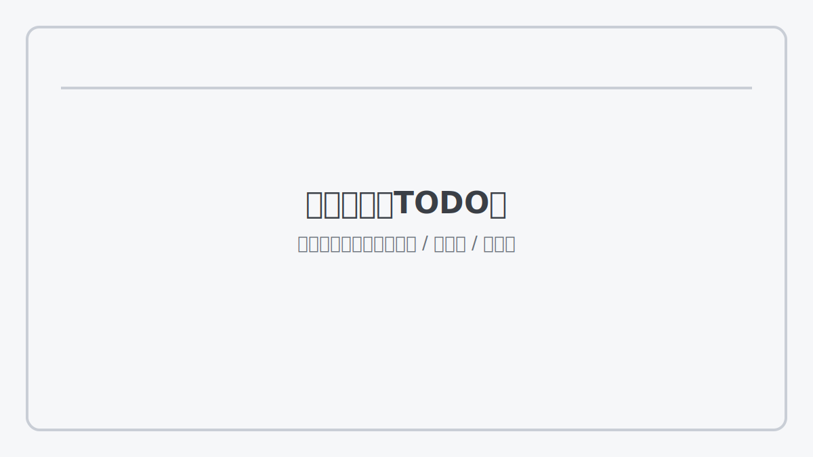

# 第 18 章：评测体系：离线/在线、红队与回归

> 评测不是“上线前做一次”，而是把变化变成可裁决的日常：回归不过不发布，退化可定位可回滚。[6]

当你进入持续迭代期，你会频繁改动提示、检索、工具边界、模型版本、后训练策略。没有评测体系，所有“优化”都会变成“感觉更好”，最后只能靠线上事故来学习。本章把评测拆成三层：离线回归、线上观测、红队与安全评测，并把它们接入发布门禁。[6]

## 章节定位
本章承接部署与运维，回答“如何持续变更而不爆雷”。它是你把 AI 系统从“演示”变成“可长期运营产品”的关键一章：评测让你敢改，回归让你敢上线，红队让你敢面对真实世界。

## 你将收获什么
- 一套离线回归集规范：字段、标签、评分口径、版本化方法。
- 一套线上观测与反馈回流：业务指标 + 质量指标同口径。
- 一份红队用例框架：注入、越权、泄露、工具滥用等常见攻击面都能进入回归门禁。[6]

## 三层思考：评测是“裁判系统”
### 第 1 层：读者目标
你要获得一个裁判：它能告诉你这次改动是更好、更坏还是不变，并且能解释原因。

### 第 2 层：论证链条
评测闭环是：

目标与门槛 → 离线回归集 → 线上观测 → 失败样本回流 → 红队攻击集 → 发布门禁 → 退化回滚

缺任何一环，系统都会漂移：你会越来越难解释“为什么变这样”。[6]

### 第 3 层：落地与验收
验收很简单：每次发布都有“离线回归报告 + 线上指标对比表”；任何退化都能触发回滚并留下证据。[6]

## 离线评测：先有回归集，再谈优化
离线回归集是你最重要的资产之一。它不追求覆盖所有情况，而追求三件事：
- 能复跑（版本化、可追溯）
- 能对比（同口径）
- 能定位（失败样本可解释）[6]

**模板：回归样本记录（最小字段）**

| 字段 | 说明 |
| --- | --- |
| id | 样本唯一标识 |
| 输入 | 用户问题/上下文摘要 |
| 期望 | 要点/参考结论（可简写） |
| 标签 | 主题/难度/风险类型 |
| 判定 | 通过/失败 + 原因 |
| 备注 | 触发条件与复现说明 |

**模板：评分口径（建议从少到多）**
- 关键要点覆盖（对/漏）
- 证据链（有/无/不贴题）
- 安全边界（拒答/越权/泄露）
- 可行动性（用户是否能继续推进）

## 线上评测：真实分布补盲
离线覆盖不了真实世界的分布。线上观测至少要回答三件事：[6]
- 用户是否解决问题（显式反馈 + 隐式行为）
- 系统是否安全与可控（拒答质量、越权率、泄露风险）
- 成本是否可控（延迟、调用次数、单次成本）

线上样本的价值在于：它会不断把你“离线没想到的失败模式”推到面前。你的任务不是否认它，而是把它变成回归资产。

## 红队与安全评测：把风险前置成门禁
红队不是“偶尔演练”，而是常态化回归。[6]

建议按攻击面组织用例：
- 输入注入（指令覆盖、越狱）
- 检索注入（文档里藏指令）
- 工具滥用（越权调用、参数注入）
- 数据泄露（敏感信息、系统提示、密钥）

红队用例进入固定回归集：命中即阻断发布，避免“线上才发现”。[6]

## 发布门禁：用最小规则把系统守住
**模板：发布门禁卡**

| 类别 | 门槛 | 退化动作 |
| --- | --- | --- |
| 离线回归 | 通过率 ≥ X | 失败即阻断 |
| 安全/红队 | 命中率 ≤ Y | 命中即阻断 |
| 线上守门 | 延迟/成本/错误率 ≤ 阈值 | 越界即回滚/降级 |
| 证据留档 | 报告与对比表齐全 | 缺证据不发布 |

## 复现检查清单（本章最低门槛）
- 回归集版本化：能追溯到数据快照、配置与版本。[6]
- 每次发布有对比表：离线报告 + 线上指标对比。
- 红队攻击集常态化：命中即阻断发布。[6]
- 失败样本回流：线上失败能在一周内进入回归集并复跑通过。[6]

## 常见陷阱（失败样本）
1. **现象**：离线分数很好，上线体验却变差。  
   **根因**：回归集分布偏离真实；缺线上反馈回流。  
   **修复**：把线上失败样本资产化；每周更新回归集。[6]

2. **现象**：每次改动都在争论“到底算不算更好”。  
   **根因**：缺评分口径与门槛；缺统一对比表。  
   **修复**：先定门槛与口径；无门槛不宣称优化。[6]

3. **现象**：安全事故线上爆雷。  
   **根因**：红队不进回归；把攻击当偶发。  
   **修复**：攻击集常态化；命中即阻断发布。[6]

## 交付物清单与验收标准
- 回归集规范与样例（含标签与评分口径）。[6]
- 红队用例与阻断阈值。[6]
- 发布门禁卡（通过阈值、回滚条件、证据留档）。[6]

## 下一章
有了裁判系统，你才能高质量迭代。下一章进入迭代与增长：路线图、实验节拍与定价如何与成本守门协同。见：[`19-iteration.md`](19-iteration.md)。

## 参考
详见本书统一参考文献列表：[`references.md`](references.md)。
