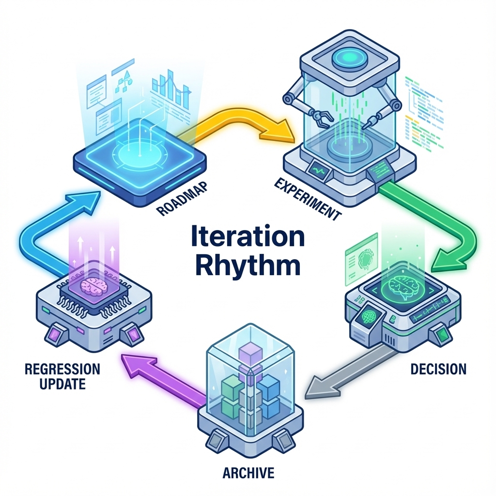

# 第 19 章：迭代与增长：路线图、实验与定价

> 迭代不是做更多，而是更快裁决。在 AI 时代，你最大的优势是速度，但你最大的风险也是速度：没有门槛与止损线，速度只会把你带向更大的偏航。[4][6]

当你已经能上线、能回滚、能评测，增长才有意义。否则增长只是把问题放大：更多用户体验到更多不稳定，更多成本暴露更多亏损。

## 章节定位
本章位于评测体系之后：先有裁判，再谈增长。它讨论一个人或小团队如何安排路线图、怎么做实验、怎么把定价与成本守门连在一起，避免越增长越亏。[6]

## 你将收获什么
- 一套路线图写法：把想做什么改写成要验证什么、怎么裁决、失败怎么止损。[4]
- 一套实验节拍：每次迭代一张卡片，门槛/失败判定/回滚/证据留档齐全。[6]
- 一套定价与成本协同：让商业闭环与系统守门指标同口径对齐。[6]

## 三层思考：增长的本质是把闭环放大
### 第 1 层：读者目标
你要建立一个能持续推进的节奏：每两周交付一个可验证的故事，并把证据沉淀为资产。

### 第 2 层：论证链条
迭代与增长链条是：

北极星指标 → 断点地图 → 实验卡片 → 发布与观测 → 评测回归 → 裁决与归档 → 路线图更新

缺裁决与归档，迭代会退化成永无止境的忙碌。[4][6]

### 第 3 层：落地与验收
验收不是上线了，而是：
- 有对比表证明关键指标变化；
- 守门指标不退化；
- 决策可追溯（为什么保留/回滚/继续）。[6]

## 路线图：从功能列表改成验证列表
0→1 的路线图不要写成要做 N 个功能，而要写成要验证 N 个关键假设。[4]

**模板：路线图（验证视角）**

| 主题 | 你要验证的假设 | 成功门槛 | 失败判定/止损 | 证据来源 |
| --- | --- | --- | --- | --- |
| Onboarding | 缩短路径提升首日闭环率 | ≥ X | < X 则回滚 | 埋点/走查 |
| 质量 | 引用合同提升信任 | ≥ Y | 越权/编造命中即停 | 回归/红队 |
| 定价 | 分层方案提升付费转化 | ≥ Z | 退款率上升则停 | 账本/对账 |

## 实验：每次只回答一个问题
一人团队最怕顺手优化：每次改动都掺杂多个目的，最终无法裁决。建议每轮实验只回答一个问题，并把它写成卡片。[4]

把发现也纳入同一套节拍：持续接触用户、持续提出可证伪假设、持续用最小实验裁决——否则增长会把你推向更快的偏航。[73]

**模板：实验卡片（增长版）**

| 字段 | 说明 |
| --- | --- |
| 假设 | 改动会提升哪个指标，为什么 |
| 目标用户 | 这次只针对谁（避免泛化） |
| 改动内容 | 最小补丁（别掺杂多个目的） |
| 成功门槛 | 指标阈值（提前写） |
| 守门指标 | 成本/延迟/错误率/退款率阈值 |
| 观察窗口 | 与使用周期匹配 |
| 回滚 | 不达标如何回滚/降级 |
| 证据留档 | 对比表、日志、决策记录位置 |

### 实验节拍：把裁决当作交付的一部分
很多独立开发者习惯了发布即完成：代码上了线，就立刻投入下一个功能。但如果缺少最后的裁决，你做的一切很容易退化成代码堆砌——你并不知道它是否有效，也不知道该继续放大还是及时止损。更稳的节拍是把裁决纳入交付定义：只有当你能回答这个改动是否改善了目标指标、是否伤害了守门指标、下一步要保留还是回滚，这次迭代才算真正结束。

- 把观察窗口结束后的裁决写成任务卡片：上线只是中途站，裁决才是终点。
- 在日历里给自己留出固定的看数据时间：别等到下一次事故才回头。
- 结论只允许三选一：保留（继续放量）/暂停（补证据）/回滚（止损并补回归）。

### 证据留档：让未来的你可以复盘
你可能觉得一人项目不需要写报告，反正所有上下文都在脑子里。但人的记忆是最不可靠的日志系统：几周后你会忘记当时为什么改、改完到底是提升还是退化、以及你凭什么做出那个决定。建立一个轻量的决策日志，不是为了写给别人看，而是为了让未来的你拥有现在的判断力——它会直接减少返工，也会让你的迭代越来越像工程，而不是凭感觉。

- 记录实验前后的关键证据：对比表、面板截图、代表性 `trace_id`、用户反馈摘要。
- 记录解释变量：流量来源、分桶策略、版本集合（代码/配置/prompt/模型/索引）。
- 记录行动项：下一次要补的回归样本、要加的门禁、要调整的止损线。

## 定价：把愿意付费写成可验证假设
定价不是拍脑袋，而是对价值与成本的共同裁决：
- 用户愿意为哪一段价值闭环付费？
- 你的成本是否允许你把它卖给足够多的人？
- 你如何止损（异常用量、拒付、退款、成本尖峰）？[6]

0→1 的实用策略是：先找可解释的价值单位，再做可止损的价格策略。例如：按任务、按文档、按席位/团队，而不是一开始就陷入复杂的计量规则。

如果你决定引入用量计费，把它当作工程合同而不是营销策略：计量事件、聚合窗口、幂等与去重、补写/更正、对账与退款规则，最好在你第一次收钱之前就写清楚——否则越增长越容易在争议与退款里被拖垮。[75]

### 把价格当作系统护栏，而不是营销文案
对 AI 产品来说，定价的第一职责往往不是赚更多，而是**让系统可持续**：你必须在体验与成本之间给出一个可解释的边界。否则你会遇到最典型的 0→1 事故：用户很喜欢、用量很高、你也很开心——直到账单把你叫醒。

更稳的做法是把定价拆成两条线同步设计：
- **价值线**：用户为哪一段结果买单（例如把文档变成可执行计划、把长资料变成带引用的结论）。
- **成本线**：你为交付这段结果付出的真实成本（模型、检索、工具调用、重试、人工介入）。[6]

当两条线之间出现不匹配，你就要用产品机制去补，而不是用祈祷用户不要乱用去补：配额、限流、降级、稳定模式提示、以及更清晰的任务拆分入口，都是定价的一部分。[6]

**最小可执行清单（定价前先回答）**
- 哪条链路最费钱？是长上下文、工具调用、还是重试/回退？
- 哪些用户行为会把成本放大？你如何在产品里引导它变短变确定？
- 触发预算时，你是降级交付还是拒绝服务？用户能否理解并自救？[6]

### 分层定价：给不同成熟度用户不同体验承诺
分层的目的不是把人分出三六九等，而是给不同需求强度的用户不同的体验承诺：轻量用户要便宜且稳定，重度用户要更强但更可控，企业用户要可审计可治理。

一种实用的 0→1 写法是把分层与护栏绑定：
- **基础层**：更强的默认止损（更短上下文、更少工具、更严格预算），主打稳定与可预测。
- **专业层**：允许更高成本路径（更多工具/更长上下文/更深检索），但必须配套更清晰的用量提示与可追溯账单。
- **团队/企业层**：把治理能力卖进去（审计、权限、配额、策略化降级与报表），让购买理由变得更可解释。[6]

## 增长飞轮：让获客不是一次性劳动
对超级个体而言，最可持续的增长来自产品内生：
- 结果可分享（输出就是传播物）
- 工作流嵌入（让产品成为流程的一环）
- 模板与资产沉淀（越用越顺手）

增长飞轮的关键不是拉新手段，而是闭环放大后仍稳定：守门指标必须不退化。[6]

### 增长的底线：放大之前先确认系统不会被放大拖垮
增长会把你的一切都放大：好的体验会被更多人看到，坏的边界也会更快暴露；轻微的成本波动会变成现金流压力；偶发的越权/注入会变成舆情与合规风险。  
所以在真正扩量前，你至少要把三件事写成默认行为：预算与降级、评测门禁、以及 10 分钟止损的 Runbook。这样增长才是放大价值，而不是放大事故。[6]

**扩量前的最小自查**
- 是否存在越用越贵的路径？触发后会自动止损吗？
- 灰度推进是否可执行？推进/暂停/回滚是否有证据口径？
- 最近一次事故（或失败样本）是否已经回写进回归集？如果没有，先补它再增长。[6]

## 复现检查清单（本章最低门槛）
- 路线图以验证假设组织，而不是功能堆叠。[4]
- 每次迭代都有实验卡片与对比表；无证据不宣称增长。[6]
- 定价与成本同口径：守门指标（成本/退款率）写成止损线。[6]

## 常见陷阱（失败样本）
1. **现象**：迭代频繁，但方向越来越散。  
   **根因**：路线图是功能清单，没有验证假设与门槛。  
   **修复**：把路线图改写为验证列表；每项都有门槛与止损线。[4]

2. **现象**：指标短期上涨，长期留存下降。  
   **根因**：只优化表层转化，忽略闭环价值与质量。  
   **修复**：把质量与失败恢复作为守门指标；退化即回滚。[6]

3. **现象**：增长越快亏得越快。  
   **根因**：成本守门缺失；定价与成本脱钩。  
   **修复**：先止损，再增长；把预算与降级写进系统默认值。[6]

## 交付物清单与验收标准
- 路线图（验证视角）与每项的门槛/止损线。[4]
- 实验卡片库 + 对比表 + 决策记录（保留/继续/回滚）。[6]
- 定价策略与成本守门（异常峰值可止损）。[6]

## 下一章
增长放大系统，也放大风险。最后一章进入合规与伦理：数据、版权与安全边界如何写清楚并落到审计与门禁里。见：[`20-governance.md`](20-governance.md)。

## 参考
详见本书统一参考文献列表：[`references.md`](references.md)。
