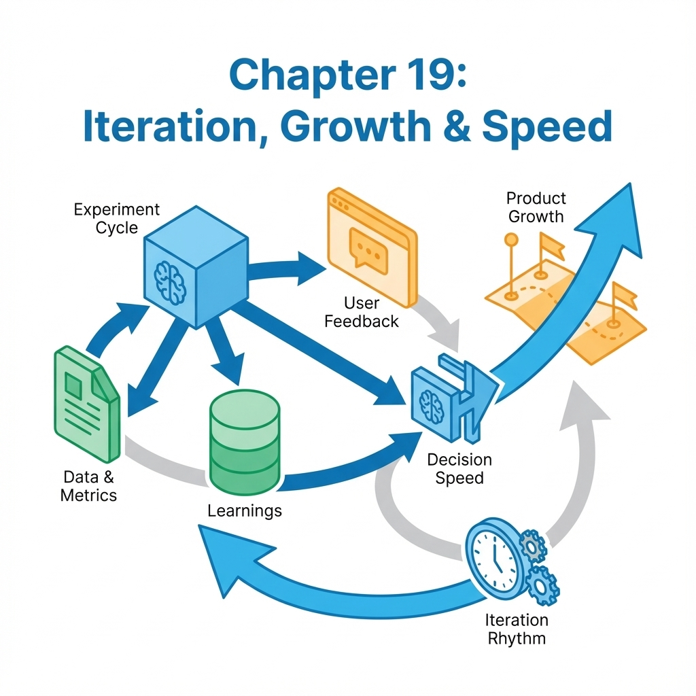

# 第 19 章：迭代与增长：路线图、实验与定价

<!-- 
image_prompt: 
  subject: A high-speed futuristic train track branching into multiple paths, with one path glowing gold and others fading out.
  style: abstract tech illustration, isometric view, clean lines, high contrast blue and orange.
  composition: Central focus on the decision point (the switch), background implies speed and scale.
  lighting: Neon accents on the valid path, dimming on the rejected paths.
-->

> 迭代不是做更多功能，而是更快下结论。在 AI 时代，你最大的优势是速度，但最大的风险也是速度：没有刹车机制的赛车，跑得越快，撞毁得越惨。[4][6]

当你已经能上线、能回滚、能评测，增长才有意义。否则增长只是把问题放大：更多用户体验到更多不稳定，更多成本暴露更多亏损。

## 章节定位
本章位于评测体系之后：先有裁判，再谈增长。我们不谈如何写营销文案，只谈如何用工程手段管理增长——如何安排路线图、如何做实验、如何把定价变成系统的第一道防线。

## 你将收获什么
- **一张验证式路线图**：不再写“要做什么功能”，而是写“要验证什么假设”。[4]
- **一套实验节拍**：两周一轮，一张卡片定生死（保留/回滚/改进）。[6]
- **一套定价护栏**：让商业模式直接映射到系统流控与熔断策略。[6]

## 核心逻辑：增长是闭环的放大器

### 1. 读者目标
你要建立一个能持续推进的节奏：每两周交付一个**可验证的结论**，而不仅仅是一堆代码。

### 2. 论证链条
迭代的链条不是“开发 -> 上线”，而是：
**假设 -> 实验 -> 观测 -> 裁决 -> (归档/扩量)**

缺少裁决与归档，你的迭代就是无效空转。[4][6]

### 3. 落地标准
验收不是“上线了”，而是：
- **有对比**：关键指标涨了吗？
- **有底线**：守门指标（成本/延迟/错误率）守住了吗？
- **有结论**：是继续做，还是杀掉这个功能？[6]

## 关键流程：两周迭代节拍（裁决驱动）

不要让“开发”占满两周。留出时间给“设计实验”和“裁决”。

```text
第 1 天：定义假设（北极星指标 -> 断点地图 -> 实验卡片）
第 2-9 天：开发与灰度（代码 + 埋点 + 门禁）
第 10 天：全量与观测（线上数据积累）
第 11-13 天：离线回归 + 线上对比
第 14 天：裁决会议（保留/暂停/回滚） -> 归档 -> 更新路线图
```

## 路线图：把“功能列表”改成“验证列表”

传统路线图：我们要开发 A、B、C 功能。
增长路线图：我们要验证 A、B、C 假设，如果不成立，就不做后续的 D、E、F。[4]


<!-- 
image_prompt: 
  subject: A spiral diagram showing the iterative process.
  style: minimal technical diagram, flat design.
  elements: 
    - Outer loop: "Hypothesis", "Build", "Measure", "Learn".
    - Inner core: "Decision Gate" (Pass/Fail).
    - Output: "Asset" or "Discard".
  color_palette: professional blue, green for pass, red for fail.
-->

### 模板：验证式路线图

把你的 Excel 表头改一改，逼自己填上数字。

| 模块 | 你要验证的假设 | 成功门槛 (Must Have) | 失败/止损线 (Killer) | 证据来源 |
| :--- | :--- | :--- | :--- | :--- |
| **Onboarding** | 缩短路径能提升首日闭环率 | 首日闭环率 $\ge$ 35% <br> 且 较基线提升 $\ge$ 5% | 首日闭环率 $<$ 30% <br> 或 7 日留存下降 $>$ 1% -> **回滚** | 埋点面板 / 漏斗图 |
| **质量** | 引用原文能提升用户信任 | 引用点击率 $\ge$ 20% <br> 且 负反馈率 $\le$ 1% | 出现越权引用 <br> 或 幻觉率 $>$ 5% -> **阻断并回滚** | 离线回归报告 / 红队日志 |
| **定价** | 分层方案能筛选高价值用户 | Pro 版转化率 $\ge$ 3% <br> 且 毛利率 $\ge$ 20% | 退款率连续两周 $>$ 3% <br> 或 毛利率 $<$ 10% -> **暂停扩量** | 支付对账单 / 成本监控 |

**注意**：不要写“提升用户体验”这种废话。体验提升必须翻译成“留存涨了”或“投诉少了”。

## 实验：每次只回答一个问题

一人团队最忌讳“顺手优化”。在这个版本里改了模型，顺便改了 Prompt，又顺便动了 UI。最后数据变了，你根本不知道是哪个动作带来的。[4]

### 模板：增长实验卡片

每次改动前，强迫自己写完这张卡片。写不出来就别动代码。

| 字段 | 说明 | 示例：新用户引导优化 |
| :--- | :--- | :--- |
| **假设** | 改动 -> 指标变化 (Why) | 把注册后强制弹窗改为侧栏提示 -> 减少干扰，提升首日闭环率 |
| **目标用户** | 谁会看到 (Who) | 新注册用户，首次进入核心页面 |
| **变量控制** | 改了什么 (What) | Feature Flag `new_onboarding_v1`，灰度 50% |
| **成功门槛** | 达到多少算赢 | 首日闭环率 $\ge$ 35% |
| **守门指标** | 只要触碰就立刻输 | 7 日留存下降 $>$ 1%；客诉率 $>$ 0.3%；P95 延迟增加 $>$ 50ms |
| **观察窗口** | 跑多久 | 14 天 或 累计 1000 个新用户样本 |
| **回滚预案** | 输了怎么办 | 关闭 Flag 恢复旧版；将流失用户的 Session ID 记入失败样本集 |

### 可执行示例：用 AI 帮你设计实验

如果你只有一个模糊的想法，可以用 Gemini 帮你生成严谨的实验卡片。

```bash
# 假设你想做个功能：在文档里自动插入相关图片
# 让 AI 帮你把这个想法变成可执行的实验设计
gemini -m gemini-3-pro-preview -p "我是独立开发者。我想在 AI 生成的文档里自动插入相关图片，目的是提升用户的阅读体验。请把这个想法转化为一个标准的'增长实验卡片'。
要求输出 Markdown 表格，包含：
1. 具体的假设（Hypothesis）
2. 成功指标与量化门槛（Success Metrics）
3. 守门指标与止损线（Guardrail Metrics，必须包含成本和延迟）
4. 失败后的回滚动作（Rollback Plan）" > experiment_design.md

cat experiment_design.md
```

## 证据留档：给未来的自己留条后路

你现在觉得“我肯定记得为什么这么改”，两周后你绝对会忘。建立一个极简的证据目录，不是为了写周报，是为了复盘。

### 目录结构规范

```text
reports/
└── 2025-12-24_exp-onboarding-001/
    ├── experiment-card.md   # 上面的实验卡片
    ├── judge.baseline.json  # 改造前的评测结果
    ├── judge.candidate.json # 改造后的评测结果
    ├── decision.md          # 最终裁决：保留 / 暂停 / 回滚
    └── evidence/            # 截图、日志、Trace ID
```

### 自动化裁决流程

用脚本把“感觉”变成“数据”。

**步骤 1：准备实验卡片**
```bash
DATE=$(date +%F)
EXP_ID="exp-image-insertion-001"
mkdir -p "reports/$DATE/$EXP_ID"
# 把上面生成的 experiment_design.md 存进去
```

**步骤 2：跑通门禁（模拟）**
确保你的改动没有击穿底线。
```bash
# 运行成对比较评测（基线 vs 候选）
python3 docs/examples/evaluation/judge_pairwise.py \
  --in docs/examples/evaluation/sample.jsonl \
  --judge mock \
  --out "reports/$DATE/$EXP_ID/judge.candidate.json"

# 假设基线已经存在（实际使用中应取上一版本的报告）
cp "reports/$DATE/$EXP_ID/judge.candidate.json" "reports/$DATE/$EXP_ID/judge.baseline.json"

# 运行门禁裁决
python3 docs/examples/evaluation/judge_gate.py \
  --baseline "reports/$DATE/$EXP_ID/judge.baseline.json" \
  --candidate "reports/$DATE/$EXP_ID/judge.candidate.json" \
  --max-win-rate-drop 0.01 \
  --max-tie-rate-increase 0.03
```

**步骤 3：写下裁决**
只允许三选一。
```markdown
# 裁决结论
- [ ] **保留 (Keep)**: 指标显著提升，守门指标正常，全量发布。
- [ ] **暂停 (Pause)**: 数据波动大或样本不足，延长观察期或补充日志。
- [x] **回滚 (Rollback)**: 触发止损线（如延迟飙升），立即下线并修复。
```

## 定价：系统最硬的护栏

不要把定价看作营销，要看作**流控**。
定价的本质是：你只允许用户在“你能承受的成本范围”内消耗资源。

### 0->1 定价策略：先止损，后盈利

别搞复杂的 Token 计费，初期没人看得懂。
**推荐策略**：
1.  **按任务/结果计费**：一份报告、一次润色、一个项目。用户容易懂，你也容易算毛利。
2.  **分层即风控**：
    *   **免费/试用版**：严格限制上下文长度、禁止高成本工具（如联网搜索）、低优先级队列。
    *   **Pro 版**：放开限制，但必须有明确的配额（如每日 50 次）。
    *   **企业版**：卖的是“可治理性”（日志、审计、SLA），不仅仅是量。

### 成本护栏对照表

把这些规则写死在代码里，而不是运营文档里。[6]

| 护栏层级 | 触发条件 | 系统动作（自动） | 话术提示 |
| :--- | :--- | :--- | :--- |
| **单次请求熔断** | 预估 Cost $>$ 0.2 元 | 强制降级模型 (Pro -> Flash) <br> 或 截断上下文 | "任务过于复杂，已切换至极速模式处理" |
| **单用户日限额** | 当日 Cost $>$ 5 元 | 拒绝服务 <br> 或 仅允许访问历史数据 | "今日算力配额已耗尽，请明日再来或升级套餐" |
| **全局亏损熔断** | 当月总 Cost $>$ 预算的 80% | 停止所有拉新广告投放 <br> 关闭高耗能实验特性 | (内部告警) "警告：月度预算即将耗尽" |
| **反薅羊毛** | 1 分钟内失败请求 $>$ 10 次 | 封禁 IP 1 小时 <br> 记录 Fingerprint | "请求过于频繁，请稍后再试" |

### 只有两个字：对齐
**价值线**（用户买单的理由）必须与 **成本线**（你付出的代价）对齐。
如果用户买的是“无限次对话”，而你付出的是“GPT-4 的 Token”，你一定会破产。
如果用户买的是“生成一份可用的代码”，而你付出的是“多次 Agent 迭代 + 运行测试”，这是健康的，因为价值和成本是正相关的。

## 复现检查清单

在开始增长前，自查这几项。缺一项，增长就是自杀。

- [ ] **路线图已清洗**：没有模糊的“优化体验”，只有带数字门槛的“验证假设”。[4]
- [ ] **实验有闭环**：每张实验卡片都填好了“失败怎么回滚”。[6]
- [ ] **定价即防线**：成本最高的接口，都有对应的硬编码限额或降级策略。[6]
- [ ] **门禁可执行**：`judge_gate.py` 能跑通，且配置了非 0 退出码来阻断烂代码。

## 常见陷阱（失败样本）

### 1. 只有功能，没有假设
**现象**：两周做了 5 个功能，用户无感。
**修正**：砍掉 3 个功能，只做 2 个最有把握提升北极星指标的，并为它们设计埋点。

### 2. 定价与成本倒挂
**现象**：用户量暴涨，云账单暴涨，但收入没涨。
**修正**：立即检查哪类请求在烧钱。如果是低价值请求（如闲聊），立即用模型降级或限额切断。

### 3. 为了增长牺牲防线
**现象**：为了让用户觉得“爽”，去掉了内容安全过滤，或者放开了 Context 限制。
**修正**：这是饮鸩止渴。一旦被攻击或刷爆 Token，项目直接死亡。把守门指标（安全/成本）作为不可逾越的红线。

## 交付物清单
1.  **验证式路线图**（Excel/Notion，带门槛列）。
2.  **实验卡片库**（Markdown，带裁决记录）。
3.  **定价与流控策略代码**（在 API 网关或应用层实现的限流/降级逻辑）。

## 下一章
增长把系统放大了，同时也把风险放大了。如何确保你的 AI 不会因为吐出敏感数据、侵犯版权或产生有害内容而让你惹上官司？
见 **[20-governance.md](20-governance.md)**：治理、合规与伦理。
