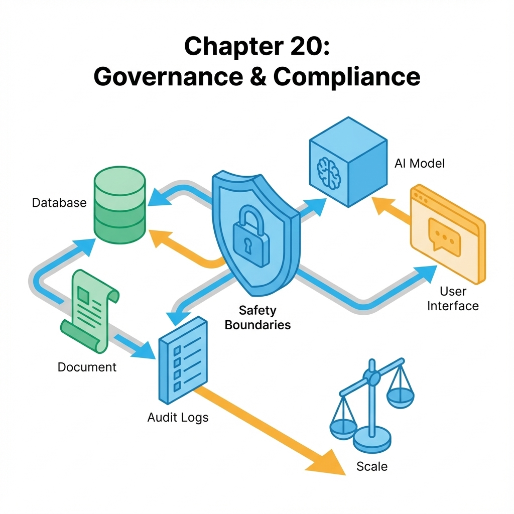
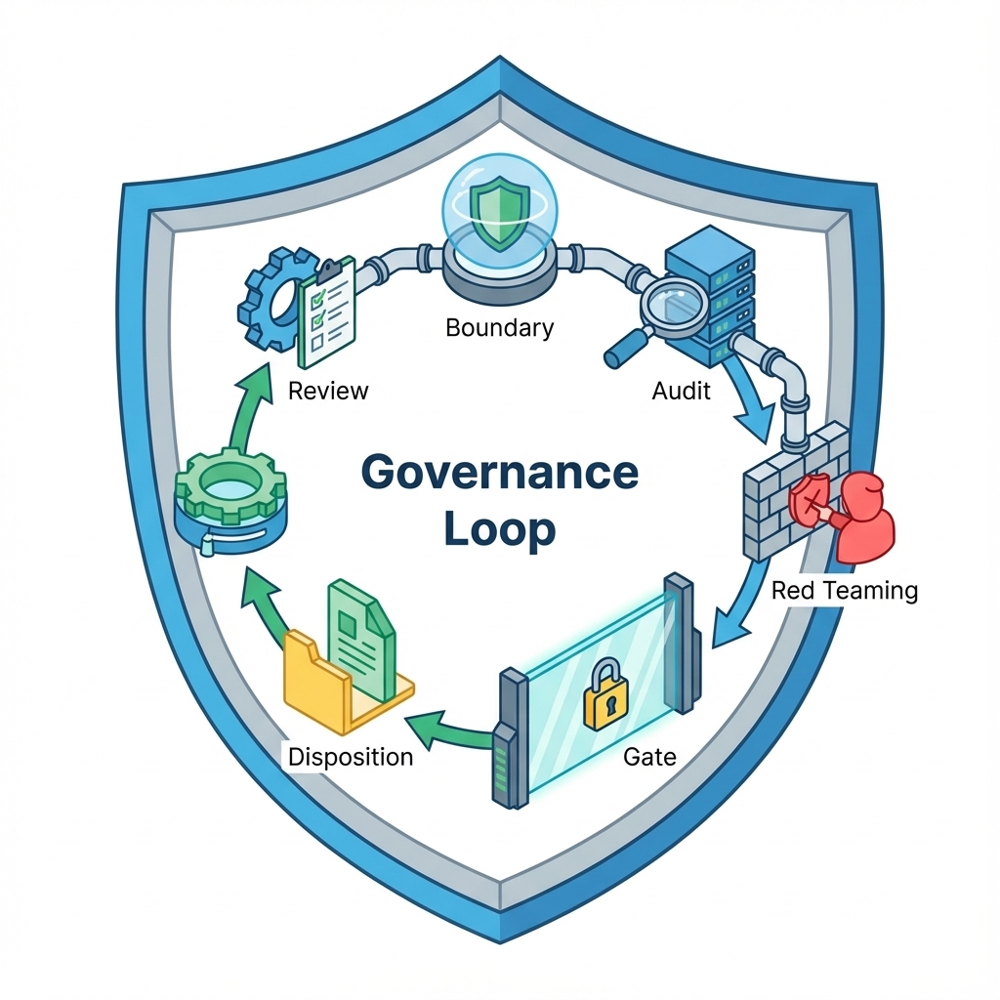

# 第 20 章：合规与伦理：数据、版权与安全边界


> 合规不是上线前盖章，而是你每天做决策时的边界：什么能收、什么能用、什么能展示、什么必须拒绝。边界写不清，增长只是在放大风险。[35][68]

对超级个体而言，合规与治理不是大公司的专利，而是你保护自己与产品的方式：它让你在最小资源下避免致命事故（隐私泄露、版权纠纷、越权访问、危险建议）。这一章的目标是把边界写成可执行规则，并接入审计与门禁。[6]

## 章节定位
本章是全书收束：当你已经能迭代与增长，你必须把风险当作系统默认属性来治理。这里不讨论把所有风险消灭，而讨论如何把风险显性化并可裁决：哪些风险必须阻断，哪些风险允许在边界内灰度试错。[6]

如果你需要一套能和团队/客户/合规对齐语言的通用框架，NIST AI RMF 提供了一个很实用的结构：风险识别、评估、缓解与持续监控不是额外工作，而应该被编织进产品生命周期——尤其是权限、审计、评测门禁与回滚这些系统默认属性。[77]

## 你将收获什么
- 一份边界文档模板：数据边界、版权边界、权限边界、行为边界（拒答与安全）。
- 一份风险登记表：风险等级、触发条件、处置与证据留档。
- 一套治理门禁：越权/泄露/注入/违规内容命中即阻断发布，退化即回滚。[6][68]

## 三层思考：治理是把不可控变成可控
### 第 1 层：读者目标
你要获得一个能保护自己的系统：出了问题能解释、能止损、能追责，必要时能证明你做了合理的防护与管理。[68]

### 第 2 层：论证链条
治理闭环是：

边界定义 → 数据与权限控制 → 审计与留档 → 评测与红队 → 发布门禁 → 事故处置与复盘 → 边界更新

缺边界定义，审计与评测都会失去目标；缺门禁，治理就变成口号。[6]

### 第 3 层：落地与验收
验收的核心是可执行：
- 边界文档能落到具体规则（拒答、过滤、权限校验、展示策略）。
- 审计能回答谁在何时对什么做了什么。
- 红队与回归能拦下高风险输出与越权行为。[6][68]

## 关键流程图（纯文本）：治理闭环（边界→控制→审计→红队→门禁→处置→更新）

```text
边界定义（数据/版权/权限/行为）
  → 数据与权限控制（脱敏/默认拒绝/资源级校验）
  → 审计与留档（trace_id + 版本组合 + 原因）
  → 评测与红队（攻击集/边界集版本化）
  → 发布门禁（命中即阻断）
  → 事故处置与复盘（先止损，再定位）
  → 边界与规则更新（把事故变成回归）
  ↺ 回归集更新（让问题不复发）
```

## 边界文档：把不能做什么写清楚
边界文档不是法律文件，而是工程与产品的共同协议。建议至少包含四类边界：

1) 数据边界：你收集什么、不收集什么；如何脱敏；如何留存与删除。[35]  
2) 版权边界：哪些内容允许训练/检索/展示；引用如何呈现；用户生成内容的权利归属。  
3) 权限边界：租户隔离、资源级授权、导出与分享策略。[68]  
4) 行为边界：模型拒答、风险提示、危险任务的禁止与人工确认。[6]

如果你想让边界更像资产而不是口头约定，一个很实用的抓手是两张卡：数据卡片和模型卡片。它们不需要写得像论文，但必须跟版本绑定，能回答这次上线用了哪些数据、评测结果如何、有哪些已知限制，以及出了问题该如何回滚。[34]



治理闭环的纯文本版本见本章「关键流程图」；这里继续把边界落到可执行规则。

### 边界文档最小可执行版

| 类别 | 必须回答的问题 | 可执行规则示例 |
| --- | --- | --- |
| 数据 | 哪些数据不可进入系统；如何脱敏；如何留存与删除 | 不采集/不出网/脱敏后才可用；敏感数据自动清洗或假名化；非必要数据定期自动删除或归档 |
| 版权 | 引用如何展示 | 必须标注来源；禁止输出受限内容全文 |
| 权限 | 谁能访问哪些资源；资源级授权策略；导出与分享策略 | 默认拒绝；跨租户阻断；按角色授权资源访问；导出需审计；分享链接带有效期与访问控制 |
| 行为 | 何时拒答/何时提示风险 | 命中高风险即拒答或要求确认 |

### 拒答不是关门：给用户留一条能继续走的路
很多人把合规理解成把门焊死：一触发风险就甩给用户一句我不能回答。这样做当然安全，但体验会非常差——用户不知道自己哪里越界，也不知道下一步怎么做，最后的结果往往是：他不是放弃任务，而是换一个更不安全的渠道去完成。

更好的拒答设计像一位有原则的向导：你不会带他去禁区，但你会告诉他边界在哪里、为什么、以及可行的替代路线。把拒绝转化为引导，你就能在不触碰红线的前提下维持交互的流动性，让用户仍然能完成任务的核心部分。

- 降级交付：不能生成受限内容全文时，改为输出结构化摘要、关键要点或公开信息的引用清单。
- 解释边界：用用户能理解的方式说明触发了哪类限制（隐私/医疗/法律/危险操作），并给出合规下一步（例如请咨询专业人士）。
- 引导改写：提示用户把目标改写成模型可安全完成的子任务（例如给出检查清单/问题框架而不是给出诊断结论）。
- 保留升级口：对高风险但可能有合法授权的场景，提供提交授权/人工复核的入口，而不是永远拒绝。

#### 拒答与降级策略：最小可执行实现
把边界写成可执行规则时，最怕两件事：规则只存在文档里，以及规则命中后没有一致的动作与留档。一个更稳的方式是把策略写成规则表，并在每次请求上强制执行与审计。

为把规则与工程连起来，rule_id 应当同时出现在三个地方：边界文档、策略执行器的命中输出（如 `docs/examples/evaluation/enforce_policy_example.py` 的 policy_hits）、以及审计日志的 policy_hits 字段。这样你才能从风险登记表一路追溯到具体门禁与证据。

| rule_id | 触发条件（示例） | 动作 | 是否阻断级 | 对用户交付（示例） | 必须留档 |
| --- | --- | --- | --- | --- | --- |
| cross_tenant | 访问资源 tenant 不一致 | reject | 是 | 拒答并提示申请授权 | trace_id + 规则命中 + 版本指纹 |
| secret_output | 输出包含密钥或系统提示片段 | reject | 是 | 拒答并提示移除敏感信息 | 同上 |
| jailbreak | 检测到越狱或注入意图 | reject | 是 | 拒答并给可行替代路线 | 同上 |
| dangerous_command | 输出包含危险操作建议 | confirm | 是（未确认前阻断） | 提示风险并要求二次确认 | 同上 |
| pii_output | 输出包含 PII | degrade | 视场景 | 脱敏后交付并提示已脱敏 | 同上 |
| copyrighted_fulltext | 输出疑似大段受限内容 | degrade | 视场景 | 改为摘要 + 引用清单 | 同上 |

最小可执行示例（策略执行与自检）：

- 示例脚本：`docs/examples/evaluation/enforce_policy_example.py`
- 运行命令：`python3 docs/examples/evaluation/enforce_policy_example.py`
- 失败判定：脚本退出码非 0 视为策略回归；在 CI 中应阻断发布。

脚本会模拟多种输入并打印 `decision`、`processed_output`、`user_message`、`policy_hits`，同时对内置用例做自检。

验收标准（最低门槛）：
- 阻断级规则命中时，必须拒答或阻断访问，且写入审计日志。
- 降级规则命中时，必须交付可用替代物（摘要、清单、引用），而不是只说不能做。

### 最小审计与证据包：出了事你需要什么
治理不仅是为了把风险挡在门外，更是为了在事故发生后有据可查、能自证尽责。很多项目直到收到投诉或合规问询，才发现日志里全是零碎调试信息：既不能还原当时发生了什么，也不能说明系统有没有启用边界策略。

你需要的是一份最小证据包，它不一定记录所有数据，但必须能回答四个问题：谁触发了什么请求，当时生效的版本是什么，系统为什么这么做（或为什么没拦住），影响面有多大。这份证据包越清晰，你越能把处置从情绪拉回到事实。

证据包目录结构与 `manifest.json` 模板见：[附录 D：证据包与门禁速查](D-evidence-pack.md)。治理场景建议额外把 `policy_hits`、裁决原因与处置动作写进证据包，保证可追责、可复盘。

- 交互快照：用户原始输入、关键上下文（脱敏后）与模型原始输出；必要时包含引用/工具调用摘要。
- 版本指纹：`model_version/prompt_version/index_version/policy_version` 等，使行为可追溯可回放。
- 拦截记录：命中了哪条规则、触发原因、采取了什么动作（拒答/降级/人工确认），以及对应的告警/工单。
- 不可抵赖链路：`request_id/trace_id`、时间戳、主体标识（用户/租户），用于复盘与取证（注意合规脱敏与最小化）。
- 影响面评估：受影响请求范围、是否涉及敏感数据、是否需要通知用户/下线入口、是否需要紧急回滚。

#### 审计日志最小格式（示例）
审计日志要能被查询与聚合，而不是只存在开发者的临时打印里。最小可用的做法是：每次请求产出一行结构化记录，并把它写到专用的审计通道（文件或日志系统）。

| 字段 | 示例 | 用途 |
| --- | --- | --- |
| ts | 2025-12-22T10:30:00Z | 时间线复盘 |
| request_id | req-abc-123 | 定位单次请求 |
| trace_id | trace-def-456 | 串联全链路日志 |
| actor_id | u-123 | 追溯主体（注意最小化） |
| tenant_id | t-001 | 租户隔离与影响面 |
| action | inference | 区分推理/导出/分享等 |
| policy_hits | cross_tenant,pii_output | 哪些规则命中 |
| decision | reject 或 degrade 或 allow | 当时的裁决 |
| version_fp | model=v3 prompt=p12 index=i7 policy=r9 | 行为可回放 |
| input_hash | sha256:... | 在不存原文时做追溯 |
| output_hash | sha256:... | 同上 |

单行示例（key=value，便于落地成 JSONL 或日志字段）：

```text
ts=2025-12-22T10:30:00Z request_id=req-abc-123 trace_id=trace-def-456 tenant_id=t-001 actor_id=u-123 action=inference decision=degrade policy_hits=pii_output version_fp=model=v3 prompt=p12 index=i7 policy=r9 input_hash=sha256:... output_hash=sha256:...
```

持久化与查询最低门槛（示例）：
- 审计日志走独立存储或索引，权限隔离，避免被业务方随意修改。
- 留存至少 180 天（按法规与合同调整），并保留版本指纹以支持回放。
- 验收：拿到一个 trace_id，能在 5 分钟内定位到对应的边界裁决与规则命中记录。

## 风险登记表：把风险变成可管理对象
风险不怕存在，怕不可见。建议你把风险登记表作为持续资产：每次事故与红队都能回写进去。[6]

建议把风险登记表单独放在仓库内可追溯的位置，例如 `docs/books/ai-assisted-software-product/risk-register.md`（或同目录下的 `risk-register.csv`）。每次事故复盘或红队发现都提交一个最小变更：新增或更新一行，并附证据路径（trace_id、回归样本 id、对比报告路径）。

字段建议（最小可用）：risk_id、severity、trigger、gate_rule、owner、status、last_review_at、evidence_paths。

风险等级定义（示例，按你业务调整但要写清）：
- 高：可能导致法律合规风险、数据泄露、服务中断或重大经济损失。默认阻断并触发应急响应。
- 中：可能导致声誉受损、功能降级或少量数据暴露。默认降级或人工确认，并纳入下一次迭代修复。
- 低：主要是体验瑕疵或轻微资源滥用。默认记录并进入后续优化。

### 风险登记表（模板）

| risk_id | severity | trigger（示例） | gate_rule（对应 rule_id） | owner | status | last_review_at | evidence_paths（示例） |
| --- | --- | --- | --- | --- | --- | --- | --- |
| privacy_leak_pii | 高 | policy_hit=pii_output 或 pii_detector=true | pii_output | security | active | 2025-12-20 | trace_id=..., regression_sample=... |
| unauthorized_access | 高 | policy_hit=cross_tenant 或 authz=deny | cross_tenant | engineering | active | 2025-12-18 | trace_id=..., regression_sample=... |
| copyright_fulltext | 中 | policy_hit=copyrighted_fulltext | copyrighted_fulltext | legal | active | 2025-12-15 | audit_log=..., mitigation=summary |
| dangerous_command_injection | 高 | policy_hit=dangerous_command 或 policy_hit=jailbreak | dangerous_command | security | active | 2025-12-21 | trace_id=..., regression_sample=... |

## 治理门禁：把高风险变成阻断级失败
推荐把以下内容纳入阻断级门禁：
- 越权行为（跨租户、资源级权限绕过）。[68]
- 注入/越狱导致的边界突破（泄露提示、绕过拒答）。[6]
- 敏感信息泄露（PII、密钥、机密内容）。[35]
- 高风险内容输出（视你的产品场景定义）。[6]

别把护栏只写在提示词里：规则命中要进回归，门禁要能阻断发布，事后还要能回溯到当时生效的策略与版本。[51][6]

这些门禁要进入回归集：命中即阻断发布，避免线上才发现。[6]

## 示例（可复制）：把治理门禁接入回归与 CI（最小可复跑）
把治理门禁落到工程里，至少要做到：有样本、有报告、有退出码。建议把阻断级风险用例固化成回归样本（按你自己的工程放置位置），每次发布前都复跑一次。

最小跑法（示例，复用第 18 章的脚本）：

回归与门禁的详细解释见：[18-evaluation.md](18-evaluation.md)。

准备输入文件（最小要求）：
- 冻结一批 prompt（阻断级红队 + 高风险业务样本）。
- 用上一稳定版本跑一遍，得到 b；用候选版本跑一遍，得到 a。
- 把同一条 prompt 的 a 与 b 写在同一行记录里，并给出可追溯的 id。

本仓库的演示数据是 `docs/examples/evaluation/sample.jsonl`，字段结构为 `{id,prompt,a,b}`。`judge_pairwise.py` 会产出评审报告（例如 `report.candidate.json`），该报告可作为 `judge_gate.py` 的 candidate 输入；上一轮通过的报告冻结为 baseline。

1) 产出评审报告（输入为 JSONL：`{id,prompt,a,b}`，其中 a 是候选版本输出，b 是上一稳定版本输出）：

```bash
python3 docs/examples/evaluation/judge_pairwise.py \
  --in docs/examples/evaluation/sample.jsonl \
  --judge gemini \
  --model gemini-3-pro-preview \
  --out docs/examples/evaluation/report.candidate.json
```

首次运行时，或你接受当前 `report.candidate.json` 的结果作为新基线时，可将其复制为 `report.baseline.json`：

```bash
cp docs/examples/evaluation/report.candidate.json docs/examples/evaluation/report.baseline.json
```

2) 把上一轮通过的报告冻结为基线（例如保存为 `docs/examples/evaluation/report.baseline.json`），再做门禁判断：

```bash
python3 docs/examples/evaluation/judge_gate.py \
  --baseline docs/examples/evaluation/report.baseline.json \
  --candidate docs/examples/evaluation/report.candidate.json \
  --max-win-rate-drop 0.01 \
  --max-win-count-drop 1 \
  --max-tie-rate-increase 0.03 \
  --max-tie-count-increase 5
```

注意：上述 `--max-win-rate-drop`、`--max-win-count-drop` 等参数为示例阈值。先用最近几次通过的报告估算自然波动，再把阈值设置在可接受风险范围内；阻断级样本应单独要求 100% 通过。

失败判定：`judge_gate.py` 退出码非 0 即阻断发布。

对 RAG 链路，可同时运行 RAGAS 门禁（离线跑，退出码表示通过或失败）：

输入文件格式（JSONL，每行一个对象）：`{question,answer,contexts}`

| 字段 | 类型 | 说明 |
| --- | --- | --- |
| question | string | 用户问题 |
| answer | string | 模型回答 |
| contexts | list[string] | 检索上下文列表 |

示例文件见 `docs/examples/evaluation/ragas_sample.jsonl`，文件内容必须是严格 JSON。

```bash
python3 docs/examples/evaluation/ragas_gate.py \
  --in docs/examples/evaluation/ragas_sample.jsonl \
  --threshold-faithfulness 0.85 \
  --threshold-answer-relevancy 0.70 \
  --threshold-context-precision 0.60
```

注意：上述阈值为示例。应以基线为参照，结合可接受风险与成本开销设置阈值，并在低于阈值时阻断发布。

失败判定：`ragas_gate.py` 退出码非 0 即阻断发布。

## 复现检查清单（本章最低门槛）
- 边界文档可执行：数据/版权/权限/行为边界写清楚，并能落成可运行门禁。[35][68]
- 风险登记表持续更新：事故与红队样本能回写，且每条都有处置结论与证据包路径。[6]
- 阻断级门禁进入回归：越权/泄露/注入命中即阻断发布，并要求最小复现与修复验证。[6][68]
- 审计可用：关键行为可追溯可查询，支持复盘与对外解释（含 trace_id 与版本组合）。[68]

## 常见陷阱（失败样本）
1. **现象：** 出了事故才发现没有边界定义；团队在压力下临场“拍合规”。  
   **根因：** 边界只存在脑子里或口头约定，无法落到可执行规则与门禁。[6]  
   **复现：** 让三个人分别回答“哪些数据可以进入训练/索引、哪些必须拒绝、越权如何处理”，出现多套口径。  
   **修复：** 写边界文档并落到规则表：拒答/过滤/权限校验/展示策略一致；把阻断级门禁接入发布流程。[6]  
   **回归验证：** 用固定边界样本集复跑：命中规则能产出一致的 `policy_hit` 与审计字段；命中阻断项时发布门禁稳定失败。

2. **现象：** 安全评测做了，但上线后还是被绕过；攻击像偶发事故一样反复发生。  
   **根因：** 红队不进回归；没有“命中即阻断”的红线门禁；修复没被固化。[6]  
   **复现：** 用固定注入/越权/泄露用例复跑：离线能命中，但发布流程没有阻断；或修复后下一次迭代又复发。  
   **修复：** 攻击样本常态化回归并版本化；命中即阻断发布；触发样本写入阻断级回归与风险登记表。[6]  
   **回归验证：** 红队集进入 CI 门禁：命中率保持 0%；修复后复跑能稳定通过，且审计/拒答口径一致。

3. **现象：** 合规要求来了才补，成本极高；产品被迫停更或大规模返工。  
   **根因：** 数据许可、留存、删除与脱敏没提前设计；没有可审计的证据链。[35]  
   **复现：** 需要响应导出/删除请求或审计时，找不到数据来源与授权链条，也无法证明删除生效或训练未使用受限数据。  
   **修复：** 数据边界与留存策略先行：`consent_state`、脱敏与删除流程进入日常流水线；敏感数据进入阻断门禁与回归。[35]  
   **回归验证：** 用固定用例验证：导出/删除请求可执行且可审计；PII 扫描/脱敏回归稳定通过；数据快照与许可可追溯到来源与版本。

## 交付物清单与验收标准
- 边界文档（数据/版权/权限/行为）与可执行规则示例。[35][68]
- 风险登记表与处置流程（含证据留档）。[6]
- 阻断级门禁与回归集（越权/泄露/注入）。[6][68]

## 结语
当你能用证据做决策，用门槛做裁决，用回滚治理不确定性，你就拥有了一个人也能持续交付的系统能力。这不是天赋，而是一套可以被复用的纪律。

## 参考
详见本书统一参考文献列表：[references.md](references.md)。
