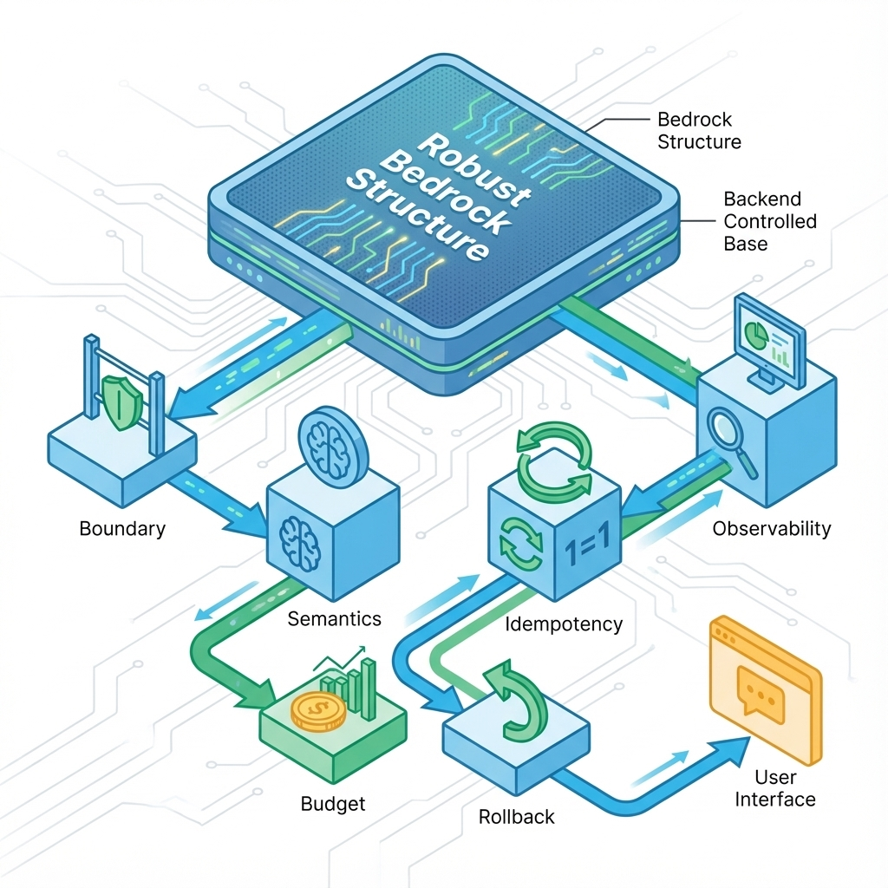

# 第 9 章：后端架构：边界、幂等与可观测

在软件产品，尤其是由人工智能驱动的产品开发中，后端系统常常扮演着幕后英雄的角色。然而，英雄并非永不犯错。许多团队在产品初期，往往将重心放在前端的视觉呈现和用户体验上，而对后端则抱着能跑就行的态度。殊不知，后端系统并非简单地把接口跑通即可，它更像是一个复杂的风险管理系统。它需要确保错误语义一致、请求可安全重放、运营成本可有效止损，并且在事故发生时能够迅速追责与复盘。忽视这些，产品最终可能面临能跑但不稳或稳但太贵的困境，尤其在AI时代，一次看似微小的改动，都可能导致调用量、上下文长度或工具链的急剧放大，使得成本与延迟如潮水般涌来，最终将整个产品淹没。

AI产品的后端开发，由于模型输出的不确定性、外部工具链的依赖性以及数据质量的波动性，使得系统面临的不确定性远超传统应用。我们必须从一开始就将这些不可控因素纳入设计考量，将风险关进笼子里。本章旨在为您提供一套构建稳健、可控、且具备成本意识的AI产品后端架构方法论，确保您的系统不仅能运行，更能穿越时间的考验，承载业务的增长。

## 章节定位

本章承接前端的状态与可恢复这一核心理念，旨在全面补齐系统底层架构的关键支柱。我们将深入探讨服务边界的划定、统一错误语义的定义、幂等性与重试机制的构建、审计与可观测性的实施，以及在AI场景下如何有效控制成本。这些内容是构建任何高可用、高扩展性系统的基石，尤其与后续的用户管理和计费章节紧密相关。在这里，我们首先关注这些作为通用底座的技术原则与实践，而更具体的业务细节将在后续章节中逐步展开。

## 你将收获什么

通过本章的学习，您将获得一套系统性的后端设计与实践框架。首先，您将学会如何精准地划定服务边界，明确哪些任务应纳入同步链路以保证用户体验，哪些可放入异步/后台处理以提升系统弹性，以及最关键的，哪些功能必须设计降级路径以应对外部依赖不可用时的挑战。其次，您将掌握一套成熟的幂等性与重试策略，这将帮助您将网络抖动、偶发失败等不可预测的事件转化为系统设计中可处理、可恢复的常态，而非紧急线上事故。最后，本章将指导您建立一套完善的可观测性与审计口径，确保系统能够自解释，让您在面临问题时能够迅速定位、高效复盘，并能够重放关键操作，彻底摆脱只能祈祷的无奈局面。

## 后端要对不可控负责

在构建后端系统时，我们必须跳出单纯实现功能的思维，转而从风险管理和系统韧性的角度进行考量。这种思考模式可以概括为三个层次，逐层深入，确保我们交付的不仅仅是代码，而是一个真正意义上敢上线的产品。

先把这章要解决的核心矛盾和边界说清楚。

你的终极目标是交付一个能够在生产环境中稳定运行、经受住真实用户考验的系统。这意味着它必须具备强大的自恢复能力，能够在部分组件失效时依然保持核心功能；当系统性能退化时，能够迅速回滚到稳定版本；并且所有的行为和资源消耗都必须是可解释、可追溯的。在AI产品中，这一点尤为重要，因为AI服务的波动性和高成本特性，使得可恢复、可回滚、可解释成为了构建信任和控制风险的生命线。一个负责任的后端，就是要把用户的信任和公司的资源牢牢守护。

再把从问题到方案再到验收的推演补齐。

后端系统的稳定性并非一蹴而就，它是一个环环相扣的逻辑链条。这个链条始于清晰的服务边界划分，明确了每个模块的职责；进而催生出严谨的契约定义和错误语义，确保系统各部分之间能够准确沟通，即便失败也能提供清晰指引。在此基础上，幂等性与重试机制保障了操作的可靠性，使得网络波动不再是灾难。而可观测性与审计机制则提供了上帝视角，让系统运行状况一览无余，所有关键行为均可追溯。最后，通过成本与限额控制，以及灰度发布与回滚策略，我们将不确定性转化为可治理的范畴。每一个环节都承载着将随机性转化为可控变量的重任，共同构筑起系统的坚实底座。

最后落到可执行的门禁、证据与回滚。

验收一个后端系统，绝不仅仅是检查接口返回的HTTP 200状态码那么简单。真正的验收标准，是检验系统在面对真实世界复杂性和不确定性时的韧性。首先，当系统发生错误时，用户是否能得到明确的反馈和可执行的指示，系统内部是否能自动或半自动地进行恢复操作？其次，所有关键的用户行为和系统操作是否都有详尽的审计记录，能够清晰地追溯谁在何时、对什么数据、做了什么操作、最终结果如何？这对于排查问题、合规审计乃至法律追责都至关重要。最后，也是在AI产品中日益凸显的关键点：当成本或延迟超出预设阈值时，系统是否能智能地自动止损、降级服务，甚至暂时关闭高成本功能，以避免不必要的财务损失和用户体验雪崩？唯有通过这些严苛的验收，我们才能确保交付的是一个真正成熟、可靠的后端。

## 方法论速览：先定边界，再定语义，再定止损

构建一个健壮的后端系统，犹如建造一栋摩天大楼，必须遵循严谨的工序。我们的方法论核心是先定边界，再定语义，再定止损，这如同为系统构建了一个清晰的蓝图，规定了沟通的语言，并设置了应急预案。以下图所示，它是一个从宏观到微观、从静态到动态的逐步细化过程。

### 1) 服务边界：把高不确定性隔离出去

在AI驱动的产品中，系统的高不确定性是常态，而非异常。模型输出的波动、外部API的稳定性、网络延迟、甚至用户输入的数据质量，都可能引入难以预测的风险。因此，清晰地划定服务边界，将这些高不确定性因素隔离，是构建弹性系统的第一步。这好比在复杂的城市规划中，将高风险工业区与居民区严格分开，以保障整体的安全。

具体而言，我们需要划定三条核心边界：**同步链路**、**异步链路**和**降级路径**。同步链路是用户等待期间必须完成的最短路径，其核心目标是极致的低延迟和高可用，任何可能引入不确定性的操作都应尽可能避免或简化。例如，一个用户请求生成AI图片，图片生成本身是高耗时的，但请求已提交的响应必须是同步且快速的。与此相对，**异步链路**则承载了那些可后台执行、可重试、可延迟的工作，例如图片真正生成、模型训练、数据导入、报表生成等。这类任务天然适合通过消息队列进行解耦，即使短暂失败也能通过重试机制最终完成，且不会阻塞用户界面。最后，**降级路径**是系统韧性的终极保障。当AI模型、外部依赖或关键服务不可用时，系统如何退一步也能工作？这可能意味着提供一个简化的默认答案、使用本地缓存数据、或者暂时禁用部分高级功能，以确保用户体验不至于完全中断。例如，在一个智能客服系统中，如果AI模型响应超时，可以迅速切换到基于关键词的传统FAQ匹配，甚至直接提示用户联系人工客服，而非让请求无限挂起。

### 2) 契约与错误语义：让失败可行动

当边界清晰后，下一步便是明确系统内部以及系统与外部世界的沟通方式，特别是面对失败时的沟通。一套清晰、统一的契约和错误语义，不仅是开发团队内部协作的基石，更是产品在面对用户时展现专业性和可控性的关键。错误语义的有效性体现在两个维度：对用户而言，他们能清晰地理解发生了什么，并知道下一步该怎么做；对工程团队而言，错误信息必须能够精准地指向问题根源，方便快速定位和修复。

例如，设想一个用户在尝试上传大文件时遇到问题。如果系统仅仅返回一个模糊的服务器错误，用户会感到困惑和沮丧。但如果返回文件大小超出限制，请上传小于100MB的文件（错误码：4003），用户就清楚地知道了原因和解决方案。在工程层面，错误码4003可以被设计为与特定的业务逻辑或系统模块关联，便于开发人员通过错误日志快速追踪到是哪个校验规则被触发。以下提供一个错误语义表的模板，帮助您系统化地定义和管理错误：

| 错误码/类型 | 用户看到什么 | 用户能做什么 | 是否可重试 | 是否需要告警 | 备注 |
|---|---|---|---|---|---|
| `INVALID_INPUT` | "您输入的内容不符合要求，请检查第X字段。" | 修改后重试 | 否 | 否 | 通常前端可拦截，后端做最终校验 |
| `TIMEOUT` | "请求处理超时，我们已为您保留进度，请稍后再试。" | 重试/查看进度 | 是 | 视阈值 | 需幂等，可能涉及异步任务 |
| `PERMISSION_DENIED` | "您没有权限执行此操作。" | 申请权限/切换账号 | 否 | 是 | 需审计，记录非法访问尝试 |
| `SERVICE_UNAVAILABLE` | "服务暂时不可用，请稍后再试。" | 稍后重试 | 是 | 是 | 高级告警，可能涉及核心服务故障 |
| `AI_MODEL_ERROR` | "AI模型处理失败，请稍后重试或尝试简化输入。" | 稍后重试/调整输入 | 是 | 是 | AI场景特有，可能涉及模型稳定性 |

通过这样的表格，每个错误都有明确的职责和处理流程，避免了因错误信息模糊而导致的混乱和低效。

### 3) 幂等与重试：把重复请求变成默认情况

在分布式系统和微服务架构中，网络波动、服务重启、超时重传等因素使得重复请求成为一种常态，而不是罕见的异常。许多新手开发者在设计系统时，往往假设每个请求都是唯一的，这在单体应用时代或许尚可，但在现代复杂架构中，这种假设是极其危险的。正确的姿势不是寄希望于请求别重复，而是从一开始就设计系统，使其能够优雅地处理重复请求，即实现**幂等性**。一个幂等的API，无论被调用一次还是多次，其对系统的影响始终与调用一次相同。

设想一个用户点击购买按钮后，由于网络延迟，按钮长时间无响应，用户可能因此反复点击。如果没有幂等性设计，用户账户可能被多次扣款，商品也可能被多次购买，这无疑是灾难性的。实现幂等性的核心在于为每个可能产生副作用的操作赋予一个**幂等键（Idempotency Key）**，这个键在客户端生成并随请求发送，服务端则利用这个键来识别并处理重复请求。例如，对于创建订单的操作，可以使用客户端生成的唯一订单号作为幂等键。当收到重复的请求时，服务器会检查该幂等键是否已处理，如果已处理，则直接返回上次的结果，而不再执行实际的业务逻辑。

重试机制则是幂等性的孪生兄弟。在网络瞬时抖动、服务短暂过载等情况下，客户端进行适当的重试可以有效提高请求的成功率。然而，重试并非盲目，它需要明确的策略，例如：何时重试、重试几次、每次重试间隔多久（指数退避是常用策略）、以及何时停止重试并宣告失败。此外，所有外部回调（如支付通知、消息队列消费）都应设计成可重放，以便在对账、数据修复和复盘时能够精确重现历史状态。以下是幂等设计卡的模板，帮助您系统化地思考和实现幂等性：

| 动作 | 副作用 | 幂等键来源 | 重试策略 | 冲突处理 | 证据留档 |
|---|---|---|---|---|---|
| 创建订单 | 写账本/扣费 | `client_order_uuid` (客户端生成) | 指数退避 (3次) + 随机抖动 | 重复请求返回首次成功结果 | 审计日志记录每次请求与结果 |
| 导入数据 | 写入/索引大量数据 | `import_session_id` (客户端/服务端协商) | 后台任务自动重试，支持断点续传 | 识别已导入部分，仅处理未完成部分 | 导入报告、操作日志 |
| 更新用户资料 | 修改数据库记录 | `user_id` + `update_transaction_uuid` | 客户端失败后提示用户手动重试 | 乐观锁或版本号机制 | 变更日志 |

### 4) 可观测与审计：让系统能解释自己

在复杂的分布式系统中，仅仅依靠猜测和经验来定位问题，无异于盲人摸象。一个能解释自己的系统，能够清晰地告诉我们它的运行状态、健康状况以及在关键时刻发生了什么。这便是可观测性与审计机制的价值所在。在0→1阶段，我们不必追求大而全的监控指标，但必须能够快速定位关键链路，理解用户体验和系统行为。

可观测性通常涵盖三个主要支柱：**日志 (Logs)**、**指标 (Metrics)** 和**追踪 (Traces)**。首先，**日志**是系统运行的详细记录，但它们必须是结构化的，包含诸如`request_id`、`user_id`、`action`等关键字段，这样才能在海量的日志中轻松地串联起一次请求的完整生命周期，甚至跨越不同的服务。其次，**指标**是系统健康状况的量化体现，例如失败率、延迟（P50、P95）、吞吐量、资源消耗（CPU、内存、网络）以及在AI场景中至关重要的成本指标。这些指标应设立明确的阈值，并在越界时触发告警。最后，**追踪**（如基于OpenTelemetry或类似的分布式追踪系统）能够可视化请求在不同服务间的调用路径和耗时，尤其有助于排查微服务架构中的性能瓶颈和依赖问题。即使在初期，至少也要能通过一个`request_id`关联起入口请求与关键下游调用，这是定位复杂问题的最低要求。

一个完善的**审计**机制则提供了一个不可篡改的历史记录，记录了谁、何时、对什么数据做了什么操作。这对于合规性、安全性和事后追责至关重要。例如，在一个AI产品中，用户对模型提示词的修改、生成内容的请求、以及模型返回结果的记录，都应纳入审计范畴。

以下是最小可观测字段规范的模板，确保您的系统日志具备基本的诊断能力：

| 字段 | 为什么必须 | 例子 |
|---|---|---|
| `request_id` / `trace_id` | 串联一次请求的全链路，跨越服务边界。 | `gen_uuid()` 在入口生成并透传至所有下游服务。 |
| `user_id` / `tenant_id` | 定位问题影响范围，区分多租户环境。 | `auth_token` 中提取，记录为日志字段。 |
| `action` | 业务语义，描述当前操作的业务目的。 | "image.generate.start", "text.summarize.success" |
| `result` | 操作的成功或失败状态，以及失败原因。 | "success", "fail:invalid_api_key", "fail:timeout" |
| `latency_ms` | 衡量用户体验和系统性能，识别性能瓶颈。 | `time.now() - start_time` 计算，记录P50/P95。 |
| `cost` | AI场景专属，用于成本核算和止损。 | `token_count * token_price`, `api_call_count * api_price` |

### 5) 成本守门：把预算写进系统默认值

在AI产品中，成本不再是季度财务报表上的一个数字，它已内化为系统运行时行为的一个核心考量。AI模型的推理、上下文长度的增加、复杂的工具调用链，都可能在短时间内消耗巨额资源。因此，在系统设计之初，就必须将预算这个概念写入代码，使其成为系统自动决策和行为的基础。这就像在建造一座桥梁时，不仅要考虑其承重能力，更要预设在超载时如何安全地进行保护性降级。

你需要建立一个三层式的预算管理体系来为AI场景守门：**单次请求预算**、**用户/租户预算**和**全局预算**。

**单次请求预算**关注每一次API调用或AI推理的资源消耗。如果单次请求的成本（如token数量、计算时间）或延迟超出预设阈值，系统应立即采取降级措施。这可能意味着：减少AI模型的上下文长度、跳过昂贵的重排或优化步骤、或者暂时禁用部分依赖外部工具的复杂功能。例如，一个摘要服务，当检测到输入文本过长且即将超出预算时，可以自动截断文本或切换到更小、更快的模型进行摘要，优先保证可用性而非极致效果。

**用户/租户预算**则是在更宏观的层面进行控制。每个用户或租户都有其每日、每周或每月可消耗的AI资源上限。一旦达到这个上限，系统可以采取限流、切换到低成本模型、或提示用户升级套餐等措施。这有效防止了单个恶意用户或失控的自动化任务耗尽所有资源。

**全局预算**是最终的防线。它监控整个系统的总消耗。当出现异常尖峰（可能是遭受攻击、突发流量或内部BUG）导致全局成本迅速飙升时，系统应能自动触发止损机制，例如临时关闭所有高成本的AI功能，或将服务降级到最低可用状态，从而保护公司的现金流，避免不必要的财务风险。

以下提供一个预算与降级策略的模板，帮助您将成本控制转化为可执行的系统行为：

| 预算层级 | 监控指标 | 阈值 | 越界动作 | 回滚条件 |
|---|---|---|---|---|
| 单次请求 | Token消耗/延迟 | `> 5000 tokens` 或 `> 5秒` | 减少上下文，切换至更小模型，跳过重排 | 指标恢复正常，或人工干预 |
| 用户/租户 | 日常消耗总金额 | `> $100` / 天 | 提示用户升级，后续请求限流至基础功能 | 次日零点自动重置，或人工审批 |
| 全局 | 小时峰值消耗 | `> $1000` / 小时 | 临时关闭所有高成本AI功能，触发紧急告警 | 人工解除降级，确认风险已排除 |

## 两个具体案例

### 案例一：智能报告生成服务的幂等性保障

某SaaS公司开发了一款智能报告生成服务，用户可以上传大量数据，AI模型根据数据生成复杂的商业报告。用户完成数据上传后，会触发一个后台任务来处理数据并生成报告。考虑到数据量大、AI模型推理耗时，以及分布式任务队列的特性，系统面临着任务重复执行、数据重复处理甚至报告重复生成的风险。

**解决方案**：团队设计了一个强幂等性的任务处理流程。每当用户提交报告生成请求时，客户端会生成一个唯一的`report_request_id`。这个ID随请求发送到后端，并作为幂等键存储在数据库中。后端服务在接收到请求后，首先检查`report_request_id`是否已存在且处于已完成状态。如果存在且已完成，则直接返回之前生成的报告链接；如果不存在或未完成，则记录该`report_request_id`并启动新的报告生成异步任务。异步任务在执行过程中，会再次检查该ID对应的状态，确保不会重复处理。即使消息队列因为网络波动重发了同一任务消息，或者用户重复点击了提交按钮，系统都能通过这个`report_request_id`识别并忽略重复操作，最终只生成一份报告，并避免了重复计费和资源浪费。

### 案例二：AI智能客服的自适应降级策略

一家电商平台推出了AI智能客服，用户可以通过对话与AI进行商品咨询、订单查询等操作。核心系统依赖于大型语言模型和复杂的知识图谱检索。为了保证在高并发和外部模型不稳定的情况下依然提供服务，团队设计了一套多层降级策略。

**解决方案**：
1.  **模型级别降级**：当主语言模型（如GPT-4）响应延迟过高或频繁报错时，系统会自动切换到成本更低、响应更快的备用模型（如GPT-3.5或内部微调模型），虽然对话质量可能略有下降，但服务依然可用。
2.  **功能级别降级**：对于一些依赖知识图谱的复杂查询（如这款手机的历史价格波动趋势），如果知识图谱服务异常，系统会自动降级，只回答简单商品信息，并提示用户当前无法提供复杂查询，请稍后重试。
3.  **最终降级**：如果AI服务完全不可用，系统会直接引导用户跳转到FAQ页面，或转接到人工客服，确保用户的问题有最终的解决路径。
4.  **成本降级**：结合预算守门机制，当用户在短时间内发送大量复杂请求导致成本激增时，系统会自动将该用户的对话模式切换到更精简、更低成本的模式，或在达到设定的消费上限后，提示用户您的AI服务今日已达上限，如需继续使用请升级套餐。

通过这些多维度的降级策略，电商平台确保了AI智能客服在高压和不确定性环境下依然能够提供稳定且有成本控制的服务，极大地提升了用户满意度和业务稳定性。

## 常见陷阱（失败样本）

尽管有最佳实践，但在实际操作中，团队仍可能因为对后端系统复杂性估计不足，或受限于短期交付压力，而陷入一些常见陷阱。这些失败样本往往代价高昂，值得我们引以为戒。

1.  **现象**：线上偶发错误难以定位，全靠猜。开发人员面对用户反馈的系统出错，往往陷入漫无边际的日志大海中，耗费数小时甚至数天才能勉强锁定问题范围。
    **根因分析**：这种混乱的局面，通常是由于缺乏统一的`request_id`或`trace_id`来串联请求全链路，关键日志字段缺失，以及没有统一的错误语义导致的。当日志是散乱的、没有关联性的文本，错误信息又是模糊的内部错误时，系统就失去了解释自己的能力。
    **惨痛教训**：一个创业公司曾因一个偶发的支付回调错误，导致用户订单状态不一致，财务账目混乱。由于日志缺乏`trace_id`，且错误信息不够具体，团队耗费了近一周才定位到是支付网关的异步通知偶发丢包，且内部重试逻辑失效。这期间，不仅客服压力巨大，更有用户因体验不佳而流失，直接影响了公司的声誉和现金流。
    **修复建议**：从项目启动阶段就强制规范化日志输出，确保每个请求都有唯一的`request_id`并透传到所有下游服务。定义清晰的错误码和错误信息，让用户和工程师都能理解。将可观测性视为核心功能而非事后补充。

2.  **现象**：接口偶尔重复执行，导致数据错乱或多扣费，影响用户体验和财务准确性。
    **根因分析**：这种问题的核心在于将重复请求视为异常，而非分布式系统中的常态。团队在设计时没有充分考虑网络抖动、客户端重试、消息队列重投等场景，缺乏幂等性保护。
    **惨痛教训**：一个在线教育平台的用户，在购买课程时遭遇网络延迟，多次点击购买。由于后端没有幂等设计，用户被重复扣费了三次。虽然最终通过人工退款解决了问题，但用户对平台的信任度降至冰点，并在社交媒体上抱怨，给品牌带来了负面影响。更严重的是，这种人为退款的流程增加了运营成本，且容易出错。
    **修复建议**：识别所有可能产生副作用的关键操作，并为它们设计幂等机制，通常是引入幂等键。确保重试策略明确且幂等。对于外部回调，要支持可重放，并有对账机制。

3.  **现象**：AI功能上线后，成本飙升，超出了业务预期，甚至威胁到公司利润。
    **根因分析**：将AI产品中的更聪明等同于无上限的资源消耗，没有在系统层面融入预算控制和降级路径。对AI模型的调用成本、token消耗、以及复杂工具链的潜在开销缺乏精确预估和实时监控。
    **惨痛教训**：一家AI内容生成初创公司，在推出一款基于大型语言模型的自动文案生成服务后，用户反响热烈，但很快就发现成本以惊人的速度增长。由于没有单次请求的token限制和全局预算的自动止损机制，一个恶意用户利用漏洞进行提示词注入攻击，大量消耗模型资源，导致公司在短短一天内就产生了数万美元的额外成本，几乎耗尽了当月的云服务预算。
    **修复建议**：将成本控制内化到系统设计中，建立多层预算体系（单次请求、用户/租户、全局）。当成本或延迟达到阈值时，自动触发降级、限流或关闭高成本功能。将成本指标纳入核心可观测范围，并设置告警。

## 读者练习

为了更好地理解和掌握本章内容，请尝试完成以下练习：

1.  **定义您的服务边界**：选择您正在开发或熟悉的一个AI产品功能（例如：AI智能客服的某个子功能，或一个AI辅助内容创作工具）。尝试将其操作拆分为同步链路、异步链路，并思考在核心AI模型不可用时，如何设计一个可用的降级路径。
2.  **完善错误语义表**：针对您选择的AI产品功能，参考本章的错误语义表模板，列出至少 5 种您认为最常见的错误场景，并为每个错误定义用户可见信息、用户可执行操作、是否可重试、是否需要告警，并添加备注。
3.  **设计幂等性方案**：在该AI产品功能中，识别一个会产生副作用的关键操作（如提交AI生成任务、保存AI生成内容）。思考如何为该操作设计一个幂等键，幂等键的来源是什么，并描述当重复请求到来时，系统如何处理以保证幂等性。
4.  **构建最小可观测性规范**：根据您选择的功能，列出您认为在日志中必须包含的最小可观测字段（参考本章模板）。请解释每个字段为什么是必须的，并提供其在实际代码中可能的获取或生成方式。
5.  **制定AI成本守门策略**：假设您的AI产品功能平均单次调用成本为 0.05 美元，预计每个用户每月合理消耗为 50 美元。请设计一套包含单次请求预算、用户预算和全局预算的成本守门策略，明确每个预算层级的阈值、越界动作和回滚条件。

## 延伸阅读

- [后端技术深度解码：7大模块构建高并发系统的核心骨架与实战引擎](https://blog.csdn.net/weixin_49707375/article/details/146430825)
- [从原理到实战，拆解高并发系统幂等性设计](https://zhuanlan.zhihu.com/p/20640678177)
- [架构师必知必会，聊聊后端架构设计的演进](https://cloud.tencent.com/developer/article/2313982)
- [构建高效可扩展的后端架构：从设计到实现](https://bbs.huaweicloud.com/blogs/456092)
- [DDD 实战课 | LEARN-BOOK - GitHub Pages](https://abc0721.github.io/learn-book/ddd/)
- [构建高效后端服务：微服务架构的深度剖析与实践](https://developer.aliyun.com/article/1643519)
- [后端 - 系统架构演进梳理](https://segmentfault.com/a/1190000045062994)
- [边界：微服务的各种边界在架构演进中的作用](https://github.com/yonoel/ddd-reality/blob/master/15  边界：微服务的各种边界在架构演进中的作用？.md)
