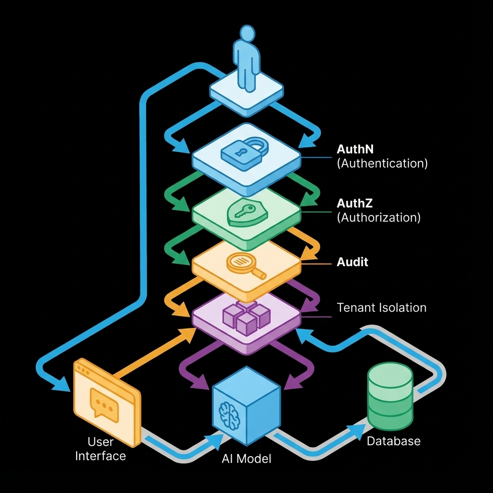

# 第 11 章：用户模块：认证、授权与审计

在构建任何面向用户的软件产品，特别是AI辅助产品时，我们往往会聚焦于核心功能的创新和用户体验的优化。然而，有一个看似基础却至关重要的模块，常常被低估其复杂性和战略价值——那就是用户模块，涵盖了认证（Authentication, AuthN）、授权（Authorization, AuthZ）与审计。许多初创公司在能登录即能上线的简化思维下匆匆推出产品，却不知这正是埋下未来事故隐患的温床。当产品规模扩大，用户数据、团队协作、计费系统等需求浮现时，权限边界模糊、审计机制缺失、账号体系脆弱的技术债便会集中爆发，轻则频繁返工，重则导致数据泄露或法律风险。

AI产品的出现，更是将用户模块的风险属性几何级放大。在传统应用中，越权访问可能仅限于页面数据；但在AI应用场景下，一旦授权机制存在漏洞，泄露的可能不只是敏感的用户信息，还包括企业核心的知识库、精心调校的提示词、AI工具调用的私密结果，甚至是关键的审计日志本身。这要求我们必须将默认安全作为系统固有的属性来设计，而非仅仅依靠开发者的记忆或临时的校验来保障。本章将把用户模块视为整个生产系统的底座，旨在构建一个边界清晰、可追溯、可回滚、具备高可靠性的安全基石。

## 章节定位

为何用户模块会在诸多产品特性之后，于产品模块阶段被单独强调？原因非常实际且深刻。许多人认为用户登录是产品最基本的功能，应该在最早阶段完成。然而，0到1阶段，一旦产品开始涉及数据保存、内容共享、团队协作、订阅计费或私有知识库等任何需要区分谁能看到什么、谁能做什么的场景，一个设计严谨的身份与权限体系就变得不可或缺。如果不在早期就对身份与权限边界进行清晰的界定和实现，那么后续所有关于数据隔离、功能访问控制、计费策略的讨论和开发，都将在同一个基础问题上反复纠缠、反复返工。例如，构建一个团队知识库功能，如果缺乏明确的权限体系，你将难以回答团队成员A能否编辑团队B的文档？、普通用户能否查看高级功能？、管理员能否强制删除用户数据？等核心问题，这直接影响产品的功能定义和交付质量。

## 你将收获什么

通过本章的深入探讨与实践指导，读者将能够构建一个稳健可靠的用户模块。具体而言，你将获得一个可灵活迁移的系统底座，它将清晰地划分认证（AuthN）与授权（AuthZ）的层次，确保多租户环境下的严格隔离，并支持细粒度的资源级权限控制。此外，你还将掌握一套统一的审计口径，明确关键事件、字段和追踪标识，确保每一次重要操作都能被完整记录，使任何安全事故都可被有效复盘与追责。最终，你将建立起一道最小化、最严格的安全门禁，能够有效阻断越权行为，对所有敏感操作进行可追溯的记录，并设计出凭证策略的可回滚机制，从而最大程度地降低潜在风险，保障系统的稳定与安全。

## 用户模块的价值不是登录，是边界

用户模块的真正价值并非仅仅在于提供一个登录入口，而在于它所构建的边界——这道边界清晰地定义了谁是谁、谁能做什么、谁能访问什么。这深层次的价值需要我们从目标、逻辑和实践三个层面进行剖析。

先把这章要解决的核心矛盾和边界说清楚。

你的核心目标是交付一个可托付的系统底座。这意味着这个底座必须具备权限清晰的特性，让每一个用户和每一个操作都拥有明确的权限范围；同时，它要确保在任何越权尝试发生时，系统能够有效回归到安全状态，即能够及时发现并阻断非法操作；更重要的是，所有关键操作都必须可追溯，确保在发生问题时，能够迅速定位责任，分析原因。这不仅仅是技术实现，更是一种对系统安全性和可信赖性的郑重承诺。

再把从问题到方案再到验收的推演补齐。

构建可靠用户模块的背后，是一条严密的逻辑链条，任何一环的缺失都可能导致系统安全性的崩溃。这条链条始于**身份体系（AuthN）**，明确用户是谁，确保其身份的真实性与唯一性；接着是**权限模型（AuthZ）**，定义了用户能做什么，界定其在系统中的操作范围；在此基础上，**租户隔离**则保障了多用户或多组织间数据的独立性和安全性，防止数据泄露和混淆；随后，**审计事件**将所有关键操作记录下来，为事后追溯和责任认定提供依据；为了验证这套体系的健壮性，**回归用例**是必不可少的，通过模拟各种攻击和异常情况来测试权限边界的有效性；最后，**变更与回滚**机制确保了权限策略调整的平滑进行和风险控制。这条链条上的任何一个环节出现疏漏，都可能导致安全防线土崩瓦解，使整个系统陷入人的记忆这种最不可靠的安全保障方式中。

最后落到可执行的门禁、证据与回滚。

用户模块的验收并非基于看起来没问题的表面现象，而是要通过三条硬性门槛进行严格验证。首先，**任何跨租户的访问尝试都必须在服务端层面被明确阻断**，而非仅仅通过UI界面隐藏来营造一种无法访问的假象。这是数据隔离的基石，确保即便是绕过前端的恶意请求也无法触及其他租户的数据。其次，**所有敏感操作都必须产生详细的审计事件记录**，这些记录需清晰指明谁（who）、何时（when）、对什么资源（what）、做了什么操作（action）以及操作结果如何（result）。这为事后追溯和责任认定提供了不可篡改的事实依据。最后，**权限变更必须具备灰度发布和可回滚的能力**，避免因一次权限策略调整而导致整个系统出现大面积无法访问的严重故障。这意味着每次权限更新都应是可控且具备快速恢复路径的。

## 方法论速览：先定模型，再定事件，再写回归

构建一个坚不可摧的用户模块，需要系统性的方法论指导。我们建议遵循先定模型，再定事件，再写回归的原则，确保从顶层设计到具体实现，每一步都围绕着清晰的边界和可验证性展开。

### 1) 身份体系（AuthN）：你是谁

身份体系（AuthN）的核心在于有效管理用户凭证的生命周期，包括凭证的签发、验证、过期、撤销和轮换。在产品从0到1的初期，我们不必追求过于复杂的登录方式，但必须确保凭证管理是可解释、可撤销的，以便在安全事件发生时能够迅速响应。

你需要清晰地回答以下三个关键问题：首先，你的产品支持哪些登录方式？这可能包括传统的邮箱/密码组合、第三方社交媒体登录（如微信、GitHub）、或是企业级单点登录（SSO）解决方案。每种方式都需要考虑其安全性、用户体验和集成成本。其次，凭证在何种情况下会失效？除了用户主动登出，还应考虑强制改密、系统风控封禁、会话过期等多种失效机制。最后，会话如何被有效追踪？这对于后续的审计和风险控制至关重要，你需要为每个会话分配唯一的追踪标识，以便在用户行为异常时能够快速定位和分析。

### 2) 权限模型（AuthZ）：你能做什么

权限模型（AuthZ）定义了用户在系统中被允许执行的操作范围。在初始阶段，我们推荐从一个最小可用三件套起步，即清晰定义**主体（Subject）**、**客体（Resource）**和**动作（Action）**。主体可以是具体的个人用户、服务账号、或是抽象的团队角色；客体是指系统中需要被保护的任何资源实例，如项目、文档、知识库、账单、AI模型访问权限等；动作则是主体可以对客体执行的操作集合，例如`read`（读取）、`write`（写入）、`admin`（管理）等。

选择RBAC（基于角色的访问控制）还是ABAC（基于属性的访问控制）并非首要考量，最重要的是权限模型必须具备**可测试性、可审计性**和**可迁移性**。这意味着你的权限规则能够通过自动化测试进行验证，其决策过程能够被审计日志记录，并且随着业务发展，权限模型能够平滑演进。

**案例分析：AI内容创作平台的权限设计**

假设我们正在开发一个AI辅助内容创作平台文思，用户可以在其中生成、编辑和发布文章。其核心的权限模型可以这样设计：

*   **主体：**
    *   **个人用户：** 创作者（`creator`）、审阅者（`reviewer`）、订阅者（`subscriber`）。
    *   **团队：** 每个团队包含多个个人用户，团队本身也是一个主体，可拥有对共享资源的权限。
    *   **服务账号：** 比如用于内容自动化发布的服务机器人。
*   **客体：**
    *   **文章：** `article:{article_id}`
    *   **知识库：** `knowledge_base:{kb_id}`
    *   **项目：** `project:{project_id}` (包含多篇文章和知识库)
    *   **订阅计划：** `subscription:{plan_id}`
*   **动作：**
    *   `read`：查看文章/知识库/项目内容。
    *   `edit`：编辑文章/知识库。
    *   `delete`：删除文章/知识库/项目。
    *   `publish`：发布文章。
    *   `manage_members`：管理项目成员。
    *   `access_premium_ai`：访问高级AI生成功能。

基于此，我们可以定义角色：
*   **创作者角色：** 拥有对自身文章的`read`, `edit`, `delete`, `publish`权限，对团队项目的`read`权限，以及`access_premium_ai`权限。
*   **审阅者角色：** 拥有对所有团队文章的`read`、`edit`权限，但无`publish`和`delete`权限。
*   **团队管理员：** 拥有对团队项目下所有资源的`read`, `edit`, `delete`, `publish`权限，以及`manage_members`权限。

这种清晰的模型使得权限边界一目了然，方便后续的策略实现和安全审计。

**模板：权限模型一页纸**

| 项目 | 写法 |
| :--- | :--- |
| **主体** | 用户/团队/服务账号的定义，例如：`user:{user_id}`、`team:{team_id}`、`service_account:{sa_id}` |
| **资源** | 需要保护的资源清单与标识方式，例如：`article:{article_id}`、`knowledge_base:{kb_id}`、`project:{project_id}` |
| **动作** | `read`, `write`, `admin`, `delete`, `publish`, `execute_ai_tool` 等最小操作集合 |
| **角色** | 角色与动作的映射关系（可选，如果使用RBAC），例如：`Creator` (可`edit`自身`article`)、`TeamAdmin` (可`manage_members` in `project`) |
| **租户隔离** | `tenant_id` 如何在所有资源访问中强制校验和贯穿 |
| **默认策略** | 默认拒绝（`deny_all_unless_explicitly_allowed`）还是默认允许（`allow_all_unless_explicitly_denied`，**强烈不推荐**） |

### 3) 租户隔离：0→1 最常见的致命漏洞

在多租户产品环境中，缺乏严格的租户隔离是0到1阶段最容易也最致命的漏洞之一。一旦发生跨租户数据泄露，其后果往往是灾难性的，不仅损害用户信任，更可能带来巨大的法律和经济损失。因此，从产品设计之初就必须将租户隔离作为最高优先级来对待。

最低要求包括：首先，**任何对资源的查询都必须强制携带租户上下文**。这意味着在数据库查询、API请求等所有数据访问层面，都必须通过`tenant_id`或其他租户标识来严格限定数据的范围，防止一个租户的用户意外或恶意访问到另一个租户的数据。其次，**任何缓存键（Cache Key）都必须包含租户信息**。这是为了避免不同租户的数据被错误地缓存并混淆，导致数据串扰的问题。一个常见的反例是，如果缓存键仅仅是`article_id`，那么不同租户拥有相同`article_id`的文章可能会被互相访问。正确的做法应该是`tenant_id:article_id`。最后，**任何数据导出或分享操作都必须有显式的授权验证和详细的审计记录**。无论是通过链接分享文档，还是导出用户数据报表，系统都必须再次确认执行此操作的用户确实拥有相应权限，并且操作过程必须被完整记录，以便追溯。

### 4) 审计：把背锅变成可追责

审计日志并非仅仅是法律合规的要求，它更是事故复盘的事实源，是追溯问题、明确责任不可或缺的依据。对于许多企业客户而言，完善的审计能力甚至是他们选择产品并愿意为此付费的关键因素之一。一个健壮的审计系统能将模糊的背锅局面，转化为清晰可循的可追责流程。

审计日志应记录系统中的所有关键事件，并遵循统一的规范。

**模板：审计事件规范**

| 字段 | 说明 |
| :--- | :--- |
| **`who`** | 执行操作的用户ID (`user_id`) 或服务账号ID (`service_id`) |
| **`when`** | 操作发生的时间戳 (`timestamp`)，精确到毫秒 |
| **`where`** | 请求ID (`request_id`)、链路追踪ID (`trace_id`)、客户端IP（视合规要求） |
| **`what`** | 被操作的资源类型 (`resource_type`) 和资源ID (`resource_id`)，例如：`article:123` |
| **`action`** | 执行的操作类型，例如：`login`, `permission_change`, `data_export`, `delete_article`, `invoke_ai_model` |
| **`result`** | 操作结果：`success` / `fail`，以及失败原因 (`reason`) |
| **`context`** | 附加的上下文信息，例如：`tenant_id`、权限决策摘要、操作前的资源状态快照 |

我们建议你在实现功能之前，优先定义必须审计的事件清单，并将审计作为功能完成的必要条件。这些事件通常包括：用户登录/登出、权限策略变更、数据导出/删除、计费相关操作、知识库内容变更、以及所有AI模型调用（尤其是敏感数据输入和输出）。任何缺少审计记录的关键操作，都应被视为未完成的功能。

### 5) 回归：把越权当成阻断级失败

权限系统是一个极易发生牵一发而动全身故障的模块，一次看似微小的改动，都可能导致大面积的越权或访问受阻。因此，必须将任何越权行为视为发布流程中的阻断级失败。这意味着，自动化回归测试对于权限系统的健壮性至关重要。

你需要设计一套固定的回归测试集，将所有已知的越权用例纳入其中，并自动化执行。这些用例应至少包括：

*   **跨租户读取验证：** 验证非本租户用户尝试读取其他租户数据时，系统是否能正确且明确地拒绝。
*   **角色降级访问：** 模拟用户角色被降级后（例如从管理员变为普通用户），其此前作为管理员才能访问的资源是否立即变得不可访问。
*   **权限变更事件：** 验证每次权限策略调整后，系统是否都能产生相应的审计事件，记录变更内容和执行者。
*   **特定场景越权：** 例如，在AI产品中，验证普通用户是否能调用仅限高级订阅用户使用的AI模型或工具。

只有当所有这些越权回归用例都成功通过，并且显示为阻断级失败（即系统明确阻止了非法访问），方可考虑发布。否则，任何测试失败都应立即阻止发布流程，直至问题被彻底修复。

## 复现检查清单（本章最低门槛）

在用户模块上线前，请务必对照以下最低门槛清单进行复查，确保核心安全和可追溯性已内建于系统之中。首先，一份清晰明确的权限模型一页纸必须已经完成，其中详细定义了主体、资源、动作、角色（如果使用RBAC）以及租户隔离策略，特别是默认拒绝原则必须被明确规定。其次，针对越权行为的自动化回归用例必须存在且覆盖了跨租户和资源级权限的场景，任何这些测试的失败都应作为阻断发布流程的硬性条件。再次，详细的审计事件规范已存在，确保所有关键操作都可被追溯和查询。最后，权限变更必须有明确的回滚策略，以应对在策略更新后可能出现的任何意外情况，确保在事故发生时能够快速恢复到旧的策略。

## 常见陷阱（失败样本）

### 陷阱一：前端权限幻觉

**现象**：我们的产品智能写作助手初期为了快速上线，将部分高级功能按钮在前端根据用户角色进行隐藏。普通用户看不到一键发布到多平台的按钮，似乎一切正常。然而，一次渗透测试发现，恶意用户通过抓包工具，依然能够直接调用对应的后端API，成功地将文章发布到了不属于自己的平台账号上。

**根因**：开发者将前端显示逻辑错误地等同于后端授权。这是一种非常普遍的误解，认为只要用户界面上没有展示某个功能入口，用户就无法访问该功能。然而，前端的任何控制都只是用户体验层面的引导，无法提供真正的安全保障。

**修复**：授权决策必须且只能在服务端进行。所有涉及敏感操作的API接口，无论前端是否展示入口，都必须在接收到请求后，首先通过后端权限服务进行严格的身份验证和权限校验。同时，必须编写针对此类越权行为的自动化回归测试用例，确保即使前端逻辑发生变化，后端安全防线依然稳固。

### 陷阱二：权限变更的一改全崩效应

**现象**：在协同设计平台的某个版本迭代中，团队决定优化权限模型，将原本扁平的角色体系调整为更细粒度的项目级权限。然而，在切换新权限模型后，大量用户报告无法访问自己的项目、无法编辑已有的设计稿等问题，导致生产环境几乎停滞。紧急回滚后，仍然耗费了数小时才恢复服务。

**根因**：权限模型变更缺乏有效的迁移策略和兼容窗口。权限系统改动往往涉及到底层数据结构和逻辑，如果直接全量切换，很可能因为新旧规则的冲突、数据迁移不彻底或逻辑bug而导致大面积故障。

**修复**：权限变更需要被视为一个独立的、具备版本化和灰度发布能力的工程。首先，新旧权限策略应并行存在一段时间，通过特性开关（Feature Flag）控制，让部分用户或团队优先体验新策略。其次，在切换过程中，应确保旧策略在一定时间内仍能兼容，例如如果新策略未匹配，则尝试匹配旧策略。最关键的是，必须预留清晰的回滚路径和应急预案，一旦新策略出现问题，能够迅速且无损地回退到之前的稳定版本。这要求在设计权限变更时，就要考虑其可回滚性。

### 陷阱三：事故发生后的审计盲区

**现象**：一家金融科技公司旗下的AI智能投顾平台，在一次内部审计中发现一笔异常的资金划转操作。然而，当安全团队尝试追溯这笔操作的来源时，发现审计日志中记录的操作者ID是一个通用的系统账号，时间戳模糊，且没有记录任何与资金相关的上下文信息。最终，由于无法确定具体操作人员和动机，这起事件成了悬案。

**根因**：审计字段缺失或不一致，导致无法串联起完整的操作链路。审计日志的价值在于其完整性和准确性，如果缺乏必要的谁、何时、何地、何事、何结果等关键信息，日志将无法为事故分析提供有效支撑。

**修复**：在产品设计阶段就应统一审计事件规范，并将其作为功能完成的硬性标准。所有关键操作都必须严格按照规范记录，确保每个审计事件都包含操作者身份、精确时间、请求链路信息（如`request_id`、`trace_id`）、被操作资源及其状态、操作类型及结果。任何新功能开发，如果其敏感操作未能按规范产生审计日志，都应被视为未完成。

## 交付物清单与验收标准

为确保用户模块的健壮性与安全性，以下是核心交付物及其验收标准：

*   **权限模型说明与变更策略文档：**
    *   **交付物：** 一份详细的权限模型文档，清晰定义了系统中的主体、资源、动作、角色（如果适用），以及最重要的租户隔离策略。文档应明确指出默认的权限策略（推荐默认拒绝）。同时，必须包含权限变更的版本化、灰度发布和回滚策略。
    *   **验收标准：** 权限模型能够覆盖所有业务场景的访问控制需求；变更策略清晰可行，能够确保权限更新的平滑过渡和风险可控；任何团队成员都能基于文档理解系统的权限边界。
*   **审计事件规范与查询方式：**
    *   **交付物：** 一份统一的审计事件规范，明确每个审计字段的含义和记录要求。同时，提供一个可访问的审计日志查询界面或API，能够快速过滤、检索和定位到任何一条关键操作的完整记录。
    *   **验收标准：** 所有关键操作（如登录、权限变更、数据导出、敏感AI调用等）都按规范产生了完整、准确的审计日志；审计日志可被快速检索，能在数秒内定位到一条指定的操作记录，并能有效支撑事故复盘。
*   **越权回归测试集：**
    *   **交付物：** 一套自动化测试用例集，专门用于验证权限系统在各种越权场景下的阻断能力。这些测试用例应覆盖跨租户访问、角色降级后的访问限制、以及其他已知或潜在的越权漏洞。
    *   **验收标准：** 越权回归测试集能够全面覆盖权限系统的核心安全边界；测试执行结果稳定，任何一个越权测试用例的失败，都能在CI/CD流程中自动触发阻断，阻止代码发布。

## 读者练习

1.  **绘制当前系统的权限模型一页纸：** 审视你正在参与或熟悉的系统，尝试用主体-资源-动作三件套模式，绘制一份当前的权限模型一页纸。识别是否存在模糊的主体、未被有效保护的资源或不清晰的动作定义。
2.  **设计一个敏感操作的审计事件：** 选取你产品中的一个敏感操作（例如删除用户数据或修改AI模型参数），根据本章提供的审计事件规范，详细设计该操作的审计日志应包含哪些字段和内容。
3.  **构思一个越权回归测试用例：** 基于你产品的特性，构思一个典型的越权场景，并描述如何将其转化为一个具体的自动化测试用例，包括前置条件、操作步骤和预期的失败结果。
4.  **评估现有权限变更流程：** 分析你团队目前进行权限策略变更的流程。是否存在灰度发布机制？是否有明确的回滚方案？如果缺乏，请思考并提出改进建议。
5.  **反思一次安全事故或潜在风险：** 回顾过去工作中遇到的一次安全事故（或你设想的潜在风险），分析如果当时拥有本章所提的完善权限模型、审计和回归机制，是否可以有效预防或快速解决该问题。

## 延伸阅读

*   [Agentic AI基础设施实践经验系列（五）：Agent应用系统中的身份认证与授权管理 | 亚马逊AWS官方博客](https://aws.amazon.com/cn/blogs/china/agentic-ai-infrastructure-practice-series-5/)
*   [Ai智能体安全必修课：认证与授权体系详解，零基础小白收藏这一篇就够了!!_智能体的身份体系与接入认证-csdn博客](https://blog.csdn.net/bugyinyin/article/details/154578034)
*   [从"执行规则"到"智能决策"，Iam+Ai是身份与访问管理的新形态 - 知乎](https://zhuanlan.zhihu.com/p/1916464970997342445)
*   [人工智能如何改变应用程序的身份验证和授权 - 腾讯云](https://cloud.tencent.com/developer/article/2453748)
*   [AI时代身份验证：**智能体身份**与访问控制，安全挑战与实践_认证_管理_火山](https://www.sohu.com/a/919787732_122362510)
*   [第11章：用户登录授权认证流程的设计与实现 | 冰河技术](https://binghe.gitcode.host/md/project/seckill/2023-05-15-《Seckill秒杀系统》第11章-用户登录流程的设计与实现.html)
*   [三十一,如何用ai实现用户认证与授权系统 - Csdn博客](https://blog.csdn.net/2401_88760782/article/details/146358913)
*   [ai开发 - AI 安全第一课：构建可信的认证体系 - spacewander - SegmentFault 思否](https://segmentfault.com/a/1190000046916074)
