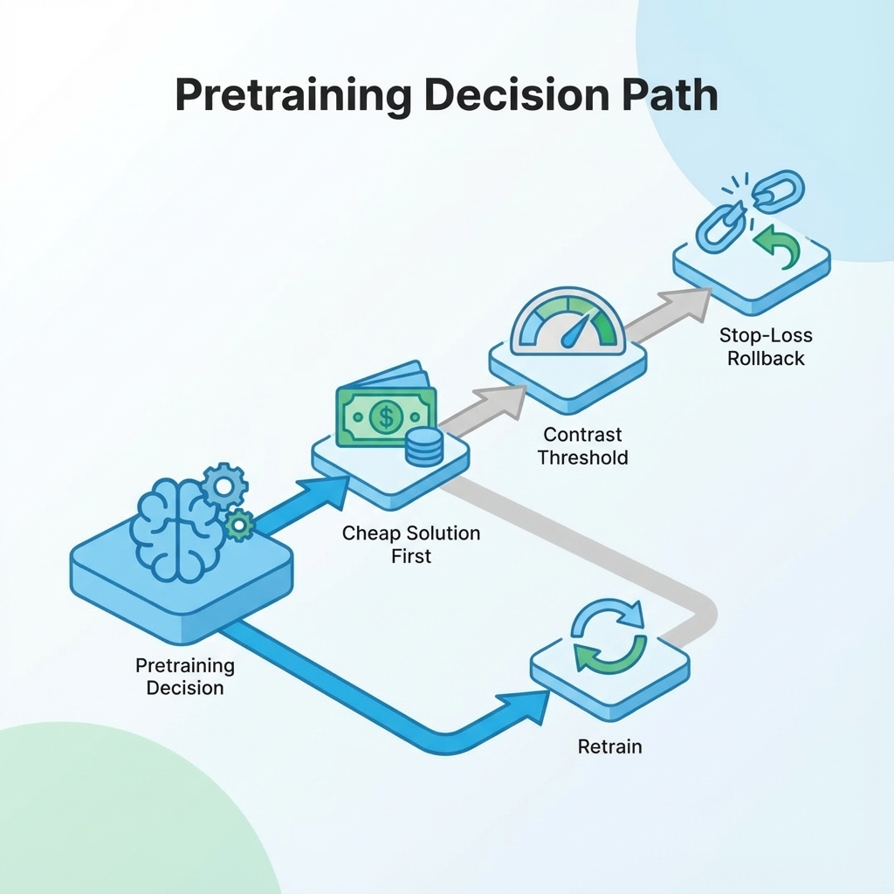

# 第 14 章：预训练：目标、边界与成本核算

在人工智能的浪潮中，预训练这个词常常与大模型和颠覆性能力联系在一起，激发着无数产品经理和技术合伙人的想象。然而，对于大多数从零到一的创新项目，尤其是个人开发者或小团队而言，过早或不加分辨地投入预训练，往往会将宝贵的资源引入歧途。预训练的本质并非简单地追求模型规模的膨胀，而是要让通用模型更精确地适配你的特定业务领域，掌握你的行业术语、工作流程和隐含知识。它是一项策略性投资，而非万能药方，其价值需要被严格审视和验证。

本章将以一种审慎且务实的视角，引导你穿越预训练的迷雾。我们将从数据资产化的基础出发，深入探讨在模型层面的一个核心决策：你的产品是否真正需要预训练（包括增量预训练或领域适配）。我们的目标不是让你成为一个训练专家，而是提供一个清晰的决策框架——何时启动预训练，如何定义其目标与边界，何时判断其完成，以及更关键的，何时果断止损。通过本章的学习，你将获得一套实用的预训练决策卡、详细的成本核算方法以及明确的止损策略，确保你的投入能够带来可衡量、可复利的回报。

## 预训练的本质是投资决策

对任何产品而言，资源的投入都应视为一种投资。预训练作为一项高门槛、高成本的技术实践，更需要我们以投资决策的严谨性去对待。这意味着，每一次关于预训练的决定，都必须建立在清晰的目标、可验证的论证链条和严格的验收标准之上，而非盲目追随技术热潮。

首先，在最上层，你需要为自己设定一个明确且可解释的投资目标。这项投资能否带来在质量、成本或可控性上的可持续复利？例如，预训练后的模型能否显著提升用户满意度，降低人工审核成本，或赋能产品以独特的竞争优势？更重要的是，你需要设定一个明确的成功门槛来判断投资成败，避免陷入感觉不错但无法量化的模糊地带。这个门槛将是你决策的核心依据。

其次，向下延伸，预训练的论证链条必须环环相扣，逻辑严密。它从问题定义开始，要求你精准识别当前产品面临的核心痛点，并探索所有便宜替代方案是否已穷尽。只有在确认现有方案无法满足需求后，才考虑预训练。接下来，你需要评估数据可用性——是否有高质量、合法合规且足够规模的数据用于训练。然后是成本与风险的详细评估，这包括财务、时间、算力及潜在的技术风险。在启动训练前，务必建立一套可靠的评测基线，否则任何训练都将沦为烧钱的黑洞，无法证明其真正价值。最终，你需要一个完整的训练计划直至对比报告和发布与回滚策略，形成一个闭环。

最后，在落地与验收层面，所有的验证都必须是对比式的。模型交付的终点不是训练完成，而是通过严苛的对比报告，证明预训练后的模型在关键任务上，相对于未训练的基线方案，实现了设定的质量提升门槛。同时，还需要确保在安全性、延迟、成本和系统稳定性等守门指标上没有出现退化。最关键的一点是，你的系统设计必须允许可回滚到旧模型或旧策略，绝不能让自己被单一的技术路径锁定，为未来的迭代和风险控制留下余地。

## 先问：你真的需要预训练吗

在深入探讨预训练的细节之前，最核心的问题是：你的产品真的需要它吗？很多时候，团队将模型的表现不佳归咎于通用模型不够智能，从而直接跳到预训练的选项。然而，这常常是一种误判，因为许多问题可以通过更低成本、更快捷的方案解决。一张清晰的决策路径图会帮助我们避开不必要的复杂性，如下图所示，它强调了优先尝试便宜方案，然后才考虑预训练，并始终设立明确的对比门槛和止损回滚机制。

为了更清醒地做出判断，我们可以将模型表现的问题进行分类，并针对性地寻找解决方案。如果模型回答常常出现事实编造（幻觉）或者知识更新不及时，这通常是缺证据的表现，而非模型底层理解力不足。此时，更优的策略是强化检索增强生成（RAG）系统，并通过精细化语料边界来确保模型只能从授权的、最新的知识源中提取信息，这远比通过预训练灌输新知识更高效和经济（参见第 10 章）。

再者，如果用户抱怨任务链条过长、输入格式混乱导致模型难以正确响应，这反映出产品缺流程。在这种情况下，问题出在产品设计和用户交互上，而不是模型本身。我们应该优先优化产品界面和交互流程，通过更合理的输入引导和任务分解，让模型在清晰的指令下发挥其通用能力（参见第 4-8 章）。例如，一个在线法律咨询平台，如果用户总是输入模糊的需求，导致模型无法给出满意答案，那么首先应该设计一个多轮对话流程，引导用户明确法律领域、问题类型和具体细节，而不是直接去预训练一个法律专家模型。

最后，当模型在面对特定领域术语、专业格式或独特风格时始终表现出理解障碍，这才是真正意义上的缺领域能力。只有到了这一步，当所有更经济、更简单的方案都已尝试且未能奏效时，才值得将领域适配或增量预训练纳入考量。例如，一家专注于生物医药的初创公司，其通用模型难以准确理解复杂的蛋白质结构命名、药物作用机制描述，或者无法生成符合药监局要求的规范化报告格式，此时，对海量的生物医学文献进行增量预训练，使其掌握该领域的语言范式和知识表达方式，就成为一个合理的投资方向。但即便如此，也需要严格控制边界，避免通用能力的意外退化。

## 预训练能解决什么（以及不能解决什么）

理解预训练的能力边界至关重要，它并非包治百病的灵丹妙药。预训练，尤其是领域适配或增量预训练，最擅长解决的是模型在特定领域语言、知识表达和隐含规则方面的缺失。例如，在一个金融分析场景中，通用大模型可能难以理解诸如MBS、CDO等专业缩写，也无法准确捕捉金融报告中特有的叙事结构和数据呈现风格。通过在大量金融研报、经济学论文和市场分析数据上进行增量预训练，模型能够学习这些特定的语言模式、术语用法，甚至能理解一些行业内约定俗成的隐性规则，从而产出更专业、更符合语境的回答。这种深度理解和风格适配是预训练的核心优势。

然而，预训练并非万能。它在处理需要实时更新的权威事实时效果甚微，因为模型一旦训练完成，其知识就被冻结在训练数据的时间点上。对于需要获取最新市场数据、法规变化或突发新闻的应用场景，检索增强生成（RAG）方案无疑是更高效、更灵活的选择。同时，预训练也无法有效解决涉及复杂决策逻辑、多步骤操作和严格权限控制的问题，例如自动执行任务、调用外部API或遵循特定业务流程。这些能力更适合通过Agent框架结合工具调用（Tool Calling）和智能合约（Tool Contract）来实现，将模型的语言理解与外部系统的执行能力相结合。试图通过预训练让模型学会调用工具或理解权限，往往会事倍功半，甚至带来不可控的风险。

## 模板：预训练决策卡（先写再动手）

在投入任何预训练项目之前，强烈建议团队坐下来，共同填写一份预训练决策卡。这份卡片迫使你将所有关键考虑因素可视化、标准化，确保在昂贵的算力投入之前，每个人都对项目的目标、风险和退出策略有清晰的共识。这不仅是项目管理的最佳实践，更是控制成本和避免盲目投入的有效工具。

| 字段 | 说明 |
| :--- | :--- |
| **目标** | 你希望通过预训练提升模型的哪项具体能力？此能力必须是可量化、可评测的。 |
| **基线方案** | 如果不进行预训练，当前如何解决同样的问题？（例如：通过RAG、精心设计的Prompt工程、人工流程等）这作为你衡量预训练效果的对照组。 |
| **数据** | 用于预训练的数据来源、获取许可、数据覆盖范围、潜在的数据偏见及其处理策略。数据的质量与代表性直接决定训练效果。 |
| **预算** | 投入的资金、时间、所需的算力资源上限，以及一旦超出此限额就停止的明确止损线。 |
| **风险** | 潜在的安全漏洞、合规性风险、模型可能出现的灾难性遗忘（对通用能力的削弱）、以及训练后模型可能产生的不可控或有害输出。 |
| **评测** | 建立一套关键任务的回归测试集，以及用于监控通用能力不退化的守门指标（如安全性、有害性等）。 |
| **成功门槛** | 预训练后的模型相对于基线方案，在关键评测指标上需要达到的最低提升阈值（例如：准确率提升5%，响应时间缩短10%等）。 |
| **回滚** | 如果预训练未能达到预期效果或带来负面影响，如何快速、安全地回退到旧模型或旧策略，确保业务连续性不受影响。 |

这张决策卡的作用在于将可能性转化为行动计划，并将模糊的期望转化为清晰的验收标准。只有在这些字段都被清晰、具体地填充完毕后，你才能真正考虑进入下一步的实际训练阶段。

## 成本核算：把可能性变成账本

对于个人开发者或小型团队而言，预训练的成本核算并非要精确到小数点后的每一分钱，其核心价值在于帮助你审视三项关键的战略性问题。首先，你需要明确自己能够承受的最坏情况是什么——这不仅是财务上的预算止损线，更是时间、机会和心理承受能力的极限。其次，这项投入是否能带来清晰、可解释的收益，能否通过对比门槛验证其价值，避免投入巨大却收效甚微的尴尬局面。最后，也是至关重要的一点，你是否能够在预训练失败时安全撤退，确保产品和业务不会因此陷入停滞，并能妥善保留训练过程中产生的任何有价值的资产。

在具体估算时，我们建议至少从三个维度来全面考量：直接成本、机会成本和风险成本。直接成本是最显而易见的，包括购置或租赁训练所需的算力（GPU/TPU）、数据存储费用、训练过程中产生的数据传输带宽费用，以及投入大量工程师时间进行数据清洗、模型实验和结果分析的薪资成本。这些是实实在在的财务支出，需要精确预估。

然而，更具隐蔽性和破坏性的是机会成本。每一次投入预训练的时间和精力，都意味着你放弃了将这些资源用于其他产品验证、用户增长或功能开发的可能。尤其在创业初期，快速迭代和验证市场是生命线，一次漫长而无果的预训练尝试，可能错失宝贵的市场窗口。此外，还有风险成本，这包括潜在的合规性审查费用、模型上线后可能引发的质量波动（例如，特定领域表现提升但通用能力下降）、以及由此带来的用户流失风险，还有后续模型维护和回归测试的持续投入。这些间接成本和潜在损失，往往比直接成本更难以量化，却可能对产品和团队造成更大的冲击。

## 评测先行：训练不是终点，对比报告才是

在预训练的整个生命周期中，一个普遍的误解是认为模型文件是最终的交付物。事实上，真正有价值的交付物，是那份能够清晰呈现训练前后模型性能变化的对比报告。这份报告不仅仅是技术细节的堆砌，更是决策者判断投资价值、指导产品迭代方向的关键依据。没有这份报告，再先进的模型也只是一堆无法验证其商业价值的字节。

这份对比报告必须详细回答几个核心问题：首先，哪些关键任务的性能达到了预设的成功门槛？这需要基于预训练决策卡中定义的可量化指标进行验证。其次，更为重要的是，在模型能力提升的同时，哪些守门指标出现了退化，例如模型的安全性、公平性、延迟或通用常识理解能力是否出现负面波动？任何积极的提升都不应该以牺牲核心安全或稳定性为代价。报告还需深入分析这些变化背后的原因，是从训练数据中学到了什么新模式，还是因为训练策略导致了某些能力的遗忘。最后，基于全面的分析，报告需要给出明确的上线建议，包括是否值得上线，以及具体的灰度发布和回滚策略，确保每一次模型更新都是受控且安全的。

## 常见陷阱（失败样本）

预训练是一条充满诱惑也潜藏风险的道路，许多团队在缺乏经验和规划的情况下，往往会跌入一些常见的陷阱。了解这些失败样本，从中汲取教训，比一味追求成功案例更为重要。以下是三个典型的失败情景，希望能帮助你规避潜在的风险。

**陷阱一：预算烧光，效果却说不清**

在一个知名的AI教育创业公司，他们为了提升其智能助教在特定学科的问答准确率，决定投入数百万人民币进行增量预训练。三个月后，模型训练完成，技术团队声称感觉模型更智能了，但当产品经理要求提供具体的性能提升数据时，却支支吾吾。原来，他们在项目开始时没有建立明确的评测基线，也没有设定量化的成功门槛。模型的提升完全凭主观感觉，导致大量预算投入后，无法向投资人或内部决策者证明其商业价值，项目最终被搁置，团队士气大受打击。这个失败案例的根源在于将预训练视为许愿而非严格的工程项目。教训是：在启动预训练前，务必建立详尽的回归测试集和可量化的对比门槛，一旦模型效果无法达到预期，就应果断止损。

**陷阱二：按下葫芦浮起瓢，领域能力增强通用能力退化**

另一家从事医疗健康领域AI辅助诊断的公司，为了让其模型更精准地理解病历和医学影像报告，对一个通用大模型进行了大量医疗专业数据的增量预训练。初步测试显示，模型在理解医学术语和诊断建议方面有了显著提升。然而，当模型上线后，用户却发现它在处理日常沟通、通用知识问答时开始出现错误，甚至有时会生成一些敏感但与病症无关的联想。原来，在训练过程中，团队过度关注领域数据，导致模型对通用语言模式和常识出现了灾难性遗忘，并且缺乏对安全性、有害性等守门指标的持续监控。这个现象的根源在于数据偏差和缺乏全面的评测体系。修复方案应是：在领域训练的同时，同步设置并持续监控一系列守门评测和通用能力回归测试，一旦发现负面退化，必须立刻回滚到旧的、更稳定的基线策略。

**陷阱三：模型训练完成，却上不了线**

某工业智能制造企业，斥巨资预训练了一个能理解复杂生产线流程和设备手册的专属大模型。模型在离线测试中表现出色，但当准备部署到生产环境时，运维团队发现模型的推理成本极高，每一次调用都需要巨大的算力资源，导致API响应延迟远超业务要求，并且持续的维护成本让他们难以承受。原来，他们在前期核算时，只关注了训练阶段的硬件和时间成本，完全忽略了模型上线后的推理成本、运维复杂度和持续的维护费用。这个案例的教训是：预训练不仅仅是训练本身，更是一个从数据到模型再到部署、监控的完整生命周期。在预算阶段，必须将模型的长期推理、运维和维护成本纳入考量，如果这些长期成本无法满足业务需求或超出承受范围，即使模型能力再强，也应审慎考虑是否继续投入。

## 读者练习

预训练的决策与实践充满挑战，但通过结构化的思考和行动，你可以显著提高成功的概率。以下是一组读者练习，旨在帮助你将本章所学转化为可执行的步骤：

1.  **完成一份预训练决策卡：** 结合你当前的产品或设想的场景，严格按照本章提供的预训练决策卡模板，清晰填写每一个字段。确保你的目标是可评测的，预算和风险有明确的止损线，并规划好回滚策略。
2.  **定义你的便宜替代方案与评测基线：** 在考虑预训练之前，详细描述如果不进行预训练，你将如何解决当前的问题（例如，通过更精细的RAG、优化Prompt工程或改进产品流程）。为这个基线方案建立一套可运行的评测机制和测试集。
3.  **设计一个全面的成本核算模型：** 不仅仅考虑训练算力等直接成本，还要评估项目可能带来的机会成本（你因此放弃了什么？）和风险成本（失败的潜在代价是什么？），并将这些纳入你的账本。
4.  **构建守门指标监控体系：** 设想你的模型在进行领域适配后，最可能出现哪些通用能力退化或安全合规风险？列出至少3-5个关键的守门指标，并思考如何设计测试来持续监控这些指标，确保模型在提升特定能力时不以牺牲基本稳定性和安全性为代价。
5.  **制定详尽的上线与回滚计划：** 为你的预训练模型设计一个从灰度发布到全面上线的部署流程。更重要的是，制定一套清晰的回滚计划，包括触发回滚的条件（例如：守门指标出现严重退化、关键任务性能未达标）和具体的执行步骤，确保你总有一条安全退路。

## 下一章
预训练讨论让模型更像你的领域。下一章进入后训练：如何用 SFT/DPO/RLHF 等方法把行为调成可控，并把安全与回归纳入门禁。见：[`15-posttrain-rl.md`](15-posttrain-rl.md)。

## 延伸阅读
- 大模型 | 一文彻底搞懂预训练和微调（Pre-training vs Fine-tuning）-CSDN博客 — [https://blog.csdn.net/m0_56255097/article/details/141311415)
- 一文搞懂大模型的预训练Pre-training：智能的诞生，零基础小白收藏这一篇就够了!! - 知乎 — [https://zhuanlan.zhihu.com/p/1927426857030099119)
- GitHub - cwz427/llm: 本项目旨在分享大模型相关技术原理以及实战经验。 — [https://github.com/cwz427/llm)
- 预训练（Pre-training），人工智能（AI）领域的预训练是什么，初步认识预训练 - 53AI-AI知识库|企业AI知识库|大模型知识库 ... — [https://www.53ai.com/news/finetuning/2024082731097.html)
- 一文读懂预训练模型（非常详细），零基础入门到精通，看这一篇就够了-csdn博客 — [https://blog.csdn.net/weixin_49892805/article/details/143567152)
- 深度理解BERT预训练机制：从理论到实践 - AtomGit | GitCode博客 — [https://blog.gitcode.com/dda25fbb11b5a06ca263bf26aa0a9c04.html)
- 了解"预训练-微调"，看这一篇就够了 - 知乎 — [https://zhuanlan.zhihu.com/p/557958732)
- TinyAI/book/README.md at main · Leavesfly/TinyAI · GitHub — [https://github.com/Leavesfly/TinyAI/blob/main/book/README.md)
