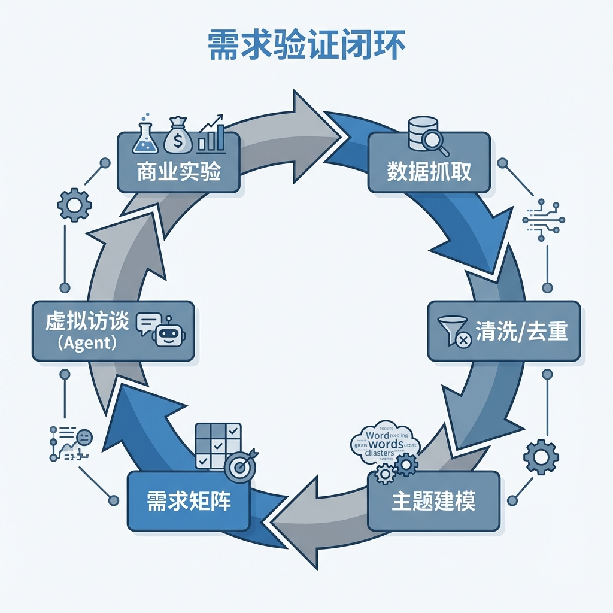
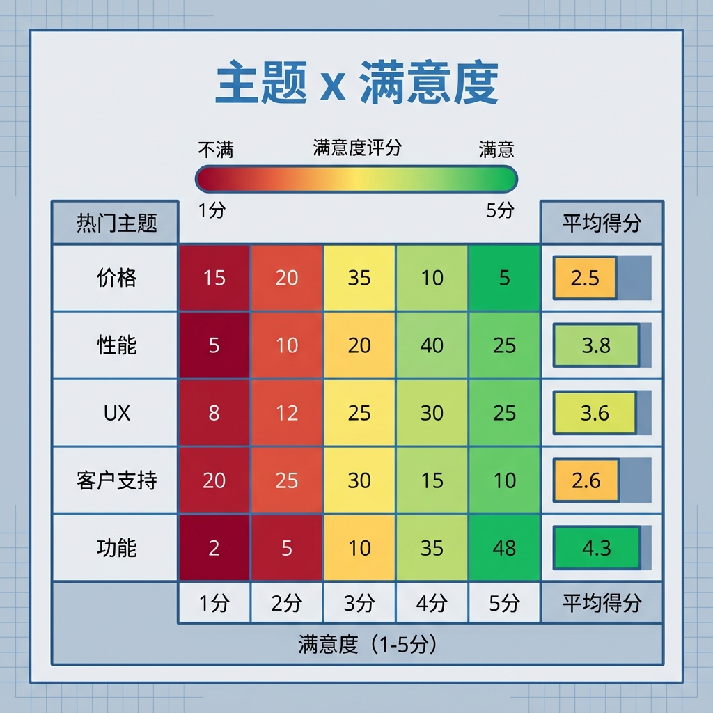

# 第 1 章：AI 驱动的需求挖掘与市场验证

> 别急着写代码：先用数据把“值不值得做”说清楚，再用最小实验把它证伪/证实。[4]

!!! note "关于复现、目录与 CI"
    本章中出现的 `make ...`、`CI`、以及示例目录/文件路径（例如 `path/to/file`）均为工程约定，用于演示如何将方法应用到你自己的工程仓库中。本仓库仅提供文档，读者需自行实现或用等价工具链替代。

!!! warning "合规与成本提醒（别踩红线）"
    - **隐私/PII：** 评论里常含用户名、邮箱/手机号等个人信息。存储前先脱敏；不要把原始隐私数据直接丢给公网模型或写进日志。
    - **平台条款：** 抓取前先看目标站点的服务条款与 `robots.txt`；能用官方 API/导出就优先用。
    - **调用成本：** 大规模“聚类/主题提炼”尽量用本地/离线工具先做粗筛，把付费 LLM 留给“总结/反例/决策解释”等高价值环节。

## 章节定位
你可能遇到过这种情况：大家聊得热血沸腾，做了两周，最后发现“根本没人要”。本章就是为了解决这个问题——把“感觉”变成有据可循的结论，把“想做”换成“能验证”。[4]

更具体一点，本章会带你做三件事：

1. **把信号收集齐：** 从公开评论/帖子里抓取样本，记录来源、时间、许可证（否则你的结论很难被复核，也可能根本不能用）。[34]
2. **把信号压缩成可评审表：** 把零散文本变成《问题—证据》矩阵：每条需求都有样本、样本量、反例与不确定性说明。[4]
3. **把结论变成可证伪实验：** 设计“七天内能验证”的实验门槛，达不到就暂停/换方向。[4][6]

本章最在意的不是“你得到了什么结论”，而是“别人拿到同一份数据，能不能大致跑出同样的结论”。因此你会特别强调去重、模板化文本污染与数据卡片（Datasheet）这些基础功。[34][35]

## 你将收获什么
- 一份能拿去开评审会的《问题—证据》矩阵：不是“观点”，而是“证据 + 反例 + 下一步实验”。[4]
- 一个从“评论”到“优先级”的精简流程，用来支撑你制定功能优先级。[9][26]
- 一个“虚拟焦点小组”的最小配置：Persona + 提纲 + 统计标准，用它专门找反例。[10]

## 方法论速览
1. **先把数据弄干净：** 抓取只是开始；更重要的是写清楚来源/时间/许可证，并处理去重与模板化污染。[34][35]
2. **再把文本变成“可量化指标”：** 用主题模型（LDA/BERTopic）+ 情绪/评分关联，把“大家都在抱怨什么”变成统计分布。[8][9][26]
3. **最后专门找反例：** 用对话 [Agent（智能体）](glossary.md#agent) 做虚拟访谈，目标不是“证明你对”，而是尽快找到“你错在哪”。[10]
4. **用门槛做决策：** 把 Lean Canvas 写成“假设→指标→实验→门槛”，达不到就停止优化幻想。[4]



## 典型场景
- **SaaS 工具选题：** 抓 GitHub Issues、社区帖子、竞品评论，先回答“用户到底在骂什么/夸什么”。再决定做不做、先做哪个切入点。
- **B2C 应用验证：** 抽样应用商店评论，把“卸载原因/留存动力”做成可排序的清单，首版只做 Top 1–2 个关键问题。

## 实战路径
```text
数据抓取 → 去重/清洗 → 主题/情绪建模 → 需求矩阵（问题—证据） → 虚拟访谈（反例） → 七天实验（门槛）
```

### 示例（可复制）：把“评论样本”变成可评审的需求矩阵

**目标：** 基于 `data/reviews.csv` 生成《问题—证据》需求矩阵（Top 10 痛点），并附样本量与反例。

**前置条件：**
- 你能导出一份结构化评论数据（CSV/JSONL 任一即可），并能运行一段脚本或 Notebook（语言不限）。
- 你愿意把“结论”绑定到可追溯证据（样本文本/来源链接/采集时间/许可证）。[34]

**上下文：**
- 项目形态：需求验证与研究流水线（可落地到你自己的工程仓库）
- 角色：产品/研究/创业者（你需要做“可评审的需求证据”）
- 输入：`data/reviews.csv`（列：`text, rating, source, ts`）

**约束：**
- 必须给出：每个痛点的样本文本引用（至少 3 条）与样本量；不得只给结论。
- 对数据来源/许可证不明的样本要标注“不可用于决策”。[34]
- 需求矩阵每行至少包含：痛点/Persona/证据样本/样本量/不确定性/反例/下一步实验。
- 若使用 AI 辅助修改代码/文档：请要求它只输出统一差异（unified diff / `git diff` 格式），不要夹带解释文本，方便你直接应用与审查。

**输出格式：**
- 产物：`docs/demand/matrix.md`（Markdown 表格）
- 命名：每次生成建议写入日期（例如 `docs/demand/matrix-YYYYMMDD.md`），并在变更说明里标注数据快照版本。

**步骤：**
1. 从一个或多个公开渠道采集评论，落盘为 `data/reviews.csv`；同时生成一份最小[数据卡片（Datasheet）](glossary.md#datasheet)（包含来源/采集时间/许可证/样本量/去重策略）。[34][35]
2. 对评论做去重与基础清洗，把刷评/复制粘贴的模板内容清掉，别让它带偏主题结论。[35]
3. 跑主题建模/情绪或评分关联，得到 Top 痛点候选与样本索引。[9][26]
4. 生成 `docs/demand/matrix.md`：每个痛点至少附 3 条原文样本（带 `source`）、样本量、反例与下一步“七天内可验证实验”。[4]

**验证命令：**
```bash
make demand-benchmark
# 预期输出包含：生成 docs/demand/matrix.md + 导出一份摘要报告（例如 Top5 主题覆盖度/样本量）
```

**失败判定：**
- 未生成矩阵文件；或矩阵缺少样本引用/样本量/反例字段；或样本来源/许可证不可追溯。[34]

**回滚：**
- `git checkout -- docs/demand/matrix.md`

### 1. 数据抓取与清洗
- 使用 requests/Playwright 抓取评论，保留原文、评分、来源链接。
- 对每条数据源写入数据卡片（Datasheet）并标注许可证与采集时间。[34]
- 去重与去噪：用 MinHash/LSH 过滤重复与近似重复文本（例如“好评返现”类复制粘贴），降低主题偏移风险。[35]
- 额外去噪：识别并剔除 SEO/关键词堆砌的垃圾文本（常见特征是信息密度极低但关键词重复率极高），避免被“伪需求”带偏。

### 2. 痛点提炼与显著性验证
```python
import pandas as pd
from bertopic import BERTopic
from sklearn.feature_extraction.text import CountVectorizer

reviews = pd.read_csv("data/reviews.csv")
vectorizer_model = CountVectorizer(stop_words="english", min_df=5)
model = BERTopic(language="multilingual", vectorizer_model=vectorizer_model)
topics, probs = model.fit_transform(reviews["text"].tolist())
print(model.get_topic_freq().head())
```
- 用手工标注的 100 条样本计算主题纯度，绘制混淆矩阵，CI 中断即提示重新标注。[9]
- 将主题与评分/情感得分关联，输出“主题 × 满意度”关联表（可视化时再画热力图），辅助优先级排序。[26]



### 3. 虚拟焦点小组
- 设计 5–8 个 Persona（如重度/轻度用户、付费/免费用户），预置提纲（痛点、预算、替代品）。[10]
- 让对话 Agent 每日轮询提问并存 SQLite，利用情感/立场分类模型统计赞成率、反对率。
- 形成《需求访谈日报》：包含新出现的反例、阻碍采纳的理由、潜在追加功能。

### 4. 商业可行性判定
- 依据 Lean Canvas 列出问题、方案、关键指标与成本结构，估算获客成本与回收周期。[4]
- 对高优先级假设设置“七天内可验证”的实验（登陆页点击、原型反馈、候补名单转化）。

## 复现检查清单
- `make demand-benchmark` 执行抓取、去重、主题建模与显著性检验；建议将其设为 CI 门禁。
- Jupyter 笔记本导出 PDF 与热力图快照，确保审稿人可离线核查。
- 样本与结果均附统计功效说明，避免“小样本伪阳性”。

## 常见陷阱
1. **现象：** “Top 痛点”看起来很清晰，但上线后没人用。  
   **根因：** 采样只来自单一平台/单一人群，你听到的可能只是“声量最大的少数群体”；真正的“沉默的大多数”直接卸载、从不评论。[34]  
   **复现：** 只用 App Store/只用某论坛的评论跑一次主题建模，对比不同渠道 Top5 主题差异。  
   **修复：** 跨源采样并记录权重与时间窗口；在矩阵里为每个痛点标注“来自哪些源/占比”。[34]  
   **回归验证：** 复跑 `make demand-benchmark`，检查 Top5 主题在多源数据上仍稳定（或明确写出分歧与取舍）。

2. **现象：** 主题模型每次重跑结论都变，评审无法对齐。  
   **根因：** 去重/清洗与随机性控制缺失，重复与模板化文本导致主题漂移。[35]  
   **复现：** 同一份数据在不同清洗参数/不同随机种子下重跑，观察主题排序变化。  
   **修复：** 固定数据快照、清洗参数与随机种子；对重复文本做 MinHash/LSH 去重，并记录差分。[35]  
   **回归验证：** 抽检 3 次运行结果，Top5 主题的覆盖度与样本量变化不超过阈值（阈值由你的基线决定）。[9]

3. **现象：** 团队每周都在“验证”，但从未做出可执行的决策。  
   **根因：** 假设过多、实验不可证伪、没有停止条件，导致验证永远在路上。[4]  
   **复现：** 罗列当前所有假设，发现多数无法在七天内证伪或没有明确指标。  
   **修复：** 每周最多 3 个待验证假设；每个假设必须绑定“证据/反例/七天实验/门槛/回滚”。[4][6]  
   **回归验证：** 每两周产出一页《决策白板》（保存在版本库），明确“保留/放弃/延期”的决策与证据链。[4]

## 延伸练习
- 将痛点主题映射到现有竞品的功能列表，验证“市场空白”是否真实存在。
- 使用 Prophet 建模需求随时间的趋势，评估淡旺季对功能优先级的影响。

## 交付物清单与验收标准
- `data/` 目录：原始评论、清洗结果与数据卡片（Datasheet）；建议由 CI 校验文件存在且列完整。
- `notebooks/01-demand.ipynb`：主题模型、情感分析、混淆矩阵截图。
- 《需求访谈日报》与 Lean Canvas 文档；未给出指标或证据的需求不得进入开发。

下面把本章的实战路径抽象为可迁移的原则，便于你换数据源/工具链时仍能复现与审计。

## 深度解析：核心原则
1. **场景化起手式：** 从一条用户投诉开始——用正反两种假设框定问题，再让 [Agent（智能体）](glossary.md#agent) 爬取 1,000 条相似评论验证是否具备“共性痛点”。以混合检索（例如 BM25 + 向量相似度）定位语义近邻，拒绝凭感觉扩写需求。[7][27]
2. **数据护栏：** 每个数据源附带“可信度评分”（采集渠道、样本量、时间跨度、噪声水平），分为 A/B/C 级。低于 B 级的数据仅做辅助，不得支撑产品决策，并在数据卡片中明示原因；对重复与模板化文本应明确去重策略。[34][35]
3. **主题—用户—价值对齐表：** 构建三维表格：主题（痛点）、目标 Persona、价值/节省的成本或时间。每行附来源与样本量，未能量化价值的主题暂缓进入路线图。[8]
4. **一页式决策白板：** 每周输出一次决策白板，包含“当前假设、证据、反例、风险、下周实验”。建议在你的项目仓库中以编号保存（示例：`docs/decisions/`），作为后续复盘的审计链路。[4]
5. **复现流水线：** 通过 `make demand-benchmark` 自动跑爬虫、清洗、主题建模、显著性检验与 PDF 报告导出；CI 检查主题 Top5 覆盖度、混淆矩阵 F1、文件完整性。失败则阻止合并，降低复现成本并减少结论漂移。[9][26]

## 资料笔记（可选）
- [精益创业（最小实验与证据门槛）](../../materials/ai-assisted-software-product/notes/ref-004-lean-startup.md)
- [Datasheets（数据来源与可用性说明）](../../materials/ai-assisted-software-product/notes/ref-034-datasheets.md)
- [数据去重（减少污染与虚高结论）](../../materials/ai-assisted-software-product/notes/ref-035-llm-dedup.md)

## 参考
详见本书统一参考文献列表：[`references.md`](references.md)。
