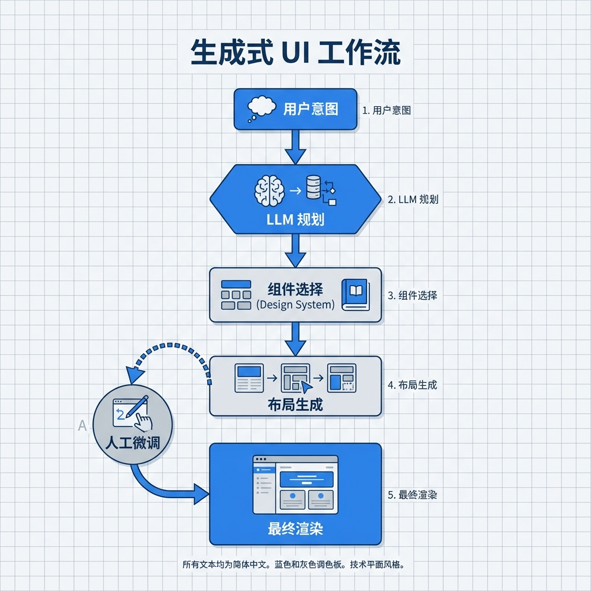

# 第 3 章：生成式 UI/UX 设计

> 好看不难，难的是“既好用，又经得起后续迭代”。本章把设计做成可回归的工程产物。[14][15][17]

!!! note "关于复现、目录与 CI"
    本章中出现的 `make ...`、`CI`、以及示例目录/文件路径（例如 `path/to/file`）均为工程约定，用于演示如何将方法应用到你自己的工程仓库中。本仓库仅提供文档，读者需自行实现或用等价工具链替代。

## 章节定位
本章旨在弥合“从灵感到工程落地”的差距：你可以尝试用生成式模型探索风格，用自动化检查守住可访问性与回归，把设计从“一次性截图”变成“能长期维护的组件”。[14][15][16][17]

## 你将收获什么
- 一套由文字驱动的 UI 生成工作流，从 Mood Board 到 Figma/代码的自动迁移。[14]
- 针对组件的可访问性与响应式检查清单，借助自动化工具提前发现问题。[17]
- 可复制的组件库工作流：Prompt → React/Tailwind → Storybook/Playwright 回归用例。[15]

## 方法论速览
1. **视觉灵感生成：** 用扩散模型生成多版情绪板，明确配色、排版、信息层级。[14]
2. **设计稿转代码：** 通过 v0.dev / Galileo 将描述直接转为 React 组件，并由 LLM 优化语义化标记。[15]
3. **自动化审查：** 用多模态模型与 Lighthouse/axe 扫描可访问性、对比设计稿差异。[17]



## 实战路径
```text
文字规格（含状态机与交互流）→ 组件实现（React/Tailwind）→ Storybook 交互演示 → a11y/性能/截图回归 → 发布与迭代
```

### 示例（可复制）：从文字规格生成可回归的 UI 组件

**目标：** 为“登录表单（含错误提示与加载态）”生成 React/Tailwind 组件，并补齐可访问性与交互回归用例。[15][17]

**前置条件：**
- 你有一个可运行的前端工程（React + Tailwind 或等价技术栈）。
- 你能运行至少一种自动化检查：a11y（axe）、性能（Lighthouse）或 E2E（Playwright）。[17]

**上下文：**
- 项目形态：组件库（可被多个页面复用）
- 角色：设计/前端（以“可回归”为目标，而非一次性 Demo）
- 组件：`packages/ui/src/LoginForm.tsx`
- 回归：`packages/ui/src/LoginForm.stories.tsx`（含交互）、`tests/ui/login-form.spec.ts`（Playwright）

**约束：**
- 必须满足：键盘可达、错误提示可读、输入框 label/aria 完整。[17]
- 必须覆盖：默认态/加载态/错误态/禁用态（至少 4 种），避免只关注静态视觉效果。[15]
- 禁止引入未声明依赖；优先使用现有组件/样式约定。
- 如果你让 AI 辅助修改代码/文档：请要求它只输出统一差异（unified diff / `git diff` 格式），不要夹带解释文本，方便你直接应用与审查。

**输出格式：**
- 产物：组件源码 + Storybook 交互用例 + 至少 1 条自动化回归用例
- 命名：组件与测试文件名要稳定，避免重构导致历史回归记录失效。

**步骤：**
1. 写“文字规格”：字段、校验规则、错误文案、加载行为、成功回调，并把状态写成最小状态机（默认/提交中/失败/成功）。[15]
2. 让 AI 生成组件初稿（React/Tailwind），再手动检查语义化与可访问性（label/aria/焦点顺序）。[17]
3. 为组件写 Storybook 故事与交互（输入、提交、触发错误），让回归检查可复用。[15]
4. 写 Playwright 用例覆盖异常路径（错误态、重试），并把 a11y/Lighthouse 报告作为门禁证据。[17]

**验证命令：**
```bash
make ui-validate
# 预期输出包含：axe/Lighthouse/Playwright 至少一种检查通过 + 产出可归档报告或截图差异
```

**失败判定：**
- axe/Lighthouse/Playwright 任一失败；或缺少交互/异常态覆盖；或错误态不可复现。[17]

**回滚：**
- 如果这些文件原本已存在：`git checkout -- packages/ui/src/LoginForm.tsx packages/ui/src/LoginForm.stories.tsx tests/ui/login-form.spec.ts`
- 如果这些文件是新建且未被 Git 跟踪：`rm -f packages/ui/src/LoginForm.tsx packages/ui/src/LoginForm.stories.tsx tests/ui/login-form.spec.ts`

### 1. 情绪板与设计约束
- 设定品牌关键词（如“信任感、极简、效率”），生成 3–5 版情绪板方案，挑选主色/辅色、字体与组件风格。[14]
- 记录设计决策：对齐产品定位的证据（用户画像、行业期望）。

### 2. 代码级原型
- 编写 Prompt：“生成一个含导航、主英雄区、CTA 与定价卡片的 SaaS 落地页，使用 Tailwind。”
- 将生成代码导入 Storybook，运行 `npm run storybook` + `playwright test` 做可视化与交互回归。[15]

### 3. 多模态走查
- 使用具备视觉输入能力的多模态模型读取截图，对比设计稿与代码渲染，列出视觉偏差与交互风险。
- 使用 `axe-core`、`lighthouse-ci` 检查语义化、对比度、键盘可达性与性能指标。[17]

### 4. 设计系统沉淀
- 抽取常用组件（按钮、表单、通知、卡片）形成 tokens（颜色、间距、阴影），存入 `design-tokens.json`。
- 建立 `packages/ui` 组件库，暴露 Props 类型与可视化 Demo，CI 对每个组件运行截图对比。

## 复现检查清单
- `make ui-generate`：生成情绪板与初始代码，产出截图供审查。
- `make ui-validate`：运行 axe + Lighthouse + Playwright，对比基线截图并输出报告。
- CI 若发现对比度或键盘可达性不达标则阻断发布。

## 常见陷阱
1. **现象：** 组件视觉精美，但业务效果不佳、用户找不到关键操作。  
   **根因：** 视觉装饰压过信息层级；没有用埋点或可用性测试验证“是否更好用”。[14]  
   **复现：** 把 CTA/错误提示/加载态去掉对比截图，观察信息是否仍清晰；或对比两版文案/布局的点击率。  
   **修复：** 把“信息层级/转化目标”写进文字规格，并把关键交互埋点纳入验收；用数据而不是审美做裁判。[6]  
   **回归验证：** 每次 UI 大改提交一份“前后对比”证据（截图差异 + 指标口径），无证据的变更不合并。

2. **现象：** 上线后才发现多语言/长文案溢出、RTL 布局错乱。  
   **根因：** 只在单语言、单屏幕尺寸下做设计与回归，忽略 i18n/RTL 的约束。  
   **复现：** 替换为超长文案与 RTL 语言，运行截图回归；常见问题是按钮挤压、表单错位。  
   **修复：** 在 Storybook/Playwright 增加多语言样例与 RTL 截图场景，把“字符长度/RTL”变成回归基线。  
   **回归验证：** 回归报告必须包含：桌面/移动两套截图 + 至少 1 个 RTL 用例的截图差异为 0 或有解释。

3. **现象：** 设计稿与实现逐渐脱节，组件被复制粘贴后不可维护。  
   **根因：** 没有单一来源（tokens/组件库），局部页面自定义样式扩散导致漂移。[15]  
   **复现：** 在不同页面搜索同类按钮/表单的 className，你会看到多个不一致版本。  
   **修复：** 抽取 tokens 与基础组件为单一来源，并要求业务页面只组合组件，不直接复制样式。  
   **回归验证：** 组件库变更必须附 Storybook 展示与截图回归；业务页面不得新增“自定义按钮样式”而绕过组件库。

## 延伸练习
- 尝试用 Stable Diffusion ControlNet 将线框图转高保真视觉，验证 Prompt 与控制图的组合效果。
- 用 Galileo/v0.dev 生成“支付失败重试”弹窗组件，并写 Playwright 覆盖异常流程。

## 交付物清单与验收标准
- `design/moodboard/*.png` 与决策说明文档。
- `packages/ui` 组件库源码、Storybook 文档与截图对比报告。
- Lighthouse、axe、Playwright 报告归档；未达标项必须在 PR 中说明豁免理由。

下面把本章的实战路径抽象为可迁移的原则，确保“好看”与“可用”都能被复现与验收。

## 深度解析：核心原则
1. **从文字到界面的闭环**：以用户故事和品牌关键词为 Prompt，生成情绪板后立即落盘到 `design/moodboard/`，再以同一 Prompt 触发 v0.dev/Galileo 产出 React/Tailwind 初稿，形成“文字→视觉→代码”单一路径，减少语义漂移。[14][15]
2. **设计 Token 统一源**：将颜色、字号、间距、圆角、阴影等 Token 写入 `design-tokens.json`，组件必须引用 Token 而非自定义样式；CI 通过 lint 确保未出现硬编码颜色/字号，保障全站可重构性。[53]
3. **可访问性基线**：在 Storybook 为每个组件添加 axe-core 检查与 Lighthouse 指标，生成报告保存 `ui/reports/`。未达到对比度或键盘可达性基线的组件不得发布到内部 npm 包。[17][54][55]
4. **交互与回归**：Storybook Play 函数覆盖表单验证、焦点顺序、错误提示与国际化（多语言占位长度）。`yarn test-storybook` 在 CI 跑视觉与交互回归，任何 >2% 截图差异需附变更理由与产品确认。[56][57]
5. **多端适配检查**：使用 Playwright 生成桌面/平板/移动截图，存档到 `ui/screenshots/` 并运行视觉回归。对 RTL 语言运行翻转检查，确保布局与对齐未破坏，支持快速进入国际化市场。[57][58]

## 资料笔记（可选）
- [WCAG 2.2（可访问性底线与验收项）](../../materials/ai-assisted-software-product/notes/ref-017-wcag-2-2.md)
- [Design Tokens（设计系统的统一语言）](../../materials/ai-assisted-software-product/notes/ref-053-design-tokens.md)
- [axe-core（可访问性自动化检查）](../../materials/ai-assisted-software-product/notes/ref-054-axe-core.md)
- [Lighthouse（网页质量评分与门禁）](../../materials/ai-assisted-software-product/notes/ref-055-lighthouse.md)
- [Storybook Test Runner（组件级回归）](../../materials/ai-assisted-software-product/notes/ref-056-storybook-test-runner.md)
- [Playwright（端到端回归）](../../materials/ai-assisted-software-product/notes/ref-057-playwright.md)

## 参考
详见本书统一参考文献列表：[`references.md`](references.md)。
