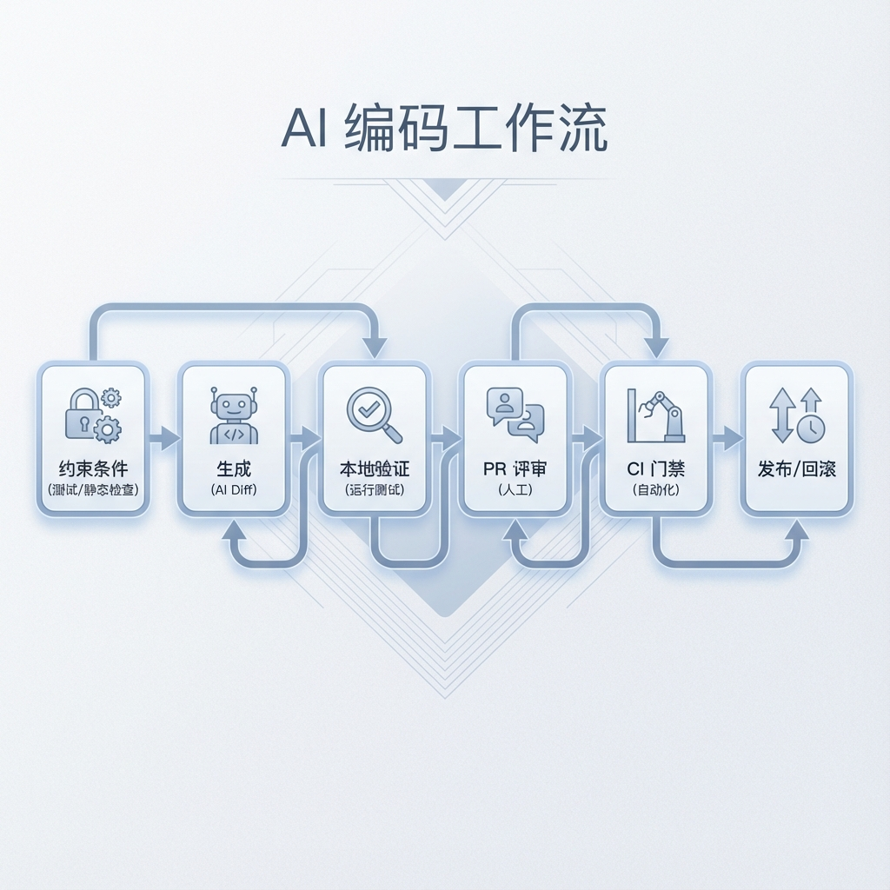
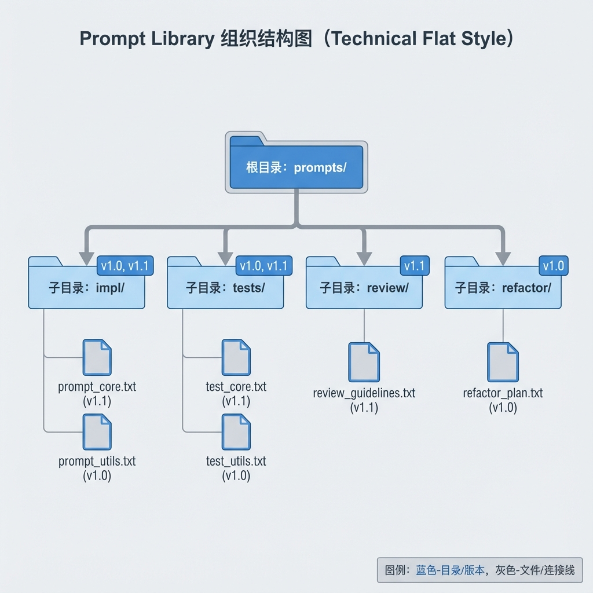
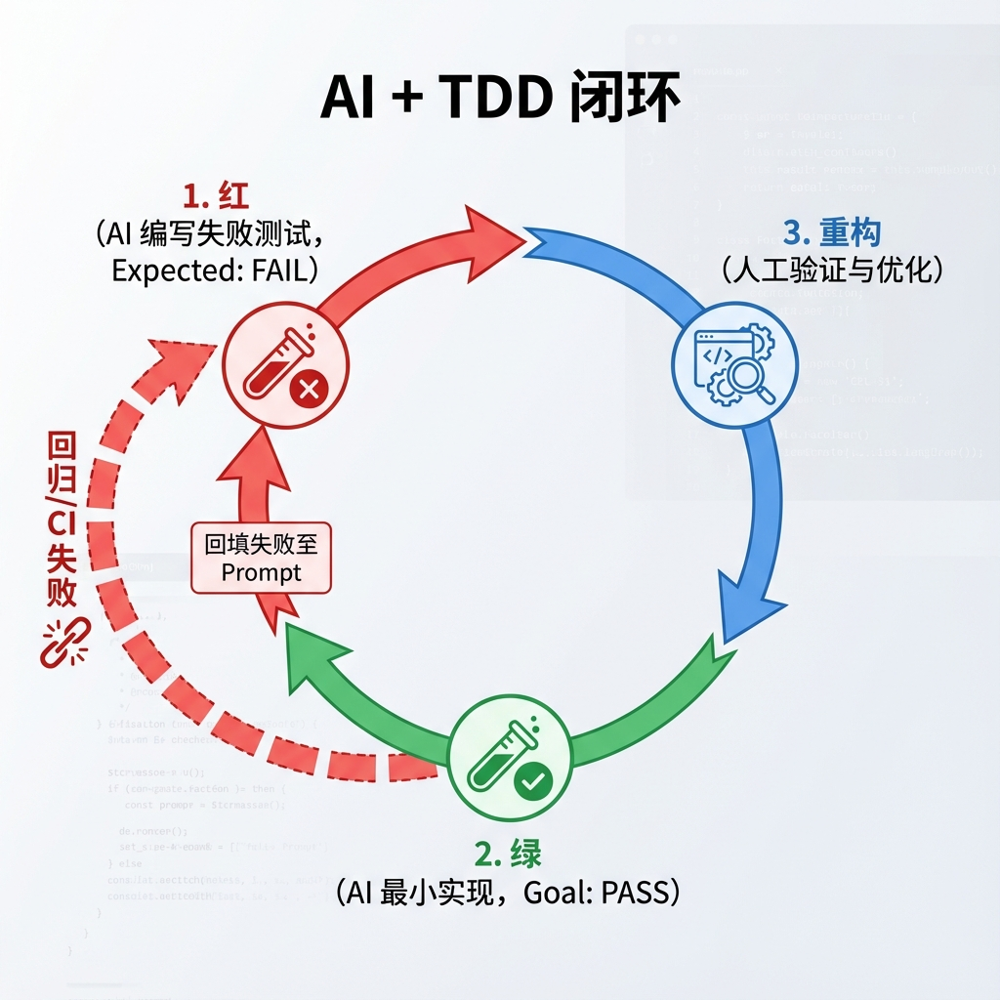

# 第 4 章：AI 辅助的高效编码工作流

> AI 能让你写得更快，也能让你更快地写错。本章的核心只有一句：用测试与门禁约束“快”，用审查与回滚守住“稳”。[18][5][6]

!!! note "关于复现、目录与 CI"
    本章中出现的 `make ...`、`CI`、以及示例目录/文件路径（例如 `path/to/file`）均为落地约定，用于说明如何把方法落实到你自己的工程仓库中。本仓库仅提供文档，读者需自行实现或用等价工具链替代。

## 章节定位
本章聚焦把 AI 编码助手嵌入到工程交付链路：从本地编辑、提交、评审到 CI 放行。目标不是“让 AI 直接写完”，而是把生成结果变成**可验证的变更**（测试、静态检查、基准与审计记录），从而在提速的同时减少返工与缺陷率。[18][5][6]

## 你将收获什么
- 一套可复用的 Prompt Library 结构：每个任务模板都包含输入上下文、输出格式、失败判定与回退策略。
- 一条 AI + [TDD](glossary.md#tdd) 的最小闭环：先生成失败用例（含负例/边界），再补齐实现，最后重构与回归。[18]
- 一条可迁移的质量闸门清单：格式化/静态分析/测试/安全扫描/基准（按项目需要裁剪），并在 CI 中强制执行。[5][6]
- 一份 AI 使用的风险与合规提示：敏感信息处理、第三方代码审查与工具的数据边界检查（以 Copilot 等产品的公开说明为参考）。[19]

## 方法论速览
1. **约束先于生成：** 先定义“什么算通过”（测试/类型/性能/安全），再让 AI 产出补丁。
2. **小步提交：** 把大需求拆成可审查的小变更，每个变更都能独立验证与回滚。[5]
3. **把 CI 当作裁判：** 让流水线决定“能不能合并”，而不是在评审里争论风格或遗漏案例。[5][6]
4. **把 AI 输出当作不可信输入：** 默认需要人类复核；对外部贡献/不熟悉模块尤其如此。[19]



*图 4-1：AI 编码工作流总览——从约束定义到自动化交付*

## 实战路径
### 0. 基础约定（建议）
- 约定“一条命令完成验证”，例如 `make fmt lint test`；避免把验证散落在 IDE/个人习惯里。[5]
- 对依赖与工具链做版本锁定（lockfile/镜像 tag），确保 CI 与本地一致。

建议把“质量闸门”拆成三层，降低反馈延迟（越靠左越快，越靠右越完整）：

| 层级 | 触发时机 | 目标 | 示例（按语言选型） |
|---|---|---|---|
| 本地（pre-commit） | 提交前 | 快速发现低级错误 | formatter、linter、类型检查的子集 |
| CI（PR） | 合并前 | 阻断破坏性变更 | 全量测试、SAST、依赖扫描、契约检查 |
| Nightly/Release | 每日/发版 | 发现慢性问题 | 基准/压测、变异测试、长跑集成测试 |

### 1. Prompt Library：把常见任务模板化
- 把 Prompt 当作“可复用的工艺配方”，建议按任务分类：`解释/定位`、`生成测试`、`实现功能`、`重构`、`评审`。
- 统一输出格式（示例）：

```text
目标：
约束：
需要修改的文件：
补丁（diff）：
新增/更新的测试：
验证命令：
风险与回滚：
```

建议把 Prompt 版本化（和代码一样），避免“同一个任务、不同人、不同写法”导致质量漂移：

```text
prompts/
  tests/
    pytest-unit.md
  impl/
    add-endpoint.md
  review/
    pr-risk-scan.md
  refactor/
    rename-module.md
```



*图 4-2：Prompt Library 的组织结构示意——分类、版本与失败样本回写*

### 示例（可复制）：为给定函数生成 `pytest` 单测

**目标：** 为函数 `calculate_discount(price, percent)` 生成覆盖边界与负例的单元测试，确保行为可回归。

**前置条件：**
- 已安装 `pytest`（或等价测试框架）。
- 你能在本地跑目标测试文件，并获取失败输出（traceback/断言差异）。[18]

**上下文：**
- 项目形态：Python 工程（单元测试）
- 角色：工程师（把 AI 输出约束为可验证补丁）
- 文件：`src/utils/pricing.py`
- 代码（供你理解，不要改动实现）：
  ```python
  def calculate_discount(price: float, percent: float) -> float:
      """Return discounted price. percent is 0-100."""
      if price < 0:
          raise ValueError("price must be >= 0")
      if percent < 0 or percent > 100:
          raise ValueError("percent must be 0..100")
      return round(price * (1 - percent / 100), 2)
  ```

**约束：**
- 只允许新增测试文件；禁止修改 `src/utils/pricing.py`。
- 测试必须覆盖：正常路径、0/100 边界、非法 percent、负数 price、类型错误（如传入字符串）。
- 使用 `pytest` + `parametrize`；断言要具体（异常类型/消息、返回值精度）。
- 如果你让 AI 输出补丁：只允许输出 unified diff（git diff 格式）。

**输出格式：**
- 产物：`tests/test_pricing.py`（若不存在则创建）
- 命名：测试函数名体现场景（`test_calculate_discount__...`）

**步骤：**
1. 把函数签名与实现片段（尽量短）提供给 AI，并明确“禁止改实现，只能新增测试”。
2. 让 AI 先写失败测试（覆盖非法输入与边界），再补齐正常路径断言（包含精度）。
3. 本地运行测试，若失败，把失败输出原样回喂，并要求 AI 只做最小修正（不扩散改动范围）。[18]

**验证命令：**
```bash
make test target=tests/test_pricing.py
# 预期输出包含：该文件内所有测试通过（exit code 0）
```

**失败判定：**
- 验证命令非 0；或缺少任一边界/负例覆盖；或断言不具体导致“测了等于没测”。

**回滚：**
- 若测试与现有行为冲突：停止并说明冲突点；不要擅自改实现。
- `git checkout -- tests/test_pricing.py`

!!! warning "隐私与数据边界"
    如果使用云端编码助手，先确认其对代码与日志的处理边界；涉及敏感仓库时优先使用企业配置或本地模型方案。[19]

### 2. AI + TDD：让测试成为生成的护栏
```bash
pytest -q
pytest tests -q
pytest tests/integration -q
```
- **红：** 让 AI 先写失败用例：正常路径 + 负例（权限不足/参数非法/外部依赖失败）+ 边界（空/极大/并发）。
- **绿：** 让 AI 写最小实现，使测试通过；避免提前“过度设计”。[18]
- **重构：** 由人类主导重构（命名、模块边界、异常语义），AI 辅助做机械性迁移与回归补测。
- **反馈闭环：** 在实现或修复阶段若测试失败（Red），将失败输出（traceback/断言差异/日志片段）原样回喂给 AI，并明确约束“只做最小改动、只改指定文件、不要顺手重构”；直到测试全绿后再进入重构阶段。



*图 4-3：AI 辅助 TDD 闭环流程——红/绿/重构与 CI 反馈回写*

!!! tip "覆盖率与质量"
    覆盖率只反映“执行过”，不等价于“验证到位”。在关键逻辑上优先补充断言强的用例、基于属性的测试（Property-based Testing）/不变量测试或变异测试（按成本选择），并用失败样本驱动迭代。

### 3. 静态检查与安全扫描（按语言选型）
- 代码质量：formatter + linter + type check（示例：`ruff`/`mypy`、`eslint`/`tsc`）。
- 安全基线：SAST/依赖扫描（示例：`semgrep`、`bandit`、`npm audit`），并将其接入 CI 流水线，设为合并卡点（阻断检查）。

建议把“该查什么”写成显式清单，避免每次换项目就重造轮子：

```text
质量闸门（最小集合）：
1) 格式化（format）—— 只关心一致性
2) 静态检查（lint/type）—— 只关心明确错误
3) 单测/集成测（test）—— 只关心行为回归
4) 依赖与 SAST（security）—— 只关心阻断级风险
5) 基准（bench，按需）—— 只关心关键路径退化
```

### 4. 性能与回归：让“变慢”可见
- 对关键路径建立基准（例如 P95 延迟、吞吐、内存峰值），每次变更输出对比表。
- 只在“测得更好”时才声称优化；若出现回退，先解释原因再合并。[6]

建议把基准输出做成“单页对比表”，避免评审时口头争论：

| 指标 | 基线 | 本次 | 变化 | 门槛 | 结论 |
|---|---:|---:|---:|---:|---|
| P95 latency (ms) |  |  |  |  |  |
| Throughput (rps) |  |  |  |  |  |
| RSS (MB) |  |  |  |  |  |

### 5. 评审协同：让 AI 做“摘要与风险扫描”
- 让 AI 输出“变更摘要 + 可能破坏的契约 + 回归建议”，帮助审阅者聚焦。
- 评审关注点：接口契约、边界条件、错误处理、并发与资源释放；风格问题交给自动化工具解决。[5]

一个可用的 PR 模板（示意）：

```text
变更动机：
影响面（API/DB/权限/性能/成本）：
验证方式（本地/CI）：
风险点（已知/未知）：
回滚方式：
```

## 复现检查（落地建议）
- `make lint test`：静态检查 + 测试必须全绿；失败即拒绝合并。[5]
- `make bench`：输出基准对比与阈值判断（阈值需按你的业务校准）。
- 归档证据：测试/覆盖率/基准报告、关键 Prompt 与模型版本（或工具版本）摘要，便于复盘与审计。

## 常见陷阱
1. **现象：** AI 说“没问题”，但 CI 一跑就红，反复来回。  
   **根因：** 把模型当裁判而不是把 CI 当裁判；没有用可执行验证把争论变成结论。[18]  
   **复现：** 让 AI 在不运行测试的情况下“判断是否正确”，然后运行 `make test`，通常会发现边界/负例缺失。  
   **修复：** 先写“通过条件”（测试清单/静态检查/性能门槛），再让 AI 输出 diff；失败输出必须原样回喂，要求只做最小改动。[18]  
   **回归验证：** 该变更的 `make lint test` 在本地与 CI 都稳定通过（非 flaky）。[5]

2. **现象：** 测试偶发失败，导致 AI 修 bug 越修越乱。  
   **根因：** 真实网络/时间/随机数引入不确定性；失败输出不可复现时，AI 的“修复”是随机游走。  
   **复现：** 连续跑同一测试 20 次，观察是否有非确定性失败（flaky）。  
   **修复：** 隔离外部依赖（mock/record-replay）、固定随机性（seed）、冻结时间（fake clock），把 flaky 先消掉再让 AI 介入。  
   **回归验证：** 关键测试在多次运行下通过率 100%，再把它写入合并门禁。

3. **现象：** 一次请求 AI “帮我改完”，输出很长但没有可用补丁。  
   **根因：** 上下文过载 + 目标不清；模型在噪声里发散。  
   **复现：** 把整个仓库或整章日志喂给 AI，观察输出容易跑题或改无关文件。  
   **修复：** 只提供任务相关的 30–200 行上下文（或少量文件），明确禁止改动范围、输出格式（diff）与失败判定。  
   **回归验证：** AI 输出的补丁能被 `git apply`（或等价方式）直接应用，并能通过指定验证命令。

4. **现象：** 不知不觉把敏感代码/凭据发给云端助手，事后无法证明未泄露。  
   **根因：** 未明确工具的数据处理边界与团队策略，缺少审计与脱敏流程。[19]  
   **复现：** 检查 Prompt/日志中是否包含 token、密钥、用户数据或内部链接。  
   **修复：** 先明确数据边界（哪些可发、哪些必须脱敏/禁止），敏感项目优先企业配置或本地模型，并对 Prompt 留档与访问控制。[19]  
   **回归验证：** 审查本次改动涉及的 Prompt/日志，不包含敏感信息；团队有可执行的“禁止项清单”。

## 延伸练习
- 给一个你从未贡献过的开源库提交 PR：让 AI 先生成测试与最小修复，再由你做风格与安全审查。
- 把“PR 评审摘要”写进模板：要求包含验证方式、回滚策略与性能影响。

## 交付物与验收（落地建议）
- Prompt Library（可版本化）与 IDE/CLI 约定：能在新机器上快速复用。
- CI 质量闸门：至少包含静态检查、测试与报告归档；关键路径包含基准对比。[5][6]
- 至少一个完整的 AI+TDD 例子：从失败用例到实现与重构，全程可复现。[18]

下面把本章的方法抽象为可迁移原则：即便你换语言/框架，仍能把 AI 产出约束为可审计的补丁。

## 深度解析：核心原则
1. **把“写代码”拆成可审计工序**：生成不是结果，补丁才是结果。每次让模型工作前，先给出通过条件（测试清单、错误语义、性能约束），并要求它输出可应用的 diff 与验证命令。这样即便模型出错，CI 也能第一时间把错误挡在合并之前。[5][18]
2. **把 CI 当作团队的共同语言**：评审里最昂贵的是争论与遗漏，而不是代码本身。把格式、静态检查、安全扫描交给流水线，把人类评审精力留给“接口契约是否被破坏”“边界条件是否覆盖”“是否引入不可逆风险”。[5][6]
3. **用失败样本训练你的 Prompt**：把每一次线上 bug、回滚、性能回退都转成可复现的测试或基准，再把这些用例写回 Prompt 模板（例如“必须补充并发/权限负例”“必须说明回滚”）。Prompt Library 不是文档，而是不断吸收真实失败的工艺资产。[18]
4. **把 AI 使用纳入合规与审计**：当你无法明确工具如何处理代码与遥测数据时，就无法证明“没有泄露”。在企业或敏感项目中，先明确数据边界（上传范围、保留期限、访问控制），再决定是否启用云端助手或采用本地模型替代。[19]

## 资料笔记（可选）
- [持续交付（门禁与回滚的工程化原则）](../../materials/ai-assisted-software-product/notes/ref-005-continuous-delivery.md)
- [Accelerate（交付表现与质量门禁怎么量化）](../../materials/ai-assisted-software-product/notes/ref-006-accelerate.md)

## 参考
详见本书统一参考文献列表：[`references.md`](references.md)。
