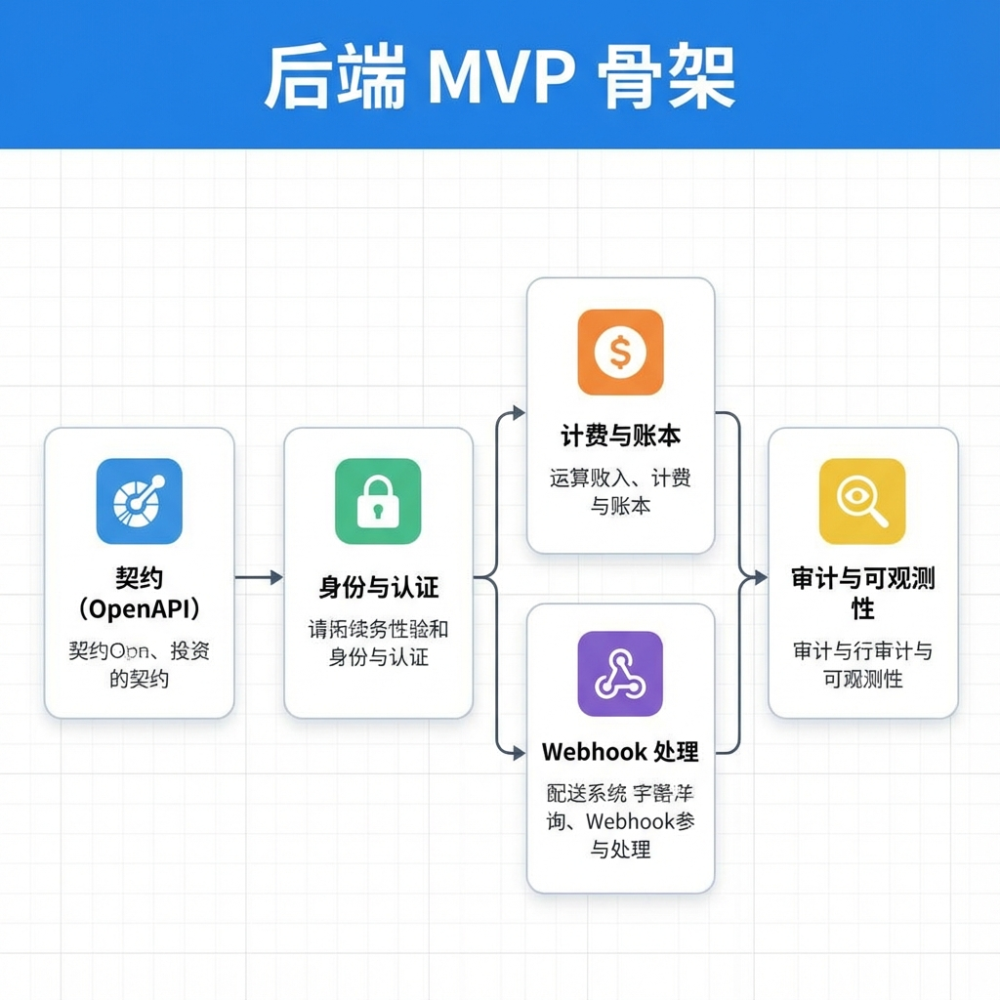
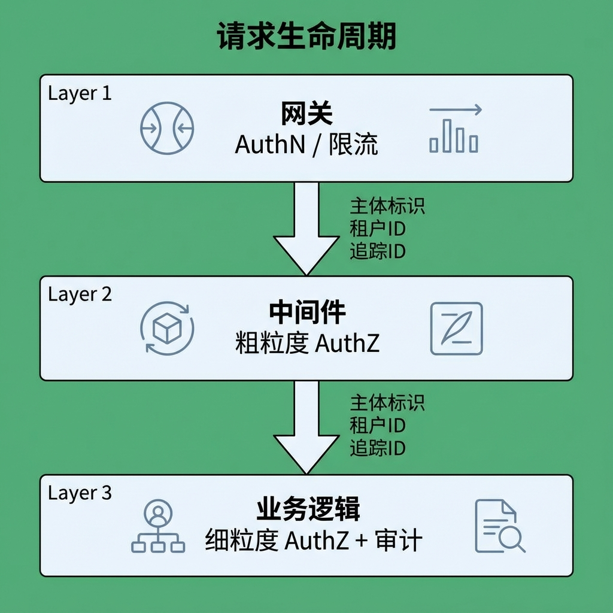
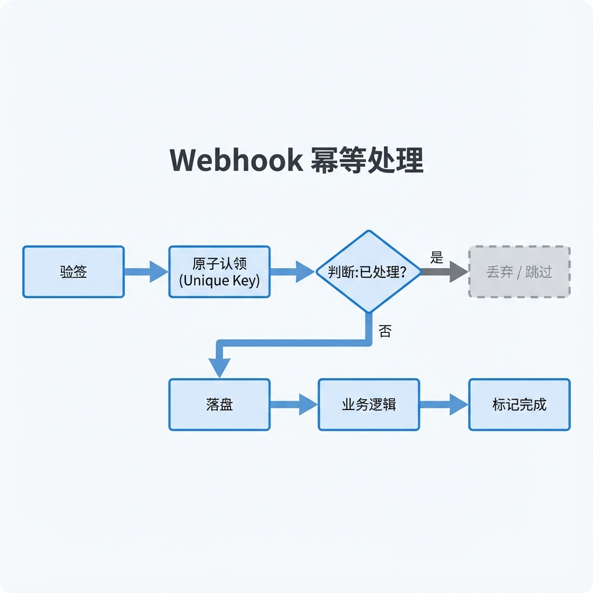

# 第 5 章：后端核心模块实战

> 后端最怕三件事：权限乱、钱对不上、出了事查不清。本章用可验收的清单把这些底线守住。[20][22][23]

!!! note "关于复现、目录与 CI"
    本章中出现的 `make ...`、`CI`、以及示例目录/文件路径（例如 `path/to/file`）均为工程约定，用于演示如何将方法应用到你自己的工程仓库中。本仓库仅提供文档，读者需自行实现或用等价工具链替代。

## 章节定位
本章回答“如何让产品可上线并守住底线”。我们以典型 Web API 为背景，给出后端最小骨架：接口契约、身份与授权、计费/配额、Webhook 安全、审计与可观测性。重点讲可迁移的模式与验收标准，而不是某个框架的固定写法。[20][22][23][61][62][64]

## 你将收获什么
- 合同优先（contract-first）的 API 设计方法：错误模型、幂等、版本化，以及把 OpenAPI 作为单一事实源。[20][67]
- 身份与授权的落地清单：认证 vs 授权、会话 vs token、RBAC/ABAC 与审计事件记录。[22][69][70]
- 支付与计费闭环要点：Webhook 签名校验、幂等处理、账本与对账的最小实现边界（不把“回调能收到”当作“钱对得上”）。[23]
- 观测性基线：结构化日志、分布式追踪与核心 SLI 指标，能在生产环境定位问题。[61][62][64]

## 方法论速览
1. **合同优先：** 先定契约（资源、错误语义、幂等规则、版本策略），再写实现与 SDK；契约变更必须可审计。[20][67]
2. **身份分层：** OAuth2 解决“授权”，不等价于“登录”；登录通常由 OIDC 等身份层完成。对外开放 API 时优先走标准授权流程，避免自创协议。[22][69]
3. **计费可追溯：** 以账本/事件为事实源，Webhook 只是一种输入。任何“影响余额/权益”的事件都必须幂等、可重放、可对账。[23]
4. **观测性与审计并重：** metrics/traces/logs 用于定位故障；审计日志用于回答“谁在何时因为什么做了什么”。[61][62][64]
5. **安全基线可验收：** 安全不是口号，而是检查项集合；把关键控制点写进 CI 与上线门槛。[68]



*图 5-1：后端核心模块依赖关系图——以契约（OpenAPI）为中心的事实源构建*
<!-- TODO: replace figure with a real architecture diagram for Ch05 -->

## 实战路径
```text
契约（OpenAPI）→ 幂等语义（Idempotency-Key）→ 原子去重（UNIQUE）→ 账本落地（events）→ 回归用例（并发/重复）→ 可观测与审计
```

### 示例（可复制）：为“可重试写操作”设计幂等与回归用例

**目标：** 为 `POST /v1/usage` 设计错误模型与幂等语义（`Idempotency-Key`），并生成最小单测/集成测用例，确保“重试不会重复扣费/重复写用量”。[20][23]

**前置条件：**
- 你已经明确这是“会被重试的写操作”（客户端/网关/任务队列可能重试）。
- 你能落地一张“去重表”（或等价原子语义）和一套最小回归用例（含并发）。[23]

**上下文：**
- 项目形态：Web API（有契约、有测试、有最小观测）
- 角色：后端/架构（把风险点变成可验收门槛）
- 契约：`openapi.yaml`（请求/响应/错误码/幂等头）
- 存储：`usage_events`（账本/事件表）+ `idempotency_keys`（去重表）

**约束：**
- 幂等去重必须基于数据库唯一约束或等价原子语义，禁止“先查再写”（TOCTOU 竞态）。[23]
- 测试必须覆盖：重复请求、并发重复、非法 key、权限不足。
- 如果你让 AI 帮你改代码/文档：请要求它只输出统一差异（unified diff / `git diff` 格式），不要夹带解释文本，方便你直接应用与审查。

**输出格式：**
- 产物：`openapi.yaml`（补充 header 与错误模型）+ `tests/`（新增幂等相关用例）
- 命名：用例名显式包含场景（`test_usage__idempotency__duplicate_returns_same_effect`）

**步骤：**
1. 在 OpenAPI 中声明 `Idempotency-Key` 头的语义（适用范围、长度/格式、重复请求的行为）。[67]
2. 在数据库中建立 `idempotency_keys` 去重表（`UNIQUE(tenant_id, key)` 或等价），并把“claim + 业务落地”放进同一事务。[23]
3. 定义错误模型与可重试/不可重试边界（例如 `RATE_LIMITED` 可重试、`FORBIDDEN` 不可重试）。[20]
4. 添加回归用例：同 key 重复请求返回 200/201 且不重复记账；并发重复只有一个成功写入，其余走幂等返回。[23]

**验证命令：**
```bash
make api-test
# 预期输出包含：幂等相关单测/集成测稳定通过（非 flaky）
```

**失败判定：**
- 任一幂等用例不稳定（flaky）或未覆盖并发重复场景；或重复请求造成重复写入/重复扣费。[23]

**回滚：**
- `git checkout -- openapi.yaml tests/`

### 1. 接口契约与错误模型（contract-first）
- 用 OpenAPI 定义：资源、鉴权方式、分页/排序、错误码、幂等键与重试语义；并将其作为前后端协作与生成 SDK 的依据。[67]
- 统一错误结构（示例）：

```json
{
  "error": {
    "code": "RATE_LIMITED",
    "message": "Too many requests",
    "request_id": "..."
  }
}
```

- 对“会重试”的写操作（创建订单、发起扣费、写入用量）提供[幂等](glossary.md#idempotency)机制：例如 `Idempotency-Key` 头 + 服务端去重表；并定义可重试错误与不可重试错误。

建议把“错误码 × 是否可重试 × 是否计费”显式化，避免客户端/网关乱重试：

| error.code | HTTP | 是否可重试 | 是否可能已产生副作用 | 说明 |
|---|---:|---|---|---|
| `RATE_LIMITED` | 429 | 是（退避） | 否 | 入口层/配额触发 |
| `TIMEOUT` | 504 | 是（有限次） | 可能 | 必须配合幂等键 |
| `CONFLICT` | 409 | 视语义 | 否/是 | 版本冲突/幂等冲突 |
| `FORBIDDEN` | 403 | 否 | 否 | 权限不足 |
| `INVALID_ARGUMENT` | 400 | 否 | 否 | 参数不合法 |

OpenAPI 中建议显式声明幂等头（示意）：

```yaml
parameters:
  - in: header
    name: Idempotency-Key
    required: false
    schema:
      type: string
      minLength: 8
      maxLength: 128
    description: >
      Optional. When provided, repeated requests with the same key MUST be idempotent
      within a tenant scope.
```

### 2. 身份、会话与授权：先把概念讲清楚
- **[AuthN/AuthZ（认证/授权）](glossary.md#authn-authz)**：你是谁 / 你能做什么。不要把“登录”与“权限校验”混在同一层。
- **会话 vs token**：浏览器侧常用安全 Cookie 会话；面向 API/多端时常用短期 access token（例如 JWT）+ 刷新策略。无论采用哪种方式，都要把过期、撤销与密钥轮换当成必做项。[70]
- **对外开放 API**：优先采用 OAuth2/OIDC 的标准流程，避免依赖密码直传等高风险做法；实现细节以你的 IdP/网关文档为准。[22][69]

请求生命周期（建议分层放置）：
1. **Gateway/Edge（入口层）**：做 AuthN（验签/过期/撤销/黑名单），尽早拒绝无效流量；产出稳定的 `principal`（user/app/tenant）。
2. **Service Middleware（通用层）**：做粗粒度 AuthZ（RBAC/Scope/路由级权限），并把 `principal/roles/scopes/tenant_id` 写入上下文与审计字段。
3. **Business Logic（业务层）**：做细粒度 AuthZ（资源级/所有权/状态机约束），例如“能否操作这条订单/这份数据”，并记录关键业务[审计](glossary.md#audit-log)事件。



*图 5-2：请求生命周期分层示意图——从网关认证、中间件授权到业务审计的上下文传递*
<!-- TODO: replace figure with a request lifecycle diagram -->

一个可直接落地的“授权清单”（按项目裁剪）：

- **资源隔离**：所有查询都带 `tenant_id`，并在数据库层有约束/索引支持（避免只靠应用层过滤）。
- **最小权限**：默认 deny；新增权限必须有审计事件与回滚（撤销）路径。[68]
- **密钥轮换**：token 签名密钥轮换方案（多把密钥、kid、过渡期）与撤销策略。[70]

```python
# 伪代码：权限依赖（示意）
def require_permission(permission):
    principal = get_principal_from_context()  # AuthN 已在网关/中间件完成
    if not principal.has(permission):
        raise Forbidden()
    audit_log(principal, action=permission)
    return principal
```

### 3. 计费、配额与 Webhook：用“账本 + 幂等”对抗现实
- **账本是事实源**：将“余额/权益”变更记录成事件（例如 `usage_reported`、`invoice_paid`、`refund_issued`），并为每个事件分配稳定主键；对账与回溯以事件流为准。
- **Webhook 处理三原则**：签名校验、幂等去重、可重放（持久化原始事件与处理结果）。Webhook 可能重复、乱序或延迟到达；系统必须能承受这些情况。[23]
- **事务边界（关键）：** 幂等去重（claim/processed 标记）与业务落地（账本/订阅/权益变更）必须在同一原子事务内完成；避免“先查重再处理”的 TOCTOU 竞态（并发下两个请求同时通过 `already_processed`）。可用数据库唯一约束实现“抢占式去重”。[23]



*图 5-3：Webhook 幂等处理流程图——基于唯一约束的“抢占式去重”与状态机流转*
<!-- TODO: replace figure with a webhook flow diagram -->

一个最小可用的数据模型（示意，按你的数据库改写）：

```sql
-- 幂等键去重（用于会重试的写操作）
CREATE TABLE idempotency_keys (
  tenant_id TEXT NOT NULL,
  idempotency_key TEXT NOT NULL,
  request_hash TEXT NOT NULL,
  response_body TEXT NULL,
  status TEXT NOT NULL,
  created_at TIMESTAMP NOT NULL DEFAULT NOW(),
  PRIMARY KEY (tenant_id, idempotency_key)
);

-- Webhook 去重与处理状态
CREATE TABLE webhook_processed (
  provider TEXT NOT NULL,
  event_id TEXT NOT NULL,
  status TEXT NOT NULL, -- PROCESSING | DONE | FAILED
  created_at TIMESTAMP NOT NULL DEFAULT NOW(),
  updated_at TIMESTAMP NOT NULL DEFAULT NOW(),
  PRIMARY KEY (provider, event_id)
);
```

建议把 Webhook 的处理状态做成最小状态机（避免“重试时不知道该怎么处理”）：

| 状态 | 含义 | 再次收到同 event_id 的行为 |
|---|---|---|
| `PROCESSING` | 已 claim，处理中 | 直接返回 200（幂等成功），避免并发重复处理 |
| `DONE` | 已应用业务效果 | 返回 200，并允许手工重放（从 raw_event） |
| `FAILED` | 处理失败（可重试） | 走重试策略或转人工；避免无限重试打爆系统 |

```python
# 伪代码：Webhook 处理流程（示意）
def handle_webhook(headers, body):
    verify_signature(headers, body)          # 供应商提供的算法/SDK
    event = parse_event(body)               # event.id 必须稳定（供应商事件主键）
    with transaction():
        claimed = try_claim_event(event.id)  # UNIQUE(event_id)，插入成功才继续
        if not claimed:
            return 200                       # 重复事件：幂等返回成功
        store_raw_event(event, body)         # 便于审计与重放（注意脱敏/访问控制）
        apply_business_effect(event)         # 更新账本/订阅/权益（尽量短事务）
        mark_done(event.id)                  # 可选：若只需要“存在性”，事务提交即代表完成
    return 200

# 伪代码：claim 的语义（示意）
# INSERT INTO webhook_processed(event_id, status) VALUES (:id, 'PROCESSING')
#   ON CONFLICT (event_id) DO NOTHING;
```

- **PCI 边界提醒**：尽量不接触卡号等敏感认证数据；采用托管收单/托管表单可显著降低合规范围，但仍需按集成方式评估你的 PCI 义务与日志脱敏策略。[23]

### 4. 速率限制、滥用防护与审计闭环
- 建立多级限流与配额：IP → 用户 → Token/应用；对“花钱”的接口（生成、检索、导出）优先按用户与配额计费口径限流。
- 审计事件覆盖：登录/权限变更/支付状态变更/密钥管理/管理员操作；并做到“可查询、可导出、可保留”。[68]

### 5. 可观测性：把生产问题变成可定位的问题
- **日志**：结构化 JSON，包含 `request_id/trace_id/user_id`；敏感字段脱敏或不落盘。
- **追踪**：在网关/应用/任务队列全链路注入 trace，定位慢请求与外部依赖抖动。[61]
- **指标**：SLI 最小集合（示例：QPS、错误率、P95 延迟、队列堆积、支付成功率/退款率），并在 Grafana 上形成可回溯面板。[62][64]

## 复现检查（落地建议）
- `make api-spec`：校验 OpenAPI（lint + breaking change 检查），并生成 SDK/文档快照。[67]
- `make api-test`：跑单测/集成测试；对“幂等/重放/乱序 Webhook”设专门用例。
- `make api-security`：运行 SAST/依赖扫描、鉴权绕过/权限过宽的回归用例；对关键审计事件做完整性检查。[68]
- `make api-observe`：发压并输出指标/追踪截图或导出 JSON，确保在没有 IDE 的情况下也能定位问题。[61][62][64]

## 常见陷阱
1. **现象：** “回调收到了”但账对不上，重复扣费或漏记账。  
   **根因：** 把 Webhook 当事务，忽略重复/乱序/延迟；缺少幂等去重与账本事实源。[23]  
   **复现：** 对同一 `event_id` 连续发送 2 次回调，并发触发两条处理路径；观察是否出现双写。  
   **修复：** 验签后先原子 claim（UNIQUE），再在同一事务内应用业务效果；raw_event 落盘用于审计与重放。[23]  
   **回归验证：** 增加“重复/乱序/延迟”三类用例，`make api-test` 稳定通过且不会产生双写。

2. **现象：** 登录/授权逻辑越来越乱：有人把 OAuth2 当登录，有人把登录当授权。  
   **根因：** 认证（AuthN）与授权（AuthZ）边界不清，身份层与授权层混在一处，导致漏洞与难以审计。[22][69][70]  
   **复现：** 让一个拥有 token 但无资源权限的主体访问资源；如果系统只验证 token 而不做资源级校验，就会越权。  
   **修复：** 分层：入口层做 AuthN，中间件做粗粒度 AuthZ，业务层做资源级 AuthZ，并记录审计事件。[68][70]  
   **回归验证：** 对关键资源补“越权不可访问”的回归用例，权限变更必须产生日志并可追溯。

3. **现象：** 事故发生后无法回答“谁在何时改了什么/做了什么”。  
   **根因：** 权限过宽且不可审计；缺少关键操作的审计事件与留存策略。[68]  
   **复现：** 模拟管理员修改权限/配额/密钥，观察是否存在可查询、可导出的审计记录。  
   **修复：** 建立审计事件最小集合（登录/权限变更/支付状态/密钥管理/管理员操作），并明确保留期与访问控制。[68]  
   **回归验证：** `make api-security` 检查关键审计事件完整性；抽样验证能定位到操作者与 request_id/trace_id。[61][68]

4. **现象：** 日志/追踪里出现 token、用户隐私或支付敏感字段，造成二次风险。  
   **根因：** 没有脱敏策略与访问控制，把生产数据当调试输出写进日志。[23][68]  
   **复现：** 检索日志中是否包含 `Authorization`、卡号片段、邮箱/手机号等字段。  
   **修复：** 结构化日志白名单字段；敏感字段默认不落盘或强脱敏；对日志查询本身做审计。[68]  
   **回归验证：** 增加日志扫描规则（CI 或运行时），发现敏感字段直接阻断发布或告警。

## 延伸练习
- 将用户体系切换为外部 IdP（自建或托管），并用同一套审计事件回答“谁有权做什么、何时生效”。[69]
- 为计费系统增加“对账差异处理”流程：差异分级、人工复核、补偿事件与回滚策略；演练一次“重复回调 + 乱序回调”的灾备用例。

## 交付物与验收（落地建议）
- OpenAPI 契约与生成物（SDK/文档），并有契约变更审计与破坏性变更检查。[67]
- 身份与授权：权限模型、校验中间件/依赖、审计事件与留存策略。[22][68][69][70]
- 计费闭环：事件表/账本、Webhook 幂等与签名校验、对账脚本与异常处置流程。[23]
- 观测性：指标/追踪/日志的最小闭环与仪表盘，支持离线审查与复盘。[61][62][64]

下面把本章的“可上线门槛”抽象为可迁移原则，便于你在不同框架/不同云环境复用同一套验收清单。

## 深度解析：核心原则
1. **后端的第一性原理：事实、契约与可追溯**：后端不是“把接口跑起来”，而是提供产品运行的事实源。事实包括用户身份、权限、权益、用量与账本；契约包括 API 的输入输出与错误语义；可追溯包括审计事件与可观测数据。三者缺一，产品都难以长期运营。[20][67]
2. **把“认证/授权/计费”拆成可验收的门槛**：能登录不代表安全，能扣费不代表账对得上。把验收写成检查项：是否能撤销 token、是否能追溯权限变更、Webhook 是否幂等可重放、是否能对账定位差异，且这些检查是否在 CI 中自动化。[22][23][68][70]
3. **把 Webhook 当作不可信输入**：现实世界里，回调会重复、乱序、延迟、甚至被伪造。正确做法是“先校验，再落盘，再幂等应用”，并允许你在未来对同一事件重放处理逻辑（例如补 bug、补偿丢失事件）。[23]
4. **把可观测性当作上线条件而非事后补丁**：如果没有 trace_id，你无法回答“哪一段慢”；如果没有 SLI 面板，你无法回答“上线后到底变好了还是变差了”；如果没有审计事件，你无法回答“是谁改的”。这些都必须在第一次上线前就准备好。[61][62][64][68]

## 资料笔记（可选）
- [OWASP ASVS（把安全写成验收项）](../../materials/ai-assisted-software-product/notes/ref-068-owasp-asvs.md)
- [OpenTelemetry（把一次请求的全链路串起来）](../../materials/ai-assisted-software-product/notes/ref-061-opentelemetry.md)
- [OpenAPI（接口契约）](../../materials/ai-assisted-software-product/notes/ref-067-openapi-spec.md)

## 参考
详见本书统一参考文献列表：[`references.md`](references.md)。
