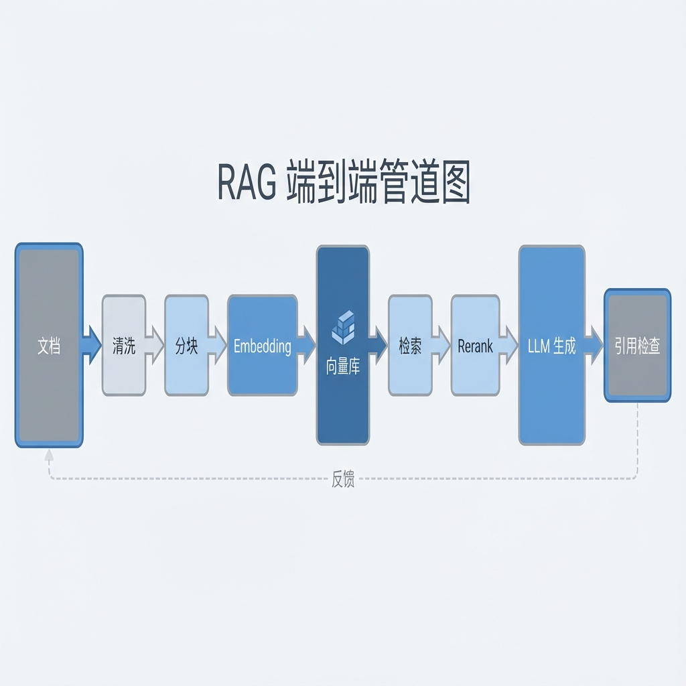
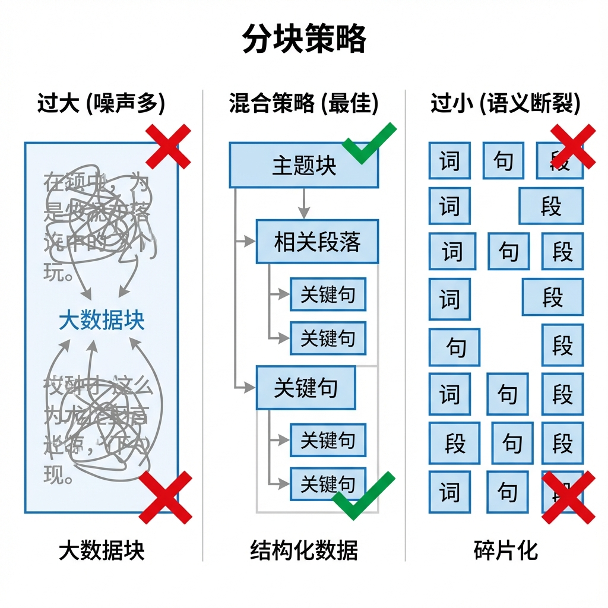

# 第 6 章：RAG（检索增强生成）—— 赋予 AI 记忆

> 通过向量检索 + 重排序 + 过滤策略，让模型回答“有出处、有证据”；并通过工程化手段把延迟控制在可接受范围。[24][25][27][28]

!!! note "关于复现、目录与 CI"
    本章中出现的 `make ...`、`CI`、以及示例目录/文件路径（例如 `path/to/file`）均为落地约定，用于说明如何把方法落实到你自己的工程仓库中。本仓库仅提供文档，读者需自行实现或用等价工具链替代。

## 章节定位
本章解决“模型记不住/答不准”的问题。你将搭建完整的 [RAG](glossary.md#rag) 管线：数据清洗、切分、索引、检索、重排序与引用追踪，并用自动化评估量化改动收益。[24][28]

## 你将收获什么
- 可切换的[向量](glossary.md#embedding)数据库方案（Milvus/Pinecone/pgvector 等），并给出对比维度与压测方法。
- 语义分块、BM25 + 向量混合检索、重排序的组合策略与可复现脚本。[24][27]
- RAGAS/LLM-as-a-Judge 评测流水线，量化回答质量与引用一致性（延迟/成本作为独立指标监控）。[28][50]
- 向量相似检索的底层索引与加速背景，可作为理解检索性能边界的参考。[25]

## 方法论速览
1. **数据处理：** PDF/Markdown 清洗、语义分块、元数据对齐，确保来源可追踪。[24]
2. **检索策略：** 混合检索（BM25 + 向量）、查询重写、重排序，兼顾召回与精度。[27]
3. **评估闭环：** 构建问答对与引用检查，RAGAS 自动评分，失败则回滚配置。[28]



*图 6-1：RAG 端到端工程化管线——从文档处理到评估回滚的闭环*
<!-- TODO: replace with your own pipeline diagram or a screenshot from your project -->

## 实战路径
```text
评测集（QA+允许引用来源）→ 强制引用的回答模板 → 引用缺失=失败 → CI 阻断 → 分数/延迟/成本三指标联动决策
```

### 示例（可复制）：把“引用缺失”变成可阻断合并的评测项

**目标：** 为 RAG 系统定义“回答必须带引用”的输出格式，并构建最小评测集 + 失败判定，让“引用缺失”在 CI 中直接阻断合并。[24][28]

**前置条件：**
- 你有一份可索引的知识源（Markdown/PDF/网页快照均可），且每个片段能映射到可追溯来源（链接/页码/文件路径）。[24]
- 你愿意把“引用”当作契约：没有引用的回答，即使看起来正确也视为失败。[24][28]

**上下文：**
- 项目形态：RAG 问答系统（可被迭代与回归）
- 角色：架构/工程（把质量门槛写成可执行检查）
- 文档源：`docs/`（Markdown/PDF）
- 评测集：`eval/qa.jsonl`（`question, expected_sources`）
- 模板：`prompts/rag_answer.md`（强制引用片段与页码/链接）

**约束：**
- 缺少引用视为失败；引用必须来自检索到的片段，不得编造。[24][28]
- 评测必须同时输出：质量分数 + 延迟 + 成本（独立列，避免“更准但更慢/更贵”被忽略）。[25]
- 若使用 AI 辅助修改代码库文件：要求它只输出统一差异格式（unified diff，git diff 格式）。

**输出格式：**
- 产物：`eval/qa.jsonl`、`prompts/rag_answer.md`、`configs/rag.yml`（或等价配置）
- 命名：评测集与配置必须可版本化（便于回滚与对比）。[28]

**步骤：**
1. 选 20–50 个高频问题，标注“允许引用的来源”（文件路径/链接/页码），写入 `eval/qa.jsonl`。[28]
2. 写回答模板 `prompts/rag_answer.md`：要求结构化输出 + 引用列表（source_id + 摘录），并明确“无引用=失败”。[24]
3. 在评测脚本里实现三类判定：引用缺失率、质量分数阈值、延迟/成本阈值；任一失败都阻断合并。[28]
4. 把评测接入 CI：每次改动检索参数/切分策略/重排序模型都必须跑评测并产出对比表。[28][50]

**验证命令：**
```bash
make rag-eval
# 预期输出包含：引用缺失率=0 + 质量分数>=阈值 + 延迟/成本在门槛内（产出 CSV/Markdown 报告）
```

**失败判定：**
- 引用缺失率 > 0；或分数低于阈值且未触发回滚；或延迟/成本显著退化但仍合并。[28]

**回滚：**
- `git checkout -- eval/ prompts/ configs/`

### 1. 数据清洗与分块
- 使用 `langchain`/`llamaindex` 解析 PDF/Markdown，去除页眉页脚与目录噪声。
- 采用语义分块（按主题/标题）+ 固定长度混合策略，块内保留来源页码。

建议把“分块策略”当作一等公民配置，而不是散落在代码里：

```yaml
# configs/chunking.yml（示意）
chunking:
  mode: hybrid            # semantic | fixed | hybrid
  chunk_size: 800
  chunk_overlap: 120
  keep_headings: true
  keep_page_number: true  # PDF
  min_chars: 200
  max_chars: 1200
```



*图 6-2：分块粒度对检索质量的影响——过大引入噪声，过小导致语义断裂，混合策略求稳*
<!-- TODO: replace with a screenshot comparing your chunking strategies on a real dataset -->

### 2. 索引与检索
```python
from llama_index.core import VectorStoreIndex

# 示例（伪代码）：Vector Store 的接入方式随 LlamaIndex 版本/插件而变化
index = VectorStoreIndex.from_documents(docs)
query_engine = index.as_query_engine(similarity_top_k=5)
print(query_engine.query("How to handle retries?"))
```
- 对比 Pinecone/Milvus/pgvector：记录建库时间、QPS、P95 延迟、存储成本。
- 结合 BM25/keyword 检索做混合召回，减少语义漂移。

建议把“检索结果”做成可审查的结构化输出（用于人工抽查与回归对比）：

```json
{
  "query": "How to handle retries?",
  "top_k": [
    {"source_id": "docs/engineering/retries.md#L1", "score": 0.83, "snippet": "..."},
    {"source_id": "docs/backend/webhook.md#L42", "score": 0.79, "snippet": "..."}
  ]
}
```

### 3. 重排序与引用
- 使用 Cross-Encoder（如 `cross-encoder/ms-marco-MiniLM-L-6-v2`）重排序 top-K 结果。
- 在生成阶段强制输出引用（原文片段与页码），引用缺失即判定失败。

一个“强制引用”的回答模板（示意，可直接落地为 `prompts/rag_answer.md`）：

```markdown
你是企业知识库问答助手。请只依据检索到的证据回答。

输出格式（必须严格遵守）：
1) Answer: 用中文给出简洁回答（最多 8 句）
2) Citations: 列出所有引用（每条包含 source_id + 摘录），格式：
   - [source_id] "verbatim quote"

规则：
- 如果证据不足以回答：输出 "Answer: 我不知道" 并解释缺失什么证据。
- 禁止编造引用；Citations 只能来自检索到的片段。
```


*图 6-3：强制引用的结构化响应示例——Answer 与 Citations 分离以防幻觉并支持追溯*
<!-- TODO: replace with a real screenshot from your UI (Answer + Citations) -->

### 4. 自动评估
- 构造 100–200 对问答基准，标注参考答案与允许的引用片段。
- 运行 RAGAS/LLM-as-a-Judge，常用指标包含 Faithfulness、Answer Relevance、Context Precision/Recall 等（以你使用的版本为准）。[28][50]

一个最小评测样例（`eval/qa.jsonl` 单行示意）：

```json
{"id":"q-001","question":"Webhook 事件重复到达如何处理？","expected_sources":["docs/books/ai-assisted-software-product/chapter-05-backend.md"],"notes":"必须提到验签、幂等、可重放"}
```

建议把评测输出固定成“可对比表”，并把阈值写进配置（避免每次手动解释）：[28]

| id | faithfulness | relevance | citation_missing | latency_ms | cost_usd | verdict |
|---|---:|---:|---:|---:|---:|---|
| q-001 |  |  |  |  |  |  |

## 复现检查（落地建议）
- `make rag-build`：清洗、切分、索引与基准数据生成。
- `make rag-eval`：执行 RAGAS 评估并输出 CSV；低于阈值自动退回上一个版本。
- CI 存档检索延迟与成本对比表，便于决策。

## 常见陷阱
1. **现象：** 回答“看起来合理”，但经常引用不到位或引用错段。  
   **根因：** 没把引用当契约；模板未强制结构化引用；评测没把“引用缺失”设为失败。[24][28]  
   **复现：** 随机抽 20 次问答，统计引用缺失率与引用是否来自检索片段。  
   **修复：** 用模板强制输出 `Answer + Citations`，并在评测中将 `citation_missing` 设为硬门禁条件。[24][28]  
   **回归验证：** `make rag-eval` 输出引用缺失率=0（或低于门槛）且可追溯到 source_id。

2. **现象：** 换个问法就检索不到，或召回很多噪声片段。  
   **根因：** 分块策略不稳：块过长=噪声，过短=断裂；元数据缺失导致过滤与追溯失败。[24][27]  
   **复现：** 在同一评测集上扫 `chunk_size/overlap` 组合，观察召回与引用准确率变化。  
   **修复：** 将切分参数配置化并版本化；用少量标注问答先筛策略，再做大规模索引与调参。[24][27]  
   **回归验证：** 关键问题的 top-k 证据稳定（或差异可解释），并能产出可对比报告。[28]

3. **现象：** 文档更新后，回答引用旧内容或出现“查不到”。  
   **根因：** 数据漂移：索引未增量刷新或元数据未对齐；embedding/model 版本变更未触发重建。[24]  
   **复现：** 更新一份文档后不重建索引，询问该文档新内容；观察是否无法引用。  
   **修复：** 为文档与索引建立版本号（快照）；定义增量刷新策略与一致性校验（新旧索引对比）。  
   **回归验证：** `make rag-build` 后同一问题的引用指向新版本 source_id，且评测分数不退化。[28]

4. **现象：** “更准了”但线上变慢、成本飙升，最终被迫回退。  
   **根因：** 只盯质量分数，忽略延迟/成本；重排序模型过重或 top_k 过大导致尾延迟。[25][28]  
   **复现：** 逐步增大 `top_k` 或启用更重 rerank，记录 P95 延迟与成本变化。  
   **修复：** 把延迟/成本作为独立门槛；用缓存、分层检索、轻量 rerank 组合实现“够好且够快”。[25]  
   **回归验证：** 评测报告同时给出质量/延迟/成本，任一超过门槛触发回滚配置。[28]

## 延伸练习
- 对比 Dense Retriever（E5/ColBERT）与 Sparse（BM25）在你数据集上的指标差异。
- 尝试基于 rerank 模型蒸馏一个轻量 Cross-Encoder，验证延迟下降幅度。

## 交付物与验收（落地建议）
- 清洗脚本、切分配置与索引构建脚本；所有步骤可重放。
- 评估报告（RAGAS + 真实用户问答）；性能与成本对比表。
- 生成提示模板与引用格式说明，缺失引用的响应在 CI 中视为失败。

下面把本章的 RAG 落地路径抽象为可迁移原则：你可以换框架/向量库，但不换“证据与回归”的验收方式。

## 深度解析：核心原则
1. **证据优先**：把“引用可追踪”当作第一契约——答案必须回指到检索片段（页码/链接），缺失引用直接判失败而不是“看起来合理”。[24][28]
2. **切分决定上限**：切分不是实现细节，而是信息检索的建模假设；先用少量标注问答对验证切分策略，再谈召回/重排的优化。[24][27]
3. **评估驱动回归**：任何参数改动（top_k、chunk_size、rerank、过滤）都必须触发评测与对比表；分数低于阈值就回滚配置而不是“口头解释”。[28][50]
4. **成本/延迟独立度量**：质量分数与延迟/成本分开看、一起决策；避免用“更准”掩盖“变慢/变贵”。[25]

## 参考
详见本书统一参考文献列表：[`references.md`](references.md)。
