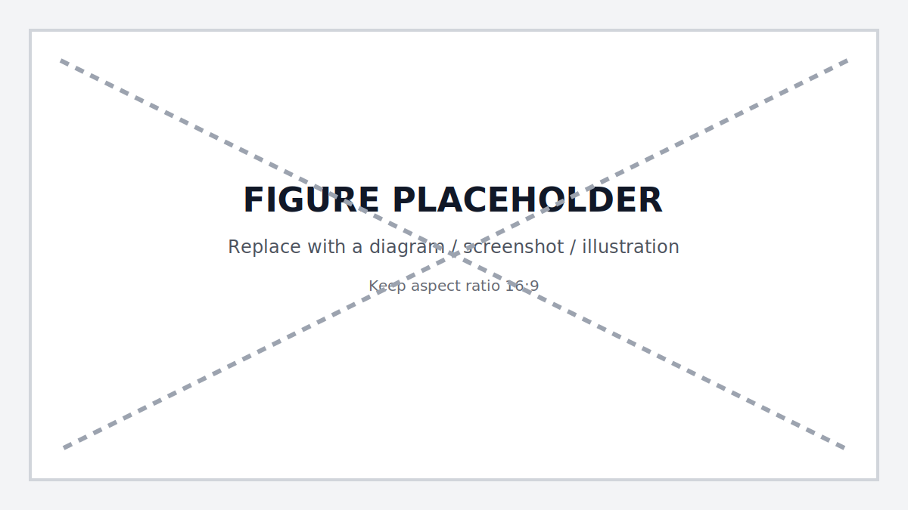

# 第 7 章：Agent（智能体）—— 赋予 AI 手脚

> 让模型具备规划、记忆与工具使用能力，完成多步任务而非单轮问答。[29][30][31]

!!! note "关于复现、目录与 CI"
    本章中出现的 `make ...`、`CI`、以及示例目录/文件路径（例如 `path/to/file`）均为落地约定，用于说明如何把方法落实到你自己的工程仓库中。本仓库仅提供文档，读者需自行实现或用等价工具链替代。

## 章节定位
本章解决“模型只会说不会做”的问题。你将实现 ReAct/工具调用/多智能体协作，定义安全的工具接口，并用基准任务验证 [Agent（智能体）](glossary.md#agent) 的有效性与鲁棒性。[29][31]

## 你将收获什么
- ReAct + Function Calling 的可复现模板，包含计划、执行、回退与记忆管理。[29][31]
- LangGraph/AutoGen 的多 Agent 编排示例，涵盖角色分工、对话压缩与长程记忆。[30][60]
- 安全护栏：工具白名单、参数校验、速率限制与审计日志。

## 方法论速览
1. **规划与记忆：** 将任务分解为计划—执行—反思循环，外部化记忆（向量库/键值对）。[29]
2. **工具接口设计：** 限定输入模式与幂等性，确保可审计与可重放。[31]
3. **协作与仲裁：** 多 Agent 协作时，引入裁决/仲裁角色，防止回声室与无限循环。[30]

## 实战路径
Agent 的本质是一个“状态机 + 工具路由器”。在进入代码前，先把数据流画清楚：输入从哪来、工具能做什么、如何记录证据、如何停止。否则你会很快得到一个“看起来能跑”的 Demo，但它会在生产里以更高速度放大风险。[29][31]



*图 7-1：Agent 核心闭环与护栏位置——输入过滤、工具白名单、审计记录与停止条件（示意）*
<!-- TODO: draw: User input -> Planner (LLM) -> Tool router -> Tool exec -> Observation -> Memory -> Planner; mark guardrails at input & tool exec; mark budget/stop. -->

### 示例（可复制）：定义安全工具接口并验证“越权不可用”

**目标：** 为 Agent 增加一个工具 `send_email(to, subject, body)`，并确保越权/敏感操作必须二次确认且可审计；当 principal 缺少权限时，Agent 不得触发工具执行。[31]

**前置条件：**
- 你已有一个最小 Agent 运行框架（ReAct/Function Calling 任一），并能把“工具调用”统一经由一个路由器入口（便于集中做白名单与审计）。[29][31]
- 你愿意把“安全边界”写成可回归用例，而不是只写在 README 里。[31]

**上下文：**
- 项目形态：具备工具调用能力的 Agent 服务（CLI/HTTP 均可）
- 角色：工程/安全（把越权与泄露变成可证伪失败）
- 工具清单：`tools/registry.json`（白名单 + JSON Schema + 权限标签）
- 审计：`logs/audit.jsonl`（至少包含 `trace_id/principal/tool/args_hash/result`）

**约束：**
- 工具必须有参数校验、超时、重试；敏感参数（收件人/内容）要脱敏落盘（例如只记录 hash/长度/域名）。[31]
- 必须有“拒绝调用”用例：当 principal 缺少权限时，Agent 不得触发工具执行。
- 必须有“二次确认”用例：当内容包含潜在敏感/高风险（例如批量群发、外部域名、包含凭据样式）时，需要显式确认 token 才能继续。
- 若使用 AI 辅助修改代码库文件：要求它只输出统一差异格式（unified diff，git diff 格式）。

**输出格式：**
- 产物：`tools/registry.json`、`tests/test_tool_authorization.py`（或等价测试文件）、审计日志字段说明（可写在 `docs/`）
- 命名：工具名与权限名稳定，避免重命名导致历史审计难以检索

**步骤：**
1. 为 `send_email` 定义 JSON Schema：类型、长度上限、允许的域名/格式，并在 registry 中标注权限（例如 `email:send`）。[31]
2. 工具路由器在执行前做三类检查：白名单（tool 是否允许）→ 参数校验（schema）→ 权限校验（principal 是否具备）。[31]
3. 为敏感操作加入确认机制：生成 `approval_token`（短时有效）并要求用户确认；确认前不得调用工具。
4. 写回归用例：无权限时必须拒绝；有权限但缺确认时必须停在“等待确认”状态；确认后才可执行。
5. 审计落盘：每次 tool call 记录 trace_id、principal、tool、args_hash（对原始参数做哈希/脱敏摘要）、结果摘要与耗时，确保可追溯与可重放。[61]

**验证命令：**
```bash
make agent-eval
# 预期输出包含：越权调用=0 次；审计日志字段齐全；并且存在“等待确认”的中间态用例
```

**失败判定：**
- 出现未授权的工具调用；或审计日志缺少关键字段（trace_id/principal/tool）；或敏感内容未脱敏直接落盘。[31]

**回滚：**
- `git checkout -- tools/ logs/ tests/`

### 1. ReAct + 工具调用
```python
# 伪代码：规划 + 调用
plan = planner("生成市场周报")
for step in plan:
    if step.tool:
        result = tool_router(step.tool, step.args)
    else:
        result = llm(reason_about=step)
    memory.write(step, result)
```
- 设计工具模式：入参 JSON Schema、超时、重试、敏感操作确认。[31]
- 加入“反思”提示，若结果无用则改写查询或切换工具；同时把“停止条件”写进系统提示，避免把失败当成继续调用工具的理由。[29]

建议把 Agent 的核心循环显式化为“状态机”，让日志、评测与回滚有落点：

| 状态 | 输入 | 产物 | 典型失败 | 建议处理 |
|---|---|---|---|---|
| `PLAN` | task + context | plan（有限步数） | 计划膨胀 | 限制步数/预算；要求每步可验证 |
| `ACT` | tool + args | tool result | 参数错误/超时 | 校验/重试/降级；记录审计 |
| `OBSERVE` | result | observation | 噪声太大 | 截断/摘要；保留 source_id |
| `REFLECT` | history | next action | 无限循环 | 触发熔断；输出“我不知道/需要人工” |
| `DONE` | - | final answer | 引用缺失 | 要求给证据/产物；否则失败 |


*图 7-2：Agent 状态机与停止条件——预算、重试、熔断与人工接管（示意）*
<!-- TODO: draw: PLAN->ACT->OBSERVE->REFLECT loop; exits to DONE; budget counters; circuit breaker; HITL approval. -->

### 1.1 停止条件与预算（必须显式化）

如果你不写停止条件，Agent 会把“继续”当默认；生产事故通常来自“无限循环 + 真实副作用”。把预算写成配置，不要埋在代码里：[29][30]

- **步数预算**：`max_steps`（例如 8–20），并对“同一工具 + 同一参数”的重复调用做硬熔断。
- **时间预算**：`max_wall_time_ms`，超时必须输出“已停止”的原因与下一步建议。
- **token 预算**：限制每轮推理与总上下文；超出时触发摘要/检索记忆或提前结束。
- **重试预算**：对每个工具定义 `max_retries` 与退避策略；超过阈值转“人工接管/降级”。
- **成本预算**：记录每次调用成本（估算也可），避免在“长链路 + 大模型”里失控。
- **副作用预算**：对有副作用工具设置更严门槛（必须确认/必须权限/必须审计）。
- **递归深度预算**：`max_recursion_depth`，防止 Agent 在子任务分解中无限层级下钻。
- **人工干预预算**：`max_interrupts`，允许人工在中间步骤介入修正的次数上限，超过则视为“半自动化”失败。

一个可复用的预算配置片段（示意）：

```yaml
agent:
  max_steps: 12
  max_wall_time_ms: 30000
  max_total_tokens: 24000
  max_tool_retries: 2
  repeat_call_breaker:
    same_tool_same_args_max: 2
  high_stakes:
    require_approval_token: true
```

### 2. 多智能体协作
- 使用 LangGraph/AutoGen 定义 Writer、Researcher、Critic 三个角色；限制轮数与 token 上限。[30][60]
- 对于长文档任务，使用摘要链或检索记忆，防止上下文爆炸。

多 Agent 的收益来自“分工”，成本来自“协调”。建议把协作策略写成清晰的仲裁规则，而不是把多个模型放进群聊：[30]

- **职责边界**：Researcher 只检索与引用；Writer 只写稿；Critic 只找漏洞与提出反例；Manager 只路由与决定停止。
- **统一输出契约**：每个 Agent 输出结构化结果（例如 JSON），避免在自然语言里丢字段。
- **轮数与预算**：每个 Agent 有自己的 `max_turns`；Manager 有总预算；超过预算必须停止并给出“未完成清单”。
- **冲突仲裁**：Writer 与 Critic 冲突时，以“证据/引用/可验证检查”裁决，而不是以语气裁决。


*图 7-3：多 Agent 协作与仲裁——角色分工、消息结构与停止条件（示意）*
<!-- TODO: draw: Manager dispatches to Researcher/Writer/Critic; Critic feedback loop; stop at max_turns; evidence-based arbitration. -->

### 3. 安全与可观测
- 工具白名单 + 参数校验 + 速率限制；错误集中到[审计日志](glossary.md#audit-log)。
- 每个工具调用记录 trace_id，便于重放与稽核。

建议把“工具调用安全”写成显式清单（能检查、能审计、能回滚）：

| 维度 | 最小要求 | 备注 |
|---|---|---|
| 白名单 | 只有 registry 中的工具可调用 | 默认 deny |
| 参数校验 | schema 校验失败=拒绝执行 | 失败要可读，便于 Agent 自修正 |
| 权限校验 | principal 缺权限=拒绝执行 | 资源级权限在业务层校验 |
| 速率限制 | per principal/per tool 限流 | 防止失控循环打爆外部 API |
| 超时与重试 | 超时可控、重试有限次 | 重试必须幂等或无副作用 |
| 审计日志 | trace_id + args_hash + result 摘要 | 敏感字段脱敏/不落盘 |
| 可重放 | raw input/observation 可复用 | 便于复盘与修复 |
| 熔断与降级 | 连续失败触发降级 | 输出“需要人工/证据不足” |

### 4. 评估基线
- 构建任务集：网页摘要、报告生成、CSV 计算、邮件草稿。为每类任务设定成功定义与评分规则。
- 使用 `MT-Bench`/自建脚本打分，比较纯 LLM 与 Agent 的增益。[50]

### 4.1 评估基线与审计（把“感觉好用”变成可回归）

Agent 的评估要同时覆盖三件事：**能否完成任务**、**是否遵守边界**、**成本是否可控**。[50][61]

建议为评测集（`eval/agent_tasks.jsonl`）定义最小字段（示意）：

```json
{
  "id": "t-001",
  "task": "生成周报并写邮件草稿",
  "allowed_tools": ["search", "read_doc", "send_email_draft"],
  "forbidden_tools": ["send_email", "delete_*"],
  "success_criteria": ["包含 3 条要点", "每条要点有引用", "不实际发送邮件"],
  "budget": {"max_steps": 10, "max_wall_time_ms": 20000},
  "notes": "必须停在草稿态，等待人工确认"
}
```

评估输出建议固定为一行一条记录（便于趋势分析）：

| id | pass | steps | tool_calls | forbidden_calls | citation_missing | latency_ms | cost_est | verdict |
|---|---:|---:|---:|---:|---:|---:|---:|---|
| t-001 |  |  |  |  |  |  |  |  |

建议建立包含以下维度的评估清单（按你的场景校准）：

| 维度 | 指标 | 说明 | 门槛示例 |
|---|---|---|---|
| 任务完成 | 通过率 | 最终产物符合验收标准的比例 | > 85% |
| 过程效率 | 平均步数 | 达成目标所需的平均步数 | < 15 步 |
| 响应延迟 | 端到端延迟（P95） | 用户输入到最终输出的耗时（P95） | < 30s |
| 成本控制 | 单任务成本 | 单任务平均 token 或金额消耗 | < $0.1 |
| 工具合规 | 参数校验失败率 | 参数校验失败/“幻觉参数”的比例 | < 5% |
| 安全边界 | 越权/违禁调用次数 | 越权/违禁工具调用的次数 | = 0（硬指标） |
| 引用质量 | 引用准确率 | 引用来源真实存在且支持论点的比例 | > 95% |
| 人工介入 | 人工介入率 | 需要人工确认或接管的比例 | < 10% |
| 循环检测 | 死循环次数 | 陷入重复步骤的死循环次数 | = 0 |

## 复现检查（落地建议）
- `make agent-demo`：启动示例 Agent，完成“周报生成 + 邮件发送”端到端流程。
- `make agent-eval`：运行基准任务并输出分数曲线，低于阈值自动失败。
- 工具调用日志与审计事件需在 CI 打包，供离线审查。

## 常见陷阱
1. **现象：** Agent 反复调用同一个工具且参数相同，进入死循环。  
   **根因：** 工具错误返回不结构化/不可行动；缺少重复调用熔断与停止条件。[29][31]  
   **复现：** 构造一个总是返回“500”的工具响应，观察 Agent 是否不断重试。  
   **修复：** 统一错误模型（错误码 + 可行动建议）；加入 `same_tool_same_args_max` 熔断；超过预算转“人工接管”。[29]  
   **回归验证：** `make agent-eval` 中的 `loop_detection` 用例必须稳定通过，且审计日志记录熔断原因。[61]

2. **现象：** 工具调用参数“幻觉”，频繁触发校验失败。  
   **根因：** Schema 不清晰、字段描述不足；工具层缺少“失败后如何自修正”的提示。[31]  
   **复现：** 为工具增加嵌套参数，观察模型是否生成不存在字段/错误类型。  
   **修复：** 强类型 schema（严格校验）+ 字段 description + one-shot 示例；校验失败返回“期望 schema 摘要 + 示例”。[31]  
   **回归验证：** `invalid_args_recovery` 用例中，Agent 能在限定次数内修正参数并完成任务。

3. **现象：** 上下文爆炸：任务进行到一半超 token 或变慢。  
   **根因：** 工具输出过大/历史对话无限增长；缺少摘要与检索记忆策略。[29]  
   **复现：** 模拟工具返回大量 HTML/JSON，观察上下文是否被撑爆。  
   **修复：** 工具输出截断（保留关键字段）；引入摘要记忆与检索记忆；把原文落盘并只给 source_id。[29][31]  
   **回归验证：** 长任务在预算内完成；日志中不出现超大 observation；平均延迟回到基线。[61]

4. **现象：** 出现越权/高风险操作（例如未经确认就触发外部写操作）。  
   **根因：** 工具即权限边界未建立；缺少高风险工具的确认 token 与审计门禁。[31][61]  
   **复现：** 用无权限 principal 触发 `send_email`；或让输入中包含“请直接发送给全员”的指令。  
   **修复：** 白名单 + 权限校验 + 二次确认；对高风险工具默认只生成草稿，必须人工确认后才允许执行。[31]  
   **回归验证：** `forbidden_calls == 0`；高风险调用在审计日志中可追溯到确认 token 与操作者。[61]

## 延伸练习
- 为 Agent 增加“合规审计员”角色，专门过滤输出中的泄露或偏见内容。
- 尝试通过 DPO/RLHF 强化 Agent 的工具选择能力（与第 10 章呼应）。

## 交付物与验收（落地建议）
- ReAct/工具调用模板与 LangGraph/AutoGen 编排脚本。
- 任务基准与评估报告，包含失败样本与改进建议。
- 工具白名单、审计日志样例与速率限制配置。

下面把本章的 Agent 工程实践抽象为可迁移原则：你可以换编排框架，但不换“权限边界、可审计、可回退”的护栏。

## 深度解析：核心原则
1. **工具即权限边界**：把工具接口当作安全边界（白名单 + Schema + 超时/重试/确认）；模型永远不直接拥有“执行权限”。[31]
2. **停止条件优先**：显式限制步数、预算（token/时间）、失败重试次数；把“无限循环/回声室”视为必须可复现的缺陷。[29][30]
3. **审计与可重放**：每次工具调用必须可追溯（trace_id、principal、参数哈希、结果摘要），支持离线复盘与事后稽核。[61]
4. **基准任务说话**：用固定任务集比较“纯 LLM vs Agent”的增益，并把失败样本回写到提示与工具设计中，而不是靠主观体验。[50]

## 参考
详见本书统一参考文献列表：[`references.md`](references.md)。
