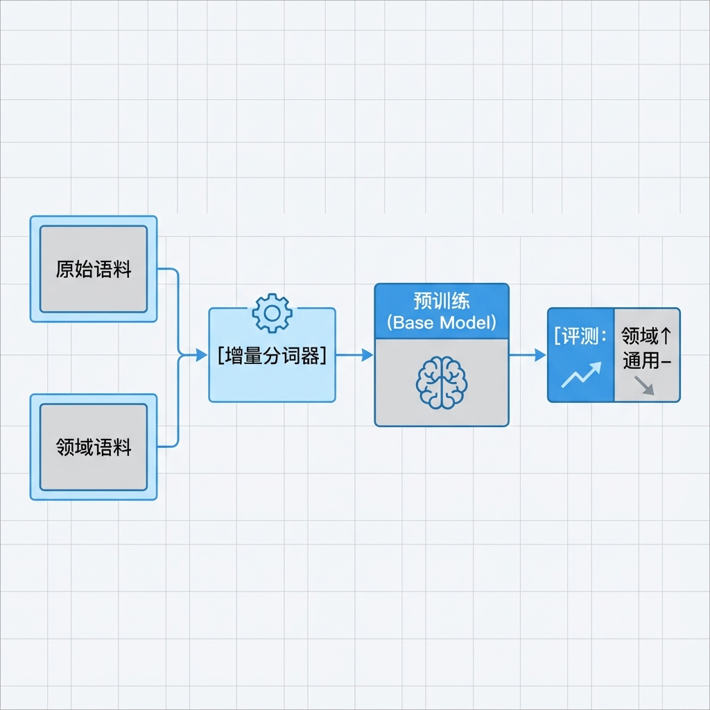

# 第 9 章：LLM 预训练与增量预训练

> 当通用模型不足以支撑业务时，需要在领域语料上进行预训练或增量预训练，控制成本同时提升知识覆盖。[2][37][39]

!!! note "关于复现、目录与 CI"
    本章中出现的 `make ...`、持续集成（CI）、以及示例目录/文件路径（例如 `path/to/file`）均为落地约定，用于说明如何把方法落实到你自己的工程仓库中。本仓库仅提供文档，读者需自行实现或用等价工具链替代。

## 章节定位
本章解决“需要具备行业/编程语境知识的模型”问题。你将理解 Transformer 核心、分词器训练、增量预训练策略，以及分布式训练的成本规划。[2][37][39]

## 你将收获什么
- 增量预训练流程：语料准备、分词器扩展、继续预训练、对齐评估。[37]
- 分布式训练样板配置（DeepSpeed/Megatron-LM），附算力与成本估算方法。[39]
- 训练数据选择与覆盖率评估，避免灾难性遗忘。

## 方法论速览
1. **架构理解：** Attention、位置编码、残差与 LayerNorm 的作用与瓶颈。[2]
2. **分词器策略：** 基于领域语料扩展词表，减少[词表外（OOV, Out-of-Vocabulary）](glossary.md#oov)；保持旧词表兼容，降低迁移成本。[38]
3. **继续预训练：** 采用小学习率在领域语料上训练数千 steps，监控困惑度与灾难性遗忘指标。[37]



## 实战路径
```text
语料（许可+去重）→ 分词器（增量扩词表）→ 继续预训练（小 LR）→ 双基线评测（领域↑/通用不降）→ 达标保留/不达标回滚
```

### 示例（可复制）：为“继续预训练”生成配置与回滚门槛

**目标：** 在领域语料上做继续预训练（continued pretraining），并定义“可回滚”的评估门槛与日志归档，让“启动训练”变成可证伪的工程流程。[37][39]

**前置条件：**
- 你已经完成数据合规与版本化（参见第 8 章），确保 `data/domain.jsonl` 可追溯来源与许可。[34]
- 你至少有一套“领域评测 + 通用回归”的双基线：领域指标要提升，通用能力不能明显退化（灾难性遗忘）。[37]

**上下文：**
- 项目形态：继续预训练（continued pretraining）流水线
- 角色：模型/工程/PM（把成本与停止条件写清）
- 语料：`data/domain.jsonl`（带许可证与来源记录）
- 配置：`configs/pretrain.yml`（模型/序列长度/batch/学习率/步数）
- 评测：`eval/domain_bench.jsonl`（领域问答/代码生成等）

**约束：**
- 必须记录：训练日志、成本估算、能耗估计；并把评测结果与基线对比。[39][44]
- 若出现灾难性遗忘或领域指标回退，必须回滚到上一个 checkpoint（检查点）/配置，而不是盲目增加训练步数。[37]
- 若使用 AI 辅助修改代码库文件：要求它只输出统一差异格式（unified diff，git diff 格式）。

**输出格式：**
- 产物：`configs/pretrain.yml`、`eval/domain_bench.jsonl`（或等价）、`reports/pretrain_run.md`（成本/日志/评测对比）
- 命名：每次运行有 `run_id`（日期+git sha+数据版本），确保可追溯。[39]

**步骤：**
1. **准备语料**：去重、清洗、许可记录；输出语料规模、重复率与 [token（词元）](glossary.md#token) 数量估算。[34][35]
2. **分词器策略**：优先“增量扩展词表”而不是完全替换；输出 OOV 率与压缩率报告，并做兼容性检查。[38]
3. **训练配置**：小学习率、有限步数，写清：序列长度、batch、梯度累计、ZeRO/检查点、预算与停止条件。[39]
4. **双基线评测**：领域基准必须提升；通用基准（或回归集）不得明显退化；若退化触发回滚。[37]
5. **归档与对比**：将日志、成本、能耗估计与评测表持久化归档；把最优 checkpoint 与决策理由写进报告。[39][44]

**验证命令：**
```bash
make pretrain-eval
# 预期输出包含：领域基准提升/通用不降 的对比表 + 成本/能耗估计 + checkpoint 选择/回滚结论
```

**失败判定：**
- 领域评测回退且未触发回滚；或通用回归明显退化；或缺少训练/成本/能耗记录。[37][39][44]

**回滚：**
- `git checkout -- configs/ eval/ reports/`

### 1. 数据与分词器
- 收集领域语料（法律/医疗/代码），清洗、去重并标注版权。
- 使用 `sentencepiece`/`tokenizers` 训练领域词表，比较 BPE 与 Unigram 的压缩率与 OOV 率。[38]

建议把“分词器决策”写成可检查清单，避免词表变更导致全链路破坏：[38]

- **兼容性**：是否能复用旧分词器（保留旧 token id）？如果不能，是否能接受下游全部重训？
- **OOV 率**：领域术语的 OOV 是否显著下降？（抽样域词表/关键词列表做对比）
- **压缩率**：平均 tokens/char 是否改善？（影响吞吐与成本）
- **特殊符号**：代码/公式/标点是否被合理切分？（避免把关键 token 切碎）
- **版本锁定**：分词器文件（vocab/merges）是否版本化？是否写入[模型卡片（Model Card）](glossary.md#model-card)？

| 影响面 | 你会看到什么 | 最小应对动作（示例） |
|---|---|---|
| 训练 | loss/困惑度曲线不连续 | 记录 tokenizer 版本；从头训练或明确迁移策略 |
| 推理 | 同输入输出变化/质量波动 | 回归集对比；必要时回滚 tokenizer |
| Embedding/RAG | 向量分布漂移、检索质量下降 | 重新建索引；固定 embedding 模型与 tokenizer |
| 评测 | 分数不可比（基线漂移） | 同版本对比；报告注明 tokenizer 变更 |
| 下游工具 | tokenization 相关报错/格式失真 | 兼容性测试（典型输入集）纳入门禁 |

*图 9-2：词表变更影响面——训练、推理、评测与下游应用的兼容性（表格化示意）*

### 2. 继续预训练
```bash
accelerate launch pretrain.py \
  --model_name_or_path llama-7b \
  --dataset /data/domain.jsonl \
  --num_train_epochs 1 \
  --learning_rate 5e-5 \
  --deepspeed ds_config.json
```
- 控制学习率与训练步数，监控训练/验证困惑度；发现遗忘时混合通用语料。

建议把“停止条件”写成明确门槛（示例，按你的基线校准）：[37]

| 维度 | 指标 | 停止/回滚触发条件（示例） |
|---|---|---|
| 领域提升 | domain_bench score | 连续 N 次评测无提升则停止 |
| 通用回归 | general_bench score | 下降超过阈值则回滚 |
| 训练稳定 | loss/grad_norm | 出现发散则停止并降 LR |
| 预算 | cost/steps | 超预算则停止并总结 |

### 3. 分布式与成本
- 估算显存、吞吐与费用：基于参数量、序列长度、batch size、显卡单价计算。
- 使用零冗余优化（ZeRO）与梯度检查点减少显存；记录能耗，参考碳排放评估。[44]

一个最小“成本核算模板”（示意，目的是让你在启动训练前就知道上限）：[39]

| 项目 | 值 | 说明 |
|---|---:|---|
| 模型参数量 |  | 7B/13B/... |
| seq_len |  | 影响 KV/激活显存 |
| global_batch |  | = micro_batch * grad_accum * data_parallel |
| tokens/step |  | ≈ global_batch * seq_len |
| steps |  | 预算决定上限 |
| tokens_total |  | tokens/step * steps |
| GPU 单价 |  | $/hour |
| 预估时长 |  | hours |
| 预估成本 |  | $ |

```text
你想要：更长上下文（seq_len↑）  →  代价：显存↑、吞吐↓、P95↑
你想要：更高吞吐（batch↑）      →  代价：显存↑、队列抖动↑
你想要：更低显存（ZeRO/ckpt）    →  代价：工程复杂度↑、训练/推理开销↑
```

*图 9-3：成本/吞吐/显存三角关系——序列长度、batch 与并行策略的取舍（纯文本示意；最终以你的基准表为准）*

### 4. 质量评估
- 构建领域特定评测集（例如法律问答、API 代码生成），对比预训练前后的指标。
- 若指标回退或偏差增大，调整语料比例或回滚词表修改。

## 复现检查（落地建议）
- `make pretrain-tokenizer`：训练并导出新词表，生成 OOV 与压缩率报告。
- `make pretrain-run`：启动继续预训练并记录日志、成本、能耗估计。
- `make pretrain-eval`：对比基线与增量模型的领域基准得分。

## 常见陷阱
1. **现象：** 训练结束后，下游应用（embedding/RAG/推理）大量报错或质量明显劣化。  
   **根因：** 词表不兼容：完全替换分词器（tokenizer）导致 token id（词元编号）语义变更，下游无法复用。[38]  
   **复现：** 用旧分词器编码一组典型输入，对比新分词器生成的 token 序列差异。  
   **修复：** 优先增量扩词表；若必须替换，明确“需要全链路重训”的成本与计划，并把兼容性测试纳入门禁。[38]  
   **回归验证：** 分词器变更必须产出 OOV/压缩率/兼容性报告，并能通过关键下游回归用例。

2. **现象：** 领域指标涨了，但通用能力明显下降，甚至出现常识错误。  
   **根因：** 灾难性遗忘：纯领域语料训练导致分布漂移，泛化下降。[37]  
   **复现：** 在通用回归集上评测，观察回退是否超过门槛。  
   **修复：** 混合少量通用语料；降低学习率/步数；或采用更细的课程学习（从相近分布到目标分布）。[37]  
   **回归验证：** 领域↑且通用不降（或下降在容忍范围内），否则回滚 checkpoint/配置。[37]

3. **现象：** 成本与时间失控，中途停机，成本已投入但产物不可复用。  
   **根因：** 未进行成本估算便启动训练；日志/配置/数据版本缺失导致无法复现与对比。[39]  
   **复现：** 要求团队说明“本次训练所用数据/配置/预算/停止条件”，若无法提供确切记录，即视为不可审计。  
   **修复：** 训练前写成本表与停止条件；训练中实时记录吞吐/成本；训练后归档日志与 run_id。[39][44]  
   **回归验证：** `reports/pretrain_run.md` 包含：数据版本、配置、成本、能耗估计、评测表与决策结论。

4. **现象：** loss（损失值）下降，但评测不提升甚至退化。  
   **根因：** 目标与评测不一致；语料噪声或分块策略导致模型学到无用模式。  
   **复现：** 抽样检查语料质量（重复/模板/低质量文本），并对比不同语料比例的评测结果。  
   **修复：** 以评测集为最终判定依据；清洗语料/调整采样；把“无提升即停止”写进门槛。  
   **回归验证：** 在固定评测集上能复现实验结论；报告中记录语料差分与指标变化。[37]

## 延伸练习
- 对比不同学习率计划（cosine、linear）对继续预训练效果的影响。
- 尝试多语种场景下的词表扩展，评估跨语种迁移性能。

## 交付物与验收（落地建议）
- 语料描述、词表文件与训练脚本；OOV/压缩率/覆盖率报告。
- 预训练日志、成本与能耗估算；模型权重与评测结果。
- 回滚策略与灾难性遗忘监控说明。

下面把本章的预训练/继续预训练实践抽象为可迁移原则：你可以换框架/集群，但不换“成本可控、效果可证伪、回滚可执行”的门槛。

## 深度解析：核心原则
1. **词表是契约**：词表决定可表达的符号空间；优先增量扩展而非完全替换，并把兼容性测试纳入发布门槛。[38]
2. **继续预训练要防遗忘**：将灾难性遗忘作为核心监控指标（权衡通用集回退与领域集提升），用混合语料与小学习率控制漂移。[37]
3. **先核算再启动**：训练前给出显存/吞吐/费用区间与停止条件（预算/步数/阈值），避免“因预算耗尽导致训练中途被迫终止”。[39][44]
4. **评估驱动回滚**：评测集与基线对比是唯一裁判；领域指标回退或偏差扩大时必须回滚 checkpoint（检查点）/配置，而不是盲目增加训练步数。[37]

## 参考
详见本书统一参考文献列表：[`references.md`](references.md)。
