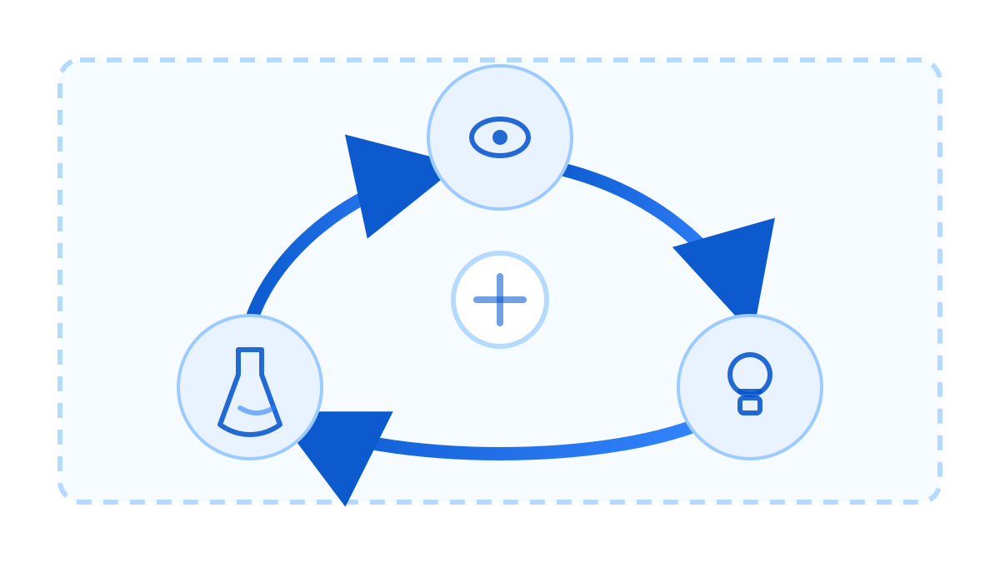

# 结语：通往 AGI 时代的船票


> **主编寄语**：别把这本书当成一本可以在书架上吃灰的“参考书”。它是一本战地手册。在算法模型一天一个样的今天，任何具体的代码实现都只是暂时的耗材。真正能让你在这个混乱周期里活下来的，是你手中那套用来**证伪假设**、**锁定质量**和**计算成本**的工程脚手架。[4][5][6]

## 别谈“完成”，谈“交付能力”

此刻，你合上书本，但这并不意味着项目结束。你构建的不是一个静态的软件，而是一条**将概率转化为价值的流水线**。

回顾一下，你手上现在应该有这三样东西：
1.  **工程决策系统 (Decision System)**：你不再靠“感觉”评价模型好坏，而是靠准入哨兵 (Admission Gates)。
2.  **可执行文档 (Executable Docs)**：你的 PRD、ADR 和 Runbook 都是可复现、可审计的资产。
3.  **证据链条 (Evidence Chain)**：你的每一个变更都包含版本集合 (Version Set) 与回滚指针。

这些才是你的护城河。技术栈会变，SOTA 模型下个月就会换，但“基于证据做决策”的工程纪律永远不会过时。[5][6]

## 活过未来 6 个月：三条生存法则

面对 AGI 的不确定性，很多团队死于盲目追新或固步自封。这里有三条硬核的生存法则，帮你在风暴中校准航向：

### 1. 技术雷达：只买“范式转移”的单

不要被营销号带着跑。每天都有新论文，但真正值得你重构系统的技术屈指可数。建立你的技术雷达，只关注那些能改变**输入输出结构**或**成本数量级**的技术。

*   **RAG (检索增强)**：改变了知识获取的边界，必选项。[24]
*   **DPO (偏好优化)**：让模型更懂人话，从“能用”到“好用”的关键。[42]
*   **推理优化**：直接决定你的商业模式是否成立（毛利是正还是负）。[45]
*   **QLoRA/量化**：让私有化部署从奢侈品变成日用品。[47][48][59]

### 2. 实验至上：把论文变成单元测试

看到新方法，别急着上生产。你的任务是设计**最小可行实验 (MVE)**。

不要只盯着成功的实验。那些失败的 Prompt、炸裂的 Loss 曲线、甚至模型胡说八道的日志，都要像战利品一样存起来。**复现失败**比复现成功更有价值，它是你团队避坑的唯一资产。[5]

### 3. 拒绝虚荣指标：Perplexity 不等于钱

如果你还在汇报会上炫耀模型的 Perplexity (困惑度) 下降了多少，那你离被裁不远了。

必须建立**技术指标到商业指标的映射表**。如果技术优化不能在 2 周内反映到转化率、留存率或算力成本上，立刻停止优化，去修别的。[4][6]

**表 21-1：指标映射自检表 (模板)**

| 技术指标 (虚荣指标) | 商业映射 (北极星指标) | 阈值判定 (低于此线停止优化) |
| :--- | :--- | :--- |
| **准确率 (Accuracy)** | **客服介入率** | 客服介入率降幅 < 5% |
| **首字延迟 (TTFT)** | **用户跳出率** | 跳出率无显著变化 (p > 0.05) |
| **Token 吞吐量** | **并发用户上限 (CCU)** | 单用户成本 > 订阅费用的 30% |
| **召回率 (Recall)** | **搜索结果点击率 (CTR)** | CTR 提升 < 1% |

## 拥抱熵增：给混乱套上枷锁

AI 系统天生就是不可控的。你无法消除幻觉，但你可以**管理**它。

不要指望模型每次都输出 `1+1=2`。你的系统必须是**反脆弱**的：
*   **护栏 (Guardrails)**：当模型发疯时，有没有规则层把它拦截下来？
*   **熔断 (Circuit Breaker)**：当 API 延迟飙升时，有没有降级策略给用户兜底？
*   **回滚 (Rollback)**：当新版本在生产环境表现不如预期时，能不能一键切回旧版本？

在概率的世界里，确定性的工程约束是你最后的守夜人。

## 立即行动：你的工程化清单

别废话了，检查一下你的背包。如果你想把这艘船开出港口，请确保你已经完成了以下动作：

### 动作 1：建立基线 (Baseline)

在动任何一行代码之前，先跑通这个基线检查。

**清单 21-1：基线锁定清单**

- [ ] **质量基线**：当前模型在黄金测试集上的通过率是多少？(精确到小数点后一位，如 85.4%) [6][44]
- [ ] **性能基线**：P99 延迟是多少毫秒？
- [ ] **成本基线**：处理 1000 个请求的平均 Token 成本是多少？
- [ ] **对比原则**：任何改动，必须在统计学上显著优于上述基线，否则回滚。

### 动作 2：版本化一切 (Reproducibility)

把你的 Notebook 扔掉。如果一个实验不能通过脚本一键复现，它就不存在。

**可执行脚本：实验快照归档**

这是一个用于将当前实验环境（代码、配置、Prompt）打包归档的脚本思路。别手动复制粘贴。

```bash
#!/bin/bash
# archive_experiment.sh
# 用法: ./archive_experiment.sh <实验名称>

EXP_NAME=$1
TIMESTAMP=$(date +%Y%m%d_%H%M%S)
ARCHIVE_DIR="experiments/${TIMESTAMP}_${EXP_NAME}"

mkdir -p "$ARCHIVE_DIR"

# 1. 保存当前 Git Hash
git rev-parse HEAD > "${ARCHIVE_DIR}/commit_hash.txt"

# 2. 导出当前 Prompt 及其参数
# 假设你的 Prompt 管理在 prompts/ 目录下
cp -r prompts/ "${ARCHIVE_DIR}/prompts_snapshot"

# 3. 记录 Python 依赖环境
pip freeze > "${ARCHIVE_DIR}/requirements.txt"

# 4. (可选) 导出评估配置
cp config/eval_config.yaml "${ARCHIVE_DIR}/"

echo "实验快照已保存至: ${ARCHIVE_DIR}"
echo "切记：把这个路径记录到你的实验追踪表格中！"
```

### 动作 3：自动化决策 (The Judge)

不要靠人眼去盯着模型输出。写一个脚本，让模型去评价模型。这是你迈向自动化运维的第一步。

**可执行示例：用模型进行最终质量验收**

创建一个验收脚本 `verify_conclusion.sh`，用模型来充当你的“冷面审稿人”，检查你的产品文档或发布说明是否足够客观。

```bash
# 1. 准备你的输入材料 (例如 release_notes.md)
# 2. 运行以下命令
mkdir -p out
cat <<'PROMPT' | <LLM_CLI> > out/audit_report.md
角色：你是一个严苛的工程审计师。
任务：审查输入的产品发布说明。
标准：
1. 是否包含量化的基线对比数据？(必须有)
2. 是否明确了已知缺陷和局限性？(必须有)
3. 是否有夸大其词的形容词（如'完美'、'极致'）？(不能有)

输出格式：
## 审计报告
- 状态：[通过/驳回]
- 发现的问题：
  1. <...>
  2. <...>
- 修改建议：
  <...>
PROMPT

# 3. 查看结果
cat out/audit_report.md
```

## 结语

技术是一场无限游戏。不需要你赢过所有人，只需要你比昨天的自己更严谨一点。[52]

不要迷信权威，包括这本书。带上你的罗盘，去代码的海洋里，撞碎那些旧世界的礁石。

---

**图 21-1：持续进化闭环**



> **插图配置**
> *   **image_prompt**: A minimalist technical diagram showing a continuous feedback loop with three nodes (eye icon, lightbulb icon, flask icon) connected by curved arrows in a circle. In the center, a stable anchor symbol representing an engineering baseline. Clean blueprint style, dark blue and white palette, solid white background, high contrast, crisp vector lines, no text.
> *   **negative_prompt**: text, letters, numbers, watermark, signature, handwriting, logo, photorealistic, 3d render, gradients, heavy shadows, blur, messy background
> *   **params**: aspect_ratio=16:9, quality=high
> *   **叠字策略**: 使用 CSS Grid 在节点上方叠加文字：上方居中 "观察 (Observability)"，右下 "假设 (Hypothesis)"，左下 "实验 (Experiment)"，中心锚点处叠加 "工程基线 (Baseline)"。

**上一章**：[20. 治理与合规：带着镣铐跳舞](20-governance.md) | **回到目录**：[目录](index.md)
