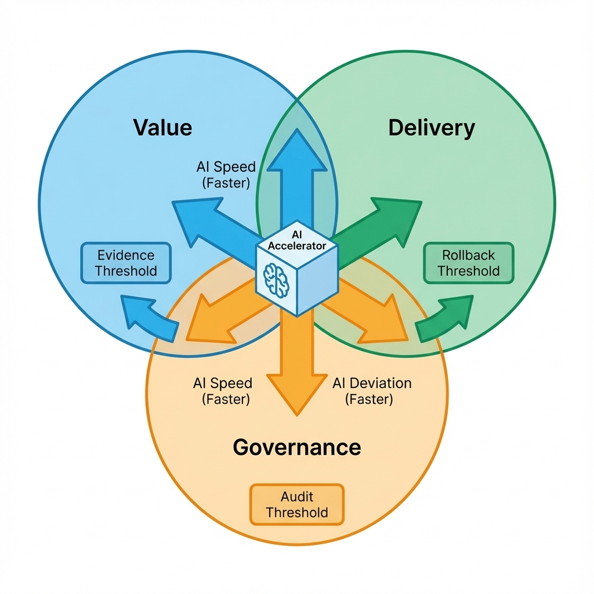

# 序言：一人即是一支队伍

过去，点亮一个产品想法需要一支整装待发的舰队：产品、设计、前后端、运维各司其职。今天，AI 将软件工程的边际成本压缩到极低，让“一个人成为一支队伍”变为可能。

但这种“独立”不是浪漫的自由，而是绝对的责任。当代码不再是瓶颈，方向就成了最大的考验。在低成本制造的诱惑下，最大的风险不再是做不出来，而是做出来后才发现：它没有价值、不可交付、无法治理。[4][5]

你不再只是造船匠，你必须同时扮演三个角色：决断航向的指挥官（价值）、把改动变成可验收成果的工程师（交付），以及在风暴中坚持门槛与审计的审查官（治理）。[2]

## 本书写给谁
本书不提供“快速暴富”的捷径，而是写给把产品视为严肃手艺的人。

- **如果你寻求**：在不确定性里建立纪律，用证据而非直觉导航，并对结果端到端负责。
- **如果你警惕**：把 AI 当作免思考的“外包工”。AI 能带来速度，但不会替你承担风险。

如果你愿意用“慢一点的验证”换取“稳一点的交付”，这本书会帮你把单兵作战变成一套可复利、可审计的工程体系。[4][5]

## 你的三重责任：价值、交付、治理
在一人成军的模式下，你必须独自点亮并守望三座灯塔：

1. **价值**：先验证再建造。你必须在写第一行代码前，用最低成本证伪关键假设，并写下止损线。[4]
2. **交付**：把改动变成可验收的商业成果。构建稳固的回滚机制，确保每次生成/改动不符合预期，都能安全撤回。[5]
3. **治理**：AI 引入了概率性的噪音。你必须记录决策日志与评测结果，让每一次偏离都可解释、可追责。[34]

| 角色 | 核心问题 | 必须留下的可复核证据 |
| :--- | :--- | :--- |
| 价值（指挥官） | 值不值得做？ | 证据链、反例、止损红线、决策记录 |
| 交付（工程师） | 做出来靠谱吗？ | 验收标准、自动化测试、一键回滚方案 |
| 治理（审查官） | 能长期健康吗？ | 评测指标、审计日志、模型退化预案 |

## 能力演进：Caller → Designer → Shaper
这三重责任会落成三种能力层级（不按岗位划分，按“你能交付什么”划分）：

- **Caller（调用者）**：交付 Demo，让系统跑起来；但不保证能长期跑、能解释跑得对不对。
- **Designer（设计者）**：交付指标与护栏，把“感觉更好”变成可验证的门槛与回归基线。
- **Shaper（塑造者）**：交付权重与基准，让系统行为可控、可演进，并能在商业闭环里持续迭代。

## 警惕 AI 的“虚假确定性”
AI 最危险之处，在于它能以极其确定的语气生成错误的逻辑。当建造变得廉价时，人很容易产生幻觉：把“代码跑通”误判为“航线正确”。[6]

因此，本书坚持三条底线：

- **证据**：无数据验证的观点，默认只是猜测；猜测可以记录，但必须附带验证方法。
- **门槛**：在调整航向前先写下评测标准；转向之后，必须严格按同一口径对比裁决，绝不因沉没成本降低要求。
- **回滚**：任何无法安全返航的冒进，都不值得在探索阶段下注。

只有当你能用客观标尺（评测）裁决主观的“感觉更好”时，AI 才是杠杆，而非风险。[18]

## 最短路径（今天就能做）
你不必读完本书才开始行动。以下 6 个动作，现在即可执行，立刻提升工程稳健度：

1. **建立“决策日志”**：新建一个文档，记录“因为……所以做……/不做……”，并写清验证方式与止损线。
2. **写下“一页纸 PRD”**：在向 AI 提问前，先用自然语言写清验收标准（Acceptance Criteria）。如果连你都无法清晰描述，AI 只会生成混乱。
3. **设定“止损线”**：明确写下：如果投入超过 `<X>` 小时或 `<Y>` 元仍未验证核心假设，立即停止（用你自己的约束填数）。
4. **跑通“空壳发布”**：在功能开发完之前，先把 `Hello World` 的自动化部署流水线跑通。
5. **写一个“金丝雀测试”**：只写一个最关键的端到端用例，确保核心业务流在任何代码变更后依然存活。
6. **加一个“回滚开关”**：为关键功能预留禁用/降级路径（配置开关或版本切换），并把触发条件写进发布说明。

## 本书导航
本书更像一套分区域的作战海图，请根据当前阶段按需查阅：

- **0→1 迷雾期**：跑通机会 → 合同 → 原型 → 验证 → 体验这条最短闭环。
  - 路径：[`02-discovery.md`](02-discovery.md) → [`03-prd.md`](03-prd.md) → [`04-prototype.md`](04-prototype.md) → [`05-validation.md`](05-validation.md) → [`06-ui.md`](06-ui.md)
- **上线后远航期**：补齐工程设施，应对深海压力。
  - 路径：[`07-engineering.md`](07-engineering.md) 与 [`18-evaluation.md`](18-evaluation.md)
- **引入智能层**：当需要构建 RAG/Agent 时。
  - 路径：[`10-agent-rag.md`](10-agent-rag.md)
- **全局总览**：先建立一页纸的全貌认知。
  - 路径：[`condensed-master-guide.md`](condensed-master-guide.md)

## 承诺
我不列举即将过时的工具清单，只交付一套关于观测、决策与纪律的方法论。在一人成军的时代，纪律是你唯一的护城河。[5]

---

参考文献详见本书统一列表：[`references.md`](references.md)。
