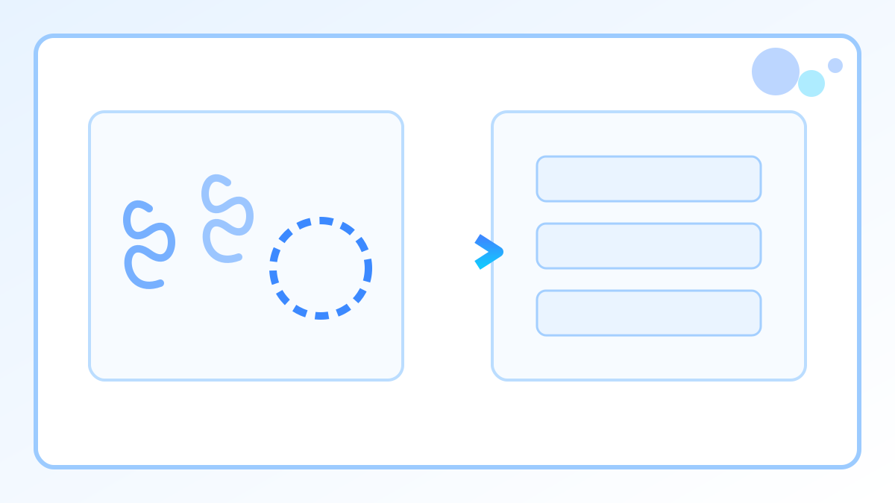

# 序章：把提示词当成交付物

你可能已经遇到过这种情况：模型时灵时不灵，同样的需求换个说法结果就变了，上线前靠反复试，出问题靠补丁改。这一章要把 Prompt 拉回工程语境，把它当接口和交付物来写，要求可测试、可复现、可回滚。

很多教程会把偶然成功包装成方法，鼓励堆情绪词和形容词，最后留下的是一段难以复跑的聊天记录。这样做会把不确定性留在流程里，最终变成线上风险。更稳的做法是先写清任务和输入输出协议，再写失败判定和降级动作，让结果能被脚本检查。

你会写两类 Prompt。文本 Prompt 用来稳定产出 Markdown、JSON、表格或代码，方便进入下游流程。图片 Prompt 用来产出可复用的图片配置，先生成无文字底图，文字留给后期排版。



很多不稳定来自三个地方：输出协议没锁死，失败判定没写清，复现机制缺失。上线前至少要满足三个条件：验收标准清晰，Pass 或 Fail 能脚本化检测；同模型版本和同输入下，输出结构收敛，波动需要有解释和降级路径；Prompt 文件化进入版本控制，改动可以回退。

下面给两份可直接复制的模板。第一份用来写合同，先把需求锁死。第二份用来写生产级 Prompt，段落顺序固定，便于做自动化。

```text
Prompt 交付合同

ID & Version: <例如：prompt.data_cleaner.v1>
运行级别: <Draft / Production>
核心任务: <一句话，只做一件事，例如：将非结构化日志转换为 JSON>
输入契约: 格式 <纯文本/Markdown/JSON>，必填字段 <...>，长度限制 <...>
输出契约: 载体 <JSON/Markdown 表格>，Schema <...>，禁止项 <寒暄语/Markdown 包裹/未定义字段>
验收标准: <脚本可执行的检查点，例如：JSON 解析成功且含字段 id>
失败判定: <命中即失败：解析错误/字段缺失/包含固定违禁短语>
降级策略: <失败后动作：重试/返回空对象/切回旧版>
```

把下面这个结构存成文件，段落顺序保持不变。

```text
# Role
你是一个严格的数据处理引擎。你没有情绪，不进行对话，只执行指令。

# Task
读取提供的 [Input Data]，根据 [Schema] 将其转换为标准格式。

# Constraints
1. 严禁输出任何解释性文字（如 "Here is the result"）。
2. 严禁使用 Markdown 代码块符号（```json）。
3. 如果输入数据缺失关键字段，输出且仅输出：{"error": "missing_fields"}。
4. 严格遵守 ISO 8601 日期格式。

# Input Data
<在这里插入变量或文件内容>

# Output Schema (JSON)
{
  "id": "string, required",
  "timestamp": "string, ISO 8601",
  "status": "enum<active, inactive>",
  "meta": {}
}
```

常见的踩坑也很固定。背景和指令混在一起，会让任务目标漂移；一段 Prompt 试图覆盖所有边缘情况，往往会把矛盾堆在一起；只写要什么不写禁止项，模型会加寒暄和解释污染输出；不给样本会导致字段名漂移；在聊天框里反复试，会让你失去复现与回归的能力。

## 最小闭环：命令行实战（工具无关）

把 Prompt 当文件，把输入当文件，把输出落盘。

假设你保存了上面的模板二为 `prompts/cleaner.txt`，输入数据在 `data/input.txt`。

```bash
mkdir -p out
{ cat prompts/cleaner.txt; printf '\n\n'; cat data/input.txt; } | <LLM_CLI> > out/result.json
```

说明：这里的 `<LLM_CLI>` 只是占位符，替换成你手头任意一个可脚本化的模型调用入口即可。

如果你不能把一次运行的结果存成文件、跟上一次结果做 diff 对比，你就没资格说自己在做工程。

## 图片 Prompt 交付物：拒绝文字底图

你需要的是可复用的素材。文字直接印在图上会让后期维护变难。

**标准图片 Prompt 配置块（直接喂给生图工具）：**

```text
image_prompt:
flat 2D vector illustration, split-screen concept, left side chaotic abstract swirls and noisy shapes representing uncertainty, right side clean structured blocks and checklists representing engineering order,
blue and white palette, minimalist composition, solid white background, high contrast, crisp edges, ample whitespace for later typography, no text

negative_prompt:
text, letters, numbers, watermark, signature, handwriting, photorealistic, 3d render, gradients, heavy shadows, blur, messy background, humans, faces, distorted shapes

params:
aspect_ratio=16:9, quality=high
```

请注意：**negative_prompt 里的 `text, letters, numbers` 是必须项**。

下一页先读总览：[index.md](index.md)
